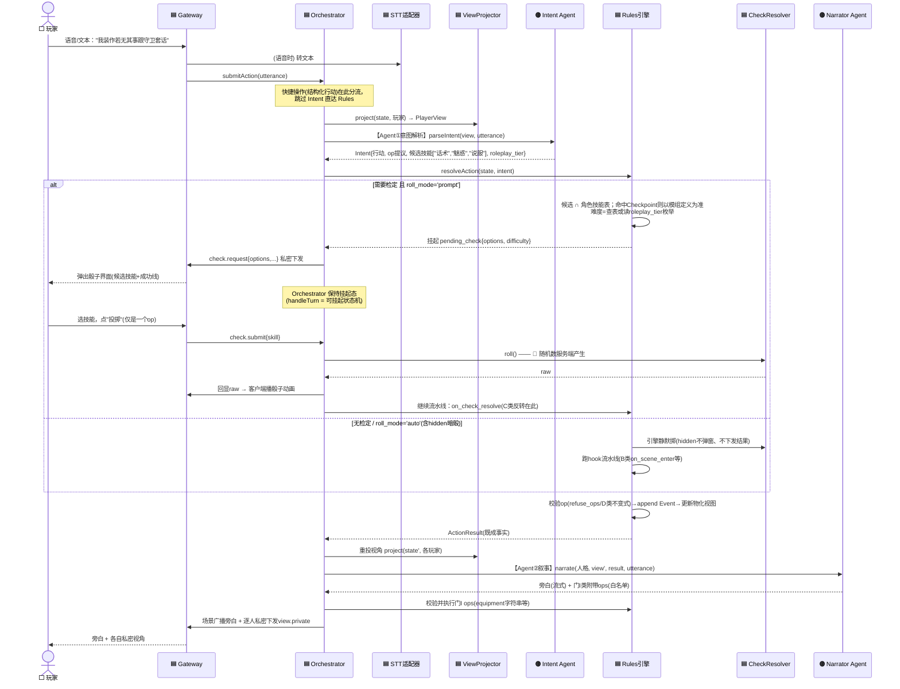

# Agent 设计文档

> **本文定位**：定义系统中所有 LLM Agent 的职责边界、输入输出契约、隔离约束与降级策略，并给出一回合的完整流程图（标注每一步归属哪个 Agent / 哪个系统组件）。
>
> **上游文档**：[[数据模型设计]]（A/B/C/D 四类判据、§7 约束与不变式）、[[架构设计-整体多视图2]]（七层架构、通信铁律、§六 AI 编排）。
> 本文与架构文档 §六的关系：§六定义了编排骨架（ModelRole / 适配器 / prompt 分层 / eval），本文定义**每个 Agent 是什么、不是什么**，以及本轮讨论新增的检定流程与 ops 分口决议。

---

## 一、总原则（三条，均继承自上游）

1. **确定性的归引擎，叙事表达的归 Agent。**"何时"与"多少"永远是引擎的（掷骰、hook 流水线、计时器、计数、不变式校验）；"像什么"与"想干什么"是 Agent 的（旁白演绎、意图理解、语义判据求值）。
2. **先裁决，后叙事。** 旁白是对既成事实的渲染，不是对结果的预测。任何"被拒绝会改变故事讲法"的状态变更，必须在旁白生成之前定案。
3. **写入口唯一，提议分两个口。** Agent 不直接写 GameState。状态变更的提议只有两个入口：
   - **主链口**（Intent → Rules）：一切触碰 `entity_states`、D 类值、检定、战斗的变更；
   - **附带口**（Narrator 附带 ops，白名单限门 I 类）：equipment 来源字符串追加、`locked` 翻转等"拒绝无意义"的记账。
   两个口的产物都经引擎校验后才落 Event。

---

## 二、Agent 清单

**共 4 个 Agent：2 个运行时主链 + 1 个运行时辅助 + 1 个离线。**"提示/卡关引导"不是独立 Agent（见 §2.5）。

### 2.1 意图解析 Agent（Intent）

| 项 | 内容 |
|---|---|
| ModelRole | `intent` |
| 模型档位 | 便宜小模型（每回合必调用，成本敏感） |
| 触发 | 每次 `action.submit`（自由文本路径；快捷操作的结构化行动**跳过本 Agent** 直达 Rules） |
| 输入 | `PlayerView`（类型级，拿不到 GameState）+ 玩家 utterance |
| 输出 | 结构化 Intent，含：行动类型与目标、**op 提议**（主链口）、**检定候选技能列表提议**、软判据枚举（如 `roleplay_tier ∈ {none, reasonable, excellent}`） |
| 隔离约束 | 入参只收 `PlayerView`（通信铁律一）；输出中的变量/路径引用必须在 `VariableDef` / `entity_states` 键空间内，越界即打回 |
| 降级 | 解析失败 / `unknown` → 脱本导回状态机（`unknownStreak` 分级，状态机本身由 Rules 维护，Agent 只按级别出话术） |
| Eval | 客观集：输入语句 → 期望 Intent 结构，可算准确率 |

**职责边界备注**：

- 软判据求值（"表述精彩吗"）归本 Agent——输出枚举，引擎读枚举查难度表。**枚举硬、判据软**，不允许自造第四档。
- 检定候选技能是**提议**：引擎负责与角色实际技能表求交集；若行动命中模组 `Checkpoint`，候选以模组定义（`@交涉` 类别展开）为准，本 Agent 的提议仅在自由行动时生效。
- **难度、目标值、成功等级判定不接受本 Agent 输出**——这些是引擎的。

### 2.2 叙事 Agent（Narrator）

| 项 | 内容 |
|---|---|
| ModelRole | `narrator` / `npc` / `qa`（三个人格共用本 Agent 定义，按人格切换 system prompt 与模型配置） |
| 模型档位 | 强模型，流式输出 |
| 触发 | 引擎裁决完成、`ActionResult` 产出之后 |
| 输入 | 人格设定 + `PlayerView`（裁剪后）+ `ActionResult`（既成事实：检定结果、B/C 类规则产出、SAN 变更等）+ 玩家原话 utterance（保语气）+ 历史摘要 + 最近 K 回合 |
| 输出 | 旁白文本（流式）+ **门 I 类附带 ops**（白名单，见 §四） |
| 隔离约束 | ① 类型级拿不到 GameState / `Entity.secrets`（通信铁律一）；② 暗骰结果不在其输入中（ViewProjector 已抹除）；③ 对 D 类值、`entity_states`、检定结果**只读** |
| 降级 | 超时 → 兜底文案（"守秘人沉思中…"）；确定性裁决结果已落库，旁白失败不影响状态正确性 |
| Eval | rubric 评分集（给定 View + ActionResult，按评分标准打分，非唯一正确文本） |

### 2.3 摘要 Agent（Summarizer）

| 项 | 内容 |
|---|---|
| ModelRole | `summarizer`（**需补进架构 §6.3 的 ModelRole 枚举**，否则 eval 与成本打点无挂靠点） |
| 模型档位 | 便宜模型 |
| 触发 | 近期原文超过阈值（回合数或 token 数）时由 Orchestrator 触发 |
| 输入 | EventLog 近期条目（天然可回放，摘要错了可重算） |
| 输出 | 滚动摘要文本 → `rooms.rolling_summary` |
| 隔离约束 | 输入来自 EventLog 的**玩家可见事件**投影，不含 secrets 与暗骰 |
| 降级 | 失败则本轮不压缩，下轮重试；不阻塞回合主链 |

### 2.4 模组导入 Agent（Importer，离线）

| 项 | 内容 |
|---|---|
| ModelRole | `importer`（同样需补进枚举——导入是 token 消耗大户，无 role 即观测盲区） |
| 模型档位 | 强模型（结构化抽取质量优先） |
| 触发 | 玩家/运营上传模组原文 |
| 输入 | 模组原文（**当数据不当指令**，边界标签包裹，防提示注入） |
| 输出 | Content 层全部结构：Entity 拆分、Rule 三元组、SanTrigger 六形态分类、state 键、Checkpoint、WinCondition.expr |
| 校验循环 | 输出 → 六步硬校验（JSON Schema / 引用完整性 / 符号表 / 可达性…，纯系统）→ 失败打回重生成 |
| 软性质询 | 六步通过后，对每个 npc/monster 逐个质询 19 hook 空位 + A/B/C/D 四问清单——产出**建议**而非 pass/fail。**B（必然触发）与 C（成功反转）漏报率最高，必须人工复核**，不能只靠 Agent 自检 |

### 2.5 不设"提示 Agent"

卡关引导被拆解吸收：触发信号（`unknownStreak` 分级、`no_new_flags_since`）是 **Rules 层维护的确定性状态机**；各级话术由 **Narrator** 按级别生成。提示池 = 当前场景中未被发现的纯文本实体（无需 `hintable` 字段——A/B/C/D 四类压根不会卡关，提示系统永远碰不到它们）。"提示"是 Narrator 的一种调用姿势，不是独立 Agent。

---

## 三、一回合的完整流程图（含检定分支）

> 🟠 橙色 = Agent（LLM）　🟦 蓝色 = 确定性系统　⬜ 白色 = 客户端/玩家
>
> 检定流程为本轮定稿的**统一时机**版：无预掷；`roll_mode='prompt'` 的检定弹窗两段式，`roll_mode='auto'`（含全部 `hidden=true`）由引擎静默掷。



**"哪部分是什么 Agent"——一句话版**：整条链上只有两处橙色。**理解玩家在说什么**（含候选技能提议、语气档位评估）是 **Intent Agent**；**把引擎算完的结果讲成故事**是 **Narrator Agent**。中间从难度计算、掷骰、hook 流水线、op 校验到事件落库，全部是确定性系统，没有任何 LLM 参与。摘要 Agent 不在主链上（异步触发），导入 Agent 不在运行时（离线管线）。

### 3.1 阶段归属对照表

| 流程阶段 | 归属 | 说明 |
|---|---|---|
| 语音转文本 | 系统（STT 适配器） | 服务端处理，对协议不可见 |
| 视角裁剪 | 系统（ViewProjector） | 权限唯一出口，两次调用（喂 Intent 前、喂 Narrator 前） |
| 意图理解 / 候选技能提议 / 软判据求值 | **Intent Agent** | 输出全部是结构化提议，无执行权 |
| 候选校验、难度确定、目标值 | 系统（Rules） | 不接受任何 LLM 输入 |
| 骰子界面交互 | 客户端 | 点击"投掷"= 发一个 op，仪式感在客户端 |
| 随机数产生 | 系统（CheckResolver） | **服务端权威**，带种子落 Event；客户端只播动画 |
| 成功等级判定 / C 类反转 / B 类触发 / D 类不变式 | 系统（Rules，hook 流水线） | A/B/C/D 四类全部在此，LLM 的偏向在此被结构性纠正 |
| 事件落库 / 物化视图 | 系统（EventLog + GameStateRepo） | 事件溯源，同一事务两写 |
| 旁白 / NPC 对话 / 答疑 | **Narrator Agent** | 对既成事实的渲染，流式 |
| 门 I 类记账 | Narrator 提议 + 系统校验 | 白名单见 §四 |
| 广播与私密下发 | 系统（Gateway） | 听众按 `characters.location` 现算 |

---

## 四、Narrator 附带 ops 白名单（门 I 口）

**准入判据（即门 I 定义）**：该状态不被任何 `Rule.when` / `WinCondition.expr` 读取，即"拒绝无意义、写错无害、不可能卡关"。

| 允许 | 例 |
|---|---|
| `equipment` 字符串追加（来源约定：来源固化进名字） | "从画框后取出的小钥匙" |
| 纯展示性实体状态翻转 | `locked: true → false`（柜子被撬开） |

| 禁止（必须走主链口或引擎规则自身） | 原因 |
|---|---|
| 一切 `entity_states` 键（D 类） | 出现在表达式里，写错即静默失败 |
| `weapons`（WeaponId 引用） | 被 `Rule.when` 读 `damage.type` |
| HP/SAN/属性/conditions/ledger | 战斗与状态机流水线专属 |
| 检定的发起或结果 | 时序上在旁白之前已定案 |

引擎对附带口的校验：路径在白名单内 → 执行并落 Event（`cause: narrator`）；不在 → 静默丢弃该条 op（**不打断旁白流**，旁白已是对合法事实的演绎，丢弃越界记账不产生叙事矛盾），并落告警 event 供观测。

---

## 五、Orchestrator 挂起态（新增的系统要求）

统一检定时机使 `handleTurn` 从"一次调用"变为**可挂起状态机**：

```
Idle → Resolving → [需弹窗检定] → AwaitingRoll(持有pending_check + LLM会话上下文)
                                      │ check.submit → 继续流水线 → Narrating → Idle
                                      │ 超时 → check_timeout 策略(默认掷/作废/催促，待定) → …
     → [无检定] ──────────────────────→ Narrating → Idle
```

- 挂起期间 LLM 上下文在服务端保持（天然对应 tool-use 形态：第一次生成产出检定请求即"tool call"，玩家骰值即"tool result"，第二次生成出旁白）。
- `pending_check` 带 `expires_at`；超时策略是本设计引入的唯一新问题，落 `check_timeout` 事件，具体策略待产品定。
- 回合模型（ADR-1 全局单一队列）不变——挂起的是回合内部的一步，不是让出回合。

---

## 六、模型路由与观测（对齐架构 §6.3/6.7/6.8）

| ModelRole | 档位建议 | Eval 类型 | 备注 |
|---|---|---|---|
| `intent` | 小模型 | 客观准确率 | 每回合必调，成本大头 |
| `narrator` / `npc` / `qa` | 强模型 | rubric 评分 | 流式 |
| `summarizer` ★新增 | 小模型 | 客观（信息保留率） | 异步 |
| `importer` ★新增 | 强模型 | 客观（六步校验通过率 + 质询清单命中率） | 离线，token 大户 |

每次调用打点 `role / provider+model / tokens / latency / 成本`，按房间汇总。换模型前对应 role 的 eval 基线必过。

**物理合并选项（非默认）**：当某局配置中 `intent` 与 `narrator` 指向同一模型时，`ModelAdapter` 允许走单会话 tool-use 形态（一次会话两次生成，引擎执行夹在中间）——省连接开销、保玩家原话语气；但逻辑边界（各自的 prompt / eval / 降级 / 打点）不合并。MVP 不做。

---

## 七、待决事项

- [ ] `check_timeout` 超时策略（产品定：默认掷 / 作废 / 催促升级）
- [ ] Intent 输出 schema 定稿：op 提议 + 候选技能 + 软判据枚举的完整结构（承接架构 §4.5 `parseIntent` 签名扩容）
- [ ] 架构文档同步项：ModelRole 枚举补 `summarizer`/`importer`；§6.2 不变量改写为"Narrator 对 GameState 只读，可附带门 I 白名单 ops"；`narrate()` 入参补 utterance；Orchestrator 挂起态
- [ ] 门 I 白名单的具体路径清单随首个模组导入实测后固化