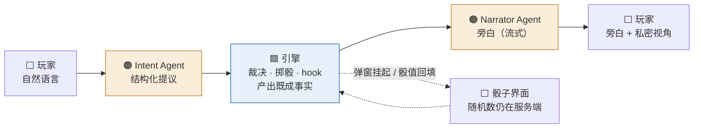

# Agent 设计文档

> **本文定位**：定义系统中所有 LLM Agent 的职责边界、输入输出契约、隔离约束与降级策略，并给出一回合的完整流程图（标注每一步归属哪个 Agent / 哪个系统组件）。
>
> **上游文档**：[[数据模型设计]]（A/B/C/D 四类判据、§7 约束与不变式）、[[架构设计-整体多视图2]]（七层架构、通信铁律、§六 AI 编排）。
> 本文与架构文档 §六的关系：§六定义了编排骨架（ModelRole / 适配器 / prompt 分层 / eval），本文定义**每个 Agent 是什么、不是什么**，以及本轮讨论新增的检定流程与 ops 分口决议。

---

## 一、总原则（三条，均继承自上游）

1. **确定性的归引擎，叙事表达的归 Agent。**"何时"与"多少"永远是引擎的（掷骰、hook 流水线、计时器、计数、不变式校验）；"像什么"与"想干什么"是 Agent 的（旁白演绎、意图理解、语义判据求值）。
2. **先裁决，后叙事。** 旁白是对既成事实的渲染，不是对结果的预测。任何"被拒绝会改变故事讲法"的状态变更，必须在旁白生成之前定案。
3. **写入口唯一，提议分两个口。** Agent 不直接写 GameState。状态变更的提议只有两个入口：
   - **主链口**（Intent → Rules）：一切触碰 `entity_states`、D 类值、检定、战斗的变更；
   - **附带口**（Narrator 附带 ops，白名单限门 I 类）：equipment 来源字符串追加、`locked` 翻转等"拒绝无意义"的记账。
   两个口的产物都经引擎校验后才落 Event。
4. **Agent 是被编排者，不是编排者。** 控制流（先调谁、走哪条分支、何时挂起）由确定性 Orchestrator 驱动，Agent 只在流程图的预留槽位里填内容。出场资格判据：**只有输入/输出是自然语言、或存在无法枚举的模糊判断的环节，才是 Agent 的位置**——其余一律是代码（详见 §5.2）。

---

## 二、Agent 清单

**共 4 个 Agent：2 个运行时主链 + 1 个运行时辅助 + 1 个离线。**"提示/卡关引导"不是独立 Agent（见 §2.5）。

### 2.1 意图解析 Agent（Intent）

| 项 | 内容 |
|---|---|
| ModelRole | `intent` |
| 模型档位 | 便宜小模型（每回合必调用，成本敏感） |
| 触发 | 每次 `action.submit`（自由文本路径；快捷操作的结构化行动**跳过本 Agent** 直达 Rules） |
| 输入 | `PlayerView`（类型级，拿不到 GameState）——一份**紧凑的结构化状态**：当前场景实体清单、角色技能表、equipment、可见 entity_states、pending_check；+ 滚动摘要（与 Narrator 共享同一份）+ 最近 2-3 回合 + 玩家 utterance |
| 输出 | 结构化 Intent，含：行动类型与目标、**op 提议**（主链口）、**检定候选技能列表提议**、软判据枚举（如 `roleplay_tier ∈ {none, reasonable, excellent}`） |
| 隔离约束 | 入参只收 `PlayerView`（通信铁律一）；输出中的变量/路径引用必须在 `VariableDef` / `entity_states` 键空间内，越界即打回 |
| 降级 | 解析失败 / `unknown` → 脱本导回状态机（`unknownStreak` 分级，状态机本身由 Rules 维护，Agent 只按级别出话术） |
| Eval | 客观集：输入语句 → 期望 Intent 结构，可算准确率 |

**职责边界备注**：

- 本 Agent 需要背景，但需要的是**符号化的状态背景**，不是 Narrator 那套文学性演绎背景（人格/场景原文/完整旁白史）。指代消解靠结构化状态而非重读对话："画后面找到的那把"与 equipment 来源字符串**直接匹配**（[[数据模型设计]] §6.4 来源约定在此兑现）；"再试一次"靠最近 2-3 回合；长程指代靠滚动摘要。这就是"状态机器可读"设计的回报：理解局面是查表，不是重读小说。
- 软判据求值（"表述精彩吗"）归本 Agent——输出枚举，引擎读枚举查难度表。**枚举硬、判据软**，不允许自造第四档。
- 检定候选技能是**提议**：引擎负责与角色实际技能表求交集；若行动命中模组 `Checkpoint`，候选以模组定义（`@交涉` 类别展开）为准，本 Agent 的提议仅在自由行动时生效。
- **难度、目标值、成功等级判定不接受本 Agent 输出**——这些是引擎的。

### 2.2 叙事 Agent（Narrator）

| 项 | 内容 |
|---|---|
| ModelRole | `narrator` / `npc` / `qa`（三个人格共用本 Agent 定义，按人格切换 system prompt 与模型配置） |
| 模型档位 | 强模型，流式输出 |
| 触发 | 引擎裁决完成、`ActionResult` 产出之后 |
| 输入 | 人格设定 + `PlayerView`（裁剪后）+ `ActionResult`（既成事实：检定结果、B/C 类规则产出、SAN 变更等）+ 玩家原话 utterance（保语气）+ 历史摘要 + 最近 K 回合 |
| 输出 | 旁白文本（流式）+ **门 I 类附带 ops**（白名单，见 §四） |
| 隔离约束 | ① 类型级拿不到 GameState / `Entity.secrets`（通信铁律一）；② 暗骰结果不在其输入中（ViewProjector 已抹除）；③ 对 D 类值、`entity_states`、检定结果**只读** |
| 降级 | 超时 → 兜底文案（"守秘人沉思中…"）；确定性裁决结果已落库，旁白失败不影响状态正确性 |
| Eval | rubric 评分集（给定 View + ActionResult，按评分标准打分，非唯一正确文本） |

### 2.3 摘要 Agent（Summarizer）

| 项 | 内容 |
|---|---|
| ModelRole | `summarizer`（**需补进架构 §6.3 的 ModelRole 枚举**，否则 eval 与成本打点无挂靠点） |
| 模型档位 | 便宜模型 |
| 触发 | 近期原文超过阈值（回合数或 token 数）时由 Orchestrator 触发 |
| 输入 | EventLog 近期条目（天然可回放，摘要错了可重算） |
| 输出 | 滚动摘要文本 → `rooms.rolling_summary` |
| 隔离约束 | 输入来自 EventLog 的**玩家可见事件**投影，不含 secrets 与暗骰 |
| 降级 | 失败则本轮不压缩，下轮重试；不阻塞回合主链 |

### 2.4 模组导入 Agent（Importer，离线）

| 项 | 内容 |
|---|---|
| ModelRole | `importer`（同样需补进枚举——导入是 token 消耗大户，无 role 即观测盲区） |
| 模型档位 | 强模型（结构化抽取质量优先） |
| 触发 | 玩家/运营上传模组原文 |
| 输入 | 模组原文（**当数据不当指令**，边界标签包裹，防提示注入） |
| 输出 | Content 层全部结构：Entity 拆分、Rule 三元组、SanTrigger 六形态分类、state 键、Checkpoint、WinCondition.expr |
| 校验循环 | 输出 → 六步硬校验（JSON Schema / 引用完整性 / 符号表 / 可达性…，纯系统）→ 失败打回重生成 |
| 软性质询 | 六步通过后，对每个 npc/monster 逐个质询 19 hook 空位 + A/B/C/D 四问清单——产出**建议**而非 pass/fail。**B（必然触发）与 C（成功反转）漏报率最高，必须人工复核**，不能只靠 Agent 自检 |

### 2.5 不设"提示 Agent"

卡关引导被拆解吸收：触发信号（`unknownStreak` 分级、`no_new_flags_since`）是 **Rules 层维护的确定性状态机**；各级话术由 **Narrator** 按级别生成。提示池 = 当前场景中未被发现的纯文本实体（无需 `hintable` 字段——A/B/C/D 四类压根不会卡关，提示系统永远碰不到它们）。"提示"是 Narrator 的一种调用姿势，不是独立 Agent。

---

## 三、一次对话的数据流转

> 🟠 = Agent（全链仅两处）　🟦 = 确定性系统　⬜ = 玩家/客户端
>
> 重点是**数据形态的三次转换**：自然语言 → 结构化提议 → 既成事实 → 自然语言。Agent 恰好站在语言与符号互相翻译的两个界面上，中间的纯符号变换全是代码。



全链由 Orchestrator 确定性驱动（分支判据全是数据，见 §5.2）。

进 Intent 和进 Narrator 之前各经一次 ViewProjector 裁剪（权限唯一出口）；`hidden` 暗骰与 `roll_mode='auto'` 不走虚线分支，引擎静默掷。

**每一段的归属与要点**：

| 段 | 形态转换 | 归属 | 要点 |
|---|---|---|---|
| 玩家 → 结构化提议 | 自然语言 → 符号 | 🟠 **Intent Agent** | 理解、指代消解、候选技能提议、软判据枚举；**只有提议权，无执行权**。快捷操作（预结构化行动）跳过本段 |
| 提议 → 既成事实 | 符号 → 符号 | 🟦 引擎（Rules / CheckResolver / EventLog） | 此段**没有自然语言、没有模糊判断**（均已被上游枚举化/设计期规则化），故无 Agent 资格；服务端出数、C 类反转、D 类不变式、事务落库全在此；瞬时、零 token |
| 既成事实 → 旁白 | 符号 → 自然语言 | 🟠 **Narrator Agent** | 对已定结果的渲染，天然不与状态矛盾，故可安全流式；门 I 白名单附带记账（§四） |
| 全程控制流 | — | 🟦 Orchestrator | 编排者永远是代码，Agent 是被编排者（§5.2） |

摘要 Agent 在主链外异步触发，导入 Agent 完全离线，均不在本图中。

---

## 四、Narrator 附带 ops 白名单（门 I 口）

**准入判据（即门 I 定义）**：该状态不被任何 `Rule.when` / `WinCondition.expr` 读取，即"拒绝无意义、写错无害、不可能卡关"。

| 允许 | 例 |
|---|---|
| `equipment` 字符串追加（来源约定：来源固化进名字） | "从画框后取出的小钥匙" |
| 纯展示性实体状态翻转 | `locked: true → false`（柜子被撬开） |

| 禁止（必须走主链口或引擎规则自身） | 原因 |
|---|---|
| 一切 `entity_states` 键（D 类） | 出现在表达式里，写错即静默失败 |
| `weapons`（WeaponId 引用） | 被 `Rule.when` 读 `damage.type` |
| HP/SAN/属性/conditions/ledger | 战斗与状态机流水线专属 |
| 检定的发起或结果 | 时序上在旁白之前已定案 |

引擎对附带口的校验：路径在白名单内 → 执行并落 Event（`cause: narrator`）；不在 → 静默丢弃该条 op（**不打断旁白流**，旁白已是对合法事实的演绎，丢弃越界记账不产生叙事矛盾），并落告警 event 供观测。

---

## 五、Orchestrator 挂起态（新增的系统要求）

统一检定时机使 `handleTurn` 从"一次调用"变为**可挂起状态机**：

```
Idle → Resolving → [需弹窗检定] → AwaitingRoll(持有pending_check + LLM会话上下文)
                                      │ check.submit → 继续流水线 → Narrating → Idle
                                      │ 超时 → check_timeout 策略(默认掷/作废/催促，待定) → …
     → [无检定] ──────────────────────→ Narrating → Idle
```

- 挂起期间 LLM 上下文在服务端保持（天然对应 tool-use 形态：第一次生成产出检定请求即"tool call"，玩家骰值即"tool result"，第二次生成出旁白）。
- `pending_check` 带 `expires_at`；超时策略是本设计引入的唯一新问题，落 `check_timeout` 事件，具体策略待产品定。
- 回合模型（ADR-1 全局单一队列）不变——挂起的是回合内部的一步，不是让出回合。

### 5.2 控制流为什么由确定性代码驱动（Agent 是被编排者）

Agent 驱动控制流（agentic workflow：LLM 自己决定下一步调哪个模块、循环到自认为完成）只在**步骤序列无法预先枚举**的开放任务中才值得。一回合是**封闭流程**：project → parseIntent → resolveAction →（可能挂起等骰）→ narrate → 广播——这张图在设计期就完整，且六模组验证已证明其收敛（19 hook / 10 算子跑完未增）。**序列可枚举，就该硬编码。**

流程中看似需要"判断"的分支，判据全部是数据，`if` 即走：

| 分支点 | 判据 | 来源 |
|---|---|---|
| 需不需要检定 | Intent 输出有无检定提议 / 是否命中 Checkpoint | 上游 Agent 结构化输出 / 模组数据 |
| 弹窗还是静默掷 | `roll_mode` + `hidden` | 模组数据 |
| 脱本导回走到第几级 | `unknownStreak` 计数 | 引擎状态机 |
| hook 上执行哪些规则、什么顺序 | `(hook, priority, mode)` | 导入时固化的规则数据 |

即：**所有需要智能的路由决策已被前移**——设计期（模组作者与导入 Agent 固化成字段和规则）和回合上游（Intent 把模糊语言变成枚举）。这是"软判据前置、硬骨架执行"哲学在控制流上的重复。

反面代价：若由 Agent 调度模块，它会概率性地跳过 `on_check_resolve`（C 类静默失效）、先广播后落 Event（事务性破）、忘记重投视角（铁律一穿）——**结构性约束被概率性执行**。控制流是全部不变式（不泄底/不污染/可回放）的最终执行者，执行者必须比被执行的约束更硬。附带 P0/P1 双损：多几次调度调用的 token 与延迟，且回放时无法复现"当时为何走了这条分支"。

注意 tool-use 合并形态中 LLM 看似在"驱动"（发 tool call、收结果、继续生成）——那只是**会话形状**，不是控制权归属：哪些 tool 存在、result 何时回填、中间引擎跑哪些步、超时怎么办，全由 Orchestrator 定。LLM 只在流程图的两个预留槽位（意图参数、旁白文本）里填内容，从未获得"下一步做什么"的决定权。

---

## 六、模型路由与观测（对齐架构 §6.3/6.7/6.8）

| ModelRole | 档位建议 | Eval 类型 | 备注 |
|---|---|---|---|
| `intent` | 小模型 | 客观准确率 | 每回合必调，成本大头 |
| `narrator` / `npc` / `qa` | 强模型 | rubric 评分 | 流式 |
| `summarizer` ★新增 | 小模型 | 客观（信息保留率） | 异步 |
| `importer` ★新增 | 强模型 | 客观（六步校验通过率 + 质询清单命中率） | 离线，token 大户 |

每次调用打点 `role / provider+model / tokens / latency / 成本`，按房间汇总。换模型前对应 role 的 eval 基线必过。

### 6.1 Intent 与 Narrator：逻辑必须两个角色，物理可以一次调用

**不可合并的墙在 LLM 与引擎之间，不在两个 Agent 之间。** 只要引擎夹在中间（结构化输出 → 引擎执行 → 结果回填 → 继续生成），单一 tool-use 会话跑完整回合在正确性上完全成立——先裁决后叙事、写入口唯一、门 I 白名单一条不破。

但**逻辑角色**（各自的 prompt / eval / 降级 / 打点 / 模型配置）必须保持两个，三条理由：

1. **成本结构**。勘误：不对称**不在调用次数**——次数上意图与叙事按回合 1:1 顺序发生；不对称在**每次调用的重量与难度**：Intent 是"小模型 × 薄的符号化背景 × 短输出"（分类抽取，小模型单价约为强模型 1/10~1/30），Narrator 是"强模型 × 厚的文学背景 × 长输出"（创作）。合并到单一会话后，解析被迫按强模型计价并驮上叙事的完整上下文——一回合从"1 份贵的 + 1 份近乎免费的"变成"接近 2 份贵的"，几百回合乘上去即成本红线。延迟侧：骰子界面弹出速度取决于第一次生成的返回，小模型几百毫秒 vs 强模型 1-3 秒，且这段等待发生在任何内容出现之前，是体感最尖锐的空白（叙事慢可被流式遮住，解析慢是干等）。
2. **Eval 分家**。ADR-6"持续换模型、不同功能不同模型"只有在 intent（客观准确率）与 narrator（rubric）各有独立基线时才安全；合并即每次换模型两个功能一起裸测。
3. **裁判与说书人的利益卫生**。软判据（`roleplay_tier` 评级、自由行动候选提议）仍在 LLM 手里。持续对话会建立叙事惯性——陪玩家演了四十轮的说书人，评级先验会向 excellent 漂移；而 Intent 作为每次冷启动的分类器没有会话情感包袱。引擎只读枚举，枚举本身被污染它无从察觉——这是 §7.3"系统性偏向"论证在软判据上的延伸。

**物理形态是配置项，两条路径都合法**：① 默认拆分（两次调用、两档模型）；② 加速路径——MVP 先用单一强模型 tool-use 形态跑通全链（工程最简），但**从第一天起按两个 ModelRole 分别打点、分开攒 eval 集**，待成本数据证明解析该降档时，拆分只是改一行配置。唯一禁止的是：因物理上合了，把 prompt / 评测 / 降级也搅成一锅——届时想拆就拆不动了。

另注：本系统不存在有状态的持续会话——对话状态的权威在 EventLog，每次 Agent 调用都是从"摘要 + 最近 K 回合 + 本回合 View"重建上下文的无状态调用；唯一保持活会话的位置是检定挂起段（§五）。

---

## 七、待决事项

- [ ] `check_timeout` 超时策略（产品定：默认掷 / 作废 / 催促升级）
- [ ] Intent/Narrator 的物理形态选择（§6.1 两条路径：默认拆分 vs 单模型 tool-use 加速路径）——团队定，逻辑边界两条路径下均不合并
- [ ] Intent 输出 schema 定稿：op 提议 + 候选技能 + 软判据枚举的完整结构（承接架构 §4.5 `parseIntent` 签名扩容）
- [ ] 架构文档同步项：ModelRole 枚举补 `summarizer`/`importer`；§6.2 不变量改写为"Narrator 对 GameState 只读，可附带门 I 白名单 ops"；`narrate()` 入参补 utterance；Orchestrator 挂起态
- [ ] 门 I 白名单的具体路径清单随首个模组导入实测后固化