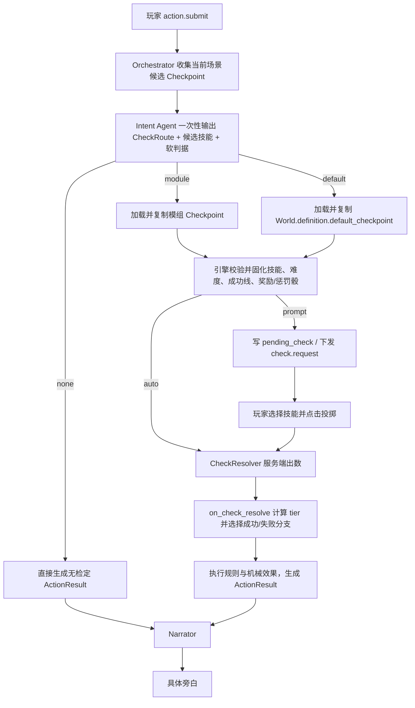

# Checkpoint 流程设计文档

> **本文定位**：定义玩家提交自然语言后，系统如何一次性决定“不检定 / 使用模组 Checkpoint / 使用默认 Checkpoint”，以及骰子结算后哪些事实由引擎决定、哪些表现交给 Narrator。
>
> `Checkpoint` 的字段定义见 [[数据模型设计]]；Agent 的总体职责见 [[agent设计文档]]。

---

## 一、核心决议

1. **Checkpoint 路由只判断一次。** 不先做一次“是否检定”，再做一次“匹配哪个 Checkpoint”
2. Intent Agent 一次性返回 `none / module / default` 三选一；`route != none` 已经等价于“需要检定”
3. 模组 Checkpoint 表达作者预设的重要分支；匹配不到时使用 `World.definition.default_checkpoint`
4. 默认 Checkpoint 的两个分支固定为：
   - 成功：`玩家行动成功`
   - 失败：`玩家行动失败`
5. 引擎决定骰值、成功等级和进入哪个分支；Narrator 结合玩家原话、场景、人物与历史上下文生成具体表现
6. 系统不在运行时生成或写回新的 Content Checkpoint；默认 Checkpoint 是长期存在的规则系统模板

一句话概括：

> **重要行动匹配模组分支，普通行动落默认分支；引擎定成败，Narrator 定怎么发生。**

---

## 二、三个概念

### 2.1 模组 Checkpoint

模组导入阶段由 Import Agent 从重要情节中生成，存入 Content 层，只读。

它适合承载：

- 成功后必须发现某条关键线索
- 失败后必须进入某个剧情分支
- 特殊难度、暗骰或 C 类反转
- 任何不能只靠 Narrator 即兴发挥的重要结果

### 2.2 默认 Checkpoint

每个 World 有且只有一个默认 Checkpoint，存放在 `World.definition.default_checkpoint`。

它只处理没有特殊剧情分支的普通检定，不携带关键状态变更：

```ts
DefaultCheckpoint {
  id:          "default_check"
  skill_source: "intent"
  difficulty:  "regular"
  hidden:      false
  roll_mode:   "prompt"
  on_success:  { narration_context: "玩家行动成功" }
  on_fail:     { narration_context: "玩家行动失败" }
}
```

默认 Checkpoint 不允许直接发放关键线索、修改 D 类状态或制造额外机械惩罚。
这类结果应由模组 Checkpoint、World Rule、战斗流水线或其他正式机制表达。

### 2.3 PendingCheck

`PendingCheck` 不是第三种 Checkpoint。它只是 `prompt` 检定等待玩家选择技能并点击投掷时的 GameState 物化视图。

无论来源是模组还是 World 默认模板，进入 UI 前都会被复制成同一种运行时快照。

---

## 三、为什么“检测”和“匹配”不能分成两次

以下设计会重复：

```text
LLM 调用 1：判断是否需要检定
LLM 调用 2：重新阅读同一句话，判断匹配哪个 Checkpoint
```

两次调用都在对同一段自然语言做语义分类，还会产生互相矛盾的组合：

```jsonc
{
  "requires_check": false,
  "checkpoint_id": "guard_persuade"
}
```

因此不保留独立的 `requires_check: bool`，改为 discriminated union：

```ts
CheckRoute =
  | { kind: "none" }
  | { kind: "module", checkpoint_id: CheckpointId }
  | { kind: "default" }
```

`kind` 本身同时回答两个问题：

| `kind` | 是否检定 | 使用什么 |
|---|---:|---|
| `none` | 否 | 无 |
| `module` | 是 | 指定的模组 Checkpoint |
| `default` | 是 | World 默认 Checkpoint |

---

## 四、完整数据流程



### 4.1 候选收集不是语义匹配

Orchestrator 先根据当前 Scene 的 `checkpoint_ids` 收集候选，只是缩小范围，不判断玩家话语含义。

Intent Agent 收到的候选视图只包含路由所需信息：

```ts
CheckpointCandidateView {
  id:         CheckpointId
  match_hint: text
  priority:   int
}
```

`on_success / on_fail`、秘密和机械后果不进入候选视图。Intent 只负责选择 ID，不能提前看到或改写分支结果。

### 4.2 Intent Agent 只进行一次路由

Intent 输出示例：

```jsonc
// 不检定
{"check_route":{"kind":"none"}}

// 命中当前场景的模组 Checkpoint
{"check_route":{"kind":"module","checkpoint_id":"guard_persuade"}}

// 需要检定，但没有命中模组的重要分支
{"check_route":{"kind":"default"},"proposed_skills":["攀爬"]}
```

引擎只做确定性校验：

- `module` 的 `checkpoint_id` 必须属于本次候选集
- `default` 使用 Intent 提议技能与角色技能表的交集
- 路由结构不合法时重试 Intent，不静默猜测

### 4.3 Checkpoint 来源决定技能来源

```text
module:
  options = expand(checkpoint.skill) ∩ character.skills

default:
  options = normalize(intent.proposed_skills) ∩ character.skills
```

两者都必须去重并校验非空。难度、目标值、奖励骰、惩罚骰与成功等级不接受 LLM 直接输入。

### 4.4 两种来源必须编译为同一种运行时格式

路由只决定模板从哪里加载。进入检定引擎前，模组节点与默认节点都被编译为同一种只读快照：

```ts
EffectiveCheckpoint {
  checkpoint_ref: CheckpointRef
  options:        SkillId[]
  difficulty:     Difficulty
  targets:        Record<SkillId, int>
  bonus_penalty:  BonusPenaltyDice
  hidden:         bool
  roll_mode:      RollMode
  on_success:     Outcome
  on_fail:        Outcome
}
```

`module` 是复制已有模组定义后编译；`default` 是复制 World 默认模板后编译。两者从这里开始共用同一套
`prompt / auto → on_check_roll → on_check_resolve → ActionResult` 流水线，检定引擎不再判断来源分支。
`EffectiveCheckpoint` 只服务于本次行动，不写回 Content；`prompt` 时再从中物化 `PendingCheck`。

---

## 五、骰后分支与 Narrator 边界

引擎输出给 Narrator 的结果本身也区分“未检定”和“已检定”，避免给 `none` 路由伪造骰子字段：

```ts
ActionResult =
  | { kind: "no_check" }
  | {
      kind:              "check"
      checkpoint_ref:    CheckpointRef
      skill_id:          SkillId
      raw:               int
      tier:              SuccessTier
      branch:            "success" | "fail"
      narration_context: text
      applied_ops:       Op[]
    }
```

### 5.1 默认 Checkpoint

默认成功时：

```json
{"branch":"success","narration_context":"玩家行动成功"}
```

默认失败时：

```json
{"branch":"fail","narration_context":"玩家行动失败"}
```

Narrator 同时获得玩家原话、当前场景、人物状态、历史摘要、技能与 `tier`，负责把固定结论展开成符合上下文的具体过程。

### 5.2 模组 Checkpoint

模组分支可以提供必须成立的事实、机械 op 和叙事提示。引擎先执行机械结果，再把已选分支交给 Narrator。

Narrator 可以决定“怎么写”，不能决定：

- 骰子究竟成功还是失败
- 是否获得模组规定的关键线索
- 是否执行 HP / SAN / Condition / D 类状态变化
- 是否绕过 `on_check_resolve` 上的 C 类规则

---

## 六、运行时快照

所有检定都携带非空的来源引用：

```ts
CheckpointRef =
  | { source: "module", id: CheckpointId }
  | { source: "world",  id: "default_check" }
```

`prompt` 检定写入：

```ts
PendingCheck {
  request_id:     CheckRequestId
  checkpoint_ref: CheckpointRef
  character_id:   CharacterId
  options:        SkillId[]
  difficulty:     Difficulty
  targets:        Record<SkillId, int>
  bonus_penalty:  BonusPenaltyDice
  requested_at:   Timestamp
  expires_at:     Timestamp
}
```

`check_requested` 与 `check_resolved` 都记录 `checkpoint_ref`，因此事件回放时可以解释该次检定来自哪个模组节点，或来自哪个 World 的默认规则。

---

## 七、不变式

1. 一次 Intent 调用只能输出一个 `CheckRoute`
2. `none / module / default` 三者互斥；不再同时维护 `requires_check` 和 `checkpoint_id?`
3. `module` 引用必须属于 Orchestrator 提供的当前候选集
4. `default` 只有在需要普通检定且没有选择模组 Checkpoint 时使用
5. 默认 Checkpoint 的分支文本固定为“玩家行动成功 / 玩家行动失败”
6. Narrator 不能改写 `tier`、`branch` 或引擎已执行的 `ops`
7. 默认 Checkpoint 不产生关键剧情事实和受保护状态变化
8. `hidden=true ⇒ roll_mode='auto'`，暗骰不创建 `pending_check`
9. `raw` 只能由 CheckResolver 生成
10. `keys(pending_check.targets) = set(pending_check.options)`

---

## 八、示例

### 8.1 命中模组 Checkpoint

玩家：“我试着说服守卫让我进去。”

当前场景候选中存在 `guard_persuade`，Intent 返回：

```json
{"check_route":{"kind":"module","checkpoint_id":"guard_persuade"}}
```

引擎使用模组定义的技能、难度与成功失败分支。

### 8.2 进入默认 Checkpoint

玩家：“我踩着排水管翻进二楼窗户。”

没有对应的重要模组节点，但行动存在不确定性，Intent 返回：

```json
{
  "check_route":{"kind":"default"},
  "proposed_skills":["攀爬"]
}
```

成功后引擎只固定“玩家行动成功”，Narrator 根据场景具体描写如何翻窗。

### 8.3 不进入检定

玩家：“我走到桌边看看那本已经打开的书。”

若没有阻碍、风险或不确定性：

```json
{"check_route":{"kind":"none"}}
```

系统直接进入 Narrator，不为了使用默认 Checkpoint 而强行投骰。

---

## 九、未决项

- `check_timeout` 默认采用 `auto_roll / cancel / reprompt` 中哪一种
- `roll_mode='auto'` 且存在多个合法技能时的确定性选择规则
- 同一场景多个模组 Checkpoint 都高度匹配时，是否仅按 `priority` 选择，还是允许 Intent 重试
