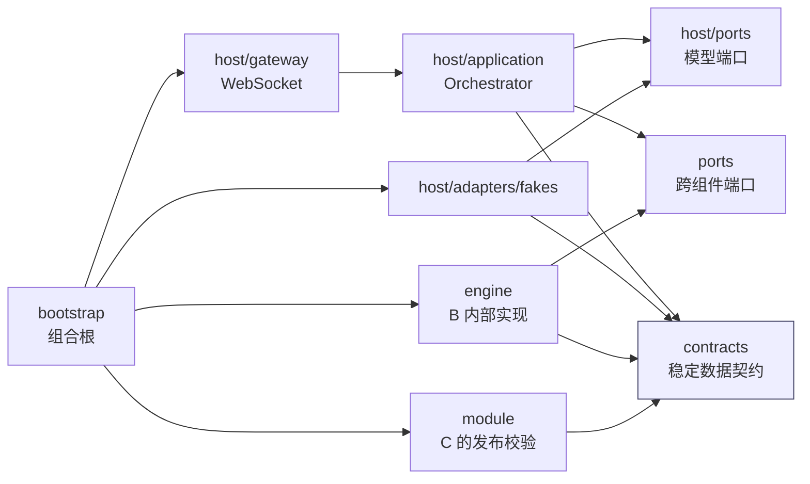

# Agent Collaboration Framework

这是成员 A（主持编排）、成员 B（确定性规则引擎）和成员 C（模组解析/审查）共同使用的模块化单体骨架。当前版本提供稳定边界、可运行的离线纵切、面向持久化的 `RuleEngineService + InMemoryEngineStore`，以及尚未接入主链的 OpenAI Agents SDK + Qwen Host Agent Adapter；不接 LangGraph、PostgreSQL 或 FastAPI。

## 阅读入口

日常开发只看三份文件：

1. 当前文件：项目入口、运行方法和目录总览。
2. [`docs/architecture.md`](docs/architecture.md)：唯一现行架构文档，包含 16 项统一决议、依赖方向和接口边界。
3. [`docs/数据模型设计.md`](docs/数据模型设计.md)：当前 Pydantic 模型、字段、所有权、revision 和幂等语义。

`docs/archive/` 仅用于追溯讨论，不是实现依据。不要从归档文档开始阅读；归档内容与现行文档冲突时，以 `docs/architecture.md`、`docs/数据模型设计.md`、代码中的 Protocol 和自动生成的 JSON Schema 为准。

## 唯一回合主链

```text
PlayerInput
  -> PlayerViewProjector.project()
  -> ContextAssembler.for_intent()
  -> IntentModelPort.generate()          # Fake 返回原始 JSON
  -> IntentParser.parse()                # Pydantic + 可信候选校验
  -> ActionExecutor.execute()            # 每个合法 Intent 恰好调用一次
  -> PlayerViewProjector.refresh()
  -> ContextAssembler.for_narration()
  -> NarrationModelPort.generate()       # Fake 返回原始 JSON
  -> Narrator.narrate()                  # Pydantic + 事实引用校验
  -> WebSocketGateway.handle()
```

`Orchestrator.run()` 是成员 A 的稳定公开入口，MVP 内部采用普通 Python `async` 流程。当前没有 checkpoint、interrupt、resume、多阶段 Action 或 LangGraph。

## Host Agent 契约（尚未接入主链）

`host/ports/HostAgentPort` 是成员 A 在规则引擎之前进行意图理解的内部端口，不是新的 A/B/C 共享业务契约。它只有一个
`astream(HostAgentContext)` 流式入口：接收可信 `PlayerInput` 和 B 已去密的 `PlayerView`，可产生零到多个脱敏的工具进度事件，
最后必须以且仅以一个 `agent.completed` 或 `agent.failed` 结束。

`agent.completed.raw_output` 只是普通、不可信的 JSON candidate；后续仍必须由 `IntentParser` 做确定性校验。当前已有
`host/tools` 中绑定 `HostAgentContext.player_view` 的两个只读工具，以及拒绝模型自行传入身份作用域的框架无关
`ToolRegistry`。它们只搜索/读取当前 `PlayerView`，不访问引擎、数据库或完整模组。

`host/adapters/openai_agents/QwenHostAgentAdapter` 通过 OpenAI-compatible Chat Completions 运行 Qwen，并使用
OpenAI Agents SDK 自带的 model/tool 循环。每次 `astream()` 独立绑定当前 Context 与两个只读工具；Adapter 负责
最大模型轮数、工具调用预算、单工具/整轮 timeout、脱敏事件、部分 usage 和严格 final JSON 对象边界。SDK/Qwen
类型只存在于该私有 Adapter 和 bootstrap 组合根。

`FakeHostAgent`、真实 Adapter 和这些工具都尚未接入上面的 `Orchestrator` 主链。Adapter 不调用
`ActionExecutor`，不执行规则动作或状态写入；它的 `agent.completed.raw_output` 仍必须交给 `IntentParser`。

显式构造 Qwen Adapter 时，由调用方在 bootstrap 阶段提供以下环境变量；模块 import 不读取环境或创建网络客户端：

| 环境变量 | 默认值 | 说明 |
|---|---|---|
| `HOST_AGENT_API_KEY` | 无 | 必填；错误、日志和 `repr` 不输出明文 |
| `HOST_AGENT_BASE_URL` | `https://dashscope.aliyuncs.com/compatible-mode/v1` | 必须是 HTTP(S) URL |
| `HOST_AGENT_MODEL` | `qwen-plus` | 非空模型名 |
| `HOST_AGENT_MAX_TURNS` | `6` | SDK Runner 最大轮数 |
| `HOST_AGENT_MAX_TOOL_CALLS` | `8` | 第 9 次尝试在调用 handler 前失败 |
| `HOST_AGENT_TOOL_TIMEOUT_SECONDS` | `5` | 单工具 timeout，安全回填 `TOOL_TIMEOUT` |
| `HOST_AGENT_TIMEOUT_SECONDS` | `30` | 整轮 timeout |

复制 `.env.example` 只用于准备非敏感默认项；项目不会在 import 时自动加载 `.env`。调用
`bootstrap.host_agent.build_qwen_host_agent()` 才会验证配置并构造客户端。

## 2、3、4 点的统一结论

- `Intent` 不再包含 `execution`，不存在由主持层决定“绕过引擎”的分支。
- 对话、未知意图、`check.route="none"` 和需要检定的动作，只要已通过 Schema 校验，均通过同一个 `ActionExecutor.execute()` 边界恰好一次。
- `Intent` 保留 `check`、`checkpoint_id` 和 `proposed_skills`。主持 Agent 根据玩家语义，从当前 `PlayerView.checkpoint_options` 的可信候选中选择 Checkpoint。
- Checkpoint 的 `action` 只是语义提示，不是穷举式动词白名单。规则引擎不以 `intent.verb == checkpoint.action` 作为合法性条件。
- 规则引擎仍负责复核房间、Actor、视图版本、Scene、Target、Checkpoint 和技能候选，并独占状态修改、Event、骰子与确定性规则执行。

这同时避免两种失败模式：主持层无法凭 `execution` 绕开权威执行边界；规则引擎也不需要用有限动词表重新理解玩家自由语言。

## 模块边界



依赖约束：

- `contracts` 不依赖 A、B、C 的实现。
- `host` 不 import `engine`、`module`、`GameState`、Event 或 `ModuleContent`。
- `engine` 不 import `host`。
- `module` 只负责把输入验证为发布契约，不参与运行时状态和 Event。
- `bootstrap` 是唯一知道具体实现并完成装配的地方。

## 目录

```text
collaboration_framework/
├── contracts/                 # 跨边界 Pydantic 数据契约
│   ├── action.py              # Intent / ActionRequest / 安全 ActionResult
│   ├── module.py              # B/C 共审的声明式 ModuleContent
│   ├── player_view.py         # ProjectionSnapshot / PlayerView
│   └── runtime.py             # PlayerInput
├── ports/                     # A/B 跨组件端口
│   ├── action_executor.py     # 唯一权威命令：execute()
│   └── player_view_source.py  # 只读投影源：read()
├── host/                      # 成员 A：主持编排
│   ├── application/           # 普通 async 工作流与应用服务
│   ├── ports/                 # Intent/Narration/Host Agent 模型抽象及 TurnPort
│   ├── adapters/fakes/        # 无网络、无 API Key 的离线 Fake
│   ├── adapters/openai_agents/# 私有 OpenAI Agents SDK + Qwen Adapter
│   ├── schemas/               # A 内部 Agent/Context/Turn/Narration Schema
│   ├── tools/                 # 绑定当前 PlayerView 的 player-safe 只读工具
│   └── gateway/               # Player-safe WebSocket 输出
├── engine/                    # 成员 B：Service、Kernel、Store 端口/适配器与内部模型
│   ├── service.py            # 跨房间复用的 ActionExecutor / PlayerViewSource
│   ├── kernel.py             # 无存储依赖的确定性规则求值
│   ├── ports/                # B 私有 EngineStore / Transaction 接缝
│   └── adapters/             # 完整离线 InMemoryEngineStore
├── module/                    # 成员 C：ModuleContent 发布校验入口
├── bootstrap/                 # 组合根；装配 A/B/C 的具体实现
├── schema_export.py           # 从 Pydantic 唯一事实源导出 JSON Schema
└── cli.py                     # 完全离线的 Fake 演示入口
```

## 关键所有权

| 契约/能力 | 所有者 | 消费者 | 说明 |
|---|---|---|---|
| `PlayerInput` | 协作层 | A | 可信连接身份在进入应用前建立 |
| `ProjectionSnapshot` | A/B 共审 | A | B 提供的只读、无 `GameState` 投影源 |
| `PlayerView` | A | A 的模型端口、Gateway | 只含当前玩家可见信息和可信候选 |
| `Intent` | A/B 共审 | B | 语义提议；无 `execution` |
| `ActionExecutor.execute()` | B 提供、A 消费 | A/B | 唯一可能产生权威副作用的命令边界 |
| `ActionResult` | A/B 共审 | A | Player-safe；不暴露 StateChange/Event payload |
| `EngineExecutionResult` | B | B | 内部含 StateChange、Event 和版本信息 |
| `EngineRuntimeSnapshot`/`CompletedAction` | B | B | Store 加载快照与幂等执行记录 |
| `NarrationOutput` | A | Gateway | 模型原始 JSON 经 Pydantic 和事实引用校验后的输出 |
| `HostAgentContext`/`HostAgentEvent`/`HostAgentUsage` | A | A 的 Host Agent Adapter | A 内部、框架无关；不是 A/B/C 共享契约，也尚未接入 Orchestrator |
| `ToolRegistry` 与 player-safe 工具 | A | A 的 Host Agent Adapter | 绑定当前 Context，只读；参数/结果均由项目 Schema 校验 |
| `ModuleContent`/`CheckpointSpec`/`RuleSpec` | B/C 共审 | B、C | 声明式内容语言；A 不直接消费 |

## ModuleContent 为什么在 `contracts/module.py`

`ModuleContent` 是 C 发布、B 执行的跨成员协议，而不是 C 的私有解析中间态，也不是 B 的运行时内部对象。把它与声明式 `CheckpointSpec`、`RuleSpec` 放在 `contracts/module.py`，可以让 B/C 共同评审和版本化同一个发布语言，并让 `module/validation.py` 保持为薄适配层。

这里的 `RuleSpec`/`CheckpointSpec` 只描述模组声明了什么；Hook 调度、骰子、状态迁移、Event 和执行期缓存仍属于 `engine/`。A 不 import `ModuleContent`，只从 `PlayerViewSource` 取得经过安全过滤的 `ProjectionSnapshot`，再自行构造 `PlayerView`。

## 运行与验证

要求 Python 3.11+：

```bash
python -m collaboration_framework.schema_export
python -m unittest discover -s tests -v
```

离线演示：

```bash
python -m collaboration_framework.cli \
  --module fixtures/demo-module.json \
  --state fixtures/demo-state.json \
  --input fixtures/demo-turn.json
```

组合根会注册房间的 `ModuleContent + GameState`，并装配一个可服务多个房间的 `RuleEngineService`。后续数据库接入只需实现相同的 `EngineStore` / `EngineTransaction` 语义并替换 adapter；不修改 Host 端口、RuleKernel 或公共 Schema。

Schema 文件由 Pydantic 模型自动生成，不应手工维护：

- `schemas/module-content.schema.json`
- `schemas/player-input.schema.json`
- `schemas/projection-snapshot.schema.json`
- `schemas/player-view.schema.json`
- `schemas/intent.schema.json`
- `schemas/action-request.schema.json`
- `schemas/action-result.schema.json`
- `schemas/narration-output.schema.json`
- `schemas/websocket-output.schema.json`
- `schemas/host-agent-context.schema.json`（A 内部 Adapter 边界）
- `schemas/host-agent-usage.schema.json`（A 内部 Adapter 边界）
- `schemas/host-agent-event.schema.json`（A 内部 Adapter 边界）

工具参数与结果不额外生成一组仓库级 Schema 文件。`ToolDefinition.arguments_json_schema()` /
`result_json_schema()` 直接从对应的严格 Pydantic 模型产生 Adapter 可消费的 Schema，避免第二份手写协议。

## 当前明确不做

- 不把真实 Host Agent、FakeHostAgent 或只读工具接入 `Orchestrator`。
- 不让 Host Agent 调用 `ActionExecutor`、决定规则结果或修改权威状态。
- 不实现数据库/RAG/网络搜索、并行工具调用或任何写工具。
- 不使用 LangGraph。
- 不由主持层实现 Rule、Hook、Checkpoint 执行、Dice、GameState 修改或 Event 写入。
- 不把 `TurnState`、`EngineExecutionResult`、Event 或摘要 Outbox 暴露为跨组件公共契约。
- 不把 `components/` 当成第二套永久架构；统一代码直接按所有权进入上述模块。
