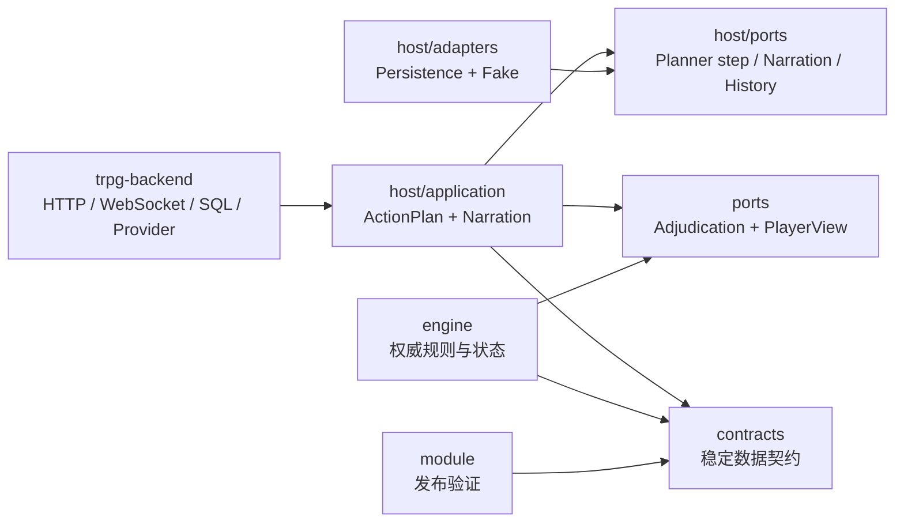

# Agent Collaboration Framework

这是 TRPG 主持编排、确定性规则引擎和模组发布共同使用的模块化单体框架。它提供
Pydantic 契约、玩家安全投影、ActionPlan 编排、Opening/ActionPlan 叙事校验、规则引擎
端口、离线 Fake 和 JSON Schema 导出；生产 HTTP、WebSocket、SQL 与模型 Provider 适配位于
`trpg-backend`。

## 阅读入口

1. [`docs/architecture.md`](docs/architecture.md)：现役生产链路、依赖方向和所有权边界。
2. [`docs/数据模型设计.md`](docs/数据模型设计.md)：当前模型字段、revision、幂等和安全语义。
3. [`docs/module-parser/MODULECONTENT-README.md`](docs/module-parser/MODULECONTENT-README.md)：模组发布语言与验证入口。
4. [`docs/architecture/issue-208-action-plan.md`](docs/architecture/issue-208-action-plan.md)：有限 ActionPlan、步骤幂等和恢复设计。

## 当前回合链路

```text
PlayerInput
  -> PlayerView + KeeperCapabilityView
  -> HostTurnDecisionModel.generate(HostAgentContext)
  -> HostTurnDecisionParser
       -> single_action: AdjudicationEngine
       -> action_plan: ActionPlanOrchestrator
            -> 每步刷新 PlayerView
            -> ActionPlanStepAdjudicator
            -> AdjudicationEngine
  -> ActionPlanNarrator
  -> narration policy
  -> backend WebSocket turn.completed
```

`HostAgentContext` 是当前 Planner 的稳定输入，只包含可信 `PlayerInput`、玩家安全
`PlayerView`、同作用域近期历史和受控 `KeeperCapabilityView`。它校验 room/player/actor、
revision 与 Keeper scope 一致性，不允许模型读取数据库、完整 `GameState` 或完整
`ModuleContent`。

模型只负责规划、当前步骤裁决候选和叙事候选。`AdjudicationEngine` 重新校验身份、revision、
目标、规则和效果，并独占状态、骰点和 Event 提交。`ActionPlanNarrator` 只能表达已提交的
player-safe evidence；`OpeningNarrator` 使用独立的开场上下文。共享
`host/application/narration_policy.py` 统一处理文本规范化、协议残留拒绝、主体所有权和分句。

`Intent`、`ActionRequest`、`ActionResult`、`CompletedAction` 与
`EngineExecutionResult` 仍是引擎及历史数据读取契约，但不是当前 Host 应用入口或发布的
Host API。

## 模块边界


```mermaid
flowchart LR
    BACKEND["trpg-backend<br/>HTTP / WebSocket / SQL / Provider"] --> HAPP["host/application<br/>ActionPlan + Narration"]
    HAPP --> HPORTS["host/ports<br/>Planner step / Narration / History"]
    HAPP --> XPORTS["ports<br/>Adjudication + PlayerView"]
    HAPP --> CONTRACTS["contracts<br/>稳定数据契约"]
    ADAPTERS["host/adapters<br/>Persistence + Fake"] --> HPORTS
    ENGINE["engine<br/>权威规则与状态"] --> XPORTS
    ENGINE --> CONTRACTS
    MODULE["module<br/>发布验证"] --> CONTRACTS
```

- `contracts` 不依赖 Host、Engine、Module 或 Provider。
- `host` 不 import Engine/Module 实现，也不写权威状态。
- `engine` 不 import Host，并独占规则执行与持久化提交语义。
- `module` 只验证并发布 `ModuleContent`，不参与运行时状态。
- Provider prompt/client/retry 属于 backend；Framework 只保留 provider-neutral prompt contract。

## 目录

```text
collaboration_framework/
├── contracts/             # ActionPlan、legacy action、PlayerView、ModuleContent
├── ports/                 # AdjudicationExecutor、PlayerViewSource
├── host/
│   ├── application/       # ActionPlan、Opening/ActionPlan Narrator、共享 policy
│   ├── ports/             # 现役模型、历史与持久化端口
│   ├── prompts/           # provider-neutral ActionPlan prompt contract
│   ├── schemas/           # Planner、ActionPlan、Opening、History、Narration
│   └── adapters/          # ActionPlan persistence 与离线 Fake
├── engine/                # 确定性规则、Store 端口/适配器和内部模型
├── module/                # ModuleContent 发布验证
└── schema_export.py       # 从 Pydantic 事实源导出 JSON Schema
```

## 关键所有权

| 契约/能力 | 所有者 | 说明 |
|---|---|---|
| `PlayerInput` / `PlayerView` | A/B 共审 | 可信身份与 revision-bound 玩家安全投影 |
| `HostAgentContext` | Host | Planner 输入；含 scope 校验的安全上下文 |
| `HostTurnDecision` / `ActionPlan` | A/B 共审 | 单动作或有限顺序语义计划；不含未来效果 |
| `AdjudicationExecutor` | Engine 提供、Host 消费 | 唯一权威写入边界 |
| `ActionPlanRun` / Store | Host | CAS、lease、步骤游标和恢复状态 |
| `NarrationOutput` | Host | Opening、ActionPlan、持久化与发送共享的安全叙事输出 |
| `ModuleContent` | B/C 共审 | C 发布、B 执行的声明式内容语言 |
| legacy action/engine records | Engine/Storage | 保持历史 SQL 记录和表达式兼容读取 |

## Schema 发布

运行 `python -m collaboration_framework.schema_export` 会从 Pydantic 唯一事实源生成
`schemas/*.schema.json`。发布面包括 Module、PlayerView、Adjudication、ActionPlan、Opening、
Narration、RecentHistory 与 `HostAgentContext`；backend WebSocket DTO 由 backend 自己维护，
不会从 Framework exporter 生成。

## 验证

要求 Python 3.11+ 和 `uv`：

```bash
uv run python -m collaboration_framework.schema_export
uv run ruff check .
uv run ruff format --check .
uv run ty check
```

Framework 测试依赖由仓库 backend 开发环境提供时，可在 `trpg-backend` 执行：

```bash
uv run pytest ../agent-collaboration-framework/tests
```

## 明确边界

- 不让模型直接提交 `GameState`、Event、骰点或数据库写入。
- 不把 Keeper capability、完整规则结果或历史私有文本发送给玩家。
- 不让未来步骤提前获得裁决；每步必须基于最新 PlayerView。
- 不把 Provider SDK 类型、客户端或配置引入 Framework 核心。
- 不将 legacy 数据读取契约重新暴露为当前 Host API。
