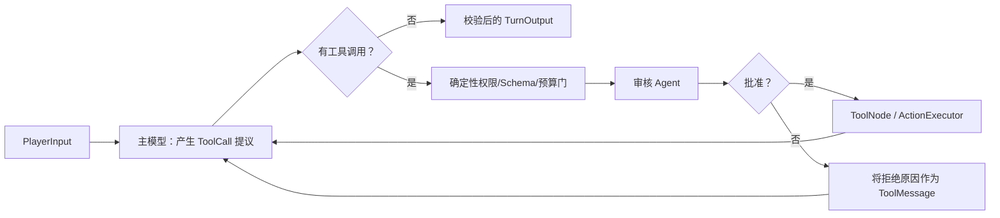
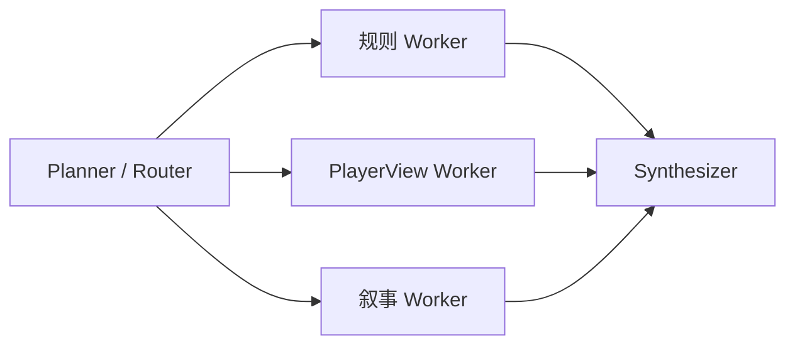

# 主持编排 Agent 技术选型：三层候选、需求审计与验证计划

> 状态：proposal / **决策未定**
> 日期：2026-07-21
> 关联：[Issue #86](https://github.com/1024XEngineer/TRPG-master/issues/86)
> 适用范围：`agent-collaboration-framework` 中成员 A 的主持编排；不改变 B 的确定性规则权威和 A/B/C 公共契约。

## 1. 决策状态

**目前没有在供应商 Agent Runtime、显式 Python 编排和 LangGraph 三个方案中做出最终选择。**

Issue #86 中“先用普通 Python、后续再考虑 LangGraph”是 2026-07-20 上午基于两方案实验形成的阶段性路线，不是加入供应商 Agent Runtime 候选后的最终 ADR。该实验也只实现了普通 Python 与 LangGraph，不能为尚未实现和测量的第三个方案代言。

本文件的作用是：

1. 明确三个候选方案及各自边界；
2. 审计当前项目是否真实需要工具调用和多轮工具调用；
3. 规定同条件三方案实验与决策门槛；
4. 在证据补齐前保持 PR 为 Draft，不把任何候选写成既成事实。

三个候选代表 Agent 实现的不同细度：

| 层次 | 实现方式 | 适合的问题 | 主要代价 |
| --- | --- | --- | --- |
| 1. 供应商 Agent Runtime | OpenAI Agents SDK、Anthropic SDK tool runner / Managed Agents 等 | 单一供应商、少量工具、希望快速验证多轮工具循环 | 供应商耦合、运行与追踪数据边界、抽象可控性 |
| 2. 显式 Python 编排 | 模型 SDK + `async` + 自己维护消息、工具与循环 | 固定、线性或很小的流程；需要完全掌握协议与安全边界 | Schema、工具回填、循环、重试、状态和可观测性需要自己实现 |
| 3. 图工作流 Runtime | LangGraph `StateGraph`、`ToolNode`、子图与 reducer | 条件路由、循环、多工具、多 Agent、fan-out/fan-in、checkpoint 或 interrupt | 更重依赖、状态模型和图语义的学习与升级成本 |

**选型的首要依据不是“能否流式输出”，而是已经确认的工具调用需求和工作流拓扑：是否需要模型自主选择工具、是否会多轮调用工具、是否存在动态路由/并行/恢复。** 三层都能流式输出；任何一层都不能绕过本项目的事实校验和玩家可见性边界。

### 1.1 当前代码需求审计

以当前仓库代码为准，而不是以未来设想或 Agent 术语为准，`Orchestrator.run()` 的实际路径是：

```text
读取/投影 PlayerView
  → IntentModelPort.generate() 一次
  → IntentParser 校验
  → ActionExecutor.execute() 一次
  → PlayerViewSource.read()
  → NarrationModelPort.generate() 一次
  → TurnOutput
```

| 检查项 | 当前代码证据 | 判定 |
| --- | --- | --- |
| 模型是否收到工具 schema | 两个 Model Port 都只有 `generate(context) -> dict` | 否 |
| 模型是否产生 `tool_calls` | 生产代码中没有 tool-call 消息、解析器或 `bind_tools` / `tools=` | 否 |
| `ActionExecutor.execute()` 是否由模型动态选择 | `Orchestrator` 在 Intent 校验后无条件调用，且恰好一次 | 否；它是确定性应用端口调用 |
| 工具结果后模型是否决定继续调用工具 | 执行后只进入固定的 Narration 阶段 | 否 |
| 是否存在多轮工具循环 | 没有 tool message 回填、循环条件或最大工具轮数 | 否，当前为 0 轮 |
| 是否存在动态路由、fan-out/fan-in、审核 Agent | 当前生产主链均未实现 | 否 |

因此，截至本次审计：

- 当前已提交 MVP **没有模型工具调用，也没有多轮工具调用**；
- 两次模型调用是固定的“意图提取”和“受约束叙事”，不是 ReAct 工具闭环；
- `ActionExecutor.execute()` 是 A/B 之间的权威命令边界。可以从“玩家动作皆可建模为工具”的视角理解它，但这种概念映射不等于 LLM runtime 中已经存在 tool call；
- 仅从当前主链看，甚至不必引入 Agent runtime，基础模型 SDK 加结构化输出已经足以表达流程；是否引入三种候选中的任一种，要结合近期确定会进入范围的能力继续判断。

### 1.2 选型前必须确认的需求

在做决定前，需由项目需求或可执行用例回答以下问题，不能仅凭框架使用体验判断：

| 需求问题 | 需要记录的证据 | 对选型的影响 |
| --- | --- | --- |
| 后续网络搜索是否纳入本轮选型范围 | 已提出该规划；仍需明确用户故事、时间范围、数据源和允许的搜索工具 | 可能首次引入模型工具调用 |
| 搜索是固定调用还是模型自主选择 | 调用时机、可跳过条件、工具白名单 | 固定调用仍可用普通函数；自主选择才需要 Agent loop |
| 一次任务最多连续调用几轮工具 | 例如 search → fetch → refine → cite 的验收用例 | 标准多轮循环可能适合供应商 Runtime；复杂分支提高 LangGraph 价值 |
| 是否需要工具执行前的 LLM 审核 | 审核结果、拒绝回填、重试上限 | 引入条件循环和第二个 Agent |
| 是否需要 fan-out/fan-in | Worker 数量是否动态、如何聚合、部分失败语义 | 动态并行和状态合并偏向图工作流 |
| 是否需要暂停、恢复、人工批准 | 恢复粒度、持久化时间、幂等规则 | 需要成熟的 runtime 状态语义 |
| 是否必须兼容 Qwen 或多供应商 | 支持矩阵与真实 API 测试结果 | 直接影响供应商 Runtime 是否可用及锁定成本 |

已知后续方向包含网络搜索，但“有一个搜索能力”仍不足以判定 Agent runtime：应用固定在某个步骤搜索不构成模型工具循环；模型自主决定是否搜索才构成工具调用；search → fetch → refine/cite 才可能构成多轮工具调用。只有把这种调用形态和近期范围确认后，实验权重才有业务依据。

## 2. 三层实现模型

### 2.1 层 1：供应商提供的 Agent Runtime

这一层的目标是最少的 Agent 样板代码。以 OpenAI 为例，`openai-agents`（不是仅调用 Chat Completions 的基础 `openai` 客户端）提供 Agent、工具、handoff、guardrail、session、流式事件和 tracing；Runner 会自动执行“模型请求工具 → 执行工具 → 回填工具结果 → 再次调用模型”的循环。[OpenAI Agents SDK](https://openai.github.io/openai-agents-python/)

Anthropic Python SDK 也提供 `@beta_tool` 和 `beta.messages.tool_runner`：它会运行工具、处理请求/响应循环、管理对话状态、包装错误和类型校验；该 API 仍标记为 beta。[Claude Tool Runner](https://platform.claude.com/docs/en/agents-and-tools/tool-use/tool-runner)

概念上可以写成：

```python
agent = Agent(
    name="host",
    instructions=HOST_PROMPT,
    tools=[look_up_rule, roll_check],
)

result = await Runner.run(agent, player_message)
```

适合：

- 只想快速验证“模型是否会选对工具”；
- 工具数量少、流程是标准 ReAct 循环；
- 使用单一供应商模型；
- 不需要复杂的自定义状态图。

限制与约束：

1. 当前实验用的是 Qwen 的 OpenAI 兼容 Chat Completions 接口；“接口兼容”不等于它可无修改接入 OpenAI Agents SDK 默认的 Responses API / provider 配置。接入前必须做模型适配、工具调用、流事件和错误行为的真实验证。
2. OpenAI Agents SDK 的 tracing 默认开启；接入前必须确认 trace 中是否含玩家输入、工具参数、模型输出和游戏秘密，并显式配置敏感数据策略。[OpenAI Agents SDK Tracing](https://openai.github.io/openai-agents-python/tracing/)
3. Anthropic 的 tool runner / Managed Agents 和 OpenAI 的 Agent Runtime 都有供应商特定的模型、托管工具、会话和数据边界；它们不应成为 A/B/C 公共协议。
4. 该层可以减少循环代码，但不能取代规则引擎、权限校验、事实验证或玩家可见性投影。

### 2.2 层 2：普通 Python + 直接模型 SDK

普通 Python 路线不是“没有 Agent”，而是主动拥有 Agent runtime：

```text
模型请求工具
  → 组装工具参数
  → 执行本地工具
  → 追加 tool message
  → 再次调用模型
  → 无工具调用时结束
```

它可以直接表达当前固定主链：`PlayerView → Intent → ActionExecutor.execute() → Narration`，并能显式放置 Schema 与 `claimed_fact_ids` 校验。但“可以表达”不等于已经选定；当前主链也可由基础模型 SDK 完成，若近期确认需要标准多轮工具循环，供应商 Runtime 可能以更少代码实现同一目标。

普通 Python 在以下条件下是值得验证的候选：

- 不调用工具，或只有一两个固定工具；
- 工具调用轮数有限，且不需要动态工作流；
- 不需要暂停恢复、跨进程 checkpoint、图级可视化；
- 业务安全门必须显式、逐行可审计；
- 团队正在学习模型工具调用的底层协议。

本仓库的 [`experiments/plain-python-tool-agent`](../experiments/plain-python-tool-agent/) 展示了显式流式工具参数拼接、工具注册、错误回填和最大轮数保护。它是理解和回归测试协议的基线，不要求未来生产实现永远停留在这一层。

### 2.3 层 3：LangGraph 图工作流

当“模型—工具—模型”不再是唯一拓扑，而变成分支、循环、并行和多个上下文隔离的 Agent 时，LangGraph 的价值来自工作流 runtime，而非简单的 token 流。

LangGraph 节点仍然可以是普通 Python 函数或 LLM 调用；边定义顺序和条件路由；状态 schema 与 reducer 定义并发结果如何合并。它原生支持条件边、并行 super-step、`Send` 动态 fan-out、`ToolNode`、子图、checkpoint 与 interrupt。[LangGraph Graph API](https://docs.langchain.com/oss/python/langgraph/graph-api)

适合迁移到 LangGraph 的触发条件：

- 主 Agent 的工具调用需要在执行前由另一个审核 Agent 审核；
- 一个任务会多轮选择、执行、拒绝或重试不同工具；
- 需要 fan-out/fan-in 或动态数量的 Worker；
- 多 Agent 有不同私有上下文、权限或持久化策略；
- 需要 checkpoint、长任务恢复、人工审批、节点级状态观察；
- 手写的状态机、并发、恢复和事件排序成本开始超过框架成本。

[`experiments/langgraph-tool-agent`](../experiments/langgraph-tool-agent/) 使用 LangChain 当前推荐的 `create_agent`，展示标准工具循环。对于需要在工具执行前插入审核节点或实现 fan-out/fan-in 的工作流，应从 `create_agent` 下沉到 `StateGraph + ToolNode`，而不是把完整的标准 Agent 循环当成不可打断的黑盒。

## 3. 基于需求的候选筛选规则（不是当前结论）

下表只规定在某类需求已经被确认时优先验证哪个候选，不表示本项目当前已经属于该类别。

| 已确认的需求形态 | 优先验证候选 | 原因 |
| --- | --- | --- |
| 没有工具，只需一次结构化 LLM 输出 | 直接模型 SDK | 不需要 Agent loop |
| 一个供应商、少量工具、标准多轮 ReAct | 供应商 Agent Runtime | 快速得到工具循环、stream、trace 和基础 guardrail |
| 固定线性主链、强业务安全门、Qwen 兼容接口 | 显式 Python | 完全控制消息、验证和失败语义 |
| 多轮工具选择、工具拒绝/重试、动态可用工具 | LangGraph | 条件路由、ToolNode、state 与 middleware 更可维护 |
| 审核 Agent、研究 Worker、聚合 Agent 并行协作 | LangGraph | 子图、`Send`、reducer 和 checkpoint 降低编排复杂度 |
| 需要长期会话、暂停、恢复、人工批准 | LangGraph 或经验证的供应商 Runtime | 不能只靠简单 `asyncio.gather()` 补齐运行时语义 |

这些方案不是单向升级链：同一个系统可以在不同边界同时使用三层。

```text
普通 Python：规则校验、数据转换、工具业务函数、外部事件协议
    ↓
供应商 Runtime：某个独立、短生命周期的标准 Agent
    ↓
LangGraph：跨 Agent 的路由、并发、恢复与工作流状态
```

关键原则是：**框架只拥有内部编排状态；`PlayerInput`、`PlayerView`、`Intent`、`ActionRequest`、`ActionResult`、`TurnOutput` 和玩家可见事件仍是稳定业务边界。**

## 4. ReAct：一个 Agent 内的工具闭环，而非“公开思维过程”

ReAct 可以理解为 Agent 在解决任务时反复进行：

```text
依据当前上下文选择动作（Action）
    → 调用工具
    → 获得观察结果（Observation）
    → 根据新结果决定下一步
```

对于主持编排，典型的 Action 不是直接写游戏状态，而是：

- 读取经脱敏的 `PlayerView`；
- 提议一个 `Intent`；
- 读取可信 Checkpoint 候选；
- 调用唯一权威入口 `ActionExecutor.execute()`；
- 读取执行后的玩家可见事实；
- 生成受事实约束的叙事。

这里有两个不可破坏的边界：

1. Agent 的工具调用只是**提议**；B 的确定性引擎才拥有规则、骰子、状态和 Event 权威。
2. ReAct 的内部推理或原始模型 token 不是玩家可见事件。玩家只能看到经过安全投影的阶段状态、工具执行进度和通过 Pydantic / 事实校验的最终结果。

因此，流式协议应继续采用语义事件，如 `turn.phase_changed`、`tool.started`、`tool.completed`、`turn.completed`，而不是暴露原始 reasoning 内容。

## 5. 审核 ReAct Agent：何时从标准 Agent 下沉到图

若需求是“主 Agent 产生 tool call 后、工具真正执行前，交给第二个 LLM 审核”，结构应是：



审核 Agent 可以判断语义合理性，例如“此时搜索是否必要”“查询是否过宽”；但不能成为唯一安全门。工具白名单、用户权限、参数 schema、速率/费用限制、`ActionExecutor` 唯一入口和玩家可见性必须在确定性代码中校验。

这类流程可以手写，但必须自行处理：未执行的 tool call 如何回填、拒绝后如何让主模型重试、最大审核轮数、并发工具、错误分支、事件排序和恢复。达到此复杂度时，`StateGraph` 的条件边、`ToolNode` 和 node-level retry 会比手写循环更合适。

## 6. fan-out / fan-in 与 multi-agent

### 6.1 固定并行

例如一个玩家问题同时触发三种独立分析：规则核对、玩家可见事实核对、叙事风格草案：



这是固定 fan-out/fan-in。普通 Python 可以用 `asyncio.gather()` 手写；LangGraph 通过多个并行边与 reducer 聚合状态。并行并不自动意味着安全：每个 Worker 仍必须只接收其被授权的上下文。

### 6.2 动态 Worker

如果 Planner 先拆出未知数量的子任务，例如根据玩家行动生成若干可核对的线索或检索任务，再为每个子任务创建 Worker，则是动态 fan-out。LangGraph 的 `Send` API 专为 map-reduce / orchestrator-worker 模式设计：每个 Worker 获得自己的输入，输出写入带 reducer 的共享结果，再由聚合节点生成最终答案。[LangGraph Workflows and Agents](https://docs.langchain.com/oss/python/langgraph/workflows-agents)

### 6.3 何时才值得拆成多个 Agent

不要为了“多 Agent”而机械拆分。一个职责值得成为独立 Agent，通常至少满足一项：

- 需要不同的上下文可见范围；
- 需要不同模型、提示词、温度或评测标准；
- 需要独立的工具权限；
- 能并行带来确定的延迟收益；
- 有独立失败模式、重试策略或长期状态；
- 输出可以被明确的强类型契约消费。

否则它更适合保留为同一 Agent 内的普通函数或提示词步骤。子图应按上下文和权限隔离，而不是按“听起来像一个角色”的名称拆分；LangGraph 子图可作为父图节点，并支持不同的 state schema 与持久化策略。[LangGraph Subgraphs](https://docs.langchain.com/oss/python/langgraph/use-subgraphs)

## 7. “万物皆可 Agent”：玩家行为如何指导接口梳理

“玩家是一个 Agent”应理解为一种接口设计视角，而不是把真人玩家误当成可直接执行内部工具的 LLM：玩家、测试脚本、未来 AI 玩家都可以是同一个游戏交互协议的调用方。

玩家在游戏中的每一种可见意图都可被建模为一个受限动作（概念上的 tool call）：

| 玩家要做什么 | 需要的可见信息 | 对应稳定接口 / 契约 | 权威结果 |
| --- | --- | --- | --- |
| 看周围、查看线索 | 当前可见场景、目标、线索 | `PlayerViewSource.read()` → `PlayerView` | 仅玩家可见投影 |
| 宣告行动 | 可选目标、技能、Checkpoint | `PlayerInput` → `Intent` | 仅提议，尚未改变状态 |
| 检定、交互、对话、移动、使用物品 | 已校验的意图与可信候选 | `ActionExecutor.execute(ActionRequest)` | `ActionResult`、权威 Event / StateChange（内部） |
| 知道发生了什么 | 执行后可见事实 | `TurnOutput` / 玩家可见 WebSocket 事件 | 已校验叙事和安全状态 |

所以梳理“玩家玩一回合时需要查询什么、能提出什么动作、动作后期待什么反馈”，就是梳理系统需要提供的查询、命令和事件接口。

这带来四个实现要求：

1. 人类玩家与未来 AI 玩家都只通过 `PlayerInput` 等公开命令边界进入系统，不能直接调用内部 `ActionExecutor` 或读取 `GameState`。
2. 模型产生的 `Intent` 与玩家 UI 选择的动作一样，都必须通过可信候选和确定性引擎校验。
3. 工具以玩家能力（看、问、行动、等待结果）建模，而不是以数据库表或内部对象直接暴露。
4. 每个动作都应有明确的输入 schema、权限、幂等语义、超时/失败语义和玩家可见输出；这使真人、Bot、自动化测试和未来多 Agent 都能复用同一协议。

## 8. 三方案同条件验证计划

### 8.1 当前证据边界

仓库目前只有两套隔离、业务无关的学习实验：

- [`plain-python-tool-agent`](../experiments/plain-python-tool-agent/)：展示手写流式工具调用循环；
- [`langgraph-tool-agent`](../experiments/langgraph-tool-agent/)：展示 `create_agent`、`@tool` 和 LangGraph 运行时；
- [`COMPLEXITY_REPORT.md`](../experiments/agent-orchestration-evaluation/COMPLEXITY_REPORT.md)：记录这两种实现使用相同通用工具、真实 Qwen 调用时的代码量、依赖和端到端数据。

这组数据只能支持以下结论：

1. 普通 Python 与 LangGraph 都能流式输出和调用工具；
2. 工具 Agent 的流式输出都需要转换为结构化事件；
3. 普通 Python 的依赖面较小，LangGraph 明显减少了本地工具 schema 和循环样板代码；
4. 现有三次端到端数据受公网和模型推理影响，只能说明性能在同一秒级区间，不能当作纯框架开销基准。

它**不能**支持以下结论：

- 供应商 Agent Runtime 是否比另外两种方案更简单或更适合本项目；
- 当前项目已经应该选择普通 Python 或 LangGraph；
- OpenAI 兼容的 Qwen Chat Completions 接口一定兼容某个供应商 Agent Runtime；
- 网络搜索、审核 Agent 或 fan-out/fan-in 已经是当前需求。

### 8.2 必须补齐的第三个实现

最终决策前，应新增一个与现有两个项目同样隔离、业务无关的 `provider-agent-runtime` 实验。若生产候选模型包含多个供应商，应分别记录 OpenAI Agents SDK、Anthropic tool runner 或所选供应商 runtime 的可用性；不能用一个供应商的成功结果替代另一个供应商的兼容性结论。

三个实现至少运行同一组场景：

| 场景 | 目的 |
| --- | --- |
| S0：无工具、结构化输出 | 判断是否根本不需要 Agent runtime |
| S1：单个模型自主工具调用 | 验证 schema、参数流、结果回填与最终回答 |
| S2：连续两轮以上工具调用 | 验证标准多轮 ReAct 与终止条件 |
| S3：非法参数、未知工具、超时和工具失败 | 验证错误回填、重试、上限和可观察事件 |
| S4：执行前审核与拒绝后重试 | 仅当近期需求确认需要审核 Agent 时运行 |
| S5：动态 fan-out/fan-in 与部分失败 | 仅当近期需求确认需要多 Agent 并行时运行 |

比较时固定同一模型、提示词、工具语义、输入样本和外部事件协议；若因 runtime 限制无法使用同一模型，必须把“供应商/模型差异”列为混杂变量，不比较模型正确率，只比较可接入性与本地实现复杂度。

需要记录：

- 核心 Agent/工具代码 SLOC、圈复杂度、直接与传递依赖；
- 首事件时间、总耗时、模型调用轮数与工具调用轮数；
- 工具选择正确率、多轮任务完成率、失败/重试行为；
- 结构化流事件转换所需代码和事件排序一致性；
- provider 锁定、Qwen 兼容性、tracing 敏感数据策略；
- checkpoint、人工批准、动态并行等已确认能力的实现成本；
- 团队能否在不阅读框架内部实现的情况下定位一次失败。

详细执行清单见 [`THREE_WAY_EVALUATION_PLAN.md`](../experiments/agent-orchestration-evaluation/THREE_WAY_EVALUATION_PLAN.md)。

## 9. 决策门槛

只有同时满足以下条件，才能将本 proposal 升级为 ADR 并关闭选型：

1. 当前与近期已承诺功能的工具清单已完成，并标明哪些是确定性函数调用、哪些由模型自主选择；
2. 已给出每个用例最大工具轮数，以及是否需要审核、并行、暂停、恢复；
3. 供应商 Agent Runtime 的第三个实验已实现，或已用真实兼容性失败证明其不可行；
4. 三方案完成同条件场景测试，原始命令、版本和数据可复现；
5. 安全边界、玩家可见事件协议、供应商锁定和 tracing 数据边界已评审；
6. 决策记录说明为何被选方案的复杂度与已确认需求匹配，并记录未选方案的反证。

届时按证据套用以下条件，而不是预先锁定路线：

```text
没有模型工具调用
    → 基础模型 SDK；不引入 Agent runtime

少量工具 + 标准多轮 ReAct + 供应商兼容可接受
    → 供应商 Agent Runtime 是优先候选

固定且高度定制的安全流程 + 供应商中立 + 循环很小
    → 显式 Python 是优先候选

审核循环 + 动态分支/工具 + 多 Agent + fan-out/fan-in + 恢复
    → LangGraph StateGraph 是优先候选
```

如果需求落在两个类别之间，可以在稳定业务边界内组合使用，不要求整个系统只能有一种实现。

## 10. 决策前允许推进与禁止事项

选型未定不妨碍推进框架无关的工作：

- 保持 `ActionExecutor.execute()` 的唯一权威执行语义；
- 梳理玩家动作、玩家可见查询和安全事件接口；
- 定义框架无关的 `TurnEvent`，区分文本、阶段、工具提议、工具结果和完成事件；
- 将模型 SDK、供应商 Runtime 或 LangGraph 限制在成员 A 的 adapter / application 内部；
- 为模型调用轮数、工具调用轮数、耗时、失败和人工介入建立测量点。

决策前禁止：

- 把本文件或 Issue #86 的阶段性描述表述为“已经决定继续普通 Python”；
- 把尚未验证的供应商 Runtime、Qwen 兼容性或 LangGraph 能力写成项目事实；
- 仅凭概念上的“玩家动作是 tool call”推导模型运行时需求；
- 把玩家、模型或 Agent 赋予绕过 `ActionExecutor` 的状态写权限；
- 向玩家流式发送模型的原始 reasoning、未验证 token 或内部 ToolMessage；
- 因“万物皆可 Agent”而把所有普通函数拆成 Agent。
