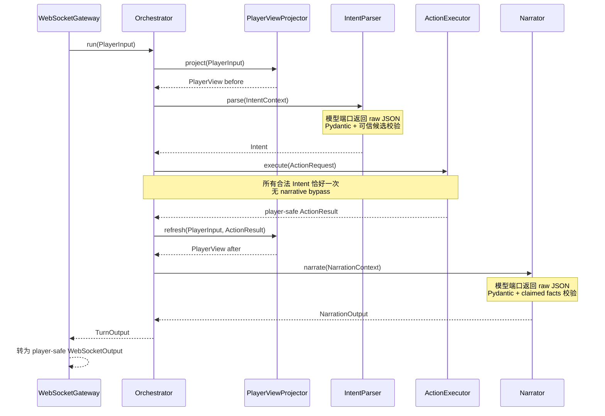
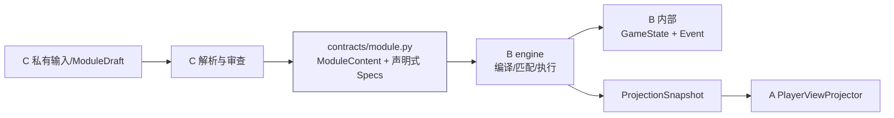
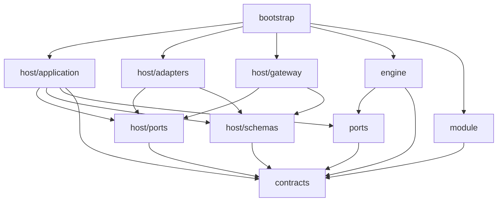

# A/B/C Agent 架构统一决议

状态：**Accepted**  
适用基线：`agent-collaboration-framework`  
讨论来源：[Issue #68](https://github.com/1024XEngineer/TRPG-master/issues/68)

本文记录三位成员已经达成的最终接口和所有权结论。它不是未来功能设计，而是当前协作代码的约束。若旧提案、旧图或旧示例与本文冲突，以本文、代码中的 Protocol 和自动生成的 JSON Schema 为准。

## 1. 共同目标

当前采用一个模块化单体仓库，但按所有权建立稳定边界：

- A 负责 PlayerView 投影、IntentParser、显式 async Orchestrator、Narrator 和 WebSocket 输出。
- B 负责 Rule、Hook、Checkpoint 执行、Dice、GameState 修改、Event 写入和事务/幂等。
- C 负责模组解析、审查和发布 `ModuleContent`。
- A 只能通过 `ActionExecutor.execute()` 发出可能影响权威状态的动作。
- MVP 只使用 Fake，不连接真实模型、LangGraph 或生产规则引擎。

## 2. 最终回合时序

## 3. 16 个争议点的最终选择

### 1. Orchestrator 入口

选择：公开接口固定为 `async Orchestrator.run(PlayerInput) -> TurnOutput`，内部为普通 Python async 工作流。

理由：A 的调用方不依赖内部编排技术。未来采用 LangGraph 时，只替换 `run()` 内部的实现或提供同一 `TurnPort` 的新适配器，Gateway 和 A/B 契约无需改变。

### 2. 哪些动作进入引擎

选择：每个通过 Schema 和可信候选校验的 `Intent`，包括 action、dialogue、unknown、`check.route="none"`，都调用 `ActionExecutor.execute()` **恰好一次**。

理由：是否修改权威状态只能由 B 判断。对话、无法理解的动作和无检定动作仍可能触发回合规则、拒绝规则、审计或幂等处理；A 不能因为表面上“只是叙事”而绕过 B。

### 3. `Intent.execution`

选择：删除。

理由：一旦所有合法动作都经过统一命令边界，`execution=narrative|engine` 既冗余又会重新引入旁路。Narrator 只负责表达已经由 B 确认的结果，不负责决定是否执行。

### 4. `check` / `checkpoint_id` / `proposed_skills`

选择：保留。

理由：C 无法在模组中穷举玩家所有自由表达。A 的语义解析职责包括把玩家话语映射到当前可见且可信的 Checkpoint 候选；B 不应重新用固定 `verb` 表理解自然语言。与此同时，B 必须复核 Checkpoint 是否属于当前 Scene、Target 是否一致、技能是否在允许集合、上下文版本是否有效。

边界细化：

- `PlayerView.checkpoint_options` 是 A 可选择的可信候选集合。
- `CheckpointSpec.action` / `CheckpointOption.action_hint` 是语义提示，不是动词白名单。
- `Intent.verb` 是开放字符串，并通过团队维护的受控词汇逐步规范；Schema 不使用封闭 Enum 阻断扩展。
- A 不能编造候选之外的 Checkpoint 或技能。
- B 不要求 `intent.verb` 与 `checkpoint.action` 字面相等。

### 5. Target 表示

选择：使用带 discriminator 的 `MatchedTarget | UnmatchedTarget`。

理由：避免同时出现 `id` 和 `raw`、两者都没有或依靠空字符串表达状态。Pydantic 在系统边界即可拒绝歧义对象。

### 6. Intent verb

选择：`verb: str`，配合版本化受控词汇，不使用封闭 Enum。

理由：自由行动会持续产生新表达；封闭 Enum 会把产品扩展变成频繁的破坏性 Schema 变更。受控词汇仍可为数据分析、评测和兼容性提供规范，而未收录表达可以被 A 归一化或保留。

### 7. 模型端口与 Pydantic 校验边界

选择：`IntentModelPort` 和 `NarrationModelPort` 返回原始 JSON 对象；`IntentParser` 和 `Narrator` 在 application 层校验为强类型对象。

理由：第三方模型 SDK 是基础设施细节。应用层拥有“什么才算合法 Intent/Narration”的政策，不能把该职责交给某个特定 SDK。Orchestrator 只接收已校验对象。

### 8. A/B 执行端口

选择：唯一跨 A/B 命令端口命名为 `ActionExecutor.execute(ActionRequest) -> ActionResult`。

理由：它表达能力而不是当前实现技术。B 可以在后面替换 Fake、事务型引擎或远程适配器，A 不需要改调用方式。

### 9. PlayerView 所有权与投影输入

选择：A 拥有 `PlayerView` 和投影政策；B 提供只读、无 `GameState` 的 `ProjectionSnapshot`，端口为 `PlayerViewSource.read()`。

理由：B 知道权威状态，但不能把完整 GameState/秘密泄漏给 A 的模型上下文；A 知道当前玩家需要看到什么。中间快照让两种职责都能独立演进。A 不 import `GameState` 或 `ModuleContent`。

### 10. ActionResult 与 B 内部执行结果

选择：跨边界 `ActionResult` 只含 player-safe 事实、叙事约束、视图版本和不透明 Event 引用；B 内部 `EngineExecutionResult` 可含 StateChange、完整 Event、状态版本和确认事实。

理由：A/Narrator 不应看到秘密状态或可误用的写入细节，WebSocket 更不能意外序列化这些字段。Event payload 和 StateChange 是 B 的内部执行/审计模型。

#### 10.1 Revision 与幂等重放

`ActionResult.view_revision` 表示当前响应结束后 A 必须刷新到的投影版本；B 内部 `EngineExecutionResult.state_version` 表示原始命令提交版本，两者不能混用。

同一 request id 的合法重放必须保持原始 resolution、outcome、visible facts、narration constraints 和 Event refs，不重新执行规则或追加 Event。若重放前已有其他动作推进状态，返回结果的 `view_revision` 必须对齐当前投影，使 Orchestrator 的动作后 refresh 仍能完成；内部原始 `state_version` 保持不变。

同一 request id 如果换成不同的 room/player/actor 或 Intent，B 必须拒绝，不能返回另一命令的缓存结果。完整字段语义见 [`数据模型设计.md`](数据模型设计.md#8-revision-与幂等重放)。

### 11. TurnState

选择：属于 A 内部 Schema，不作为 A/B/C 公共契约导出。

理由：它只是当前编排实现的工作内存。未来换 LangGraph 时该结构最可能变化，跨成员依赖它会把实现细节固化为协议。

### 12. Contracts 组织方式

选择：保留同一模块化单体，但把单一巨型 `contracts.py` 按所有权拆为 `contracts/action.py`、`module.py`、`player_view.py`、`runtime.py`。

理由：所有公共模型仍可从 `contracts/__init__.py` 导入，但评审、CODEOWNERS 和版本影响范围更清晰；也能阻止 A 因方便而依赖 B/C 不相关的模型。

### 13. Fake 与纵向集成测试

选择：保留能修改 Fake GameState、生成内部 Event 并支持重放/幂等验证的 B Fake；端到端纵切归 B/集成测试共同维护。A 自己的模型 Fake 保持简单、离线、确定性。

理由：纯 `pass` Fake 无法验证边界是否真的连通。功能型 Fake 是接口的可执行规格，但不能被误认为生产规则引擎。

### 14. SummaryOutbox

选择：从 MVP 回合主链和公共契约移除。

理由：摘要属于未来的非权威衍生能力，当前引入会增加一致性、幂等和所有权争议，却不帮助验证核心 A/B/C 边界。需要时应作为回合完成后的独立消费者设计。

### 15. 真实模型依赖

选择：移除 PydanticAI、OpenAI 和 Prompt 依赖，只保留模型 Protocol 与 Fake adapter。

理由：本阶段目标是稳定工程骨架，不是模型效果。真实 SDK 以后放入 adapter，不进入 contracts/application 核心。

### 16. ModuleContent 与验证边界

选择：`ModuleContent`、声明式 `CheckpointSpec` 和 `RuleSpec` 放在 `contracts/module.py`，由 B/C 共同评审。C 的 `module/validation.py` 只负责把发布输入解析/验证为 `ModuleContent`；B 消费它执行规则；A 不消费它。

理由：它们是 C 到 B 的发布协议。若留在 C 私有目录，B 只能依赖 C 实现；若放进 B 内部目录，C 的发布器只能反向依赖运行时。公共契约解决的是“模组能声明什么”，不包含“引擎怎样执行”。

## 4. ModuleContent 的三层边界

- C 私有：原文、解析草稿、证据位置、审查报告、人工批准流程。
- B/C 公共：发布后模组的结构、引用关系和声明式条件/操作。
- B 私有：编译后的 Rule、Hook 注册表、随机源、状态变更、Event、事务和缓存。
- A 私有：玩家可见投影政策、意图/叙事上下文、回合工作状态和 Gateway DTO。

## 5. 每个目录的五问

### `contracts/`

1. 为什么需要：为进程内模块提供不依赖具体实现的版本化数据语言。
2. 如果没有：跨成员会互相 import 实现类，任何内部重构都会变成协作阻塞。
3. 边界：只定义跨边界结构与结构性不变量；不执行规则、不调用服务、不读写状态。
4. 类型：共享契约层，既非 A/B/C 业务实现，也非外部基础设施。
5. LangGraph 迁移：不需要修改；图节点仍应收发同一业务契约。

### `ports/`

1. 为什么需要：固定 A/B 间最小能力边界，而不是固定 B 的类结构。
2. 如果没有：A 会直接依赖 Fake/真实引擎和存储实现。
3. 边界：只含跨组件 Protocol；不含模型 SDK、规则代码或状态。
4. 类型：应用边界/依赖倒置层。
5. LangGraph 迁移：不需要修改；图节点继续调用这些端口。

### `host/application/`

1. 为什么需要：集中 A 的显式回合用例和校验政策。
2. 如果没有：工作流散落在 Gateway、模型 adapter 和引擎调用处，无法测试调用次数与顺序。
3. 边界：只编排强类型数据并调用端口；绝不修改 GameState 或写 Event。
4. 类型：A 的应用逻辑。
5. LangGraph 迁移：`Orchestrator` 内部可能替换；ContextAssembler、IntentParser、Narrator、Projector 可直接作为节点服务复用。

### `host/ports/`

1. 为什么需要：隔离 Intent/Narration 模型和回合入口的技术实现。
2. 如果没有：核心会绑定 PydanticAI/OpenAI/LangGraph SDK。
3. 边界：规定输入输出形状；不含 Prompt、重试或供应商配置。
4. 类型：A 的应用端口。
5. LangGraph 迁移：模型端口不改；`TurnPort` 允许 Gateway 无感替换实现。

### `host/adapters/`

1. 为什么需要：承载 Fake 和未来真实模型等可替换外部实现。
2. 如果没有：基础设施细节会进入 parser/narrator/orchestrator。
3. 边界：实现 host 端口；不能制定权威规则或绕过 Pydantic 校验。
4. 类型：基础设施。
5. LangGraph 迁移：通常不改；只有新增一种编排 adapter 时才增加文件。

### `host/schemas/`

1. 为什么需要：区分 A 内部 Context/Turn 模型与真正跨成员契约。
2. 如果没有：临时工作状态会被误当公共 API，B/C 开始依赖 A 的编排细节。
3. 边界：只供 host 使用；引擎和 module 不得 import。
4. 类型：A 内部应用数据模型。
5. LangGraph 迁移：`TurnState` 可能变化；Narration Context/Output 通常可复用。

### `host/gateway/`

1. 为什么需要：把连接协议和 player-safe 输出与回合用例分开。
2. 如果没有：Orchestrator 会承担 WebSocket 序列化、连接生命周期和泄密过滤。
3. 边界：接收可信身份下的 `PlayerInput`、调用 `TurnPort`、只发送 `WebSocketOutput`。
4. 类型：入口基础设施。
5. LangGraph 迁移：不需要修改，只要新的实现继续满足 `TurnPort`。

### `engine/`

1. 为什么需要：隔离所有确定性规则、状态和 Event 权威。
2. 如果没有：A 会直接修改状态，或 B 的内部模型泄漏到所有模块。
3. 边界：实现 `ActionExecutor`/`PlayerViewSource`；对 A 只返回安全契约。当前实现是 Fake。
4. 类型：B 的业务核心与其内部模型。
5. LangGraph 迁移：不需要修改；LangGraph 不能取代或进入确定性权威边界。

### `module/`

1. 为什么需要：给 C 的解析/审查发布流程一个明确入口。
2. 如果没有：调用方可能把未经发布校验的草稿直接交给 B。
3. 边界：验证并输出 `ModuleContent`；不执行 Checkpoint/Rule，不触碰运行时状态/Event。
4. 类型：C 的应用入口；当前是薄 Fake/校验层。
5. LangGraph 迁移：运行时迁移无影响；C 未来可在自己的离线工作流内部使用图编排。

### `bootstrap/`

1. 为什么需要：需要一个地方选择并连接具体 A/B/C 实现。
2. 如果没有：模块会在 import 时自行实例化对方，形成循环依赖和隐藏全局状态。
3. 边界：只做对象装配和配置，不包含业务判断。
4. 类型：应用启动基础设施/组合根。
5. LangGraph 迁移：需要调整装配，但其他模块和外部契约不必改变。

## 6. 依赖方向

禁止的反向依赖：

- `contracts -> host/engine/module`
- `engine -> host`
- `host -> engine/module`
- `module -> engine/host`

## 7. 稳定 Schema 清单

跨边界 Pydantic Schema：

- `PlayerInput`
- `ProjectionSnapshot`
- `PlayerView`
- `Intent`
- `ActionRequest`
- `ActionResult`
- `ModuleContent`

A 输出/内部边界 Schema：

- `IntentContext`
- `NarrationContext`
- `NarrationOutput`
- `TurnOutput`
- `WebSocketOutput`
- `TurnState`（A 内部，不导出 JSON Schema）

B 内部模型（不属于跨组件 Schema）：

- `GameState`
- `StateChange`
- Event 及 payload
- `EngineExecutionResult`

## 8. 合并与演进规则

1. 修改 `contracts/action.py` 或 `ports/action_executor.py`，需要 A/B 共同评审。
2. 修改 `contracts/module.py`，需要 B/C 共同评审。
3. 修改 `contracts/player_view.py`，需要 A/B 共同评审；任何新增字段先判断是否会泄露秘密。
4. A 的 PR 不得引入对 `engine`、`GameState`、Event 或 `ModuleContent` 的 import。
5. B 的 PR 不得引入对 `host` 的 import。
6. C 的发布器可输出 `ModuleContent`，但解析草稿不得被运行时直接消费。
7. 每次 Schema 修改必须重新运行 exporter，并提交生成文件和兼容性说明。
8. 若未来迁移 LangGraph，先用同一测试套件证明 `run()`、执行一次语义和 WebSocket 输出未变，再替换实现。
