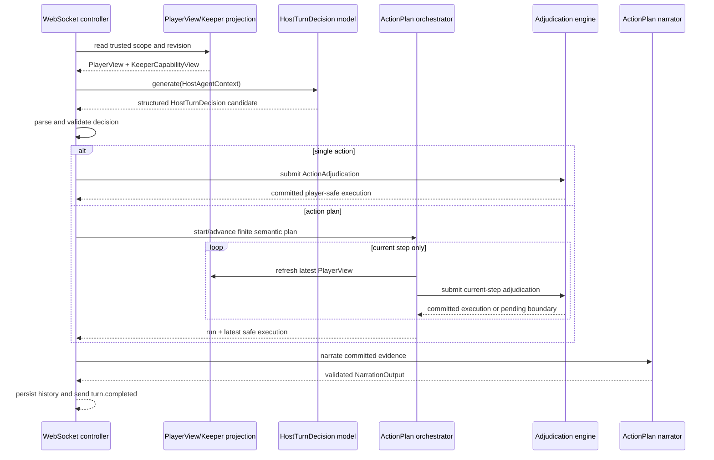
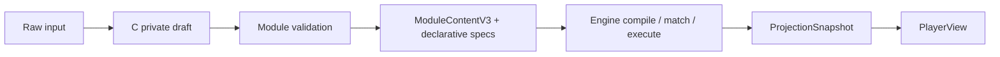
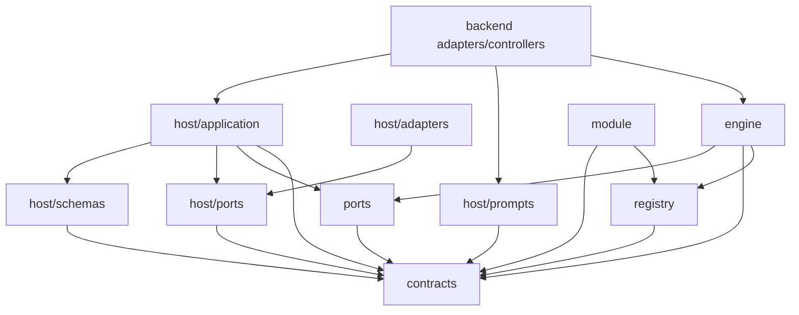

# A/B/C 当前架构

状态：**现行**
适用范围：`agent-collaboration-framework` 与 `trpg-backend` 的生产回合链路

## 1. 目标和边界

- A（Host）负责玩家安全上下文、单动作/ActionPlan 决策、逐步编排和安全叙事。
- B（Engine）负责规则、目标、revision、检定、状态、Event 和持久化提交。
- C（Module）负责把草稿验证并发布为 B 可执行的声明式 `ModuleContentV3`。
- backend 负责 HTTP/WebSocket、SQL、Provider client、结构化 JSON 重试和依赖装配。
- Framework 不依赖 Provider SDK，不定义 backend WebSocket DTO，也不读取环境变量。

## 2. 生产回合时序

```mermaid
sequenceDiagram
    participant W as WebSocket controller
    participant V as PlayerView/Keeper projection
    participant P as HostTurnDecision model
    participant O as ActionPlan orchestrator
    participant E as Adjudication engine
    participant N as ActionPlan narrator

    W->>V: read trusted scope and revision
    V-->>W: PlayerView + KeeperCapabilityView
    W->>P: generate(HostAgentContext)
    P-->>W: structured HostTurnDecision candidate
    W->>W: parse and validate decision
    alt single action
        W->>E: submit ActionAdjudication
        E-->>W: committed player-safe execution
    else action plan
        W->>O: start/advance finite semantic plan
        loop current step only
            O->>V: refresh latest PlayerView
            O->>E: submit current-step adjudication
            E-->>O: committed execution or pending boundary
        end
        O-->>W: run + latest safe execution
    end
    W->>N: narrate committed evidence
    N-->>W: validated NarrationOutput
    W-->>W: persist history and send turn.completed
```

开场叙事独立走 `OpeningNarrator`，不伪造一次行动。当前链路不会把 legacy action 数据模型
当作 Host 入口，但 Engine 与 SQL compatibility reader 继续使用这些模型读取历史记录。

## 3. Host 应用边界

### 3.1 Planner context

`HostAgentContext` 位于 `host/schemas/planner_context.py`，是当前 Planner 的稳定输入：

- `player_input`、`player_view` 与 `recent_history` 必须属于同一 room/player/actor scope；
- `keeper_capabilities` 若存在，必须匹配 room/actor/revision；
- `PlayerView` 是玩家安全、不可变且 revision-bound 的事实视图；
- Keeper capability 是受控词汇表，不是绕过 Engine 校验的授权；
- 上下文不包含数据库 session、完整 `GameState`、完整模组或其他玩家私有数据。

### 3.2 Decision and orchestration

`HostTurnDecisionParser` 将 Provider 返回的普通 JSON 校验为单动作或 `ActionPlan`。
`ActionPlan` 只保存玩家安全的顺序语义步骤，不保存未来裁决、效果、隐藏信息、身份或 revision。
`ActionPlanOrchestrator` 每次只裁决当前步骤，并在步骤边界刷新 PlayerView。冻结的
`ActionPlanPolicy` 管理技术上限、软推进窗口和修复预算；软窗口不是玩家能力上限。

步骤提交通过 `AdjudicationExecutor` 进入 Engine。需要骰点、玩家选择或 presentation 时，
Run 保存 pending 边界并停止；恢复、取消、CAS、lease 和幂等都由持久化 Run 状态约束。

### 3.3 Narration

`ActionPlanNarrator` 只接收已提交的 player-safe evidence、当前 PlayerView 与安全近期历史。
它校验 evidence 引用、持续性 claim、主体所有权和澄清输出。`OpeningNarrator` 校验开场协议与
参与者覆盖。

共享 `narration_policy.py` 提供文本规范化、协议/Schema 残留拒绝、主体拒绝和稳定 chunking。
WebSocket delivery、房间广播和语音分句复用同一 policy，不各自维护正则或分句规则。

`TurnExecutionError` 只定义在 `host/application/errors.py`，由 Framework、Provider adapter、
回合控制器和测试共享，避免捕获不同模块中的同名异常。

## 4. Engine 权威边界

Engine 独占以下行为：

- 校验 room/player/actor、source revision、目标和规则候选；
- 决定检定、骰点、效果与状态变化；
- 原子提交 `GameState`、Event、执行记录和 revision；
- 按 request id 提供幂等重放，并拒绝作用域或 fingerprint 冲突；
- 从同一 runtime snapshot 复核 Keeper capability 中被引用的 ID。

`PlayerViewSource` 只返回去密投影。Host 不 import Engine 实现，Engine 不 import Host。
`Intent`、`ActionRequest`、`ActionResult`、`CompletedAction` 和 `EngineExecutionResult` 保留为
Engine/legacy persistence 契约，不代表当前 Host 有第二套应用入口。

## 5. Module 发布边界

```mermaid
flowchart LR
    RAW["Raw input"] --> DRAFT["C private draft"]
    DRAFT --> VALIDATE["Module validation"]
    VALIDATE --> CONTRACT["ModuleContentV3 + declarative specs"]
    CONTRACT --> ENGINE["Engine compile / match / execute"]
    ENGINE --> SNAP["ProjectionSnapshot"]
    SNAP --> VIEW["PlayerView"]
```

正式 `ModuleContentV3` 位于 `contracts/module_v3.py`，由 B/C 共同评审，是仓库里唯一的模组
内容版本——v1/v2 的契约与发布链路已随 #384 删除。Host 和 backend 不得绕过 validation 直接
消费未校验内容；A 只能通过安全投影和受控 capability 看到与当前回合有关的内容。

## 6. 依赖方向

```mermaid
flowchart TD
    CONTRACTS["contracts"]
    XPORTS["ports"] --> CONTRACTS
    REGISTRY["registry"] --> CONTRACTS
    HSCHEMA["host/schemas"] --> CONTRACTS
    HPORTS["host/ports"] --> CONTRACTS
    HAPP["host/application"] --> HSCHEMA
    HAPP --> HPORTS
    HAPP --> XPORTS
    HAPP --> CONTRACTS
    HPROMPT["host/prompts"] --> CONTRACTS
    HADAPTER["host/adapters"] --> HPORTS
    ENGINE["engine"] --> XPORTS
    ENGINE --> CONTRACTS
    ENGINE --> REGISTRY
    MODULE["module"] --> CONTRACTS
    MODULE --> REGISTRY
    BACKEND["backend adapters/controllers"] --> HAPP
    BACKEND --> HPROMPT
    BACKEND --> ENGINE
```

`registry`（#347）是引擎自带的封闭登记表：Rule 只能引用表里已登记的条目，模组数据不能定义新条目。
它同时被 `engine`（执行期求值）和 `module`（发布期校验）读取，而 `module -> engine` 是禁止的，
所以它与 `contracts` 同级、作为叶子存在，运行时只依赖 `contracts`；求值函数需要的引擎状态模型
一律放在 `TYPE_CHECKING` 块里，只用于类型注解，不构成运行时依赖边。

禁止反向依赖：

- `contracts -> host/engine/module/registry`
- `registry -> host/engine/module`（仅允许 `TYPE_CHECKING` 下的类型注解导入）
- `engine -> host`
- `host -> engine/module`
- `module -> engine/host`
- Framework core -> Provider SDK/client/config

## 7. Provider 边界

backend 当前保留四类 Prompt 模型：Host decision、当前步骤 adjudication、ActionPlan narration
和 Opening narration。它们使用 structured JSON client；DeepSeek/Qwen 的重试、Schema 和错误
映射留在 backend adapter。

ActionPlan 决策与当前步骤裁决的指令位于 `host/prompts/action_plan.py`，属于
provider-neutral contract。backend 可以替换 client/provider，但不得改变 parser、Engine 写入
边界或叙事 evidence policy。

## 8. 发布 Schema

Framework exporter 当前发布：

- Module 与校验：`ModuleContentV3`、validation models；
- 投影：`PlayerInput`、`ProjectionSnapshot`、`PlayerView`、`KeeperCapabilityView`；
- Adjudication：request、execution、status、cancel/status request；
- ActionPlan：plan、policy、progress；
- Host：`HostAgentContext`、`OpeningNarrationContext`、`NarrationOutput`、`RecentTurnContext`。

`Intent` 等 legacy 类型仍可从 Python contracts 导入，但不作为当前 Host API 单独发布。
backend DTO、WebSocket protocol 与 `trpg-sdk` 类型由各自生成链维护，不由 Framework exporter
重复生成。

## 9. 演进规则

1. 修改 PlayerView/Keeper scope 需要 A/B 共审并验证隐私边界。
2. 修改 Engine command/result 或 legacy persistence reader 需要保留历史读取兼容。
3. 修改 ActionPlan 状态机、policy 或 pending 边界必须覆盖恢复、CAS、lease 和幂等测试。
4. 修改 narration policy 必须同时覆盖 Opening、ActionPlan、WebSocket delivery、广播和分句。
5. 修改 Pydantic 发布模型必须重跑 exporter 并提交生成 Schema。
6. Provider 变更不得把 SDK 类型或配置带入 Framework。
7. WebSocket DTO、前端协议和数据库迁移是独立边界，不能因 Host 内部清理而隐式变化。
