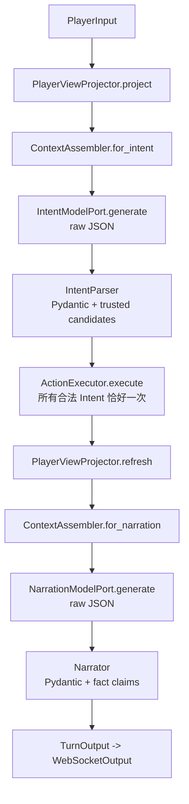

# 成员 A：主持编排 Agent 流程架构

> 当前状态：MVP 骨架；只使用显式 Python async 和 Fake 模型。
> 已归档。现行决议：[`../../architecture.md`](../../architecture.md)

## 1. A 的职责

A 负责：

- 从 `ProjectionSnapshot` 构造当前玩家的 `PlayerView`；
- 组装 Intent 与 Narration 上下文；
- 调用模型端口并在应用层执行 Pydantic 校验；
- 把自然语言语义映射到当前 `PlayerView` 中的可信 Checkpoint 候选；
- 通过 `ActionExecutor.execute()` 调用 B；
- 基于 B 的 player-safe 结果和刷新后的 PlayerView 生成叙事；
- 输出 player-safe WebSocket 消息。

A 不负责：Rule、Hook、Checkpoint 执行、Dice、GameState 修改、Event 写入、幂等事务。A 不 import `GameState`、Event、B 内部执行模型或 `ModuleContent`。

## 2. 固定工作流

`Intent` 没有 `execution` 字段。A 不能建立 narrative bypass；action、dialogue、unknown 与 no-check 都走同一 `execute()` 边界。

## 3. Checkpoint 语义选择

保留 `check/checkpoint_id/proposed_skills` 是 A 与 B 的明确分工：

1. B 通过安全投影提供当前 Scene 的 `checkpoint_options`。
2. A 根据玩家自由表达，在这些候选中做语义匹配。
3. A 只能选择候选中存在的 Checkpoint、对应 Target 和候选技能。
4. B 再复核 Scene、Target、Checkpoint、技能和视图版本，并执行确定性逻辑。

Checkpoint 的 `action_hint` 只帮助语义匹配。B 不要求自由字符串 `Intent.verb` 与它字面相等；否则 B 会被迫再次承担自然语言理解，而且有限动作词表无法覆盖玩家组合行为。

## 4. A 内部模块

### `host/application/orchestrator.py`

- 为什么需要：把一回合固定顺序集中在一个可测试入口。
- 没有它：调用顺序和错误边界会散落在 Gateway/adapter 中。
- 边界：只编排，不修改状态；只通过 Protocol 调用外部能力。
- 类型：A 应用逻辑。
- LangGraph：公开 `run()` 不变，内部可替换。

### `context_assembler.py`

- 为什么需要：集中定义模型可以看到的上下文。
- 没有它：IntentParser/Narrator 会自行拼接并可能泄露字段。
- 边界：只组合强类型安全对象，不读 GameState/ModuleContent。
- 类型：A 应用逻辑。
- LangGraph：可直接复用为节点前处理服务。

### `intent_parser.py`

- 为什么需要：隔离模型 raw JSON 与可信 `Intent`。
- 没有它：Orchestrator 或 SDK adapter 会承担 Schema/候选政策。
- 边界：Pydantic 校验及 PlayerView 候选硬化；不执行规则。
- 类型：A 应用逻辑。
- LangGraph：无需修改，可作为节点服务。

### `player_view_projector.py`

- 为什么需要：由 A 明确拥有玩家/模型可见政策。
- 没有它：A 会读完整 GameState，或由 B 决定模型上下文产品政策。
- 边界：只消费 `PlayerViewSource.read()` 的 `ProjectionSnapshot`。
- 类型：A 应用逻辑。
- LangGraph：无需修改。

### `narrator.py`

- 为什么需要：确保模型叙事只声称 B 已确认且 PlayerView 可见的事实。
- 没有它：raw JSON 或幻觉内容会直接进入 WebSocket。
- 边界：表达结果，不决定规则结果，不读取内部 Event。
- 类型：A 应用逻辑。
- LangGraph：无需修改。

### `host/ports/`

- 为什么需要：核心不绑定模型 SDK 或编排框架。
- 没有它：PydanticAI/OpenAI/LangGraph 会侵入 application。
- 边界：模型端口返回 raw JSON；`TurnPort` 固定 Gateway 调用面。
- 类型：应用端口。
- LangGraph：保持不变，新图实现满足相同端口。

### `host/adapters/fakes/`

- 为什么需要：离线验证工作流和契约。
- 没有它：骨架测试会依赖网络、模型费用和非确定性输出。
- 边界：实现模型端口；不承担权威规则。
- 类型：基础设施 Fake。
- LangGraph：无需修改。

### `host/schemas/`

- 为什么需要：隔离 A 内部 Context/Turn 模型。
- 没有它：临时编排状态会变成 B/C 公共协议。
- 边界：只允许 host import；`TurnState` 不导出为跨组件 Schema。
- 类型：A 内部数据模型。
- LangGraph：`TurnState` 可能变化，其余通常复用。

### `host/gateway/`

- 为什么需要：协议输出与用例编排分离，并建立最终防泄漏边界。
- 没有它：Orchestrator 会耦合 WebSocket 序列化和连接逻辑。
- 边界：调用 `TurnPort`，仅发送 `WebSocketOutput`。
- 类型：入口基础设施。
- LangGraph：无需修改。

## 5. A 使用的稳定契约

- 输入：`PlayerInput`
- 只读来源：`PlayerViewSource.read() -> ProjectionSnapshot`
- A 的安全投影：`PlayerView`
- 语义提议：`Intent`
- 唯一命令：`ActionExecutor.execute(ActionRequest) -> ActionResult`
- 叙事：`NarrationContext -> NarrationOutput`
- 外发：`WebSocketOutput`

`ActionResult` 不含 GameState、StateChange 或完整 Event。`event_refs` 只是不可解释的审计引用，不能被 A 用来重建或修改状态。

## 6. 未来迁移 LangGraph

迁移只在出现 checkpoint/interrupt/resume、多阶段 Action 或确切的图状态需求后考虑。迁移验收条件：

1. `Orchestrator.run()` 或 `TurnPort` 的外部语义不变；
2. 所有合法 Intent 仍恰好调用一次 `ActionExecutor.execute()`；
3. Parser、Narrator、Projector 和 contracts 不因图框架而改成 SDK 类型；
4. Gateway 输出和现有纵向集成测试全部保持通过；
5. LangGraph state 保持 A 内部，不成为 A/B/C 公共协议。
