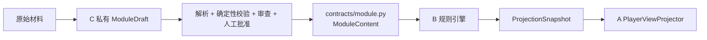

# 成员 C：模组解析与审查 Agent 边界

> 当前只保留发布契约和薄校验入口，不实现真实解析 Agent。
> 已归档。现行决议：[`../../architecture.md`](../../architecture.md)

## 1. C 的职责

C 负责：

- 接收模组原始材料；
- 解析为 C 私有的 `ModuleDraft`；
- 做来源、结构、引用、秘密标注、可达性和一致性审查；
- 管理人工批准与发布门；
- 输出版本化 `ModuleContent`；
- 维护模组 fixtures、审查样例和内容质量评测。

C 不负责运行时 Rule/Hook 执行、Dice、GameState 修改、Event 写入、PlayerView、Intent 或 Narration。

## 2. 三层数据边界

关键结论：C 直接向 B 发布 `ModuleContent`；A 不 import 或消费 `ModuleContent`。A 只接收 B 从权威运行时上下文产生、且已经去除秘密的 `ProjectionSnapshot`。

这不意味着 A 无法看到模组内容，而是可见内容必须经过运行时 Scene、状态和玩家权限过滤，不能让 A 的模型上下文拿到整包秘密材料。

## 3. 为什么 ModuleContent 在 `contracts/module.py`

`ModuleContent` 是 C 的输出协议和 B 的输入协议，所有权天然跨 B/C：

- 若放在 `module/` 私有实现中，B 必须依赖 C 的解析组件，发布协议和解析算法耦合。
- 若放在 `engine/` 中，C 必须依赖 B 的运行时实现，内容生产与执行技术耦合。
- 放在 `contracts/module.py` 后，双方共同评审同一个声明式发布语言，C 和 B 都只依赖稳定契约。

同文件中的 `RuleSpec`、`CheckpointSpec` 只描述发布内容，不执行规则：

- Condition/Operation 是声明式数据；
- Hook 调度器、规则编译器、骰子、GameState、StateChange、Event 和事务都留在 B；
- Prompt、原文证据、解析置信度、ReviewReport 和人工工作流都留在 C。

## 4. `module/validation.py` 为什么保持很薄

当前入口只做两件事：

1. 把 dict/JSON 交给 Pydantic `ModuleContent`；
2. 返回已验证、可版本化的发布对象。

它不参与运行时状态或 Event，这个方向保持不变。未来真实 C Agent 可以在该入口之前增加：读取器、分段器、Draft builder、审查器、人工批准和发布器，但最终发布门仍输出同一个 `ModuleContent`。

## 5. C 内部未来可扩展模块

### `module/ingestion/`

- 为什么需要：隔离 PDF/Markdown/JSON 等来源读取。
- 没有它：文件格式细节会混入内容语义模型。
- 边界：只产生可追溯的原始片段，不输出运行时契约。
- 类型：C 基础设施。
- LangGraph：与 A 的运行时迁移无关；C 可独立选择编排方式。

### `module/drafts/`

- 为什么需要：允许不完整、有置信度和来源证据的解析中间态。
- 没有它：未审查内容会被迫伪装成合法 `ModuleContent`。
- 边界：C 私有，B/A 不得 import。
- 类型：C 业务数据模型。
- LangGraph：可能成为 C 自己图工作流的 state，但不影响发布契约。

### `module/review/`

- 为什么需要：聚合确定性校验、Agent 审查和人工批准结果。
- 没有它：发布成功与“Pydantic 能解析”会被错误等同。
- 边界：判断是否可发布，不执行游戏规则。
- 类型：C 应用逻辑。
- LangGraph：可替换内部流程，输出仍是 ReviewReport/批准结果。

### `module/publication/`

- 为什么需要：负责版本、不可变发布物和 Schema 兼容性。
- 没有它：B 无法知道加载的内容版本，重放也无法定位原始模组。
- 边界：只发布经过批准的 `ModuleContent`，不写 GameState/Event。
- 类型：C 应用服务与存储适配边界。
- LangGraph：不需要因 A 迁移而修改。

## 6. B/C 共同评审项目

修改以下内容必须 B/C 共同批准：

- 稳定 ID 和引用规则；
- Scene/Entity/Checkpoint 的必填字段；
- Condition 与 Operation 的声明语义；
- Rule hook 名称和优先级含义；
- Checkpoint 技能与难度的结构；
- 版本兼容和迁移政策；
- JSON Schema 与合法/非法 fixtures。

B 的执行算法和 C 的解析算法不需要双方共同批准，只要它们分别满足已评审的发布契约。

## 7. 发布验收

最小验收包括：

- 所有 JSON 合法并可解析为 `ModuleContent`；
- Scene、Entity、Checkpoint、WinCondition ID 唯一；
- 所有引用和状态路径存在；
- 公开内容与秘密字段分离；
- 版本与 `world_ref` 明确；
- B 能加载 fixture 并产生安全 `ProjectionSnapshot`；
- A 无需 import `ModuleContent` 即可完成 PlayerView 与回合工作流；
- Schema 由 Pydantic 唯一事实源自动导出。
