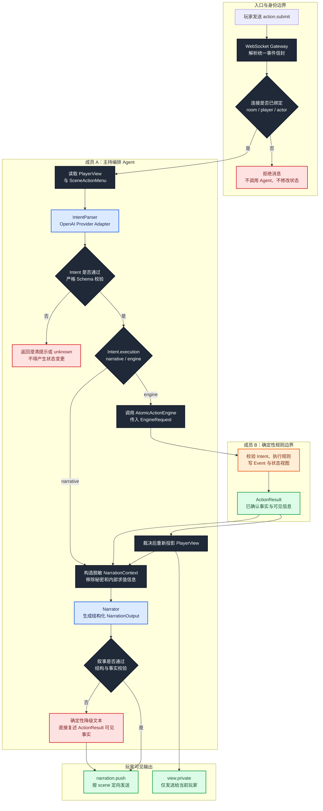

# 成员 A：主持编排 Agent 流程架构

> 文档状态：MVP 实施基线  
> 主责成员：成员 A  
> 核心产出：从玩家输入到玩家可见回复的完整运行时链路  
> 术语说明：本文的“成员 A”指团队分工；“机制 A”特指规则引擎的 `refuse_ops` 拒绝机制，二者无关。

## 1. 目标与系统定位

成员 A 负责运行时主持 Agent、回合编排和服务端 WebSocket 接线。它位于玩家与确定性规则引擎之间：先把玩家自然语言转换为结构化 `Intent`，再将它与可信 `PlayerInput` 组装为 `EngineRequest`，调用成员 B 提供的 `AtomicActionEngine` 获得权威 `ActionResult`，最后只依据玩家可见事实生成叙事。

成员 A 的核心目标不是“替代真人主持人自由裁决”，而是保证下面这条链路稳定、可追踪、不会越权：

```text
玩家输入
→ 身份与协议校验
→ 玩家视角投影
→ 意图理解
→ 确定性引擎裁决
→ 结果脱敏
→ 忠实叙事
→ WebSocket 定向发送
```

架构语义以最新版《数据模型设计》为准；《协作修改建议》用于修正旧团队计划中的 `ActionPlan`、`ConfirmedOutcome` 和 Event 写入顺序。下载目录中的后端代码只用于映射当前实现，不反向定义架构。

## 2. 输入、输出与上下游

| 方向 | 数据或服务 | 提供方 | 成员 A 如何使用 |
| --- | --- | --- | --- |
| 输入 | `action.submit` | 玩家客户端 | 接收本回合自然语言和输入模式 |
| 输入 | 已认证会话 | WebSocket Gateway | 取得可信 `room_id`、`player_id`、`actor_id` |
| 输入 | `ModuleContent` | 成员 C | 读取场景、实体、Checkpoint 和玩家可见内容 |
| 输入 | `PlayerView`、`SceneActionMenu` | ViewProjector | 为 IntentParser 提供脱敏上下文和安全候选菜单 |
| 输入 | `ActionResult` | 成员 B | 作为本回合已经确认的唯一事实边界 |
| 输出 | `Intent` | 成员 A | 由编排层与可信 `PlayerInput` 组装成 `EngineRequest` |
| 输出 | `NarrationOutput` | 成员 A | 生成忠于裁决结果的玩家可见文本 |
| 输出 | `narration.push`、`view.private` | WebSocket Gateway | 分别发送场景叙事和玩家私有视图 |

三人之间的接口关系：

```text
成员 C ── ModuleContent ──→ 成员 A
成员 A ── Intent ──→ 成员 B
成员 B ── ActionResult ──→ 成员 A
成员 A ── NarrationOutput / WebSocketEvent ──→ 玩家
```

## 3. 主流程架构图



颜色约定：蓝色为 Agent/LLM，深色为确定性代码或校验器，橙色为规则引擎，绿色为已确认输出，红色为拒绝或降级路径。

## 4. 主流程逐步说明

### 4.1 接收并绑定可信身份

1. Gateway 接收统一事件信封并校验 `id`、`ts`、`roomId`、`type` 和 `payload`。
2. `room_id`、`player_id`、`actor_id` 必须来自已经认证并加入房间的连接上下文。
3. 客户端正文即使携带同名字段，也只能作为无效冗余字段忽略或拒绝，不能覆盖连接身份。
4. 身份、房间、阶段或协议无效时，链路在 Gateway 终止，不调用 LLM 和规则引擎。

### 4.2 投影安全上下文

1. 按 `room_id` 加载当前状态，但不把完整 `GameState` 交给 Agent。
2. `ViewProjector` 为当前玩家生成 `PlayerView`，隐藏未发现实体、秘密、暗骰和其他玩家私有信息。
3. 同时生成 `SceneActionMenu`，只暴露当前场景允许被模型引用的实体、NPC、出口、技能和动作提示。
4. IntentParser 只能在 `PlayerView + SceneActionMenu` 的边界内做软匹配。

### 4.3 解析并校验 Intent

1. IntentParser 通过 OpenAI Provider Adapter 调用模型，使用严格结构化输出。
2. 输出采用判别式 `Intent`；无法匹配时显式返回 `unknown`，不能伪造目标 ID。
3. `Intent.execution` 统一为 `narrative|engine`，只决定是否进入 `AtomicActionEngine`。
4. `CheckProposal.route` 统一为：
   - `none`：动作不主动要求检定；
   - `module`：提议使用当前场景中的模组 Checkpoint；
   - `default`：提议使用 World 默认检定。
5. `execution` 与 `check.route` 独立：`engine+none` 表示进入完整规则流水线但不检定；`narrative` 只允许搭配 `none`。
6. Parser 可以提议 `checkpoint_id`、`proposed_skills` 和 `narrative_intent`，但不能确定最终技能、难度、成功线、骰点或分支结果。

### 4.4 调用确定性规则引擎

成员 A 只依赖稳定端口，不直接操纵 `RulesEngine`、`GameStateRepo` 或 `EventLog`：

```python
async def execute_action(
    request: EngineRequest,
) -> ActionResult:
    ...
```

只有 `execution=engine` 才组装 `EngineRequest`。`AtomicActionEngine` 内部由成员 B
负责从 `EngineRequest.player_input` 取得可信执行上下文，加载房间状态、复核场景和角色，
按 `check.route` 选择直接解析或检定解析，写 Event、更新状态视图并返回 `ActionResult`。
成员 A 不在引擎调用之后额外执行 `GameStateRepo.save(state)`。

### 4.5 重新投影并构造叙事上下文

1. 引擎分支提交事务后重新投影 `PlayerView`，不得复用裁决前的旧视图；纯叙事分支不执行刷新。
2. 引擎分支用 `ActionResult` 和新 `PlayerView` 构造 `NarrationContext`；纯叙事分支使用原安全上下文与 `Intent`，不伪造 `ActionResult`。
3. `NarrationContext` 只包含玩家可以知道的事实、叙事约束、说话角色和建议动作。
4. `ActionResult` 中用于审计或规则调试的隐藏字段不能直接进入 Narrator 提示词。

### 4.6 输出叙事与私有视图

1. Narrator 输出结构化 `NarrationOutput`，至少包含文本和事实引用。
2. 校验器检查叙事是否违背 `ActionResult`：失败不能写成成功，未发生的状态变化不能写成已发生。
3. MVP 先发送完整非流式消息：`streaming=false`、`seq=0`、`done=true`。
4. `narration.push` 只发给同一场景内有权看到或听到该事件的连接；`view.private` 只发给当前玩家。
5. Narrator 不可用时，用确定性模板根据 `player_visible_information` 和 `narration_constraints` 生成降级回复。

## 5. 模块职责与禁止事项

### 5.1 成员 A 负责

- 运行时主持 Agent 的提示词、Provider 适配和模型调用策略。
- 玩家上下文组装、`PlayerView` 与 `SceneActionMenu` 消费。
- 自然语言到判别式 `Intent` 的解析和结构校验。
- Checkpoint、技能和动作类型的软提议。
- 回合编排、`EngineRequest` 组装、`AtomicActionEngine` 调用和裁决后重新投影。
- `NarrationContext` 脱敏、最终旁白和 NPC 对话生成。
- `action.submit`、`narration.push`、`view.private` 的服务端接线。
- 模型超时、非法输出和叙事失败的降级策略。
- Intent、Narration 和完整回合链路的评测。

### 5.2 成员 A 不负责

- 不直接修改 `GameState` 或物化状态表。
- 不直接追加权威 Event。
- 不决定最终技能、难度、成功线、骰点和检定结果。
- 不执行 `Rule.when`、`Op`、`refuse_ops`、invariant 或 `WinCondition`。
- 不信任客户端或模型提供的 `player_id`、`actor_id`、`room_id`。
- 不把引擎失败改写为成功，也不为叙事效果补造状态变化。
- 不把完整 God View、秘密或暗骰结果传给 Narrator。

## 6. 核心接口与数据契约

### 6.1 `PlayerActionInput`

| 字段 | 含义 | 信任级别 |
| --- | --- | --- |
| `utterance` | 玩家自然语言 | 不可信输入，必须限制长度并校验 |
| `input_mode` | `text` 或 `voice` | 客户端元数据；MVP 只实现 text |
| `client_action_id` | 客户端幂等标识 | 用于防止断线重发重复执行 |
| `room_id/player_id/actor_id` | 执行上下文 | 只能由已认证连接注入 |

### 6.2 `Intent` 与 `CheckProposal`

`Intent` 保留现有后端的判别式联合结构，并为交互行为和检定提议增加统一字段。示例：

```json
{
  "execution": "engine",
  "kind": "interact",
  "action": "open",
  "target": { "matched": true, "id": "cabinet" },
  "check": {
    "route": "module",
    "checkpoint_id": "open_cabinet",
    "proposed_skills": ["locksmith"]
  },
  "narrative_intent": "尝试打开书房柜子"
}
```

约束：

- 模型不输出可信 `actor_id`；`actor_id/player_id/room_id/client_action_id` 由已认证的 `PlayerInput` 注入，引擎再复核绑定关系。
- `execution` 只决定是否调用引擎；`check.route` 只决定检定来源，不能再用 `none` 表示直接叙事。
- `execution=narrative` 只能搭配 `check.route=none`；`execution=engine` 可以搭配三种检定来源。
- `checkpoint_id` 只是候选，成员 B 必须验证它属于当前 Scene。
- `proposed_skills` 只是软判据，成员 B 必须与 Checkpoint 和角色技能求交集。
- 模型无法把目标匹配到安全菜单时使用 `RefUnmatched`，不得猜测内部 ID。

### 6.3 `ActionResult`

成员 A 至少消费以下语义字段：

| 字段 | 用途 |
| --- | --- |
| `success` | 本次规则解析是否成功完成，不等同于所有后果都是好结果 |
| `resolution` | `checkpoint/direct/improvised/blocked/unrecognized` 等解析类型 |
| `confirmed_facts` | 已经由引擎确认、可供编排器使用的事实 |
| `player_visible_information` | 允许进入 Narrator 的信息 |
| `state_changes` | `path/from/to/cause`，用于事实核对而非由 A 再次执行 |
| `narration_constraints` | 必须表达或禁止表达的内容 |
| `next_required_action` | 需要澄清或等待的下一步；MVP 不返回 `PendingCheck` |

### 6.4 `NarrationContext` 与 `NarrationOutput`

```json
{
  "context": {
    "scene": "书房",
    "visible_facts": ["柜门已经打开", "里面的文件被砸坏"],
    "constraints": ["不得称文件完好", "不得泄露管家下一回合出现"]
  },
  "output": {
    "text": "柜门终于在撞击中弹开，但纸页也被震裂、撕碎。",
    "claimed_fact_ids": ["cabinet.opened", "document.destroyed"],
    "suggested_actions": []
  }
}
```

### 6.5 `WebSocketEvent`

`TurnOutput` 只在宿主内部流转，不能作为 WebSocket payload 整体发送。客户端只接收
`NarrationOutput` 的玩家可见投影，以及 ViewProjector 明确允许公开的视图；
`PlayerInput`、`Intent`、完整 `ActionResult` 和 `SummaryOperation` 都不直接下发。

统一事件信封：

```json
{
  "id": "evt_01",
  "ts": 0,
  "roomId": "room_01",
  "type": "narration.push",
  "payload": {
    "sceneId": "study",
    "text": "……",
    "streaming": false,
    "seq": 0,
    "done": true
  }
}
```

`SummaryOperation` 是回合结束后交给宿主 `SummaryOutbox` 的非权威命令。它只能按
`(room_id, client_action_id)` 幂等更新会话摘要，禁止写 `GameState` 或 `EventLog`。

## 7. 异常与降级路径

| 异常 | 行为 | 状态影响 |
| --- | --- | --- |
| 会话未认证、房间不匹配 | Gateway 拒绝并返回协议错误 | 无 Event、无状态变化 |
| 消息 Schema 无效 | 拒绝消息，记录技术日志 | 无 Event、无状态变化 |
| Intent JSON 无效 | 重试一次结构化输出；仍失败则返回 `unknown` | 无状态变化 |
| 目标无法匹配 | 返回澄清问题，不猜测实体 ID | 无状态变化 |
| 引擎拒绝动作 | 使用 `ActionResult` 的失败事实生成叙事 | 只保留引擎明确记录的 Event |
| Narrator 超时或不可用 | 使用确定性降级文本 | 不重试引擎，不重复执行动作 |
| NarrationOutput 违背事实 | 丢弃模型文本，使用降级文本 | 已提交的引擎结果不回滚 |
| 推送失败或断线 | 按事件 ID 补发视图/叙事 | 不重复调用 AtomicActionEngine |

## 8. 当前后端实现映射

当前参考代码位于 `/Users/jiahao/Downloads/TRPG-master-LWC-1-Folder`：

| 目标能力 | 当前模块 | 当前状态与差距 |
| --- | --- | --- |
| Intent 解析 | `packages/core/ai/intent.py` | 已有判别式 Intent 和 `unknown` 保底；当前使用兼容 OpenAI SDK 的 Chat Completions/JSON 模式，尚未采用严格结构化输出和统一 `CheckProposal` |
| 玩家视角与安全菜单 | `packages/core/view/` | 已有 `PlayerView` 和 `SceneActionMenu` 投影入口，可作为 Agent 的唯一上下文来源 |
| 回合编排 | `packages/core/orchestrator/orchestrator.py` | 主链已存在；当前直接调用 `RulesEngine` 后执行 `GameStateRepo.save`，需改为单一 `AtomicActionEngine.execute_action(EngineRequest)` 事务边界 |
| Narrator | `packages/core/ai/narrator.py` | 已有流式文本接口；当前直接消费 `ActionResult`，需增加脱敏 `NarrationContext` 和结构化事实校验 |
| WebSocket | `packages/server/ws/gateway.py` | 已接通 `action.submit`、`narration.push`、`view.private`；当前仍信任信封中的玩家标识、整房广播并缓冲叙事，需要连接身份绑定、场景定向和统一事件信封 |

这些差距描述用于指导适配，不表示要保留下载目录当前实现中的错误边界。

## 9. 与其他成员的协作接口

### 9.1 成员 A → 成员 B

- 提供已通过 Schema 校验的 `Intent`。
- 传递可信 `room_id`、`player_id`，不传递可被模型伪造的身份。
- 不要求 B 信任 `checkpoint_id` 或技能提议。
- 使用统一 `AtomicActionEngine.execute_action(EngineRequest) -> ActionResult`，测试期间由 `FakeAtomicEngine` 保持并行开发。

### 9.2 成员 B → 成员 A

- 返回稳定、可叙述的 `ActionResult`。
- 明确失败、拒绝、坏后果和玩家可见信息。
- 保证函数返回时 Event 与状态视图事务已经提交，A 可以安全重新投影。

### 9.3 成员 C → 成员 A

- 提供通过审查的 `ModuleContent`、稳定实体 ID、Scene、Checkpoint 和可见内容。
- 提供 Demo 输入、预期 Intent 和叙事约束，供 Intent/Narration 评测使用。

## 10. MVP 交付顺序

1. 冻结 `Intent`、`CheckProposal`、`ActionResult` 和 WebSocket 事件 Schema。
2. 用 `FakeAtomicEngine` 打通 `action.submit → Intent → EngineRequest → ActionResult → NarrationOutput`。
3. 接入 OpenAI Provider Adapter 和严格结构化 Intent 输出。
4. 建立 `NarrationContext` 脱敏和事实忠实度校验。
5. 接入成员 B 的真实 AtomicActionEngine，移除编排层直接保存状态的路径。
6. 修复 WebSocket 身份绑定、场景定向和幂等处理。
7. 接入成员 C 的书房 Demo，运行三人共同验收案例。

第二阶段再实现：`PendingCheck`、玩家手动掷骰、暗骰扩展、真正的 token 流式推送、语音输入和运行时单 Agent 拆分。

## 11. 测试与验收标准

### 11.1 Intent 测试

- 调查书架生成合法 `investigate` Intent 并匹配书架。
- 打开、砸坏、使用物品等交互动作生成合法判别式 Intent。
- 模型提出不存在的实体时输出 unmatched/unknown，不伪造 ID。
- `narrative/engine` 两条执行路由与 `none/module/default` 三条检定提议能被独立解析。
- 模型不能注入可信 `actor_id`、难度或骰点。

### 11.2 编排测试

- 每个需要引擎的合法动作只调用一次 AtomicActionEngine。
- `execution=engine + check.route="none"` 不会绕过引擎；只有 `execution=narrative` 直接进入 Narrator。
- 编排器不调用 `GameStateRepo.save`，不直接追加 Event。
- 引擎返回后重新投影视图，再生成叙事。
- Narrator 失败不会导致同一动作再次执行。

### 11.3 叙事测试

- 无钥匙开柜被拒绝时，旁白明确柜子未打开。
- 砸柜成功但文件损毁时，同时表达动作成功和坏结果。
- 不泄露秘密、隐藏骰点、未发现实体和未来 Hook。
- 模型文本违背 `ActionResult` 时触发确定性降级。

### 11.4 WebSocket 测试

- 玩家不能伪造其他玩家、角色或房间。
- `narration.push` 只发送给正确场景，`view.private` 只发送给当前玩家。
- 重发同一 `client_action_id` 不会重复执行引擎。
- 非流式 MVP 消息包含 `streaming=false`、`seq=0`、`done=true`。

## 12. 交接清单

- **我负责什么**：玩家输入理解、运行时编排、OpenAI 适配、叙事生成、WebSocket 服务端接线和相关评测。
- **我不负责什么**：规则裁决、状态写入、Event 权威存储、模组内容生产和规则审查。
- **我向谁提供什么**：向成员 B 提供 `Intent`；向客户端提供 `NarrationOutput` 和 WebSocket 事件；向成员 C 提供解析与叙事评测反馈。
- **我依赖谁提供什么**：依赖成员 B 提供 `AtomicActionEngine/ActionResult`；依赖成员 C 提供通过审查的 `ModuleContent`、Demo 和预期结果。
