# ModuleContent 领域概念模型

> 状态：Domain Model Proposal  
> 日期：2026-07-23  
> 输入报告：[`../CoC模组能力统计与ModuleContent-v1归纳.md`](../CoC模组能力统计与ModuleContent-v1归纳.md)  
> 当前实现事实源：`collaboration_framework/contracts/module.py`  
> 非目标：本文不设计 JSON Schema，不修改现有 Contract，不声明 Candidate 已被 Runtime 支持

## 0. 阅读约定

本文区分三个层次：

1. **领域概念成立**：样本证明 TRPG 模组中存在这种语义。
2. **ModuleContent 应能承载**：为了保真发布，该语义不能在编译后丢失。
3. **独立结构或自动执行获准**：Parser、Validation、Runtime、Projection、Ruleset 和迁移方案均已有确定证据。

三者不能互相替代。本文主要完成第 1 层，并提出第 2 层的稳定边界；第 3 层仍需按纵向能力单独决策。

本文使用以下状态：

| 状态 | 含义 |
|---|---|
| 确定 | 可以立即确认领域职责和边界，但不等于已成为当前 Contract 字段 |
| 待确认 | 领域需求存在，模型边界或引用方式需要团队确认 |
| 消费者驱动 | 是否独立结构化取决于明确消费者和端到端原型 |
| 暂缓 | 当前只保留自然语言或 Capability Gap，不建立执行结构 |

---

# 1. 目标定义

## 1.1 数据链路中的定位

```text
原始文档
  │  PDF / DOCX / Markdown / TXT / 图片
  ▼
DocumentAdapter
  │  NormalizedDocument / SourceFragment
  ▼
Parser Draft
  │  候选对象、来源、置信度、歧义、未决问题、Capability Gap
  ▼
归一化与编译
  │  语义归并、稳定 ID、引用解析、可见性分类、
  │  Ruleset 绑定、可执行/自然语言边界、Gap 检测
  ▼
Validation / Review
  │  确定性不变式与来源忠实度
  ▼
ModuleContent
  │  不可变、版本化、已发布的静态模组定义
  ├───────────────┬────────────────┐
  ▼               ▼                ▼
Runtime         Projection        Ruleset
执行声明         安全可见结果       通用检定与规则算法
  │
  ▼
GameState + Event
```

`ModuleContent` 是归一化编译结果，不是原始文档的逐段转录，也不是 Parser 的中间推理记录。

## 1.2 ModuleContent 是什么

ModuleContent 是：

- 一个模组发布版本的**静态领域定义聚合根**。
- Parser／Editor 与 Runtime／Projection／Ruleset 之间的共享语义边界。
- 对模组身份、叙事框架、可游玩内容、对象、信息、交互、规则声明和终局的规范化表达。
- Runtime 建立独立 GameState 时使用的只读定义来源。
- 对已获支持能力的确定性声明，以及对未获支持能力的保真自然语言承载边界。
- 一个版本冻结后不可被某局游戏回写的发布物。

ModuleContent 的基本不变量是：

1. 同一发布版本中的稳定对象可以被无歧义引用。
2. 静态定义和某局当前状态分离。
3. Keeper-only 内容不能绕过 Projection 进入玩家视图。
4. 可执行声明只能使用 Runtime／Ruleset 已注册的能力。
5. 无法确定执行的原文机制不能伪装成已支持规则。
6. 发布后 Runtime 不再依赖 Parser、原始文档或 Review。

## 1.3 ModuleContent 不是什么

ModuleContent 不是：

- 原始 PDF、OCR 文本、页码、bbox 或 SourceFragment。
- 带置信度、候选解释和未决问题的 Parser Draft。
- ValidationReport、ReviewReport 或发布审批记录。
- 某一房间、玩家、角色或实体的当前状态。
- 骰点结果、ActionRequest、CheckResult、EventLog 或幂等缓存。
- 最终 PlayerView 或 KeeperView。
- CoC 技能、战斗、SAN、追逐等通用 Ruleset 算法。
- 任意脚本、任意自然语言表达式或 Host 直接写状态的通道。
- Repository 权利、内部文件路径、内容哈希或商业使用记录。
- 为每种模组机制预留一个顶层数组的“万能包”。

## 1.4 归一化与编译负责什么

归一化与编译位于 Draft 和 ModuleContent 之间，负责：

- 保真识别“章节”“场景”“地点段落”“任务段”“连续解谜段”等原文组织；在有寻址、导航或运行跟踪消费者时再归并为可引用 ContentUnit。
- 为需要跨引用、运行跟踪或审计的定义分配稳定 ID。
- 解析引用并建立单向、可验证的关系。
- 将信息本体与信息载体、获得方式分离。
- 将玩家动作、Ruleset 检定、普通结果和终局分离。
- 将硬规则、主持裁量和纯叙事建议分开。
- 将可执行 Condition／Effect 绑定到已注册 catalog。
- 把无法保真编译或没有消费者的机制记录为 Capability Gap。

归一化与编译不负责猜造原文不存在的事实，也不把“KP 认为合理时”自动转换成布尔表达式。

---

# 2. 从十项表达需求到最小领域骨架

样本报告中的十项最低表达需求，不应成为十个顶层模型。它们可以归并为以下职责簇：

| 样本表达需求 | 归属的领域职责 |
|---|---|
| 模组身份 | `ModuleIdentity`，作为 ModuleContent 聚合根的身份值 |
| 场景前提、幕后信息 | `ModuleFrame` 的不同叙事视角 |
| 调查员进入方式 | `EntryPoint`，绑定角色前提与目标 ContentUnit |
| 可游玩内容段 | `ContentGraph` 中的 `ContentUnit` |
| 参与对象 | `EntityDefinition`；物理空间可能由独立 `LocationDefinition` 表达 |
| 可获得信息及来源 | `InformationItem` 与 `InformationAcquisition` |
| 行动触发、行动后果 | `InteractionDefinition`、`ResolutionDefinition`、`OutcomeDefinition`，或 `RuleDefinition` |
| 终局结果 | `EndingDefinition` |

这不是顶层字段清单。物理存储可以采用嵌套、注册表、组合对象或编译索引；只有引用方向和职责边界在本文中确定。

## 2.1 统计证据如何约束模型

本模型只把输入报告已经统计出的语义作为归纳起点：

| 报告证据 | 本文允许推出的领域结论 | 本文不据此推出 |
|---|---|---|
| 十项伞形语义的 `E+N` 均为 15/15；其中可游玩内容段为 `E=14, N=1` | 发布物必须能保真识别并承载这些语义；只有寻址、导航或运行跟踪消费者成立时，隐式内容才进一步结构化为 ContentUnit | 十个一级字段、十个必填对象、固定章节类型 |
| 地图／空间辅助 14/15 | 空间关系是高覆盖可选能力，Location 需要与可游玩内容分责 | 每个模组必须提供地图文件，或 Location 必须是顶层数组 |
| 场景级时间表／日程／倒计时 12/15 | Trigger 可以引用时间语义；Timeline 值得做消费者原型 | 所有模组共享同一个全局时钟 |
| 明确阶段／计数轨道 7/15 | Track 是可选能力候选；定义与当前值必须分层 | 感染、异变、沙漏各自成为专用字段 |
| 预制调查员／固定身份模板 4/15 | Character Setup 是可选能力候选 | EntryPoint 必须包含完整角色卡 |
| 多势力反应 3/15 | Organization 可以共享 Entity 身份；Faction 状态和反应需要独立消费者 | 每个 Organization 都必须进入自动势力系统 |
| 随机表 2/15、显式调查网 2/15、跨模组组合 2/15 | 这些低频能力不能逐模组必填，但要么有可选表达，要么形成 Gap | 仅因低频而删除，或直接增加三个顶层数组 |
| 角色独占信息 1/15 | 信息受众与角色级 Projection 是真实可选需求 | 所有 Information 都必须绑定角色 |

因此，`ModuleFrame` 是“前提 + 幕后 + 进入语境”的职责归并；`ContentGraph` 是“内容段 + 关系”的职责归并；`Interaction／Resolution／Outcome` 是“动作触发 + 判定 + 后果”的职责拆分。`RuleDefinition`、独立 `EntryPoint`、独立 `InformationAcquisition` 及各类 Optional Capability 是否进入正式 Contract，仍由消费者和端到端证据决定。

## 2.2 建议的领域骨架

```text
ModuleContent
├── ModuleIdentity                     值对象
├── ModuleFrame                        前提、幕后视角、主持说明
│   └── EntryPoint                     可选的结构化进入绑定
├── ContentGraph
│   ├── ContentUnit                    可游玩内容
│   └── ContentRelation                包含、后继、替代、解锁等关系
├── Definition Registry                逻辑注册空间，不等于顶层数组
│   ├── EntityDefinition
│   ├── InformationItem
│   ├── InformationAcquisition
│   ├── InteractionDefinition
│   │   ├── ResolutionDefinition
│   │   └── OutcomeDefinition
│   ├── RuleDefinition
│   └── EndingDefinition
└── Optional Capability Definitions    只有消费者成立时加入
    ├── LocationDefinition
    ├── Timeline / Track
    ├── EncounterDefinition
    ├── CharacterTemplate
    └── Asset / Table / Faction 等
```

`Definition Registry` 是领域上的“由该发布物拥有的一组稳定定义”，不是要求实现一个名为 `definitions` 的字段。

---

# 3. 核心概念候选

## 3.1 语义与职责

| 名称 | 精确定义 | 核心职责 | 不负责什么 | 状态 |
|---|---|---|---|---|
| **ModuleContent** | 一个特定模组内容版本的、已归一化并通过发布门禁的静态领域聚合 | 维护版本内身份、定义所有权、稳定引用和静态不变量 | 不保存来源审计、当前游戏状态、执行结果或最终视图 | 确定 |
| **ModuleIdentity** | 标识模组及其内容版本、Ruleset 绑定和兼容边界的值对象 | 让 Loader、Validation 和发布流程知道“加载的是谁、哪个版本、按什么规则解释” | 不承载标题之外的全部营销元信息，不保存 content hash 或 Parser provenance | 确定 |
| **ModuleFrame** | 将模组前提、Keeper 需要掌握的幕后因果、进入语境和主持指导组织在同一叙事框架中的值对象 | 保留“故事是什么、为什么发生、从哪里开始、哪些真相不能提前泄露”；事实被结构化后只保留叙事摘要与引用 | 不执行剧情、不记录玩家已知信息、不把每段背景都原子化，也不成为与 InformationItem 并行的第二个事实权威源 | 确定语义；结构待确认 |
| **EntryPoint** | 将一种合法开局方式绑定到起始 ContentUnit、角色前提和初始披露范围的静态定义 | 支持默认入口、多职业入口、HO 入口和独立／支线入口 | 不保存当前 Scene，不创建玩家角色，不保存某局已经选择的入口 | 消费者驱动 |
| **ContentGraph** | 由 ContentUnit 及其关系构成的静态可游玩内容结构 | 表达顺序、包含、替代、解锁和可达关系，而不要求模组线性 | 不表示某局当前进度，不把地图拓扑和剧情关系混为一谈 | 确定语义；表示法待确认 |
| **ContentUnit** | 在主持、导航、投影或交互路由中可被独立引用的一段可游玩内容 | 为叙事上下文、可用对象、信息、交互和局部规则提供稳定宿主 | 不自动等同于 Location、Task、Event、Chapter 或 Encounter；不保存当前激活状态 | 确定候选；类型体系待确认 |
| **ContentRelation** | 两个 ContentUnit 之间的静态关系及其可选可达条件 | 表达包含、后继、替代、返回、解锁等关系 | 不执行转场，不记录已经走过哪条路径，不替代 Condition 或 Effect | 确定语义；独立身份待确认 |
| **EntityDefinition** | 模组世界中具有稳定身份，且可能被引用、交互、描述、赋予初始状态或挂接规则的对象定义 | 统一 NPC、Monster、Organization、Item 和 Environment Object 的身份核心 | 不要求所有 Entity 具有相同属性、战斗能力或运行生命周期；不保存当前 HP、位置或持有者 | 确定 |
| **InformationItem** | 可被引用、限制披露、授予、遗忘或用于支持其他信息的静态语义内容 | 表达 Fact、证据／Clue、Memory 内容和文档所承载的语义 | 不等同于物理载体，不保存谁已经知道，不把 Keeper-only 当作另一种事实本体 | 确定语义；分类待确认 |
| **InformationAcquisition** | 描述某 InformationItem 可通过何种来源、交互或结果被获得的静态关系 | 将信息本体与来源、载体、获得条件和受众分离，支持同一信息的多条路径 | 不保存本局是否已获得，不自行执行检定，不保证每条叙事信息都必须结构化 | 确定分离原则；独立模型待确认 |
| **InteractionDefinition** | 模组预先声明的一种可尝试动作或直接交互机会，包含语义意图、目标和可用性 | 连接玩家意图、目标、可选 Resolution 和可能 Outcome | 不是某次 ActionRequest，不等于检定，不负责全局剧情编排 | 确定候选 |
| **InteractionTargetRef** | Interaction 内部指向一个受支持目标类型及稳定目标 ID 的类型化引用值 | 避免 Entity、Location、ContentUnit 等目标字段同时成为多个事实源；为零目标、单目标或多目标保留统一引用语义 | 不决定一个 Interaction 允许多少目标，不复制目标对象，不保存本次实际选中的目标 | 引用语义确定；目标基数待确认 |
| **ResolutionDefinition** | 声明一次 Interaction 如何得到确定结果的策略；Ruleset Check 是其中一种 | 区分直接成功、Ruleset 检定、对抗、自动触发和主持裁量 | 不保存骰点结果，不重新定义 Ruleset 算法，不把自然语言裁量伪装成确定执行 | 确定语义；具体变体待确认 |
| **Trigger** | 父定义内部声明“何时考虑求值”的注册 Hook／时机值 | 将求值时机与 Condition 分离，并绑定 Runtime 已支持的 catalog | 不是本次已经发生的 Event，不读取或修改状态 | 语义确定；catalog 消费者驱动 |
| **Condition** | 父定义内部对已注册 Runtime 上下文进行只读判断的纯谓词值 | 表达可验证、无副作用的可用性或分支条件 | 不决定求值时机，不执行自然语言，不修改状态 | 语义确定；表达能力消费者驱动 |
| **Effect** | 父定义内部声明一个已注册结果意图的值 | 作为 Outcome／Rule 唯一执行路径，引用 Operation catalog 及目标定义 | 不是已经发生的 StateChange／Event，不允许任意脚本 | 语义确定；catalog 消费者驱动 |
| **RuleScope** | Rule 内部声明其适用目标或上下文的引用值候选 | 防止从序列化嵌套位置隐式推断作用域 | 不拥有被作用对象，不决定 Scope 数量或组合规则 | 需求确定；形态和基数 OPEN |
| **RuleDefinition** | 在明确 Trigger 到达时，若 Condition 成立则执行有限 Effect 的静态声明，并带作用域与冲突政策 | 表达跨交互或生命周期 Hook 生效的硬规则 | 不是任意脚本，不负责 Ruleset 核心算法，不执行自然语言判断 | 确定边界；catalog 消费者驱动 |
| **OutcomeDefinition** | 某次 Interaction 或内容事件解析后可能成立的非必然结果定义 | 聚合叙事约束及有序 Effect；信息获得和内容解锁通过唯一 Effect／Operation 路径引用既有定义 | 不表示某局已选结果；普通 Outcome 不结束游戏；不维护第二套直接授予／解锁关系 | 确定 |
| **EndingDefinition** | 让一个明确 Runtime 作用域进入正式终止状态的静态终局定义；当前 v1 对应的 WinCondition 行为只实现 Room／Session 终止 | 表达终局触发条件、最终信息和叙事结果 | 不表达普通失败、阶段完成、回滚或重试；不预设胜负分类；角色级等扩展 Scope 尚未决定 | 终局语义确定；Scope／分类待确认 |

## 3.2 身份、生命周期和所有权

| 名称 | 稳定 ID | 生命周期 | 主要生产者 | 主要消费者 | 静态定义或运行状态 |
|---|---|---|---|---|---|
| ModuleContent | `module_id + content version` 形成发布身份 | Draft → 编译 → Validation／Review → Published → Deprecated；发布后不随游戏变化 | Parser／Editor，Publish 固化 | Loader、Validation、Runtime、Projection | 静态聚合 |
| ModuleIdentity | 无独立对象 ID；它构成聚合身份 | 随 ModuleContent 版本演进 | Parser／Editor／Publish | Loader、兼容性门禁、Repository | 静态值对象 |
| ModuleFrame | 通常无独立 ID | 随模组版本发布和修订 | Parser／Editor | Keeper Context Builder、Review、Projection | 静态值对象 |
| EntryPoint | 多入口或被外部引用时应有稳定 ID；单入口也至少有稳定键 | 定义随模组版本；某局选择结果另存 | Parser／Compiler／Editor | Loader、建局流程、Projection | 静态定义；所选入口属于 GameState |
| ContentGraph | 通常无独立 ID，由 ModuleContent 所有 | 随模组版本；运行时只读 | Compiler／Editor | Validation、Runtime navigation、Review | 静态聚合部件 |
| ContentUnit | 只有被结构化用于寻址、导航或跟踪时才需要稳定 ID；叙事段落本身不分配对象 ID | Draft 候选 → 发布定义；运行时可被进入、完成或解锁，但定义不变 | Parser／Compiler／Editor | Runtime、Projection、Host、Review | 静态定义；当前／已访问状态属于 GameState |
| ContentRelation | 被规则、Review 或外部引用时需要 ID；否则可使用稳定复合键 | 随图版本发布；运行时只读 | Compiler／Editor | Validation、Runtime navigation | 静态关系；已走分支属于 GameState |
| EntityDefinition | 需要稳定 ID；跨形态应尽量保持同一身份 | 定义随模组版本；运行实例有独立生命周期 | Parser／Compiler／Editor | Runtime target resolver、Projection、Ruleset adapter | 静态定义；当前状态属于 GameState |
| InformationItem | 被授予、引用、跟踪或限制披露时需要稳定 ID；纯背景段落可不原子化 | 定义随版本；某局知识状态独立变化 | Parser／Compiler／Editor | Knowledge Runtime、Projection、Review | 静态内容；已知／遗忘状态属于 GameState |
| InformationAcquisition | 多路径、重复或审计需求存在时应有稳定 ID；简单路径可嵌入 Outcome | 定义随版本；某局触发记录独立 | Parser／Compiler／Editor | Runtime、Validation、Knowledge Projection | 静态关系；是否触发属于 GameState／Event |
| InteractionDefinition | 需要稳定 ID，供 Host 候选和 Runtime 引用 | 定义随版本；每次尝试生成独立 Action／Result | Parser／Compiler／Editor | Projection、Intent Router、Runtime | 静态定义；尝试和结果属于 Runtime |
| InteractionTargetRef | 无独立 ID；随父 Interaction 使用稳定目标引用 | 随父 Interaction 发布；本次实际目标另存 | Parser／Compiler／Editor | Validation、Target Resolver、Projection | 静态引用值；本次选择属于 ActionRequest／Attempt |
| ResolutionDefinition | 默认可作为 Interaction 的值对象；复用或独立引用时才需要 ID | 随 Interaction 发布；本次解析独立 | Parser／Compiler，Ruleset 提供 catalog | CheckResolver、Ruleset、Validation | 静态策略；CheckResult 属于 Runtime |
| Trigger | 无独立 ID；随父定义 | 随 Rule／Ending 等父定义发布 | Parser／Compiler／Editor | Validation、Runtime Dispatcher | 静态时机值；实际触发属于 Event |
| Condition | 无独立 ID；若未来复用再单独决策 | 随父定义发布 | Parser／Compiler／Editor | Validation、Condition Evaluator、Review | 静态纯谓词；求值结果属于 Runtime |
| Effect | 无独立 ID；顺序由父定义内位置或稳定键确定 | 随 Outcome／Rule 等父定义发布 | Parser／Compiler／Editor | Validation、Operation Executor、Projection | 静态结果意图；StateChange／Event 属于 Runtime |
| RuleScope | 无独立 ID；随 Rule | 随 Rule 发布 | Parser／Compiler／Editor | Validation、Rule Indexer、Dispatcher | 静态引用值；当前上下文属于 Runtime |
| RuleDefinition | 需要稳定 ID | 定义随版本；Runtime 可编译索引但不修改原声明 | Parser／Compiler／Editor | Validation、Rule Engine、Review | 静态声明；求值和执行记录属于 Runtime／Event |
| OutcomeDefinition | 被跨对象引用时需要 ID；局部结果可使用父对象内稳定分支键 | 定义随父对象发布；某次成立记录独立 | Parser／Compiler／Editor | Runtime、Projection、Review | 静态定义；已选 Outcome 属于 Event／GameState |
| EndingDefinition | 需要稳定 ID | 定义随版本；当前 v1 的 Room／Session 从未结束进入一次终止，扩展 Scope 的数量语义 OPEN | Parser／Compiler／Editor | Runtime、Projection、Review | 静态定义；`ending_id/phase` 或扩展 EndingState 属于 GameState |

## 3.3 ID 分配原则

不是所有原文名词都需要 ID。仅在以下至少一种情况成立时分配稳定 ID：

- 被其他定义引用。
- Runtime 或 Projection 需要单独寻址。
- 某局需要记录其状态或完成情况。
- Review／Validation 需要建立来源覆盖或关系检查。
- 多条获得路径必须汇聚到同一语义对象。

纯描述性氛围、一次性比喻、没有消费者的章节排版信息可以保留在 Narrative Content 中，不必对象化。

---

# 4. 重点概念辨析

## 4.1 ContentUnit

### 4.1.1 可以统一什么

ContentUnit 可以作为“可被独立引用的可游玩内容段”统一入口，但不能以一个类型吞并所有领域语义。

| 原文概念 | 是否可作为 ContentUnit | 关系或独立模型判断 |
|---|---|---|
| Scene | 是；它是最稳定的运行型 ContentUnit | 可作为 ContentUnit 的主要语义类型；当前 v1 Scene 是迁移起点 |
| 连续解谜段 | 是；可作为一个 Unit，也可按交互焦点拆成子 Unit | 暂不需要 Puzzle 模型；谜题依赖主要由 Interaction、Information 和关系表达 |
| Chapter | 仅当它需要稳定导航、包含子单元或投影时 | 通常是 ContentUnit 的分组／包含关系；纯排版章节可留在 Parser outline |
| Task | 仅当“任务段”本身是可游玩上下文 | 跨多个 Unit 的目标若需跟踪，应是独立 Objective 候选；不能只靠 `kind=task` |
| Event | 事件展开后的叙事内容可以是 Unit | “事件何时发生”属于 Trigger／Rule／Timeline；事件发生记录属于 EventLog |
| Encounter | 简单对峙可以是 Scene 型 Unit | 有持续回合、参与者和结束条件时，应引用独立 EncounterDefinition 候选 |
| Location | 否 | Location 回答“在哪里”；ContentUnit 回答“此时发生什么”，二者通过引用关联 |

### 4.1.2 ContentUnit 最小职责

ContentUnit 应稳定表达：

- 可识别名称和叙事内容。
- Keeper-only 指导与玩家安全内容的边界。
- 相关 Entity、Information、Interaction 和局部 Rule 的引用。
- 与其他 ContentUnit 的结构关系。
- 可选 Location 引用。

它不应天然拥有：

- 当前是否激活或完成。
- 玩家当前位置。
- 运行中 Encounter、时钟或 Track 的当前值。
- 所有章节排版信息。
- 仅凭 `kind` 推导出的执行算法。

### 4.1.3 类型、引用和独立模型的结论

- `Scene`：ContentUnit 的核心类型或兼容特化。
- `Location`：独立引用。
- `Chapter`：优先采用包含／分组关系。
- `Event`：内容可引用 Unit；触发定义独立。
- `Task`：展示段可用 Unit；可跟踪目标需消费者原型。
- `Encounter`：简单内容留在 Unit；持续编排能力独立。
- `连续解谜段`：使用 Unit + Interaction + Information；不增加模组专用类型。

## 4.2 Entity

### 4.2.1 可以共享的身份核心

| 类型 | 是否共享 Entity 身份 | 说明 |
|---|---:|---|
| NPC | 是 | 具有身份、公开描述、秘密、知识、目标和可选状态 |
| Monster | 是 | 仍是可寻址 Actor；“怪物”主要是叙事／Ruleset 分类，不必另建身份根 |
| Organization | 可以 | 具有名称、目标、知识、成员和关系；但不能强制拥有角色属性或 HP |
| Item | 是 | 具有身份、描述和规则；持有、消耗、装备等生命周期可能要求 Resource 能力 |
| Environment Object | 按需 | 只有需要引用、交互、状态或规则时才对象化；普通陈设保留为内容文本 |
| Location | 不应强行合并 | Location 的核心是空间拓扑、层级和移动，不是普通对象状态 |

### 4.2.2 共享不等于字段完全相同

Entity 应共享：

- 稳定身份和别名。
- 玩家安全描述与 Keeper 私有内容的声明边界。
- 可选初始状态声明。
- 可选 Ruleset profile 或能力绑定。
- 作为 Interaction 目标、Information 来源或 Rule 宿主的能力。

Entity 不应强制共享：

- 战斗属性。
- Actor 行动能力。
- Inventory 生命周期。
- Organization 成员关系。
- Location 出口和地图坐标。

更稳定的方向是共享身份核心，再按明确消费者组合 Actor、Resource、Faction 等能力；本文不冻结具体继承或组件结构。

### 4.2.3 Location 的处理

Location 应具有自己的稳定 ID 和空间关系。如果某地点也可被“调查”“破坏”或“询问环境”，Interaction 的目标引用应能指向 Location，而不是为同一地点再创建一个无关联 Entity ID。

当前 `Entity.kind="location"` 是 v1 兼容事实。是否迁移到独立 Location，需要 navigation／多人位置／隐藏路线消费者原型和单向迁移方案。

### 4.2.4 静态状态与当前状态

```text
EntityDefinition
  ├── 声明合法状态语义
  └── 可选默认初值

GameState.EntityState
  ├── 当前 HP／阶段／态度
  ├── 当前位置／持有者
  └── 本局变化历史由 Event 记录
```

发布后的 EntityDefinition 不得被 Runtime 回写。

## 4.3 Information

### 4.3.1 信息分类

| 概念 | 领域判断 |
|---|---|
| Fact | 关于模组世界的权威命题，例如“道格拉斯主动加入了食尸鬼” |
| Clue／Evidence | 可被调查员获得、用于支持或指向 Fact 的信息表现 |
| Secret | 信息或内容的披露政策，不是与 Fact 并列的另一种真相本体 |
| Memory | 与特定主体相关的信息内容；“记得／遗忘／恢复到第几段”属于 GameState |
| Document Content | Information；承载它的日记、录像、字条或文件是 Entity／Asset |
| Player-facing Information | 可披露受众或投影政策，不是单独的信息本体类型 |
| Keeper-only Information | 不可向玩家披露的访问政策；Projection 必须执行隔离 |

### 4.3.2 信息权威源与叙事摘要

ModuleFrame、ContentUnit 和 Entity 的叙事正文可以讲述同一个幕后事实，但不能形成多个可独立修改的权威事实源：

- 在信息尚未获准独立结构化时，原始叙事由 ModuleFrame／Narrative Content 保真承载。
- 一旦某个 Fact 需要稳定引用、授予、可见性控制或一致性校验，InformationItem 成为该原子语义的唯一权威定义。
- ModuleFrame 只保留面向 Keeper 的因果摘要并引用这些 InformationItem；ContentUnit 和 Entity 也只提供上下文或载体引用。
- Parser／Compiler 必须能检测“摘要与被引用 Fact 相互矛盾”，而不是让 Runtime 选择相信其中一个。

这并不要求把每句幕后说明拆成 Fact，只约束已经结构化的事实不能再有第二个权威副本。

### 4.3.3 信息本体必须与获得方式分离

必须区分：

```text
InformationItem：玩家可能知道“什么”

InformationAcquisition：通过“哪里、谁、什么动作、什么结果”得到它
```

原因：

- 同一个 Fact 可以由邻居、报纸、日记和目击等多条路径获得。
- 同一个日记可以揭示多个不同信息。
- 某个 NPC 掌握一条信息，不代表该信息归 NPC 所有。
- 某条信息可以自动揭示、通过检定揭示或只向特定角色揭示。
- 载体销毁不一定意味着已经获得的信息从角色记忆中消失。

InformationAcquisition 可以引用：

- 来源 ContentUnit。
- 来源 Entity／Location／Asset。
- 来源 Interaction；若由特定 Outcome 获得，则由该 Outcome 的 Effect 反向引用本 Acquisition。
- 可执行 Condition，或明确的主持裁量说明。
- 被授予的 InformationItem。
- 声明的受众范围。

是否将 Acquisition 实现为独立集合、Interaction Outcome 的嵌入关系或编译索引，需要 Knowledge／Projection 消费者原型决定；“信息与获得方式分离”的领域原则已经可以确定。

当 InformationAcquisition 已结构化时，它是“哪条路径获得哪项信息”的唯一语义权威。Outcome／Rule 不再维护一套直接的 Information 授予列表；可执行路径由注册 Effect 引用该 Acquisition，非可执行路径则保留主持指导。

### 4.3.4 可见性和知识不是同一件事

| 内容 | 所属层 |
|---|---|
| 信息被标记为 Keeper-only | ModuleContent 静态声明 |
| 某 InformationAcquisition 可由 Outcome 的 Effect 激活并向全队披露 | ModuleContent 静态声明 |
| 某玩家当前已经知道该信息 | GameState |
| 本次请求最终能看到的文本 | ProjectionSnapshot／ActionResult |

## 4.4 Interaction / Checkpoint

### 4.4.1 关系

```text
InteractionDefinition
  ├── 玩家可能尝试的语义动作
  ├── 可选目标
  ├── 可用性／前置条件
  ├── ResolutionDefinition
  │   ├── Direct
  │   ├── Ruleset Check
  │   ├── Opposed Check
  │   ├── Automatic
  │   └── Keeper Adjudication
  └── OutcomeDefinition[]

Runtime
  ActionRequest → Resolution → CheckResult／Decision → selected Outcome
```

Interaction 是静态交互机会；玩家本次动作属于 Runtime。Check 是一种解析策略，不是所有 Interaction 的共同本质。

### 4.4.2 当前 Checkpoint 的判断

当前 `CheckpointSpec` 同时包含：

1. `action`：交互语义和 Host 路由提示。
2. `scene_id`：内容上下文归属。
3. `target_id`：目标 Entity。
4. `skills + difficulty`：Ruleset 判定声明。
5. `success/failure`：二分结果分支。
6. `ops`：状态效果。
7. `facts/player_visible_information`：信息披露。
8. `narration_constraints`：叙事政策。
9. `mvp_check_result`：测试控制。

因此：

| 问题 | 判断 |
|---|---|
| 是交互定义吗 | 部分是 |
| 是判定节点吗 | 是，这是当前最明确的职责 |
| 是剧情推进节点吗 | 只能通过状态修改间接推进，没有显式内容转场 |
| 是否混合职责 | 是，且混入了测试控制 |

### 4.4.3 领域上的拆分方向

当前 Checkpoint 应被视为 **v1 兼容聚合**：

```text
CheckpointSpec
≈ InteractionDefinition
  + CheckResolutionDefinition
  + success/failure OutcomeDefinition
  + v1 兼容路由字段
```

不应把 Checkpoint 扩展成所有交互、事件和剧情节点的总模型。

需要解决的边界：

- 无检定 Interaction 不应继续只存在于 `Entity.direct_responses`。
- Interaction 目标可能是 Entity、Location、ContentUnit 或无显式目标。
- Resolution 的成功等级应来自 Ruleset catalog，不固定为 success/failure。
- 结构化 Outcome 只声明有序 Effect；信息获得由 Effect 引用 InformationAcquisition，内容解锁由 Effect 引用 ContentRelation，不再维护直接授予／激活的旁路。
- 纯主持裁量或开放式 Interaction 可以只有自然语言指导；只有被声明为“结构化可解析”时，才要求 Resolution 和封闭的 Outcome 集合。
- `mvp_check_result` 应属于 Test Fixture 或注入式 CheckResolver。

## 4.5 Condition / Effect / Rule

### 4.5.1 Condition

Condition 是对 Runtime 已注册求值上下文的只读谓词：

- 不修改状态。
- 不决定何时被求值。
- 不调用任意函数或脚本。
- 不直接理解自然语言。
- 只能读取 Validation 和 Runtime 共同认识的路径、事实、时间、关系或 Ruleset 值。

### 4.5.2 Effect

Effect 是模组声明的有限结果意图，例如：

- 设置或调整状态。
- 激活已声明的 InformationAcquisition。
- 激活已声明的 ContentRelation。
- 产生允许／禁止结果。
- 请求 Ruleset 执行已注册效果。

领域文档使用 `Effect` 描述语义；执行 Contract 必须映射到唯一的 Operation catalog，不能同时维护 Effect 和 Operation 两套竞争语言。Outcome、Rule 和其他触发源只能引用这条权威执行路径，不能再各自增加信息授予或内容解锁字段。

### 4.5.3 Trigger

Trigger 回答“何时考虑这条规则”，例如：

- 进入 ContentUnit。
- Interaction 解析完成。
- 时间窗口到达。
- Track 阶段改变。
- 某个 Ruleset hook 到达。

Trigger 不是 Condition。`当前感染阶段 == 3` 是 Condition；`每次场景轮结束` 是 Trigger。

### 4.5.4 Rule

Rule 不只是 Condition + Effect：

```text
Rule = Trigger
     + optional Condition
     + ordered Effects
     + Scope
     + Priority / Conflict Policy
```

Scope 决定规则绑定在哪些已注册上下文上；候选目标包括整个 Module、ContentUnit、Entity、Location、Interaction 或可选 Encounter。存储上嵌套在某个对象下面不能代替领域上的 Scope。一个 Rule 只能有一个 Scope、可以有多个 Scope，还是使用“主 Scope + Condition”，目前均为 OPEN，必须由索引、冲突处理和 Runtime 原型决定。

RuleDefinition 属于 ModuleContent；编译索引、EvalContext、事务、StateChange 和 Event 属于 Runtime。

### 4.5.5 不能自动转成规则的自然语言

以下内容不能直接生成可执行 Condition：

- “如果玩家的说辞足够精彩。”
- “KP 认为气氛合适时。”
- “采用其他合理方法也可以。”
- “调查员已经获得足够线索。”
- “根据玩家强度调整敌人。”
- “如果玩家表现得谨慎／专业／有人情味。”
- “让剧情在合适的时候收束。”

处理方式只能是：

1. 保留为 Keeper Guidance。
2. 由明确的人类／模型裁量步骤产生受控枚举，再由硬规则读取。
3. 若它对正确运行不可忽略且没有可靠消费者，则记录 Capability Gap。

## 4.6 Ending / WinCondition / Outcome

| 概念 | 定义 | 是否终止 Runtime |
|---|---|---:|
| 普通 Outcome | 一次 Interaction 或内容事件的局部结果 | 否 |
| 分支 Outcome | 改变可达内容、关系或后续路径的局部结果 | 否 |
| EndingDefinition | 正式终局的静态定义 | 定义本身不终止；Runtime 命中后终止 |
| Runtime termination | 写入 `ending_id` 并将会话 phase 置为 ended 的状态变化 | 是 |
| 胜利／失败／逃离／异化 | Ending 的结果分类或标签 | 取决于对应 Ending |

应保持以下边界：

- 被抓回房间、重试、阶段完成、任务失败但故事继续，都不是 Ending。
- 同一个模组可以有胜利、失败、逃离、加入敌方、失踪、死亡或开放式 Ending。
- Ending 的名称不应预设结果一定是“Win”。
- Ending 可以由某个局部 Outcome 显式激活，也可以由 Runtime 在声明的 Trigger 上检查终局 Condition；二者最终都只能产生一次受控的终止状态迁移。
- 如果只有 UI、统计或后续模组消费者需要区分胜败类别，才结构化分类；否则叙事内容即可。
- 某局当前是否结束和命中的 Ending ID 只属于 GameState。

当前 v1 的确定语义只有“一个 Room／Session 进入 ended，并记录一个 `ending_id`”。角色级终局、局部 Scope、同局多个 EndingState 以及胜负分类都属于扩展候选；关系图将其基数标为 OPEN，不能从样本统计直接冻结。

当前 `WinConditionSpec` 在 Runtime 中命中后会设置 `phase="ended"`，因此其实际职责是最小 Ending，而非狭义胜利条件。

---

# 5. 层次边界

## 5.1 容易放错层的例子

| # | 内容 | 正确归属 | 原因 |
|---:|---|---|---|
| 1 | 原始 PDF、DOCX、扫描图片 | RawDocument／Repository | Runtime 不应解析原始文件 |
| 2 | 页码、bbox、OCR block、SourceFragment | ParserResult／provenance | 只用于来源追踪和 Review |
| 3 | confidence、模型、Prompt、转换器版本 | ParserResult | 属于解析审计生命周期 |
| 4 | 两种可能的原文解释 | ParserResult unresolved issue | 正式 Contract 不能携带歧义并让 Runtime 猜 |
| 5 | 尚未支持的感染机制 | Capability Gap | 不能写成自然语言 Rule 冒充已执行 |
| 6 | ContentUnit 静态定义 | ModuleContent | 来自模组，跨局复用 |
| 7 | 当前 ContentUnit／Scene | GameState | 随某局推进变化 |
| 8 | Entity 合法状态及默认初值 | ModuleContent | 是静态实例化声明 |
| 9 | NPC 当前 HP、态度、位置 | GameState | 按 Room 变化 |
| 10 | InformationItem 的正文 | ModuleContent | 是静态模组知识 |
| 11 | 某个玩家已经知道一条 Clue | GameState／KnowledgeState | 是本局、按角色变化的知识 |
| 12 | Keeper-only 披露政策 | ModuleContent | 是静态安全声明 |
| 13 | 本次最终可见的安全文本 | ProjectionSnapshot／ActionResult | 由定义与当前状态共同计算 |
| 14 | InteractionDefinition | ModuleContent | 是可尝试动作的静态声明 |
| 15 | 玩家本次自由语言动作 | Runtime ActionRequest | 是一次运行输入 |
| 16 | CheckDefinition 的技能候选和难度策略 | ModuleContent + Ruleset binding | 是模组声明与 Ruleset 语义的交界 |
| 17 | 本次骰值、成功等级和 CheckResult | Runtime／Event | 是一次执行结果 |
| 18 | RuleDefinition | ModuleContent | Parser 声明，Runtime 执行 |
| 19 | Rule 编译索引、EvalContext、事务 | Runtime 私有 | 是执行优化和状态权威 |
| 20 | 技能表、骰点、战斗、SAN、追逐算法 | Ruleset／Reference | 不属于单个模组 |
| 21 | 模组对某次 SAN 事件的声明 | ModuleContent 或 Ruleset extension 候选 | 是模组参数，不是通用算法 |
| 22 | 当前感染阶段、沙漏值、时钟 | GameState | 是某局动态状态 |
| 23 | Track 阶段和阈值定义 | ModuleContent 候选 | 是静态状态机定义 |
| 24 | EndingDefinition | ModuleContent | 是终局声明 |
| 25 | 当前 `ending_id` 和 `phase=ended` | GameState | 是 Runtime 已确认状态 |
| 26 | 引用不存在、ID 重复、状态路径非法 | ValidationReport | 是确定性校验结论 |
| 27 | 关键线索可能不可达、秘密可能泄漏 | ReviewReport，部分可由 Validation 检查 | 不是模组玩法状态 |
| 28 | 任意玩家绘图应生成什么物品 | 自然语言指导或 Capability Gap | 没有封闭、可验证的执行语义 |
| 29 | 地图图片的存储路径、rights | Repository／Publish | 生命周期不同 |
| 30 | 地图在何条件下可以展示 | ModuleContent 声明 + Projection 执行 | 内容政策与实际视图分层 |
| 31 | content hash 和发布签名 | Publish metadata | 由发布物计算，不能成为自己的内容 |
| 32 | 测试强制成功／失败 | Test Fixture／CheckResolver stub | 不属于生产模组语义 |
| 33 | 当前持有者、库存数量、物品损坏状态 | GameState | 按局变化 |
| 34 | Item 的静态定义和可用能力 | ModuleContent 候选 | 来自模组内容 |
| 35 | “KP 可酌情调整”的建议 | Keeper Guidance | 不是可执行 Condition |

## 5.2 Capability Gap 的位置

Capability Gap 描述：

- 原文要求某种保真或执行能力；
- 当前目标 Contract、Runtime、Projection 或 Ruleset 无法完整承载／执行；
- Parser 不得丢弃，也不得伪装成已支持结构。

Gap 属于 ParserResult、ValidationReport 或 ReviewReport 的旁路记录，不是 ModuleContent 中的“执行字段”。当对应能力形成纵向消费者并升级后，应重新编译原 Draft／来源，而不是让 Runtime 解释 Gap 文本。

---

# 6. 关系模型

## 6.1 静态领域关系

```mermaid
classDiagram
    class ModuleContent {
        <<static aggregate root>>
    }
    class ModuleIdentity {
        <<value object>>
    }
    class ModuleFrame {
        <<value object>>
    }
    class EntryPoint {
        <<static definition>>
    }
    class ContentGraph {
        <<owned graph>>
    }
    class ContentUnit {
        <<static definition>>
    }
    class ContentRelation {
        <<static relation>>
    }
    class EntityDefinition {
        <<static definition>>
    }
    class LocationDefinition {
        <<optional capability>>
    }
    class InformationItem {
        <<static definition>>
    }
    class InformationAcquisition {
        <<static relation>>
    }
    class InteractionDefinition {
        <<static definition>>
    }
    class InteractionTargetRef {
        <<value object; cardinality OPEN>>
    }
    class ResolutionDefinition {
        <<strategy>>
    }
    class CheckResolution {
        <<ruleset-bound strategy>>
    }
    class OutcomeDefinition {
        <<static definition>>
    }
    class RuleDefinition {
        <<static definition>>
    }
    class RuleScope {
        <<value object>>
    }
    class Trigger {
        <<value object>>
    }
    class Condition {
        <<pure predicate>>
    }
    class Effect {
        <<registered intent>>
    }
    class EndingDefinition {
        <<terminal definition>>
    }
    class EncounterDefinition {
        <<optional capability>>
    }

    ModuleContent "1" *-- "1" ModuleIdentity : owns
    ModuleContent "1" *-- "0..1" ModuleFrame : owns when structured
    ModuleContent "1" *-- "0..1" ContentGraph : owns when structured
    ModuleContent "1" *-- "0..*" EntityDefinition : owns definitions
    ModuleContent "1" *-- "0..*" InformationItem : owns definitions
    ModuleContent "1" *-- "0..*" InformationAcquisition : owns or embeds
    ModuleContent "1" *-- "0..*" InteractionDefinition : owns or embeds
    ModuleContent "1" *-- "0..*" RuleDefinition : owns or embeds
    ModuleContent "1" *-- "0..*" EndingDefinition : owns when structured
    ModuleContent "1" *-- "0..*" LocationDefinition : owns when capability enabled
    ModuleContent "1" *-- "0..*" EncounterDefinition : owns when capability enabled

    ModuleFrame "1" *-- "0..*" EntryPoint : declares when structured
    ModuleFrame "0..1" --> "0..*" InformationItem : summarizes or references
    EntryPoint "0..*" --> "1" ContentUnit : starts at

    ContentGraph "1" *-- "0..*" ContentUnit : contains when structured
    ContentGraph "1" *-- "0..*" ContentRelation : contains
    ContentRelation "0..*" --> "1" ContentUnit : from
    ContentRelation "0..*" --> "1" ContentUnit : to
    ContentRelation "0..*" o-- "0..1" Condition : availability

    ContentUnit "0..*" --> "0..*" EntityDefinition : references
    ContentUnit "0..*" --> "0..*" InformationItem : contextualizes
    ContentUnit "0..*" --> "0..*" InteractionDefinition : offers
    ContentUnit "0..*" --> "0..*" LocationDefinition : occurs at
    ContentUnit "0..*" --> "0..*" EncounterDefinition : may activate

    InformationAcquisition "0..*" --> "1" InformationItem : grants
    InformationAcquisition "0..*" --> "0..1" EntityDefinition : source
    InformationAcquisition "0..*" --> "0..1" LocationDefinition : source
    InformationAcquisition "0..*" --> "0..1" ContentUnit : context
    InformationAcquisition "0..*" --> "0..1" InteractionDefinition : through
    InformationAcquisition "0..*" o-- "0..1" Condition : requires
    InformationItem "0..*" --> "0..*" InformationItem : supports or points to

    InteractionDefinition "1" *-- "0..1" ResolutionDefinition : resolves by when structured
    ResolutionDefinition <|-- CheckResolution
    InteractionDefinition "1" *-- "0..*" OutcomeDefinition : may yield when structured
    InteractionDefinition "1" *-- "0..*" InteractionTargetRef : target refs OPEN
    InteractionTargetRef --> "0..1" EntityDefinition : entity target
    InteractionTargetRef --> "0..1" LocationDefinition : location target
    InteractionTargetRef --> "0..1" ContentUnit : content target
    InteractionDefinition "0..*" o-- "0..1" Condition : available when

    OutcomeDefinition "1" *-- "0..*" Effect : declares
    Effect "0..*" --> "0..1" InformationAcquisition : grants or reveals via
    Effect "0..*" --> "0..1" ContentRelation : activates

    RuleDefinition "1" *-- "1" Trigger : at
    RuleDefinition "1" *-- "0..1" Condition : when
    RuleDefinition "1" *-- "1..*" Effect : then
    RuleDefinition "1" *-- "0..*" RuleScope : scope refs OPEN
    RuleScope --> "0..1" ModuleContent : module target
    RuleScope --> "0..1" ContentUnit : content target
    RuleScope --> "0..1" EntityDefinition : entity target
    RuleScope --> "0..1" LocationDefinition : location target
    RuleScope --> "0..1" InteractionDefinition : interaction target
    RuleScope --> "0..1" EncounterDefinition : encounter target

    EndingDefinition "1" *-- "0..1" Trigger : evaluated at
    EndingDefinition "1" *-- "0..1" Condition : terminal when
    EndingDefinition "1" *-- "1" OutcomeDefinition : terminal result
    OutcomeDefinition "0..*" --> "0..1" EndingDefinition : may activate
```



图中的“owns definitions”表示聚合所有权，不要求它们在序列化时成为同名顶层数组。“references”表示通过稳定 ID 引用，而不是复制完整对象。

图中的 `0..1`／`0..*` 不表示样本语义可以丢失，而表示报告没有单独证明相应语义必须成为独立结构。ModuleFrame、ContentGraph、ContentUnit、EntryPoint、Interaction 的机器解析部分和 EndingDefinition 在尚无消费者时，仍可由 Narrative Content 保真承载。某个可执行发布 Profile 可以另行要求结构化内容图、至少一个入口、封闭 Interaction 或至少一个终局，但这不是 15/15 样本统计单独作出的 Contract 决议。

图中信息授予和内容解锁只有一条执行路径：Outcome／Rule 拥有 Effect，Effect 再引用 InformationAcquisition 或 ContentRelation。ModuleFrame 只摘要或引用结构化 InformationItem，不与其形成双事实源。

InteractionTargetRef 表示“一条类型化引用”，每条引用只选择一种目标类型；一个 Interaction 允许零个、一个还是多个 target 仍为 OPEN。RuleScope 的数量和组合方式同样为 OPEN；图中的多种 target 只列出候选引用类型，不冻结“恰好一个”或“可以同时多个”的约束。

## 6.2 静态定义与动态状态的对应

```mermaid
classDiagram
    class ModuleContent {
        <<immutable definition>>
    }
    class EntryPoint {
        <<definition>>
    }
    class ContentUnit {
        <<definition>>
    }
    class ContentRelation {
        <<definition>>
    }
    class EntityDefinition {
        <<definition>>
    }
    class InformationItem {
        <<definition>>
    }
    class InformationAcquisition {
        <<definition>>
    }
    class InteractionDefinition {
        <<definition>>
    }
    class OutcomeDefinition {
        <<definition>>
    }
    class RuleDefinition {
        <<definition>>
    }
    class EndingDefinition {
        <<definition>>
    }
    class GameState {
        <<per-room mutable state>>
    }
    class ContentProgress {
        <<runtime state>>
    }
    class RelationProgress {
        <<runtime state>>
    }
    class EntityState {
        <<runtime state>>
    }
    class KnowledgeState {
        <<runtime state>>
    }
    class InteractionAttempt {
        <<runtime record>>
    }
    class RuleExecution {
        <<runtime event>>
    }
    class EntrySelection {
        <<runtime setup state>>
    }
    class EndingState {
        <<runtime state>>
    }
    class ProjectionSnapshot {
        <<safe derived view>>
    }
    class Ruleset {
        <<algorithm provider>>
    }

    GameState "0..*" --> "1" ModuleContent : instantiated from
    GameState "1" *-- "0..*" EntrySelection : owns by scope
    GameState "1" *-- "0..*" ContentProgress : owns
    GameState "1" *-- "0..*" RelationProgress : owns if stateful
    GameState "1" *-- "0..*" EntityState : owns
    GameState "1" *-- "0..*" KnowledgeState : owns
    GameState "1" *-- "0..*" EndingState : cardinality OPEN; v1 max 1

    EntrySelection "0..*" --> "1" EntryPoint : selected
    ContentProgress "0..*" --> "1" ContentUnit : state of
    RelationProgress "0..*" --> "1" ContentRelation : state of
    EntityState "0..*" --> "1" EntityDefinition : state of
    KnowledgeState "0..*" --> "1" InformationItem : knowledge of
    KnowledgeState "0..*" --> "0..*" InformationAcquisition : acquired via
    InteractionAttempt "0..*" --> "1" GameState : occurs in
    InteractionAttempt "0..*" --> "1" InteractionDefinition : attempt of
    InteractionAttempt "0..*" --> "0..1" OutcomeDefinition : selected result
    RuleExecution "0..*" --> "1" GameState : occurs in
    RuleExecution "0..*" --> "1" RuleDefinition : execution of
    EndingState "0..*" --> "1" EndingDefinition : activated ending

    ProjectionSnapshot ..> ModuleContent : reads allowed definitions
    ProjectionSnapshot ..> GameState : reads current visibility
    InteractionDefinition ..> Ruleset : binds resolution catalog
```

一个 ModuleContent 发布版本可以实例化多个 GameState；任何 GameState 的变化都不能写回 ModuleContent。

静态定义不会被整份复制成同名运行对象：

| 静态定义 | 运行期对应 | 边界 |
|---|---|---|
| ModuleIdentity／ModuleFrame／ContentGraph | 无同名可变副本 | Runtime 只读；房间选择和进度另记 |
| EntryPoint | EntrySelection 或建局事件 | 可按房间、角色或角色模板记录多个并行入口；不复制入口正文 |
| ContentUnit | ContentProgress | 记录可达、当前、已访问或已完成状态 |
| ContentRelation | 仅在需要解锁／一次性使用时有 RelationProgress | 无动态语义的静态关系不必复制 |
| EntityDefinition | EntityState | 只复制合法初值，不复制秘密正文 |
| InformationItem | KnowledgeState | 按角色／队伍记录已知状态 |
| InformationAcquisition | 获取事件，必要时作为 KnowledgeState provenance | 同一知识可保留多条获得路径；定义本身不保存“已触发” |
| Interaction／Resolution／Outcome | ActionRequest、CheckResult、InteractionAttempt／Event | 定义和一次尝试分离；Attempt 可引用选中的 Outcome |
| RuleDefinition | RuleExecution／Event／StateChange | Condition 和 Effect 不变成可写状态 |
| EndingDefinition | EndingState | 当前 v1 只记录一个 Room／Session Ending 与终止 phase；扩展 Scope 和数量 OPEN |

---

# 7. 五个差异样本验证

本章是把样本语义投影到前述领域职责上的验证，不是字段准入表。出现 `LocationDefinition`、`EntryPoint`、Track 等候选名称，只表示“如果对应消费者获准结构化，应由这个职责承载”；在此之前，原文仍由现有叙事承载区（例如 v1 `Scene.content`）保真保存，并按需要记录 Capability Gap。“领域语义映射”也不等于 Current Contract 已支持或该对象逐模组必填。

## 7.1 《追书人》

### 领域语义映射（不代表结构准入）

- `ModuleFrame`：单人调查、失踪委托、道格拉斯成为食尸鬼的幕后真相。
- `ContentUnit`：询问邻居、图书馆／报社调查、金博尔宅、监视、公墓／地穴、最终对话。
- `EntityDefinition`：道格拉斯、托马斯、墓地看守、邻居、食尸鬼群、日记和书籍。
- `InformationItem`：道格拉斯的选择、墓碑位置、旧报报道、日记内容、地下通道。
- `InformationAcquisition`：邻居交涉、看守贿赂、图书馆检定、日记阅读、跟踪足迹。
- `InteractionDefinition`：询问、搜索、监视、追踪、打开地穴、呼喊名字、攻击、交谈或跟随。
- `Outcome／Ending`：道格拉斯返回地下、调查员逃离、道格拉斯被杀、调查员进入地下并失踪等。

### 可选扩展

- 独立 LocationDefinition：宅邸、公墓、墓碑入口和地穴；仅在导航／位置消费者成立时结构化。
- 夜间监视和重复调度。
- 多来源／替代来源的信息网络。
- 隐藏空间入口。

### 只能暂存为自然语言

- “礼貌地询问”。
- 按职业调整寻找地下酒吧的流程。
- 玩家提出的新解决方案。
- 原模组明确留给 KP 补足的部分。

### Capability Gap

若目标要求自动运行，则重复监视调度、开放式行动理解、复杂社交裁量和隐藏路线导航仍是 Gap。若目标只要求保真静态承载，核心领域模型不需要专用字段。

### 特例与职责冲突检查

不需要 `single_player`、`surveillance` 或 `ghoul_dialogue` 特例字段。道格拉斯同时是失踪 NPC、信息来源和怪物，证明 Entity 分类不应互斥，也不应为转化前后建立两个无关联身份。

## 7.2 《银之锁》

### 领域语义映射（不代表结构准入）

- `ModuleFrame`：当代背景、调查员失忆醒来并被束缚。
- `ContentUnit`：一个连续房间解谜段，可按床、挂画、通风管、书桌、衣柜、房门和走廊遭遇拆为子单元。
- `EntityDefinition`：猫、人面鼠、绑架者、速写本、钥匙、字条、白纸、抽屉等。
- `InformationItem`：字条内容、银之锁原理、声音来源、物品用途。
- `InformationAcquisition`：观察、聆听、开锁、读字条和与芭斯特交流。
- `InteractionDefinition`：移动床、开抽屉、撕下速写、画物品、救猫、喂猫、开门、逃跑。
- `Condition／Outcome`：持有哪把钥匙、猫是否存活、是否越过区域边缘，以及获得物品、解除束缚、被抓回或逃脱。

### 可选扩展

- 独立 LocationDefinition、地图和空间连接：房间与走廊；银之锁作用范围属于 Rule scope 或自然语言约束，不另造空间对象。
- Resource／特殊物品生命周期。
- 区域规则。
- 跨空间容器。
- 依据人物卡进行编译期个性化。

### 只能暂存为自然语言

- “使用其他奇思妙想均可”。
- “能用平面表现构造的简单物品”。
- KP 何时给予提示。
- 按玩家共感替换谜题元素。
- 根据装备强弱调整走廊遭遇。

### Capability Gap

任意绘图实体化、空间箱、以活物为核心的持续区域束缚和人物背景驱动的内容定制，如果要求自动执行，均为 Gap。人物背景定制更接近 Parser／编译参数，不应成为运行状态字段。

### 特例与职责冲突检查

不需要 `sketchbook`、`silver_lock` 或 `cat_alive` 顶层字段。房间是 Location；书桌和抽屉只在需要独立引用或状态时才成为 Entity。该样本证明 ContentUnit 必须允许连续解谜段，不应强制每个模组存在显式章节。

## 7.3 《复足》

### 领域语义映射（不代表结构准入）

- `ModuleFrame`：庆典、旅店和电影首映的导入，以及冷蛛感染的幕后因果。
- `ContentUnit`：电影首映、黑夜尖叫、留守／逃跑、寻找劳伦、录像、楼梯、医生房间、中庭和结局。
- `EntityDefinition`：兰迪、劳伦、医生、旅客、冷蛛、蜘蛛神和梦境之石。
- `InformationItem`：仪式真相、录像内容、感染症状和梦境之石用途。
- `InformationAcquisition`：检查尸体、搜索摄像机、观看录像、观察感染症状和询问 NPC。
- `InteractionDefinition`：保持清醒、治疗感染、搜索录像、携石离开、破窗、走楼梯、救援和战斗。
- `Condition／Outcome`：感染阶段、持有梦境之石、当前位置、检定结果，以及阶段变化、伤害、信息揭示、空间转移和死亡。
- `EndingDefinition`：携石返回现实、未携石进入荒原及其他撤离结果。

### 可选扩展

- 独立 LocationDefinition：旅店楼层、房间、楼梯、中庭及梦境／现实空间；仅在空间消费者成立时结构化。
- 预制角色。
- 六级 Track。
- 每十分钟重复检定和停电时间表。
- 梦境／现实作用域。
- 特殊物品能力。
- 持续遭遇和人数缩放。

### 只能暂存为自然语言

- KP 自行补足地点细节。
- 临时武器和非常规逃生方式是否成立。
- “详细调查并指明区域”。
- 如何解释“离开宾馆范围”。
- 玩家是否还有足够行动时间。

### Capability Gap

若自动化，需要感染阶段和每人一次手术记录、重复计时、按物品持有改变怪物行为、持有者与未持有者所见外部景象的差异化 Projection、按调查员人数缩放、多人共持同一块梦境之石离开时的意志对抗和跨世界迁移。技能、战斗和理智算法本身仍属于 Ruleset。

### 特例与职责冲突检查

不需要顶层 `infection` 或 `dream_stone` 字段。感染机制的静态说明必须由 ModuleContent 叙事保真；只有 Track 消费者获准后才形成结构化阶段定义。某调查员当前阶段和手术历史属于 GameState。梦境之石是静态 Entity；当前持有者属于 GameState。

## 7.4 《追沙》

### 领域语义映射（不代表结构准入）

- `ModuleFrame`：1920 年代曼哈顿、沙之书幕后事实和多种调查员动机。
- `ContentGraph`：韦伯书店、码头、警局、酒吧、画廊、俱乐部、制革厂和动态事件构成网状内容。
- `EntityDefinition`：NPC、斯卡莱塔家族、运河党、窄门秘会、堂口、沙之书，以及确实被单独引用或交互的特定抄页／展示材料；未个体化的散落纸页保留为叙事内容或集合性资源。
- `InformationItem`：绑架真相、各势力掌握的事实、传闻、纸页和路线信息。
- `InformationAcquisition`：亲自调查、合作势力、跟踪、电话和不同地点中的替代路径。
- `InteractionDefinition`：调查、结盟、使用沙之书、突袭制革厂、毁书或进行时间操作。
- `Condition／Outcome`：已知信息、合作关系、沙漏阶段、物品位置和玩家行动，驱动势力反应、计数增加、地点异常和物品转移。
- `EndingDefinition`：归还、毁灭、占有和“时间的脓疮”。

### 可选扩展

- 显式调查图。
- Faction 关系与反应。
- 沙漏 Track。
- 异常事件 Table。
- Timeline、交通，以及物品可能位置和转移条件的静态声明。
- 预设调查员。
- 特殊物品和法术参数。

### 只能暂存为自然语言

- 守秘人按需删改人物和事件。
- 选择而不是投掷异常事件。
- 势力基于整体行为作出的社会反应。
- 沙之书针对任意主题生成何种未来信息。
- 开放式调查中的检定难度和道德后果。

### Capability Gap

开放式网状调查、势力推理、任意主题信息生成、随机事件区域适配、时间错乱导致的空间变化和自然语言条件下的物品转移均是自动化 Gap。明确计数阈值和固定表项可以候选结构化，但仍需消费者原型。

### 特例与职责冲突检查

不需要 `sand_book`、`hourglass` 或每个帮派的顶层字段。势力初始目标和知识是静态定义；当前态度、资源、行动以及沙之书当前所在位置属于 GameState。“沙漏达到 23 且斯卡莱塔仍在频繁使用沙之书”是终局触发条件；归还、毁灭、占有是玩家行动导向的不同 Ending，不能都压成“胜利条件”。

## 7.5 《RE计划》

### 领域语义映射（不代表结构准入）

- `ModuleFrame`：固定三人、便衣警察身份、收网任务和三个 HO 的不同导入语义；未获结构化准入时保留为叙事。
- `ContentGraph`：餐厅会面、三次串联任务、局部三线并行、逃离组织和尾声。
- `EntityDefinition`：NPC、警方、黑恶组织、耳机、通行卡、U 盘和 RE 计划文件。
- `InformationItem`：幕后真相、各 HO 独占背景、通讯内容、RE 计划文件和环境伏笔。
- `InformationAcquisition`：角色初始授予、通讯、读取文件、环境调查和任务结果。
- `InteractionDefinition`：自由行动、潜入、救人、读取、交涉、战斗和逃离。
- `Condition／Outcome`：角色身份、检定结果和已完成的前置里程碑，驱动信息揭示、物品给予、角色获救、场景切换和后续里程碑。
- `EndingDefinition`：普通结局、隐藏结局及由早期 Outcome 组合的尾声。

### 可选扩展

- 结构化 EntryPoint：按 HO／角色模板绑定不同导入与初始披露。
- 独立 LocationDefinition：总部、剧院、餐厅和住宅；仅在位置／导航消费者成立时结构化。
- 固定身份／预制角色模板。
- 角色级可见性。
- 并行 ContentUnit 编排。
- Timeline 和跨场景里程碑。
- 通讯 Resource。
- 条件化尾声。
- Organization／Faction 关系。

### 只能暂存为自然语言

- KP 即兴补足三线内容。
- 控制消息发放和“世界线收束”。
- 按玩家战意调整难度。
- 判断 NPC 态度和行动可信度。
- “3—4 轮自由行动”一类节奏提示。

### Capability Gap

角色级 Projection、并行场景同步、跨任务隐藏结局条件和按早期选择拼接尾声，在没有消费者时均为 Gap。自由行动轮是主持节奏，不等同于 Ruleset 战斗回合。

### 特例与职责冲突检查

不需要 `HO1`、`HO2`、`HO3` 或 `hidden_ending_flag` 专用字段。HO 同时涉及角色模板、内容受众和初始信息，必须拆成三个职责；完成标记属于 GameState，Ending 只引用其条件。

## 7.6 样本验证结论

五个差异明显的模组均可由同一组核心概念承载，不需要模组专用字段。差异来自：

- ContentUnit 的组织方式。
- 可选能力是否存在。
- Runtime 自动化深度。
- 自然语言裁量的比例。

验证同时表明：

1. ContentUnit 可以统一可游玩内容宿主，但不能吞并 Location、Encounter 和 Chapter 的全部语义。
2. Information 本体与获得方式必须分离。
3. Interaction、Check、Outcome 和 Ending 必须分责。
4. Optional capability 不能因为低频而删除，也不能因为样本存在就直接成为顶层数组。
5. Capability Gap 表示自动化／结构化能力不足，不等于 ModuleContent 无法保留自然语言内容。

---

# 8. 决策清单

## 8.1 可以立即确定的概念

以下结论可以作为领域边界立即接受：

1. ModuleContent 是不可变、版本化的静态模组聚合，不是 GameState。
2. ModuleIdentity 属于聚合根；发布身份与 Parser／Repository metadata 分离。
3. 前提、幕后信息和主持指导可以由 ModuleFrame 统一承载，不需要三个顶层模型。
4. 可游玩内容在需要导航、跨引用或状态跟踪时，应归一化为稳定 ContentUnit 及关系；纯正文段落不因此一律对象化，线性顺序也不是唯一结构。
5. EntityDefinition 与 EntityState 必须分离。
6. NPC、Monster、Organization、Item 和 Environment Object 可以共享身份核心，但不强制共享全部能力。
7. InformationItem 与 InformationAcquisition 必须在领域职责上分离。
8. Fact 一旦被结构化，InformationItem 是唯一权威定义；ModuleFrame 和内容正文只能摘要或引用。
9. 可见性声明、当前知识状态和最终 Projection 是三个不同层次。
10. Outcome／Rule 的结构化后果只走唯一 Effect／Operation 路径；信息获得与内容解锁不能另设旁路。
11. InteractionDefinition 与某次 Runtime Action 必须分离。
12. Check 只是 Interaction 的一种 Resolution。
13. 当前 Checkpoint 是 v1 兼容聚合，不是最终最小概念。
14. Condition 是纯谓词，Effect 是有限结果意图，Trigger 决定求值时机。
15. Rule 还需要显式 Scope 和冲突政策，不能简化为 Condition + Effect，也不能从存储嵌套推断 Scope。
16. 普通 Outcome、分支 Outcome 和正式 Ending 必须分离。
17. WinCondition 当前实际承担最小 Ending 职责。
18. 自然语言裁量不能自动视为可执行规则。
19. 未支持机制必须形成 Capability Gap，不能被静默丢弃。

## 8.2 需要团队确认的概念

1. `Scene` 是 ContentUnit 的一种类型，还是由 ContentUnit 在下一 major version 中取代。
2. ContentUnit 的最小类型集合和 Chapter 分组方式。
3. ContentRelation 是否拥有独立 ID，以及单一所有权方向。
4. 独立 Location 与当前 `Entity.kind="location"` 的迁移方式。
5. Organization 是普通 Entity kind，还是带独立 Faction profile 的能力组合。
6. Item 何时升级为具有 Inventory 生命周期的 Resource。
7. Fact、Clue／Evidence 和普通 InformationItem 的最小分类。
8. InformationAcquisition 是独立定义、Outcome 内嵌关系还是编译索引。
9. EntryPoint 是否进入共享 Contract，以及多 HO 入口如何与 Character Setup 分工。
10. InteractionTargetRef 支持哪些目标类型，以及一个 Interaction 是零目标、单目标还是多目标。
11. 非二元 CheckResult 如何由 Ruleset catalog 映射到 Outcome。
12. Rule 的 Scope、Trigger catalog、Effect／Operation catalog 和冲突政策。
13. 是否在当前 Room／Session 终局之外增加角色级或其他 Ending Scope，以及同局 EndingState 的基数。
14. Ending 分类是否有真实 UI、统计或跨模组消费者。
15. Keeper Guidance 在 ModuleFrame、ContentUnit 和 Interaction 中的承载边界。

## 8.3 暂时不应结构化的内容

- 氛围、主题、文学象征和情绪节奏。
- “足够精彩”“合理”“适当”“玩家表现很好”等软判据。
- KP 即兴扩写、删减、平衡和世界线收束建议。
- 开放式创意解法的完整枚举。
- 没有消费者的 NPC 说话风格细分。
- 只用于排版的章节、页眉页脚和目录结构。
- 无运行引用需求的普通陈设和背景人物。
- 模组专用字段，例如 `dream_stone`、`hourglass`、`HO1`、`cat_alive`。
- 任意脚本或未经注册的自然语言 Effect。
- 为尚无消费者的 Puzzle、Table、Faction 或 Asset 预先冻结完整执行结构。

这些内容仍可作为 Narrative Content 或 Keeper Guidance 保真保存。

## 8.4 需要消费者原型才能决定的内容

| 能力 | 最小消费者原型 |
|---|---|
| Location | Runtime navigation、多角色位置、隐藏路线和安全地图投影 |
| EntryPoint／Character Setup | 建局 Loader、角色校验和角色级初始信息投影 |
| Information／Acquisition | KnowledgeState、信息授予、角色级 Projection 和防泄密测试 |
| Resource | Inventory、持有／消耗／研读状态和物品投影 |
| Timeline | Scheduler、时间推进和到期事件 |
| Track | 通用阶段状态机、阈值转换和阶段效果投影 |
| Encounter | Orchestrator 与 Ruleset 战斗／追逐算法分工 |
| Faction | 当前态度、资源和反应规则消费者 |
| Table | 确定性随机源、抽取记录和 Projection |
| Asset | Repository 引用、展示权限和前端消费者 |
| Ending 分类 | UI、统计或后续模组分支消费者 |
| 多角色 Ending | 角色与房间 phase 分离的 Runtime 原型 |

## 8.5 与当前 ModuleContent v1 的冲突和迁移问题

当前可执行 v1 只有：

```text
module_id
version
world_ref
scenes[]
entities[]
checkpoints[]
win_conditions[]
```

以下是领域模型与当前事实的主要冲突：

| # | 当前 v1 | 领域模型方向 | 迁移问题 |
|---:|---|---|---|
| 1 | 顶层固定为四个集合 | 先建立聚合、图和引用职责 | 不应继续把每项样本能力直接加成顶层数组 |
| 2 | Scene 是唯一可游玩段 | Scene 是 ContentUnit 的迁移起点 | 需要决定保留特化还是 major-version 替换 |
| 3 | Scene 没有入口、层级或转场 | EntryPoint + ContentRelation | 需要 Loader 和 navigation 消费者 |
| 4 | Scene 与 Checkpoint 双向保存引用 | 关系应有单一所有权方向 | 迁移前需决定谁拥有关系，避免双写 |
| 5 | `Entity.kind` 只有 npc/object/location | 通用 Entity 身份 + 可选能力 | 不能只扩枚举就声称支持 Monster／Organization／Resource |
| 6 | Location 是 Entity kind | Location 可能独立 | 需保持旧 ID、避免双重身份并提供单向 adapter |
| 7 | `Entity.state` 同时像状态声明和默认值 | Definition／Initial Value／Current State 分层 | 当前 Loader 尚未自动实例化，不能误报已支持 |
| 8 | Information 散落在 content、secrets、facts、visible strings | InformationItem + Acquisition + visibility | 需要迁移并消除多个事实源 |
| 9 | `Rule.facts` 与 `Outcome.facts` 语义未冻结 | 引用 Information 或明确为确认事实 | 不能继续保留模糊字符串语义 |
| 10 | `Entity.direct_responses` 表达无检定互动 | 统一 Interaction | 需决定迁移为静态回应 Outcome 还是仅保留叙事提示 |
| 11 | `refuse_ops/blocked_text` 混合动作政策与叙事 | Interaction 可用性／Rule + Outcome | 需要防止 Host 策略成为第二套规则系统 |
| 12 | Checkpoint 强制 target、skills、difficulty | Interaction 与 Resolution 分离 | 无目标、直接、自动和主持裁量互动需要表达路径 |
| 13 | Checkpoint 只有 success/failure | Ruleset 结果映射到多个 Outcome | 需要 CheckResolver 和兼容迁移 |
| 14 | Checkpoint 混合信息、状态和叙事约束 | Outcome 分责 | 迁移时必须保持已确认结果和可见性语义 |
| 15 | `mvp_check_result` 位于静态 Contract | Test Fixture／CheckResolver | 应在生产迁移中移出 |
| 16 | Condition 只能读取 Entity state 的 path/equals | 受限、注册的求值上下文 | 扩展需要类型系统和 Validation，不允许任意表达式 |
| 17 | 当前 Operation catalog 只有 allow／modify(set) | 唯一注册 Operation catalog | 每个新 Operation 都要有真实 Runtime consumer |
| 18 | Rule 只能嵌在 Entity，hook dispatcher 不完整 | 明确 Scope、Trigger 和完整 dispatcher | 不能把 Declared hook 写成 Supported |
| 19 | `world_ref` 是裸字符串 | ModuleIdentity 中明确 Ruleset binding | 结构化迁移是破坏性变化 |
| 20 | WinCondition 名称暗示胜利 | EndingDefinition | 需要 Contract major version；不能让两套集合长期并存 |
| 21 | WinCondition 只能用单一等值条件 | 更一般但受限的终局条件 | 依赖 Condition 能力升级 |
| 22 | 没有 ModuleFrame／EntryPoint | 前提、幕后与进入只能散落文本 | 只有消费者承诺后才进入正式 Contract |
| 23 | 当前集合字段必填但可以为空 | 能力可选性与字段存在性混淆 | 迁移时区分“容器存在”和“模组必须具备” |
| 24 | 模型标称 frozen，但包含可变 dict | 发布物要求不可变 | 需要防御复制或深不可变策略 |

### 迁移原则

1. 当前 `contracts/module.py` 在新 Contract 正式落地前仍是唯一可执行事实源。
2. 先冻结领域职责，再设计字段和 Schema。
3. 每个能力按 Parser → Validation → Runtime／Ruleset → Projection → E2E 的纵向切片实施。
4. 破坏性变化必须进入新的 Contract major version。
5. 旧发布物通过单向 Migration Tool 或 Loader adapter 迁移。
6. Runtime 不应长期同时解释两套 Scene、Information、Checkpoint 或 Ending 语义。
7. Candidate 未达到 Supported 前，继续通过 Narrative Content 和 Capability Gap 保真，不添加无消费者执行字段。

---

# 9. 最终领域决议摘要

ModuleContent 的稳定领域核心不是“十个样本概念对应十个数组”，而是：

```text
一个不可变的 ModuleContent 聚合
  ├── 一个发布身份，以及前提／幕后／进入语境
  ├── 在需要寻址时形成的 ContentUnit 与关系
  ├── 在需要引用或状态时形成的世界对象
  ├── 获准结构化时唯一的信息本体及获得关系
  ├── 获准结构化的交互、解析策略和局部结果
  ├── 有确定消费者时才成立的有限规则声明
  └── 可保真承载、与普通结果分离的终局语义
```

静态定义属于 ModuleContent；当前进度、对象状态、知识、尝试结果和终局状态属于 GameState；实际可见结果属于 Projection；通用检定和系统算法属于 Ruleset；来源、不确定性、审查结论和 Capability Gap 属于各自的流水线产物。

这组概念能够解释《追书人》《银之锁》《复足》《追沙》《RE计划》的差异，而不引入任何模组专用字段。低频能力通过可选定义或 Capability Gap 保留，是否结构化和自动执行由确定消费者决定。
