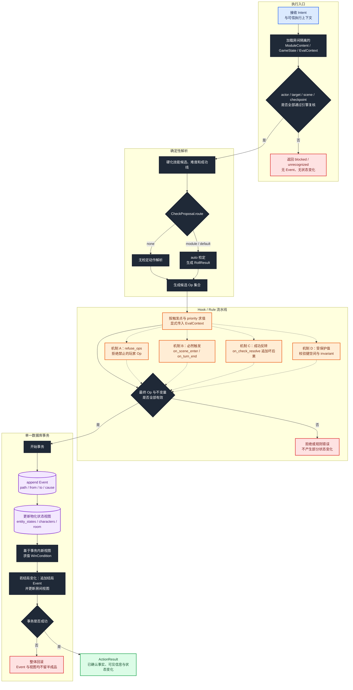

# 成员 B：确定性规则引擎流程架构

> 文档状态：MVP 实施基线  
> 主责成员：成员 B  
> 核心产出：检定、规则、Event 权威写入、状态视图、约束和结局  
> 术语说明：本文的“成员 B”指团队分工；“机制 B”特指条件满足后必然主动触发的规则机制，二者无关。

## 1. 目标与系统定位

成员 B 不开发自由对话 Agent，而是提供整个 Agent 系统的确定性裁决地基。主持 Agent 可以理解玩家、提出目标和检定候选，但只有规则引擎能够确认动作是否允许、检定如何结算、哪些规则必须触发、状态如何变化以及游戏是否结束。

引擎的核心不变量：

```text
LLM 只提议
→ 引擎重新验证
→ 规则产生有限 Op
→ Event 作为权威事实先写入
→ 物化状态视图在同一事务中更新
→ ActionResult 对外确认结果
```

最新版《数据模型设计》是规则和状态语义的最高依据；《协作修改建议》用于修正旧团队计划里“先更新状态、后补 EventLog”的错误顺序。下载目录中的后端代码只反映当前实现进度。

## 2. 输入、输出与上下游

| 方向 | 数据或服务 | 提供方 | 成员 B 如何使用 |
| --- | --- | --- | --- |
| 输入 | `Intent` | 成员 A | 作为不可信的动作提议，必须完整复核 |
| 输入 | 可信执行上下文 | 成员 A / Gateway | 取得 `room_id`、`player_id` 和幂等动作 ID |
| 输入 | `ModuleContent` | 成员 C | 读取 Scene、Entity、Checkpoint、Rule、WinCondition |
| 输入 | `GameState` / 物化视图 | State Repository | 读取当前房间事实，所有读取受 `room_id` 隔离 |
| 输出 | `Event` | 成员 B | 追加可回放、可重建的权威事实 |
| 输出 | 物化状态视图 | 成员 B | 在与 Event 相同的事务内更新 |
| 输出 | `ActionResult` | 成员 B | 向成员 A 返回已经确认的事实与可见信息 |

三人之间的接口关系：

```text
成员 C ── ModuleContent ──→ 成员 B
成员 A ── Intent ──→ 成员 B
成员 B ── ActionResult ──→ 成员 A
成员 B ── Event ──→ EventLog / 回放 / 审计
```

## 3. 主流程架构图



颜色约定：蓝色为上游 Agent 提议，深色为确定性代码，橙色为规则引擎，紫色圆柱为权威 Event/状态存储，绿色为已确认输出，红色为拒绝或回滚。

## 4. 主流程逐步说明

### 4.1 建立房间隔离的 `EvalContext`

1. `ActionExecutor` 接收可信 `room_id`、`player_id`、`client_action_id` 和不可信 `Intent`。
2. 所有 Content、GameState、角色、实体、Event 和表达式读取都由同一个 `room_id` 约束。
3. `EvalContext` 显式携带房间、世界规则、当前 Scene、角色和本次动作数据；求值器禁止通过全局查询隐式读取其他房间。
4. 幂等键已执行时直接返回先前结果，不重复掷骰、写 Event 或触发 Rule。

### 4.2 复核 Agent 提议

引擎必须重新验证：

- `player_id` 是否绑定有效角色，且角色属于当前房间；
- `target_id` 是否存在、对当前动作可引用并位于当前 Scene；
- `checkpoint_id` 是否存在且属于当前 Scene；
- Checkpoint 是否与动作类型、目标和当前状态兼容；
- `proposed_skills` 是否与 `expand(checkpoint.skill)` 和角色实际技能有交集；
- `default` 检定是否来自当前 World 的默认规则；
- 客户端和 Agent 是否试图写入禁止字段或跨房间状态。

任一复核失败都返回 `blocked` 或 `unrecognized`，不能产生部分状态变化。

### 4.3 硬化检定并解析动作

1. `none` 路由不主动掷骰，但仍进入规则流水线，因为动作可能触发机制 A、B 或 D。
2. `module` 路由使用经过 Scene 复核的 Checkpoint。
3. `default` 路由使用 World 明确定义的默认 Checkpoint/检定机制。
4. 最终技能、难度、目标值和成功线由引擎硬化；LLM 只提供软候选。
5. MVP 所有检定均为 `roll_mode="auto"`，由引擎生成原始骰点和 `RollResult`。
6. 检定分支中的静态效果定义叫 `Outcome`；本次动态执行结果只叫 `ActionResult`。

### 4.4 生成和求值有限 Op

动作解析、Checkpoint Outcome 和 Rule 只能生成有限的 Op，例如：

```text
modify(path, set/add/subtract)
grant_entity(entity_id, recipient)
move_actor(scene_id)
apply_condition(condition_id)
emit_hook(hook_name)
end_game(win_condition_id)
```

每个 Op 必须经过：

- 路径白名单和类型检查；
- 当前值读取与 `from` 值确认；
- `Entity.refuse_ops` 检查；
- 机制 D 保护值的写入权限和 invariant 检查；
- 房间、实体、角色和 Scene 引用隔离；
- 同一流水线内的冲突与优先级检查。

禁止把任意 JSON Patch、任意属性赋值或 LLM 自由生成的数据库语句作为 Op。

### 4.5 执行机制 A/B/C/D

| 机制 | 触发源 | 引擎行为 | 书房 Demo |
| --- | --- | --- | --- |
| 机制 A：拒绝 | 玩家提出一个被禁止的 Op | 命中 `Entity.refuse_ops` 后默认拒绝；只有显式 Rule 满足时才能放行 | 无钥匙时拒绝 `open cabinet`，`key_found=true` 时由 Rule 放行 |
| 机制 B：必然 | `on_scene_enter`、`on_turn_end` 等 Hook 条件满足 | 即使 Agent 没提起，也主动产生规则 Op | 管家在指定场景或回合进入 |
| 机制 C：反转 | 引擎得到特定检定分支 | 在成功分支追加坏结果或代价 | 砸柜成功，但文件被毁 |
| 机制 D：值 | 状态被 Rule 或 WinCondition 表达式读取 | 保护写入口、类型、数量和不变量 | `key_found`、`cabinet.opened`、`document.obtained` |

同一实体可以同时属于多类。分类描述的是引擎为什么介入，不是实体种类。

### 4.6 Event 权威写入和物化视图

当所有候选 Op 均通过校验后，ActionExecutor 开始单一数据库事务：

1. 锁定或按版本检查相关房间状态。
2. 将每个状态变化转换为可重建 Event。
3. 先追加 Event，再更新对应的物化状态视图。
4. 在事务内新视图上执行 Hook 后续阶段和 `WinCondition` 求值。
5. 若产生结局或额外状态变化，继续追加 Event 并更新视图。
6. 所有写入成功后提交；任何一步失败都整体回滚。

Event 不是事后审计日志，而是状态事实的权威来源。物化视图可删除并通过 Event 全量重建。

### 4.7 生成 `ActionResult`

只有事务提交成功后才构造并返回 `ActionResult`。它描述：

- 动作是否被执行以及采用哪种解析路径；
- 检定是否成功；
- 最终发生了哪些事实，包括“成功但结果变坏”；
- 哪些状态发生了变化及其原因；
- 玩家可以知道什么；
- Narrator 必须遵守什么限制；
- 下一步是否需要澄清或其他动作。

## 5. 模块职责与禁止事项

### 5.1 成员 B 负责

- `ActionExecutor` 事务边界和稳定端口。
- Checkpoint 复核、技能展开、难度硬化和 auto 骰子。
- Hook、Rule、priority、`when` 表达式和有限 Op 执行。
- 机制 A/B/C/D、状态白名单和 invariant。
- 房间隔离的 `EvalContext`。
- Event 权威存储、物化视图更新和全量回放。
- `WinCondition` 求值和游戏结局状态。
- `ActionResult` 的事实完整性和玩家可见字段划分。
- 规则、事务、并发、回放和跨房间隔离测试。

### 5.2 成员 B 不负责

- 不理解玩家自然语言，不自行调用主持 LLM 猜测 Intent。
- 不生成最终沉浸式旁白或 NPC 文风。
- 不信任 Agent 提交的角色、目标、Checkpoint、技能或难度。
- 不允许绕过 Op 白名单直接修改任意状态路径。
- 不先更新状态再事后补 Event。
- 不在事务失败时保留部分 Event 或部分视图更新。
- 不把内部秘密、暗骰细节和完整规则上下文作为玩家可见信息返回。

## 6. 核心接口与数据契约

### 6.1 `ActionExecutor`

```python
class ActionExecutor(Protocol):
    async def execute(
        self,
        room_id: str,
        player_id: str,
        intent: Intent,
    ) -> ActionResult:
        ...
```

第二阶段引入手动掷骰后可以扩展为 `ActionResult | PendingCheck`，但 MVP 只返回 `ActionResult`。

### 6.2 `Intent` / `CheckProposal`

成员 B 将以下字段全部视为提议：

| 字段 | 引擎复核规则 |
| --- | --- |
| `kind/action` | 必须映射到已注册的动作处理器和有限 Op |
| `target` | 必须是当前 Scene 中有效、可引用的实体或目标 |
| `check.route` | 仅允许 `none/module/default` |
| `checkpoint_id` | `module` 时必须属于当前 Scene；其他路由不得滥用 |
| `proposed_skills` | 与 Checkpoint 展开结果和角色技能求交集 |
| `narrative_intent` | 只作解释和审计，不参与确定性求值 |

### 6.3 `EvalContext`

```text
room_id
module_id / world_ref
scene_id
player_id / character_id
actor_state
target_state
party_snapshot
current_hook
check_resolution
event_sequence
```

所有表达式求值必须从该上下文读取；禁止求值器通过未加房间条件的全局查询补数据。

### 6.4 `Event` 与 `StateChange`

状态变化 Event 的最小可重建语义：

```json
{
  "type": "state.modified",
  "room_id": "room_01",
  "actor_id": "pc_1",
  "path": "entities.cabinet.opened",
  "from": false,
  "to": true,
  "cause": "op:open_cabinet"
}
```

要求：

- `path/from/to` 足以确定重放后的值；
- `cause` 使用 `op:<id>`、`rule:<id>`、`checkpoint:<id>` 等稳定来源；
- 单纯的 `{"type":"cabinet_opened"}` 语义事件不能替代状态变化 Event；
- Event 带房间、顺序、时间、可见性和幂等动作关联信息。

### 6.5 `ActionResult`

```json
{
  "success": true,
  "resolution": "checkpoint",
  "confirmed_facts": ["柜门被砸开", "文件被毁"],
  "player_visible_information": ["柜门已经打开，但文件无法阅读"],
  "state_changes": [
    {
      "path": "entities.cabinet.opened",
      "from": false,
      "to": true,
      "cause": "checkpoint:smash_cabinet"
    },
    {
      "path": "entities.document.destroyed",
      "from": false,
      "to": true,
      "cause": "rule:smash_success_cost"
    }
  ],
  "narration_constraints": ["不得称文件完好"],
  "next_required_action": null
}
```

`success=true` 表示动作按规则完成，不代表后果对玩家有利。机制 C 必须能够表达“成功但更糟”。

## 7. 异常与回滚路径

| 异常 | 返回 | Event / 状态行为 |
| --- | --- | --- |
| 玩家或角色不属于房间 | `blocked` | 不写 Event，不改状态 |
| 目标不在当前 Scene | `unrecognized` 或 `blocked` | 不写 Event，不改状态 |
| Checkpoint 非当前 Scene 所有 | `blocked` | 不写 Event，不改状态 |
| 技能候选无合法交集 | 使用引擎默认规则或 `blocked`，按 World 定义决定 | 不采用 Agent 的非法技能 |
| 命中 `refuse_ops` | `blocked`，说明玩家可见失败事实 | 禁止的状态变化不落库 |
| D 类 invariant 失败 | `blocked` | 整组候选变化不落库 |
| Rule 表达式错误 | 技术错误或安全失败 | 当前事务整体回滚 |
| Event append 失败 | 技术错误 | 状态视图不更新或整体回滚 |
| 状态视图更新失败 | 技术错误 | 已追加 Event 与本事务一起回滚 |
| WinCondition 求值失败 | 技术错误 | 当前事务整体回滚，不猜测结局 |
| 重复 `client_action_id` | 返回先前 `ActionResult` | 不重复掷骰、触发或写 Event |

## 8. 当前后端实现映射

当前参考代码位于 `/Users/jiahao/Downloads/TRPG-master-LWC-1-Folder`：

| 目标能力 | 当前模块 | 当前状态与差距 |
| --- | --- | --- |
| Intent / ActionResult 类型 | `packages/core/rules/models.py` | 已有判别式 Intent 和 ActionResult；当前 ActionResult 缺少通用 `state_changes(path/from/to/cause)`、叙事约束和明确可见事实集合 |
| 规则执行 | `packages/core/rules/engine.py` | 已能处理调查、移动等部分动作；当前直接原地修改 GameState，尚未接入 Event 权威事务和完整 A/B/C/D 流水线 |
| 检定解析 | `packages/core/rules/check_resolver.py` | 可作为技能、目标值和骰子硬化的实现入口，需确保全部输入经过房间和 Scene 复核 |
| 状态仓储 | `packages/core/state/repo.py` | 当前保留 `load/save` 模式，由 Orchestrator 调用 `save`；目标是把写入收口到 ActionExecutor 事务 |
| EventLog | `packages/core/state/event_log.py` | 已有独立 append/list 接口和表实现，但未接入主回合链路，也未与状态视图更新组成同一事务 |
| Event 类型 | `packages/core/state/models.py` | 已有多种语义事件；当前缺少通用、可重建的 `state.modified(path/from/to/cause)` 变体 |
| 内容规则 | `packages/core/content/models.py` | 已有 Entity.state、Entity.rules、Checkpoint、WinCondition；当前 Entity 缺少 `refuse_ops`，需补齐机制 A 表达能力 |

## 9. 与其他成员的协作接口

### 9.1 成员 A → 成员 B

- 提供已通过结构校验但仍不可信的 `Intent`。
- 提供从连接上下文取得的可信 `room_id` 和 `player_id`。
- 测试期间通过 FakeActionExecutor 让双方并行，不让 A 依赖 B 的内部类。

### 9.2 成员 B → 成员 A

- 提供稳定 `ActionExecutor` 接口和完整 `ActionResult`。
- 区分确认事实、玩家可见信息、内部调试信息和叙事约束。
- 保证返回前事务已提交；失败时保证没有部分状态。

### 9.3 成员 C → 成员 B

- 提供通过 Schema 和规则审查的 `ModuleContent`。
- 明确 Entity.rules、World.world_rules、Scene/Checkpoint 引用、`refuse_ops`、初始状态和 WinCondition。
- 提供机制 A/B/C/D 的正向和负向 Demo 案例。

## 10. MVP 交付顺序

1. 冻结 `ActionExecutor`、`ActionResult`、`Event` 和有限 Op 契约。
2. 实现房间隔离、actor/target/scene/checkpoint 复核和可重复 auto 检定。
3. 建立 Event append 与状态视图更新的单一事务，并完成全量回放测试。
4. 实现机制 A `refuse_ops` 和机制 D 受保护状态/invariant。
5. 实现机制 C `on_check_resolve` 成功反转。
6. 实现 `WinCondition` 和结局 Event。
7. 实现机制 B `on_scene_enter/on_turn_end` 必然触发。
8. 加入 Rule priority、并发冲突和完整幂等处理。

第二阶段再实现：`PendingCheck`、手动掷骰、超时策略、更多暗骰、Condition、Ledger 和复杂规则调度。

## 11. 测试与验收标准

### 11.1 复核与检定

- 非当前 Scene 的 `checkpoint_id` 被拒绝。
- Agent 提议不存在或角色不会的技能时，引擎不会直接采用。
- 同一固定随机种子产生可复现 `RollResult`。
- `none/module/default` 三条路由行为符合 World 和 Scene 定义。

### 11.2 机制 A/B/C/D

- 无钥匙开柜命中机制 A，`cabinet.opened` 保持 `false`。
- 砸柜成功触发机制 C，柜子打开但文件损毁，并能进入坏结局。
- 管家在指定 Scene 或回合 Hook 上必然触发机制 B。
- `key_found`、`cabinet.opened`、`document.obtained` 只能通过合法 Op 修改。
- D 类 invariant 被破坏时，整个动作拒绝且无部分写入。

### 11.3 Event、事务与回放

- 每次状态变化都有包含 `path/from/to/cause` 的 Event。
- 删除物化视图后可以从 Event 全量重建，结果与删除前一致。
- Event append 后模拟视图更新失败，事务整体回滚。
- WinCondition 产生的房间状态变化也有对应 Event。
- 同一幂等动作重放不重复掷骰、不重复触发 Hook、不重复写 Event。

### 11.4 隔离与并发

- 两个房间拥有同名实体时不会读写串房。
- 两个动作并发修改同一路径时由版本或锁策略确定性解决，不发生静默覆盖。
- 任何跨房间 `party.size`、角色或实体读取都会被测试捕获。

## 12. 交接清单

- **我负责什么**：检定、Hook/Rule、有限 Op、机制 A/B/C/D、Event 权威写入、状态视图、房间隔离、结局和 ActionResult。
- **我不负责什么**：自然语言理解、最终旁白文风、客户端 UI、模组原文解析和内容审查。
- **我向谁提供什么**：向成员 A 提供 `ActionExecutor/ActionResult`；向回放和审计提供 Event；向成员 C 提供可执行规则和 Schema 反馈。
- **我依赖谁提供什么**：依赖成员 A 提供可信执行上下文和结构化 Intent；依赖成员 C 提供通过审查的 ModuleContent、规则、初始状态和验收案例。
