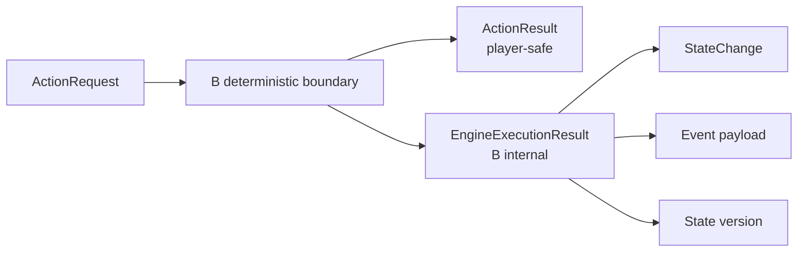

# 成员 B：确定性规则引擎边界

> 当前代码是功能型 Fake，用来验证接口，不代表生产规则引擎实现。
> 统一决议：[`architecture-alignment-decisions.md`](architecture-alignment-decisions.md)

## 1. B 的职责

B 独占：

- Rule 和 Hook 的确定性执行；
- Checkpoint 合法性复核与执行；
- Dice/随机源政策；
- GameState 读取和修改；
- StateChange 与 Event 创建、提交、重放；
- 事务、并发、幂等和状态版本；
- 从权威状态产生无秘密的 `ProjectionSnapshot`。

B 不负责理解玩家自由语言、生成 Narration、构造最终 PlayerView 或 WebSocket 输出。

## 2. 对 A 的两个端口

### 命令端口

```python
class ActionExecutor(Protocol):
    async def execute(self, request: ActionRequest) -> ActionResult: ...
```

这是 A 唯一可调用的权威命令。B 应把每个 request 当作需要复核的提议，而不是可信状态变更指令。

所有合法 Intent 都进入该端口，包括 dialogue、unknown 和 `check.route="none"`。B 可以返回 `direct`、`blocked`、`unrecognized` 或 `checkpoint`，但 A 不得预先旁路。

### 只读投影源

```python
class PlayerViewSource(Protocol):
    async def read(self, player_input: PlayerInput) -> ProjectionSnapshot: ...
```

`ProjectionSnapshot` 不是 GameState。它不得包含秘密字段、内部 Event、StateChange 或可被 A 写回的状态对象。A 在此基础上拥有最终 PlayerView 投影政策。

## 3. Checkpoint 执行边界

A 负责把玩家语义映射到 `PlayerView.checkpoint_options` 中的候选，B 负责确定性复核和执行。

B 至少校验：

- room/player/actor 与当前执行上下文一致；
- `source_view_revision` 未过期；
- Checkpoint 属于当前 Scene；
- target 与 Checkpoint 一致且当前可交互；
- `proposed_skills` 是该 Checkpoint 技能集合的子集；
- 条件、拒绝规则和状态约束满足；
- request id 的幂等语义满足。

B 不应要求 `Intent.verb` 和 `CheckpointSpec.action` 字面相等。后者是 A 的语义提示，不是完备自然语言规则。如果 B 需要额外的确定性动作类别，应通过 A/B 共审的结构化契约新增，而不是在引擎中重做自由文本匹配。

## 4. 公共结果与内部结果



`ActionResult` 允许 A 使用：resolution、outcome、visible facts、narration constraints、刷新版本和不透明 Event refs。

`EngineExecutionResult`、StateChange、完整 Event payload、GameState 与内部确认事实只属于 B。它们不能通过 NarrationContext 或 WebSocket 泄露。

## 5. 与 C 的 ModuleContent 边界

B 和 C 共同评审 `contracts/module.py` 中的：

- `ModuleContent`
- `SceneSpec`
- `EntitySpec`
- `CheckpointSpec`
- `RuleSpec`
- 声明式 Condition/Operation/Outcome specs

这些模型定义发布模组“能声明什么”。Hook 注册表、编译后的 Rule、随机数、事务、Event 和状态迁移属于 `engine/` 内部，不能反向放进公共发布契约。

## 6. FakeAtomicEngine 的定位

当前 `engine/atomic.py` 同时实现 `ActionExecutor` 和 `PlayerViewSource`，用于验证：

- 主链每回合执行一次；
- 过期视图和非法 Checkpoint 被拒绝；
- StateChange/Event 不跨出公共结果；
- Event 能重放 Fake 状态；
- 相同 request id 幂等；
- A 的语义 Checkpoint 选择不会因 verb 字面不同被拒绝。

它不提供生产级 Dice、并发数据库事务或完整 Hook 系统。真实 B 实现替换它时必须保持两个 Protocol 和公开 Schema 不变，或通过共同评审显式升级版本。

## 7. 依赖约束

- `engine` 可以 import `contracts` 和顶层 `ports`。
- `engine` 不得 import `host` 或 C 的解析实现。
- `host` 不得 import `engine`。
- 只有 `bootstrap` 知道 `FakeAtomicEngine` 同时满足两个端口并负责装配。
- LangGraph 属于 A 的潜在编排实现，不能进入 B 的确定性规则核心。
