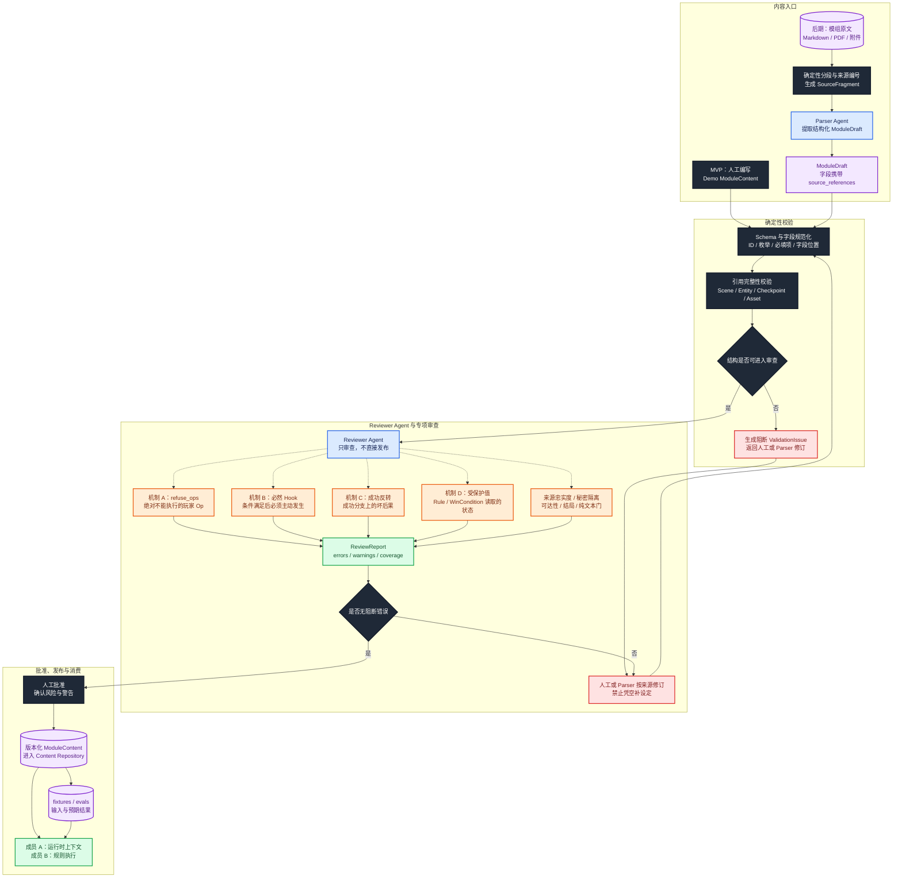

# 成员 C：模组解析与审查 Agent 流程架构

> 文档状态：MVP 实施基线  
> 主责成员：成员 C  
> 核心产出：可运行的 ModuleContent、解析/审查流水线、共享 fixtures 与 evals  
> 术语说明：本文的“成员 C”指团队分工；“机制 C”特指检定成功分支挂接坏结果的反转机制，二者无关。

## 1. 目标与系统定位

成员 C 负责把模组原始材料转成成员 A、B 能稳定消费的 `ModuleContent`，并建立导入前的确定性校验、Agent 审查、人工批准和质量评测流程。

这项工作分两个阶段，但共用同一条发布管线：

```text
MVP：人工编写标准 Demo
后期：模组原文 → Parser Agent 生成草稿

两者共同进入：
Schema 规范化 → 引用校验 → Reviewer Agent → 人工批准 → 发布
```

第一阶段不等待完整自动解析 Agent。先以人工 `demo-module.json` 固定三人共同接口和验收案例；运行时能稳定消费后，再把人工生产步骤逐段替换为 Parser Agent。

最新版《数据模型设计》是内容字段、规则归属和机制 A/B/C/D 的最高依据；《协作修改建议》用于修正旧团队计划中的顶层 `rules`、旧协议名和过弱 Demo。下载目录中的后端代码只用于映射现有 Content 和导入骨架。

## 2. 输入、输出与上下游

| 方向 | 数据或服务 | 提供方 | 成员 C 如何使用 |
| --- | --- | --- | --- |
| 输入 | 模组原文、附件和素材 | 作者 / 产品 | 作为 Parser Agent 的唯一事实来源 |
| 输入 | World / 数据模型 Schema | 三人共同契约 | 规范字段、枚举、规则挂载位置和引用 |
| 输入 | 规则执行约束 | 成员 B | 确保 Rule、Op、Checkpoint、WinCondition 可执行 |
| 输入 | 运行时上下文需求 | 成员 A | 确保 Scene、实体可见性和安全菜单信息可投影 |
| 输出 | `ModuleContent` | 成员 C | 提供给成员 A、B 的稳定内容契约 |
| 输出 | `ReviewReport` | Reviewer Agent | 给出阻断错误、警告、来源和修订建议 |
| 输出 | `FixtureCase` / `EvalCase` | 成员 C | 作为三人共享的集成测试与 Agent 评测输入 |

三人之间的接口关系：

```text
成员 C ── ModuleContent ──→ 成员 A、成员 B
成员 C ── FixtureCase / EvalCase ──→ 三人共同测试
成员 A ── Intent 与叙事失败反馈 ──→ 成员 C
成员 B ── Schema 与规则执行反馈 ──→ 成员 C
```

## 3. 主流程架构图



颜色约定：蓝色为 Agent/LLM，深色为确定性校验器和人工批准点，橙色为规则/质量专项审查，紫色圆柱为来源、草稿、内容和测试资产，绿色为可消费输出，红色为阻断与修订循环。

## 4. 主流程逐步说明

### 4.1 MVP 先人工建立标准 Demo

第一阶段直接人工编写 `demo-module.json`，目的是固定：

- `ModuleContent` 最小可运行结构；
- Scene、Entity、Checkpoint、Rule 和 WinCondition 的引用关系；
- 机制 A/B/C/D 的真实表达方式；
- 成员 A 预期生成的 Intent；
- 成员 B 预期返回的 ActionResult、Event 和状态变化；
- Narrator 必须表达或禁止表达的事实。

人工 Demo 也必须走与自动解析相同的 Schema、引用、Reviewer 和批准流程。人工编写不等于可以绕过质量门。

### 4.2 分段原始材料并保留来源

后期自动导入时：

1. 将原文、图片说明、表格和附件登记为 `SourceDocument`。
2. 用确定性逻辑按章节、页码或段落生成稳定 `SourceFragment.id`。
3. Parser Agent 输出的实体、秘密、规则和结局必须携带 `source_references`。
4. 无法找到来源的设定必须标为缺失或推断，不能静默写成确定事实。
5. 原始文件只读保存，解析草稿与正式 ModuleContent 分开管理。

### 4.3 Parser Agent 生成 `ModuleDraft`

Parser Agent 负责提取而不是裁决发布：

- World 与 `world_ref`；
- Module 元信息和背景；
- Scene、出口和内容关系；
- Entity、公开描述、秘密、初始 state；
- Checkpoint、技能、难度、静态 Outcome；
- Rule、Hook、Op、WinCondition；
- 素材和角色模板引用；
- 每一项对应的来源片段与置信度。

Parser 不得因为“这样更好玩”而补造原文没有的机制。若原文含糊，应保留 `ValidationIssue` 或人工确认点。

### 4.4 确定性规范化与引用校验

这一步不用 LLM 猜测，负责：

- JSON Schema 和 Pydantic 类型验证；
- 必填字段、枚举、数值范围和额外字段检查；
- ID 格式、唯一性和稳定性；
- `world_ref`、Scene、Entity、Checkpoint、Rule、Asset、WinCondition 引用存在性；
- Scene 出口和 Checkpoint 归属；
- Rule/Op 字段位置和表达式语法；
- 秘密字段与公开字段的结构隔离；
- 顶层禁止模组级 `rules`。

正式 ModuleContent 中：

- 模组实体规则放在 `Entity.rules`；
- 世界通用规则放在 `World.world_rules`；
- `Entity` 的 MVP 字段必须能表达 `state`、`refuse_ops` 和 `rules`；
- Scene 必须能明确引用可用 Checkpoint；
- WinCondition 读取的状态必须能够被 Event 和物化视图承载。

### 4.5 Reviewer Agent 专项审查

Reviewer 只读取已经通过结构校验的草稿，输出 `ReviewReport`，不直接写入 Content Repository。

专项审查包括：

| 审查项 | 核心问题 | 阻断示例 |
| --- | --- | --- |
| 来源忠实度 | 每个关键事实是否能追溯到原文 | Parser 凭空补出新结局 |
| 机制 A | 是否存在 LLM 会被说服、但作者要求绝对拒绝的 Op | “小号绝不转让”却没有 `refuse_ops` |
| 机制 B | 是否存在条件满足后无论如何都必须发生的事件 | 管家进入只写在叙述备注中，没有 Hook |
| 机制 C | 是否存在成功检定反而产生代价或坏结果 | 成功砸柜的文件损毁只写在 prompt 中 |
| 机制 D | Rule/WinCondition 读取的值是否落入受保护状态 | 结局读取 `document.obtained`，但没有初始 state/合法写入口 |
| 秘密隔离 | 未发现秘密是否可能进入 PlayerView | `secrets` 被混入公开 `content` |
| 引用完整性 | ID 和关系是否可解析 | Scene 引用不存在的 Checkpoint |
| 可执行性 | Rule、Op、表达式是否被引擎支持 | 自由文本 Rule 无法转成有限 Op |
| 可达性 | 关键 Scene、Checkpoint 和结局是否有合理路径 | 唯一结局引用永远无法置真的状态 |
| 过度结构化 | 纯文本对象是否被错误做成复杂规则 | 普通抽屉被无必要地建成 A/B/C/D |

### 4.6 区分纯文本“门”和 A/B/C/D

Reviewer 对每个疑似规则对象按以下顺序判断：

```text
Q1 玩家发起某个 Op 时，引擎必须拒绝吗？
   是 → 机制 A：Entity.refuse_ops

Q2 某个条件满足时，引擎必须主动触发吗？
   是 → 机制 B：Hook / Rule

Q3 引擎求值为 success 时，是否必须挂坏后果？
   是 → 机制 C：on_check_resolve Rule

Q4 它是否被 Rule.when 或 WinCondition.expr 读取？
   是 → 机制 D：受保护 entity_states 键

四项都否 → 保持纯文本，由主持 Agent 灵活演绎
```

“门”本身通常不需要复杂规则。只有后续规则需要读取“门后获得了什么”时，相关值才按机制 D 落库。

### 4.7 ReviewReport、人工批准与发布

1. Reviewer 汇总结构错误、机制缺失、秘密风险、来源引用和覆盖率。
2. `errors` 为阻断项，必须返回 Parser 或人工修订并重新从 Schema 校验开始。
3. `warnings` 可以由人工接受，但必须保留审批记录。
4. 审查通过后由人工批准，生成不可变版本号和内容摘要。
5. 只有批准版本进入 Content Repository，供运行时房间绑定。
6. 每个发布版本同时冻结 fixtures/evals，保证后续 Parser 或 Schema 修改不会悄悄改变玩法。

## 5. 模块职责与禁止事项

### 5.1 成员 C 负责

- 人工标准 Demo 和正式 ModuleContent 内容生产。
- Parser Agent、来源分段、字段提取和来源追踪。
- 确定性 Schema、字段、枚举、ID 和引用校验。
- Reviewer Agent 和机制 A/B/C/D 专项审查。
- 秘密隔离、可执行性、可达性、结局和过度结构化审查。
- `ReviewReport`、人工批准和版本化发布流程。
- 三人共享的 fixtures、evals、错误分类和回归数据。
- 向成员 A、B 反馈内容契约缺口和运行时不可表达问题。

### 5.2 成员 C 不负责

- 不在运行时理解玩家输入或生成最终旁白。
- 不执行骰子、Rule、Op、Event、状态事务或 WinCondition。
- 不让 Parser/Reviewer 绕过 Schema 直接发布内容。
- 不让 Reviewer 自动接受自己的修订，正式发布必须有人审。
- 不把顶层 `rules` 当成模组规则容器。
- 不把所有叙事对象都做成状态或规则。
- 不凭空补造来源中没有的事实来修复可达性。
- 不用测试样例替代正式数据协议。

## 6. 核心接口与数据契约

### 6.1 `SourceDocument` 与 `SourceFragment`

```json
{
  "document_id": "module_source_01",
  "kind": "markdown",
  "checksum": "sha256:...",
  "fragments": [
    {
      "id": "src_ch2_p14_003",
      "locator": "第二章 / 第14页 / 第3段",
      "text": "……"
    }
  ]
}
```

来源 ID 必须稳定，修订报告和 ModuleDraft 都通过它追踪证据。

### 6.2 `ModuleDraft`

```text
raw_source_ref
parser_version
schema_version
draft
source_references
confidence_notes
unresolved_questions
```

`ModuleDraft` 是候选结构，不得被运行时加载，也不等于正式 `ModuleContent`。

### 6.3 `ModuleContent`

MVP 顶层最小结构：

```json
{
  "world_ref": "coc-7e",
  "scenes": [],
  "entities": [],
  "checkpoints": [],
  "win_conditions": []
}
```

Entity MVP 子集：

```json
{
  "id": "cabinet",
  "kind": "object",
  "name": "上锁的柜子",
  "content": "一只年代久远的木柜。",
  "secrets": "文件藏在柜中。",
  "state": { "opened": false },
  "refuse_ops": ["open"],
  "rules": []
}
```

注意：`refuse_ops:["open"]` 表示默认拒绝；书房 Demo 必须另外在 `Entity.rules` 定义 `bookshelf.key_found == true` 时放行 `open`。上面的空 `rules` 只用于展示字段位置，不是完整柜子实例。“无钥匙拒绝、有钥匙放行”必须由成员 B 可确定执行的规则表达，不能只写在 `secrets` 中。

### 6.4 `ValidationIssue`

```text
severity: error | warning
code
path
message
source_references
suggested_fix
```

相同问题使用稳定 `code`，便于统计 Parser/Reviewer 回归。

### 6.5 `ReviewReport`

```json
{
  "status": "needs_revision",
  "errors": [],
  "warnings": [],
  "source_references": [],
  "suggested_fixes": [],
  "coverage_summary": {
    "schema": 1.0,
    "references": 1.0,
    "mechanism_abcd_reviewed": true,
    "endings_reviewed": true
  }
}
```

`status` 只允许：

- `pass`：无阻断错误，可以进入人工批准；
- `needs_revision`：存在可修订的阻断错误；
- `blocked`：缺少来源、Schema 或关键产品决策，无法安全修订。

### 6.6 `FixtureCase` 与 `EvalCase`

```text
FixtureCase
  initial_module_version
  initial_state
  player_input
  expected_intent
  expected_action_result
  expected_events
  expected_final_state
  narration_constraints

EvalCase
  input
  expected_properties
  forbidden_properties
  error_category
  source_references
```

Fixture 用于确定性集成测试；Eval 用于评测 Parser、Reviewer、IntentParser 和 Narrator。

## 7. 书房 MVP Demo 设计

至少维护以下共享案例：

| 案例 | 初始条件 | 预期 Intent / 规则 | 预期 Event 与结果 | 覆盖目标 |
| --- | --- | --- | --- | --- |
| 调查书架 | `key_found=false` | `investigate bookshelf`，module/auto 检定 | 成功时写 `key_found: false→true` | 普通 Checkpoint、机制 D |
| 无钥匙开柜 | `key_found=false`、`cabinet.opened=false` | `interact open cabinet` | 引擎拒绝，柜子保持关闭 | 机制 A |
| 有钥匙开柜 | `key_found=true` | 合法 open Op | `cabinet.opened: false→true`，`document.obtained: false→true` | 正常状态链 |
| 砸柜 | 文件尚完好 | smash Checkpoint 成功 | 柜子打开，同时文件损毁，可能触发坏结局 | 机制 C |
| 管家进入 | 到达指定 Scene 或回合 | 即使玩家未提到，也触发 Hook | 产生管家进入 Event 和可见事实 | 机制 B |
| 结局求值 | `document.obtained/destroyed` 达到条件 | WinCondition 表达式求值 | 写结局 Event，更新房间阶段 | 机制 D、结局 |
| 普通抽屉 | 没有规则读取其状态 | 保持纯文本处理 | 不创建不必要 Rule/Event | 防止过度结构化 |

建议状态键统一为实体路径，避免含糊的全局布尔值：

```text
entities.bookshelf.key_found
entities.cabinet.opened
entities.document.obtained
entities.document.destroyed
entities.butler.entered
```

最终命名以三人冻结的 Schema 为准，但 fixtures、Event 和 WinCondition 必须使用同一套路径。

## 8. 异常与修订路径

| 异常 | 状态 | 处理 |
| --- | --- | --- |
| 原文缺失或无法读取 | `blocked` | 请求补充来源，不让模型猜测 |
| Parser 输出非法 JSON | `needs_revision` | 结构化重试；仍失败则人工处理 |
| Schema/枚举错误 | `needs_revision` | 确定性报告字段路径和期望类型 |
| 重复 ID 或悬空引用 | `needs_revision` | 阻断发布，修订后全量重验 |
| 顶层出现模组 `rules` | `needs_revision` | 移到 Entity.rules 或 World.world_rules，并复核语义 |
| 关键规则只写在 secrets/prompt | `needs_revision` | 转成 A/B/C/D 中对应的显式结构 |
| 来源与提取事实冲突 | `needs_revision` 或 `blocked` | 以来源为准，人工裁定歧义 |
| 秘密进入公开字段 | `needs_revision` | 阻断发布并增加泄密回归用例 |
| 结局不可达 | `needs_revision` | 标记断裂路径；不得凭空新增通关手段 |
| Reviewer 服务不可用 | `blocked` | 保留草稿，不自动批准 |
| 只有 warning | `pass` 后人工批准 | 记录接受理由和审批人 |

## 9. 当前后端实现映射

当前参考代码位于 `/Users/jiahao/Downloads/TRPG-master-LWC-1-Folder`：

| 目标能力 | 当前模块 | 当前状态与差距 |
| --- | --- | --- |
| 内容模型 | `packages/core/content/models.py` | 已有 World、ModulePack、Scene、Entity、Checkpoint、WinCondition；Entity 已有 `state/rules`，但缺少 `refuse_ops`；ModulePack 顶层目前没有 `rules`，与新版方向一致 |
| Scene 与 Checkpoint 关系 | `packages/core/content/models.py` | 当前通过 `Scene.contents` 中的 checkpoint 项表达，而非直接 `checkpoint_ids`；正式契约需选定一种稳定表示并由校验器统一处理 |
| 粗粒度导入 Agent | `packages/core/moduleimport/agent.py` | 已有 `parse()`、`validate_and_ingest()` 和 `ModulePackDraft` 桩；内部 Parser、确定性校验、Reviewer、ReviewReport 和批准流程尚未实现 |
| 内容存储 | `packages/core/content/repo.py` | 可作为批准版本的持久化边界；草稿和 ReviewReport 不应混入正式运行时内容 |
| fixtures / evals | 当前目录未发现完整实现 | 需要新增书房 Demo、预期 Intent/ActionResult/Event 和 Agent 评测集 |

现有 `ModuleImportAgent` 粗粒度外部接口可以保留，但内部必须拆成来源分段、Parser、校验、Reviewer、人工批准和发布步骤，不能让 `validate_and_ingest` 成为不可观察的黑箱。

## 10. 与其他成员的协作接口

### 10.1 成员 C → 成员 A

- 提供批准版本的 `ModuleContent`、稳定 Scene/Entity/Checkpoint ID 和玩家可见内容。
- 提供 Intent 解析样例、歧义输入、未匹配输入和叙事约束。
- 明确哪些字段是公开信息、秘密、发现后可见信息和永不直接展示的规则信息。

### 10.2 成员 C → 成员 B

- 提供可执行的 Rule、Hook、Op、`refuse_ops`、初始 state、Checkpoint 和 WinCondition。
- 所有引用、状态路径和表达式在发布前通过确定性校验。
- 为机制 A/B/C/D 分别提供正向、负向和边界案例。

### 10.3 成员 A/B → 成员 C

- A 反馈无法稳定解析的动作、菜单缺失和叙事泄密案例。
- B 反馈无法执行的 Rule/Op、非法路径、回放不完整和 WinCondition 问题。
- C 将反馈固化为 Schema 检查、Reviewer 规则或回归案例，而不是只人工修一次数据。

## 11. MVP 交付顺序

1. 冻结 ModuleContent MVP Schema、术语和 ID/状态路径约定。
2. 人工编写书房 `demo-module.json`，覆盖普通动作和机制 A/B/C/D。
3. 编写 10～20 条 `FixtureCase`，包含预期 Intent、ActionResult、Event、最终状态和叙事约束。
4. 实现确定性 Schema、枚举、ID、引用、字段位置和秘密隔离校验。
5. 输出第一版 ReviewReport 格式和人工审查清单。
6. 与成员 A、B 跑通书房 Demo，修正不可消费或不可执行的内容契约。
7. 开始最小 Parser 实验：先提取 Entity/Checkpoint 和来源引用。
8. 运行时稳定后再实现完整 Parser → Reviewer → 批准 → 发布流水线。

第二阶段再实现：复杂 PDF/表格/图片导入、自动修订循环、多模组批量导入、Review 仪表盘和更大规模评测集。

## 12. 测试与验收标准

### 12.1 Schema 与引用

- 合法 Demo 能完整解析为 ModuleContent。
- 非法枚举、额外顶层字段和错误字段位置被拒绝。
- 重复 ID、悬空 Scene/Entity/Checkpoint/Asset 引用被拒绝。
- 顶层模组 `rules` 被拒绝；Entity.rules 与 World.world_rules 可通过。
- Entity 的 `state/refuse_ops/rules` 能表达 MVP Demo。

### 12.2 Parser 与来源忠实度

- 关键实体、秘密、Checkpoint、Rule 和结局均带来源引用。
- 原文未提供的信息不会被静默补造。
- 同一来源重复解析得到稳定 ID 或明确迁移映射。
- Parser 非法输出不会进入正式内容仓储。

### 12.3 Reviewer

- 能识别无钥匙开柜缺失机制 A。
- 能识别管家进入缺失机制 B Hook。
- 能识别砸柜成功损毁文件缺失机制 C。
- 能识别 WinCondition 读取但未落库的机制 D 状态。
- 能发现 secrets 泄漏、不可达结局、自由文本不可执行 Rule 和过度结构化对象。
- 存在阻断错误时不能进入人工批准后的发布步骤。

### 12.4 三人集成

- 成员 A 能用发布版 ModuleContent 生成正确 PlayerView/SceneActionMenu 和 Intent。
- 成员 B 能执行全部 Demo Rule/Op，并从 Event 重建最终状态。
- 成员 A 的 Narrator 能忠实表达正常、拒绝和“成功但坏结果”三类结果。
- ModuleContent、Intent、ActionResult 和 Event 中的实体/状态路径一致。

## 13. 交接清单

- **我负责什么**：标准模组数据、Parser Agent、确定性校验、Reviewer Agent、人工批准、版本化发布、fixtures 和 evals。
- **我不负责什么**：玩家意图理解、运行时旁白、规则实际执行、Event/状态事务和客户端交互。
- **我向谁提供什么**：向成员 A、B 提供通过审查的 ModuleContent；向三人提供共享 fixtures/evals 和 ReviewReport。
- **我依赖谁提供什么**：依赖成员 A 提供上下文、Intent 和叙事约束需求；依赖成员 B 提供可执行 Rule/Op、状态路径、Event 和 ActionResult 契约。
