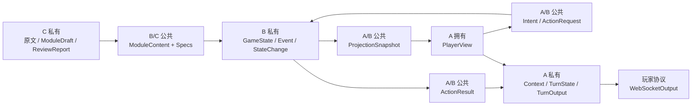

# 数据模型设计

状态：**现行（MVP）**  
适用范围：`agent-collaboration-framework`  
架构决议：[`architecture.md`](architecture.md)

本文说明当前 A（主持编排）、B（确定性规则引擎）和 C（模组解析/审查）的数据模型所有权、跨边界字段和不变式。

`docs/archive/pre-consensus/数据模型设计.md` 是三人统一之前的完整后端建模提案，仅用于追溯。当前模型的事实源顺序为：

1. `collaboration_framework/contracts/` 中的 Pydantic 模型；
2. `collaboration_framework/ports/` 中的 Protocol；
3. `host/schemas/` 与 `engine/models.py` 中的内部模型；
4. 自动生成的 `schemas/*.schema.json`；
5. 本文。

如果文档与生成的 Schema 冲突，以 Pydantic 和生成的 Schema 为准，并在同一个 PR 中修正文档。

## 1. 分层与所有权



| 模型组 | 所有者/共同评审者 | 消费者 | 禁止包含 |
|---|---|---|---|
| `ModuleContent` 与声明式 Specs | B/C | B、C、组合根 | GameState、运行时 Event、骰子结果、Prompt |
| `ProjectionSnapshot` | A/B | A | GameState 对象、秘密、内部 Event、写命令 |
| `PlayerView` | A | A 的模型端口、Gateway | 其他玩家私有信息、模组秘密、状态写入口 |
| `Intent` / `ActionRequest` | A/B | A、B | `execution` 旁路、Dice 结果、StateChange |
| `ActionResult` | A/B | A | GameState、完整 Event payload、内部规则轨迹 |
| A 的 Context/Turn 模型 | A | 仅 `host/` | B/C 内部对象 |
| B 的状态/Event/执行结果 | B | 仅 `engine/` 和 B 的测试 | A 模型上下文、WebSocket DTO |

## 2. 公共模型基础规则

跨边界模型继承 `ContractModel`：

- `extra="forbid"`：拒绝未知字段；
- `frozen=True`：创建后不可原地修改；
- `populate_by_name=True`：支持明确的字段别名；
- `str_strip_whitespace=True`：清理字符串两端空白。

`ContractError` 表示结构已通过 Pydantic，但违反房间身份、视图版本、可信候选或幂等键等确定性边界。

模型 adapter 返回的 `JsonObject` 只是 raw JSON。它必须经过 `IntentParser` 或 `Narrator` 校验，不能直接进入 Orchestrator 的后续步骤。

## 3. 回合输入：`PlayerInput`

定义：`contracts/runtime.py`

| 字段 | 类型 | 语义 |
|---|---|---|
| `room_id` | `str` | 可信房间身份 |
| `player_id` | `str` | 当前连接对应的玩家 |
| `actor_id` | `str` | 玩家在房间中控制的角色 |
| `client_action_id` | `str` | 客户端幂等键；映射为 `ActionRequest.request_id` |
| `utterance` | `str` | 玩家自由语言输入 |

生产 Gateway 必须从认证连接和房间绑定建立身份字段，不能只信任客户端 JSON。B 在执行时仍复核 Actor 与 Player 的绑定。

## 4. 安全投影

定义：`contracts/player_view.py`

### 4.1 `ProjectionSnapshot`

这是 B 通过 `PlayerViewSource.read()` 提供的只读、与 `GameState` 解耦的安全投影源。

| 字段 | 类型 | 语义 |
|---|---|---|
| `room_id` | `str` | 快照所属房间 |
| `scene_id` | `str` | 当前 Scene |
| `phase` | `playing \| ended` | 当前阶段 |
| `revision` | `str` | 不透明投影版本；Fake 中来自 `event_sequence` |
| `entities` | `tuple[ProjectionEntity, ...]` | 已由 B 去除秘密的实体 |
| `checkpoint_options` | `tuple[ProjectionCheckpointOption, ...]` | 当前可信 Checkpoint 候选 |

`ProjectionEntity` 只含 `id/kind/name/aliases/content`，不含 `EntitySpec.secrets` 或运行时私有状态。

`ProjectionCheckpointOption` 只含 `id/target_id/action_hint/skills`。`action_hint` 是语义提示，不是封闭动词白名单。

### 4.2 `PlayerView`

A 的 `PlayerViewProjector` 从安全快照构造面向当前玩家的视图：

| 字段 | 类型 | 语义 |
|---|---|---|
| `room_id/player_id/actor_id` | `str` | 当前玩家上下文 |
| `scene_id` | `str` | 当前 Scene |
| `phase` | `playing \| ended` | 当前阶段 |
| `revision` | `str` | 当前视图版本 |
| `visible_facts` | `tuple[VisibleFact, ...]` | 当前可见事实 |
| `visible_entities` | `tuple[VisibleEntity, ...]` | 玩家可见实体 |
| `checkpoint_options` | `tuple[CheckpointOption, ...]` | A 可选择的可信候选 |

B 负责先去除权威状态和秘密；A 负责玩家级可见政策。A 不得直接读取 `GameState` 或完整 `ModuleContent`。

## 5. 意图模型：`Intent`

定义：`contracts/action.py`

| 字段 | 类型 | 语义 |
|---|---|---|
| `kind` | `action \| dialogue \| unknown` | 高层语义类型 |
| `verb` | `str` | 开放动作词，不使用封闭 Enum |
| `target` | `MatchedTarget \| UnmatchedTarget` | 以 `matched` 为 discriminator |
| `check` | `NoCheck \| ModuleCheck \| DefaultCheck` | 以 `route` 为 discriminator |
| `approach` | `str \| None` | 玩家表达的方式 |
| `summary` | `str` | 简短语义摘要 |
| `clarification_question` | `str \| None` | unknown 的澄清问题 |

`Intent` 没有 `execution`。所有通过 Schema 和可信候选校验的 Intent 都调用一次 `ActionExecutor.execute()`。

### 5.1 Target

```text
MatchedTarget:   matched=true,  id
UnmatchedTarget: matched=false, raw
```

discriminator 会拒绝同时携带 `id/raw` 等歧义结构。

### 5.2 Check

```text
NoCheck:      route="none"
ModuleCheck:  route="module", checkpoint_id, proposed_skills
DefaultCheck: route="default", proposed_skills
```

A 只能从 `PlayerView.checkpoint_options` 选择 Checkpoint、对应 Target 和技能。B 复核 Scene/Target/Checkpoint/skills，但不要求自由语言 `verb` 与 `action_hint` 字面相等。

### 5.3 结构不变式

- unknown 必须使用 `UnmatchedTarget` 和 `NoCheck`，并提供澄清问题；
- action/dialogue 必须使用 `MatchedTarget`，不得携带澄清问题。

## 6. 命令：`ActionRequest`

定义：`contracts/action.py`

| 字段 | 类型 | 语义 |
|---|---|---|
| `request_id` | `str` | 幂等键，来自 `client_action_id` |
| `room_id/player_id/actor_id` | `str` | 可信执行作用域 |
| `source_view_revision` | `str` | A 解析 Intent 时所基于的视图版本 |
| `intent` | `Intent` | 已校验的语义提议 |

首次执行时，B 校验身份绑定、source revision、当前 Scene、Target、Checkpoint、skills 和 request id 占用情况。

## 7. 安全结果：`ActionResult`

定义：`contracts/action.py`

| 字段 | 类型 | 语义 |
|---|---|---|
| `request_id` | `str` | 对应命令 |
| `action_id` | `str` | 引擎动作标识 |
| `resolution` | `checkpoint \| direct \| blocked \| unrecognized` | B 使用的处理路径 |
| `outcome` | `success \| failure \| not_applicable` | 确定性结果 |
| `visible_facts` | `tuple[VisibleFact, ...]` | Narrator 可声称事实 |
| `narration_constraints` | `tuple[str, ...]` | 叙事限制 |
| `view_revision` | `str` | 当前响应结束后 A 必须刷新到的视图版本 |
| `event_refs` | `tuple[str, ...]` | 原始执行的不可解释 Event 引用 |

它不含 GameState、StateChange、完整 Event payload、confirmed facts、state version 或内部规则轨迹。

## 8. Revision 与幂等重放

### 8.1 版本字段

| 字段 | 所属模型 | 含义 |
|---|---|---|
| `source_view_revision` | `ActionRequest` | 首次提交时 Intent 所基于的视图版本 |
| `view_revision` | `ActionResult` | 当前响应完成后 A 要刷新到的投影版本 |
| `state_version` | `EngineExecutionResult` | 原始命令提交时的 B 内部状态版本 |
| `event_sequence` | Fake `GameState` | Fake Event 单调序号；生产实现可替换 |

`ActionResult.view_revision` 是 A 的刷新同步元数据，不是原始动作永远不变的提交版本。

### 8.2 首次执行

```text
request_id 未命中缓存
  -> 校验 source_view_revision
  -> 执行确定性内核
  -> 提交状态与 Event
  -> 缓存原始 ActionRequest + EngineExecutionResult
  -> 返回 ActionResult(view_revision=当前投影版本)
```

### 8.3 合法重放

同一个 `request_id` 重放时：

1. room/player/actor 和 Intent 必须与首次命令相同；
2. `source_view_revision` 可以变化，因为中间可能已有其他提交；
3. B 不重新执行规则、不追加 Event、不修改状态；
4. resolution、outcome、visible facts、constraints、event refs 保留首次结果；
5. 返回的 `view_revision` 更新为当前投影版本，使 A 的强制 refresh 成功；
6. 缓存中的 `EngineExecutionResult.state_version` 保留原始提交版本。

必须支持以下交错顺序：

```text
执行 A -> 执行 B -> 重试 A
```

重试 A 返回 A 的原始语义结果和当前 view revision，不重放 A 的副作用。

### 8.4 非法复用

同一个 `request_id` 如果换成不同 Actor 或不同 Intent，B 必须抛出可识别的 `ContractError`，不能静默返回另一命令的缓存。

## 9. A 内部模型

定义：`host/schemas/`

### 9.1 模型上下文与输出

| 模型 | 字段 | 说明 |
|---|---|---|
| `IntentContext` | `player_input`, `player_view` | Intent 模型只能看到输入和动作前安全视图 |
| `NarrationContext` | `player_input`, `intent`, `action_result`, `player_view` | Narrator 使用 B 的安全结果和动作后视图 |
| `NarrationOutput` | `kind`, `text`, `claimed_fact_ids`, `suggested_actions` | 已经通过 Pydantic 和事实引用校验的叙事 |

`Narrator` 校验 `claimed_fact_ids` 必须属于 `ActionResult.visible_facts`。

### 9.2 `TurnState`

`TurnState` 是 A 的临时工作内存，不是公共 Schema：

```text
player_input
view_before
intent
action_result
view_after
narration
status = running | completed | clarification
```

未来迁移 LangGraph 时可以替换它，B/C 不得依赖。

### 9.3 `TurnOutput` 与 `WebSocketOutput`

`TurnOutput` 含 `status/player_input/intent/action_result/narration/player_view`，是 A 的内部完整结果，不能直接发给玩家。

`WebSocketOutput.payload` 的类型是 `PlayerTurnPayload`，它承载可发送给当前玩家的 `room_id`、`player_id`、`actor_id`、`narration` 与 `player_view`。协议封装与玩家回合载荷分开，是为了让未来新增其他 WebSocket 消息类型时不必修改玩家回合模型。

外发 `WebSocketOutput` 为：

```text
protocol_version = "1"
message_type = "turn.completed"
correlation_id = PlayerInput.client_action_id
payload:
  room_id
  player_id
  actor_id
  narration
  player_view
```

外发 payload 不含 Intent、ActionResult、PlayerInput 或 B 内部对象。

## 10. B 内部模型

定义：`engine/models.py`

### 10.1 Fake `GameState`

| 字段 | 语义 |
|---|---|
| `room_id` | 房间隔离键 |
| `scene_id` | 当前 Scene |
| `phase` | `playing \| ended` |
| `ending_id` | 已触发结局 |
| `event_sequence` | Fake Event 单调序号 |
| `actors` | Actor 与 Player 绑定及房间内角色卡快照 |
| `entities` | Fake 权威实体状态 |

`actors` 的 key 是房间内 `actor_id`，值类型为 `ActorState`：

| 字段 | 语义 |
|---|---|
| `player_id` | 当前控制角色的玩家 |
| `name` | 房间内角色名称 |
| `source_character_id` | 进入房间时选择的用户角色卡 |
| `source_character_version` | 复制角色卡时的版本 |
| `state` | 房间内独立运行的角色状态快照 |

角色卡进入房间后复制到 `ActorState.state`，游戏内变化只修改该运行时快照，不反向覆盖用户角色卡。`ActorState` 是 B 的内部权威状态，不允许 A 直接读取；A 只能获得由 `PlayerViewProvider` 投影后的安全视图。

### 10.2 StateChange 与 Event

`StateChange` 含：

```text
path
from_value  # JSON 序列化别名为 "from"
to
cause
```

当前 Fake Event 为 `StateModifiedEvent`：

其中 `payload` 的类型是 `StateModifiedPayload`，字段为 `path`、`from_value` 与 `to`，只由 B 在提交动作时产生。

```text
event_id
sequence
type = "state.modified"
room_id
actor_id
client_action_id
cause
visibility = public | private | hidden
payload:
  path
  from_value  # JSON 别名 "from"
  to
```

完整 Event payload 不进入 ActionResult、NarrationContext 或 WebSocket。

### 10.3 `EngineExecutionResult`

```text
action_result
confirmed_facts
state_changes
events
state_version
```

它保存 B 的原始执行审计；A 只能获得其中的安全 `action_result`。

## 11. B/C 发布模型：`ModuleContent`

定义：`contracts/module.py`

顶层字段为 `module_id/version/world_ref/scenes/entities/checkpoints/win_conditions`。

声明式模型字段为：

| 模型 | 字段 |
|---|---|
| `ConditionSpec` | `path`, `equals` |
| `AllowOperationSpec` | `op="allow"`, `action` |
| `ModifyOperationSpec` | `op="modify"`, `path`, `set` |
| `RuleSpec` | `id`, `hook`, `priority`, `when`, `then`, `facts`, `player_visible_information` |
| `SceneSpec` | `id`, `name`, `content`, `entity_ids`, `checkpoint_ids` |
| `EntitySpec` | `id`, `kind`, `name`, `aliases`, `content`, `secrets`, `state`, `refuse_ops`, `blocked_text`, `direct_responses`, `rules` |
| `CheckpointOutcomeSpec` | `facts`, `player_visible_information`, `narration_constraints`, `ops` |
| `CheckpointOutcomesSpec` | `success`, `failure` |
| `CheckpointSpec` | `id`, `scene_id`, `action`, `target_id`, `skills`, `difficulty`, `mvp_check_result`, `outcomes` |
| `WinConditionSpec` | `id`, `when`, `fact`, `player_visible_information` |

这些模型描述模组“声明了什么”，不实现运行时 Hook、Dice、GameState 或 Event。B 负责执行；C 负责解析、审查和发布。

`CheckpointSpec.mvp_check_result` 只用于离线 Fake fixture。生产检定结果必须由 B 的权威规则/随机源产生。

当前发布校验覆盖 ID 唯一、Scene/Entity/Checkpoint 引用、Checkpoint Scene/Target 关系，以及 Condition/Modify Operation 状态路径。

## 12. 信息安全边界

```text
ModuleContent.secrets / GameState / Event payload
                    不进入 A 模型上下文

B -> ProjectionSnapshot
                    先过滤秘密与内部状态

A -> PlayerView
                    再应用玩家级可见政策

B -> ActionResult.visible_facts
                    限定 Narrator 可声称事实

TurnOutput -> WebSocketOutput
                    删除内部 Intent/Result/Input
```

安全不能依赖“模型不会使用某字段”，而应通过安全模型中根本不存在该字段来保证。

## 13. JSON Schema

`python -m collaboration_framework.schema_export` 生成：

- `module-content.schema.json`
- `player-input.schema.json`
- `projection-snapshot.schema.json`
- `player-view.schema.json`
- `intent.schema.json`
- `action-request.schema.json`
- `action-result.schema.json`
- `narration-output.schema.json`
- `websocket-output.schema.json`

TurnState、GameState、StateChange、完整 Event 和 EngineExecutionResult 不导出公共 JSON Schema。

## 14. 演进规则

| 修改位置 | 共同评审者 | 必须同步 |
|---|---|---|
| `contracts/action.py` | A/B | 测试、Schema、本文 Intent/Action/幂等章节 |
| `contracts/player_view.py` | A/B | 泄密审查、投影测试、本文 |
| `contracts/module.py` | B/C | fixtures、Schema、本文 |
| `host/schemas/` | A | WebSocket 安全投影、必要的本文更新 |
| `engine/models.py` | B | 内部测试、本文；不得泄漏到公共 Schema |

公共字段变化需要说明所有者、调用方、玩家可见性、重放语义、版本影响和向后兼容性。

## 15. 当前未建模

MVP 不承诺生产 ORM/数据库表、完整 COC7 Reference 层、生产 Event Store、真实 Dice/RNG、多阶段 Action、interrupt/resume、LangGraph State、SummaryOutbox、真实模型 SDK DTO，以及 C 的 ModuleDraft/ReviewReport 具体字段。

这些能力需要后续独立设计，不能从归档的旧后端文档直接复制为当前公共契约。
