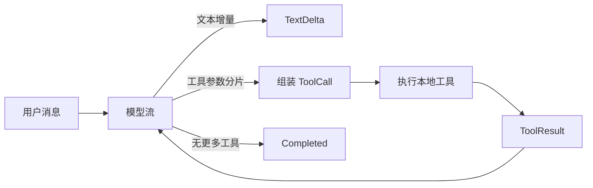

# 普通 Python 与 LangGraph 工具 Agent 实现复杂度评估

评估日期：2026-07-20
模型：`qwen-plus`
接口：阿里云百炼 OpenAI 兼容接口
Python：3.12.13

## 1. 评估范围与可支持结论

> 本报告只比较普通 Python 与 LangGraph 两个实现。它没有实现或测量 OpenAI Agents SDK、Anthropic tool runner 等供应商 Agent Runtime，因此**不能作为三方案最终选型依据**。主持编排的最终路线目前未决定，后续实验见 [`THREE_WAY_EVALUATION_PLAN.md`](./THREE_WAY_EVALUATION_PLAN.md)。

两条路线都能实现真正的流式输出和工具调用，功能上没有“普通 Python 不能流式”的差异。工具 Agent 的流式输出不能只转发文本 token：模型可能先流出工具调用参数，应用需要执行工具，再进行下一轮模型调用。因此，两种实现都应向上层输出结构化事件，而不是单一字符串流。

本次重构后，LangGraph 生态实现明显减少了本地编排代码，但增加了依赖数量和框架抽象：

- 普通 Python 在本实验中更便于直接观察协议和验证底层行为；
- LangChain `create_agent` 在本实验中减少了工具 schema 与循环样板代码，并提供状态持久化、中断恢复、人工审批和中间件等扩展入口；
- 在真实模型调用中，网络与模型生成占主导，框架耗时不应成为当前选型的主要因素；
- 两个项目可分别保留为协议原理基线和图运行时基线，但这些事实不等于当前项目应该选择其中一个。

## 2. 公平比较边界

两个实现是独立项目，各自在单独虚拟环境安装，且不存在交叉导入。它们拥有相同的能力边界：

- 同一类业务无关系统提示词；
- `add_numbers(a, b)` 与 `get_current_time(timezone_name)` 两个通用工具；
- Qwen `qwen-plus`；
- 文本增量、工具调用、工具结果、完成四类结构化事件；
- 模型—工具—模型的两轮调用；
- 独立 CLI 与不消耗 API 配额的离线测试。

两边刻意各自实现配置读取和工具函数，避免用共享模块降低统计数字或制造隐藏耦合。

## 3. 实现方式

### 3.1 普通 Python

普通实现直接使用 OpenAI Python SDK，显式负责：

1. 维护 `system`、`user`、`assistant`、`tool` 消息；
2. 把工具 JSON Schema 发给模型；
3. 合并流式响应中按 index 分片的工具 ID、名称和 JSON 参数；
4. 解析、查找并执行工具；
5. 把成功或失败结果放回消息历史；
6. 再次调用模型并判断是否结束；
7. 累加 token usage，并用最大轮数阻止无限循环。

### 3.2 LangGraph 生态

LangGraph 实现采用当前 LangChain 高层 API：

```python
def build_agent(model):
    return create_agent(model=model, tools=TOOLS, system_prompt=SYSTEM_PROMPT)
```

工具使用 `@tool` 声明。`create_agent` 自动完成 Schema 生成、消息维护、工具执行和循环路由，其 Agent 运行时建立在 LangGraph 上。项目没有使用已弃用的 `langgraph.prebuilt.create_react_agent`。

该项目仍有一个流适配器，把 LangGraph 的 `messages` 与 `updates` 两种原生流转换为教学事件。这个适配器解决的是应用输出协议，不是 Agent 的决策编排。

## 4. 静态复杂度数据

统计规则：生产目录 `src/` 下排除空行和 `#` 注释的物理行；docstring 计入代码行。圈复杂度使用 Radon 6.0.1。

| 指标 | 普通 Python | LangGraph 生态 | 解释 |
| --- | ---: | ---: | --- |
| 全部生产代码 SLOC | 324 | 201 | LangGraph 少 123 行，约 38.0% |
| `agent.py` SLOC | 163 | 92 | 包含两边一致的事件适配层 |
| `tools.py` SLOC | 71 | 23 | `@tool` 省去手写 Schema/注册类型 |
| `agent.py + tools.py` SLOC | 234 | 115 | Agent 与工具主体少 119 行，约 50.9% |
| 核心创建 Agent | 显式循环 | `create_agent(...)` 1 个返回语句 | 框架隐藏了循环实现 |
| 最复杂方法圈复杂度 | `astream`: D (23) | `astream`: C (12) | LangGraph 的 12 来自流事件适配 |
| Agent/工具代码平均圈复杂度 | A (4.15) | A (3.64) | 两边总体均可维护 |

逐文件 SLOC：

| 文件职责 | 普通 Python | LangGraph 生态 |
| --- | ---: | ---: |
| 配置 | 42 | 42 |
| 工具 | 71 | 23 |
| Agent 与事件 | 163 | 92 |
| CLI | 39 | 35 |
| 包导出 | 9 | 9 |

需要注意：LangGraph 的较低本地复杂度并不表示复杂度消失，而是把经过通用化和测试的循环逻辑放进框架依赖。调试时需要理解 LangChain 消息类型、LangGraph 节点更新和框架版本行为。

## 5. 依赖与安装体积

两个全新虚拟环境均从各自 `pyproject.toml` 安装。安装包数量排除了 `pip` 和本地示例包，但包含传递依赖；体积为整个虚拟环境的 `du` 结果，会受 Python/文件系统影响，仅用于同机相对比较。

| 指标 | 普通 Python | LangGraph 生态 |
| --- | ---: | ---: |
| 直接依赖 | 1 | 3 |
| 安装后的第三方 distribution | 16 | 42 |
| 虚拟环境体积 | 46.6 MiB | 81.8 MiB |
| 核心版本 | `openai 2.46.0` | `langchain 1.3.14`、`langchain-openai 1.3.5`、`langgraph 1.2.9` |

普通 Python 在供应链、升级面和冷启动导入方面更轻；LangGraph 用这些额外依赖换取现成的 Agent 运行时和后续生态能力。

## 6. 真实 Qwen 工具调用结果

### 6.1 加法工具三轮端到端计时

每次运行都是新的 CLI 进程，包含依赖导入、第一次模型决定调用工具、本地执行工具、第二次模型生成答案。两组按“普通 Python 三次，然后 LangGraph 三次”的顺序执行，没有并发。

| 实现 | 三次耗时（秒） | 均值 | 中位数 |
| --- | --- | ---: | ---: |
| 普通 Python | 2.49、2.58、2.39 | 2.49 | 2.49 |
| LangGraph 生态 | 3.02、3.40、2.99 | 3.14 | 3.02 |

两边三轮均产生同样的可观察流程：

```text
[tool call] add_numbers({"a": 23.5, "b": 18.25})
[tool result] {"sum": 41.75}
The sum of 23.5 and 18.25 is 41.75.
[done] rounds=2
```

普通 Python 的本批次均值低约 0.65 秒，但样本只有三次，且测量包含公网、服务排队、模型推理和进程冷启动，也没有交替随机化执行顺序。因此，该数字不能被解释为 LangGraph 的纯编排开销。它只说明在本机本次完整工作流中，两者处于同一个秒级区间，尚未出现足以压倒维护成本的性能差异。

### 6.2 时间工具冒烟验证

两个项目还分别真实调用了：

```text
get_current_time({"timezone_name": "Asia/Shanghai"})
```

两边都收到带 `+08:00` 时区偏移的 ISO-8601 工具结果，并在第二轮模型调用中生成最终自然语言回答。这证明示例不是针对固定加法结果写死的单一演示。

## 7. 流式输出为何需要结构调整

普通聊天可以把每个文本 token 直接写给客户端；工具 Agent 至少包含以下不同语义：



如果把工具参数片段当普通文本输出，用户会看到不完整 JSON；如果只输出最终文本，又失去工具执行进度、错误和审计信息。因此，本示例统一采用四类事件：

- `TextDelta`：可直接呈现的模型文本；
- `ToolCall`：已经组装并解析的工具名与参数；
- `ToolResult`：工具成功或失败结果；
- `Completed`：Agent 循环结束及可用统计。

实际系统可在此基础上增加 `run_id`、`sequence`、节点名、时间戳、可见性级别与持久化偏移，而不应把上游协议限定为 `AsyncIterator[str]`。

## 8. 扩展成本对比

| 变化 | 普通 Python | LangGraph 生态 |
| --- | --- | --- |
| 新增一个普通工具 | 写函数、JSON Schema、注册项和测试 | 写一个带类型注解/docstring 的 `@tool` 函数，加入工具列表 |
| 工具参数校验 | 自己实现或再引入校验库 | 由类型 Schema 与框架完成基础解析 |
| 工具调用流式拼接 | 自己维护 index、ID、名称和参数缓冲区 | 模型集成与框架消息对象处理 |
| 最大循环/停止条件 | 自己设计和测试 | Agent 运行时提供递归/循环限制机制 |
| 会话持久化/恢复 | 自己设计存储与状态机 | 可接 LangGraph checkpointer |
| 人工审批工具 | 自己引入暂停、恢复协议 | 可使用 LangGraph interrupt/中间件能力 |
| 自定义非标准流程 | 直接修改循环，控制最强 | 可下沉到自定义 StateGraph，但框架知识成本上升 |
| 升级风险 | SDK 协议变化面较小 | LangChain/LangGraph 多包版本需要联动验证 |

## 9. 本实验能与不能支持的判断

本实验能支持：

1. 不能以“能否流式输出”作为普通 Python 与 LangGraph 的二选一条件，两者都可以；
2. 无论使用哪种 runtime，都应先定义稳定的结构化流事件协议，将前端/SSE/WebSocket 与内部框架解耦；
3. 普通 Python 在依赖和显式控制方面更轻，LangGraph 在工具 schema、循环和扩展能力方面减少了本地代码；
4. 本次三次真实调用不足以分离公网、模型和框架耗时，不能将 0.65 秒均值差写成纯编排差异。

本实验不能支持：

1. 当前 TRPG 项目应该继续普通 Python；
2. 当前 TRPG 项目应该改用 LangGraph；
3. 供应商 Agent Runtime 是否能以更少代码满足相同需求；
4. 当前项目是否真实需要模型工具调用、多轮工具调用、审核 Agent 或 fan-out/fan-in；
5. Qwen 的 OpenAI-compatible Chat Completions 接口是否兼容某个供应商 Agent Runtime。

三方案最终判断必须先完成项目工具需求审计，再按 [`THREE_WAY_EVALUATION_PLAN.md`](./THREE_WAY_EVALUATION_PLAN.md) 补齐供应商 Runtime 和多轮/失败场景数据。

## 10. 复现命令

普通 Python：

```bash
cd experiments/plain-python-tool-agent
python3 -m venv .venv
.venv/bin/pip install -e .
.venv/bin/python -m unittest discover -s tests -v
.venv/bin/plain-tool-agent
```

LangGraph：

```bash
cd experiments/langgraph-tool-agent
python3 -m venv .venv
.venv/bin/pip install -e .
.venv/bin/python -m unittest discover -s tests -v
.venv/bin/langgraph-tool-agent
```

真实运行会从当前目录或源码父目录向上读取最近的 `.env`，但不会输出或复制密钥。离线测试使用假模型。

## 11. API 依据

- [LangChain Agents](https://docs.langchain.com/oss/python/langchain/agents)：`create_agent`、工具循环与 LangGraph 运行时。
- [LangGraph v1 release](https://docs.langchain.com/oss/python/releases/langgraph-v1)：`create_react_agent` 弃用与 `create_agent` 推荐迁移路线。
- [LangChain Streaming](https://docs.langchain.com/oss/python/langchain/streaming)：`updates`、`messages` 与自定义流模式。
- [Qwen Function Calling](https://help.aliyun.com/en/model-studio/qwen-function-calling)：Qwen 工具定义、工具结果回传与二次调用流程。
- [Qwen Streaming](https://help.aliyun.com/en/model-studio/stream)：OpenAI 兼容接口的 `stream=true` 与 usage 流式返回方式。
