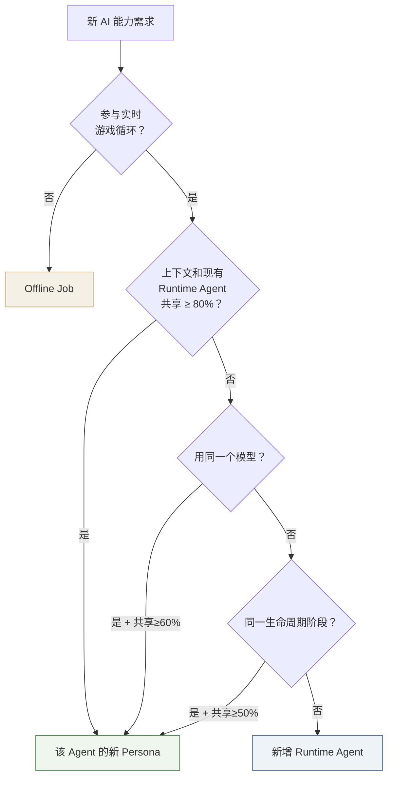
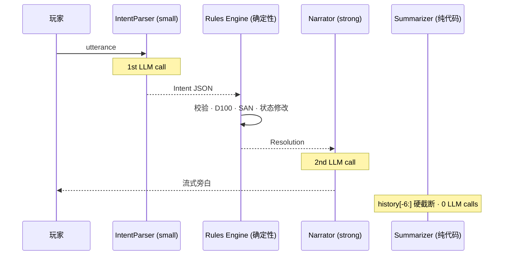

# Agent 设计文档

> 日期：2026-07-13
> 前置契约：Intent / Resolution / PlayerView / GameState / ModulePack / EventLogEntry
> 原则：**Agent 数量由上下文边界决定，不由功能数量决定。确定性的归代码，叙事表达的归 AI。**

---

## 一、架构全景

```
                         ┌─────────────────────────────┐
                         │       AI Runtime Platform     │
                         │                               │
  玩家 utterance          │  ┌─────────────────────────┐ │
  ───────────────────────▶│  │ IntentParser             │ │
                         │  │ small model · 同步调用     │ │
                         │  └───────────┬─────────────┘ │
                         │              │ Intent JSON    │
                         │              ▼                │
                         │  ┌─────────────────────────┐ │
                         │  │ Rules Engine (确定性代码)  │ │
                         │  │ D100 · SAN · 状态修改     │ │
                         │  └───────────┬─────────────┘ │
                         │              │ Resolution     │
                         │              ▼                │
                         │  ┌─────────────────────────┐ │
                         │  │ Narrator                 │ │
                         │  │ strong model · 流式调用   │ │
                         │  │                          │ │
                         │  │  Persona:                │ │
                         │  │   narrator  P0 · 场景描写  │ │
                         │  │   npc:{id}  V2 · NPC对话  │ │
                         │  │   hint      V2 · 隐晦提示  │ │
                         │  └───────────┬─────────────┘ │
                         │              │ 流式文本        │
                         │              ▼                │
                         │  ┌─────────────────────────┐ │
                         │  │ Summarizer               │ │
                         │  │ MVP:纯代码 / V3:small     │ │
                         │  │ 按需触发 · Token预算管理   │ │
                         │  └─────────────────────────┘ │
                         └─────────────────────────────┘

                         ┌─────────────────────────────┐
                         │     Future Runtime Agent     │
                         │  RuleQA  V2 · small model    │
                         │  规则问答 · RAG检索           │
                         └─────────────────────────────┘

                         ┌─────────────────────────────┐
                         │       Offline Jobs           │
                         │  ModuleParser  V3 · PDF→JSON │
                         │  ReplayWriter  V3 · 叙事复盘  │
                         └─────────────────────────────┘
```

**3 个 Runtime Agent。3 个 Persona（归 Narrator 管理）。1 个 Future Agent。2 个 Offline Job。**

---

## 二、分类判据

新能力是独立 Agent、Persona 还是 Offline Job？

```
Q1  参与实时游戏循环吗？            → 否 = Offline Job
Q2  上下文和现有 Agent 共享 ≥ 80%？ → 是 = 该 Agent 的 Persona
Q3  用同一个模型吗？               → 是 + Q2≥60% = Persona
Q4  同一生命周期阶段被调用？        → 是 + Q2≥50% = Persona

四个都否 → 新增独立 Runtime Agent。
```



**实例**: "TensionTracker — 游戏紧张时调整旁白节奏" → 在线 + 上下文与 Narrator 100% 共享 → Narrator 的新 Persona，不是新 Agent。

---

## 三、Runtime Agent

### 3.1 IntentParser

**Context Boundary**: utterance + PlayerView + SceneContext + history → Intent JSON

与 Narrator 上下文完全不重叠（`utterance → JSON` vs `Resolution → 文本流`），模型不同（small vs strong），生命周期不同（turn 开始 vs turn 结束）。

| | 字段 | 类型 | 说明 |
|---|---|---|---|
| **输入** | `utterance` | `str` | 玩家原始自然语言 |
| | `playerView` | `PlayerView` | 当前玩家视角（只读） |
| | `sceneContext` | `SceneContext` | 当前场景 |
| | `history` | `TurnRecord[]` | 最近 N 轮 |
| **输出** | `intent` | `Intent` | 结构化游戏动作 |

| 参数 | 值 |
|------|-----|
| 模型 | small（DeepSeek-V3 / Claude Haiku） |
| 调用 | 同步（Intent 必须完整返回后校验） |
| 降级 | 关键词匹配 + 场景可交互列表菜单 |
| Persona | 无 |
| MVP | ✅ |

---

### 3.2 Narrator

**Context Boundary**: Resolution + PlayerView + SceneContext → 流式文本

NPCDialogist 和 HintProvider 与 Narrator 共享 80-90% 上下文、同一模型、同一输出格式——因此是 Persona，不是独立 Agent。

| | 字段 | 类型 | 说明 |
|---|---|---|---|
| **输入** | `resolution` | `Resolution \| None` | 引擎裁决。hint 时可为 None |
| | `playerView` | `PlayerView` | 当前玩家视角（只读） |
| | `persona` | `str` | 人格标识 |
| | `sceneContext` | `SceneContext` | 当前场景 |
| **输出** | `stream` | `AsyncIterator[str]` | 流式文本 |

| 参数 | 值 |
|------|-----|
| 模型 | strong（Claude Sonnet / Opus） |
| 调用 | 流式 |
| 降级 | 预设文本模板（按 persona 不同） |
| MVP | ✅ |

**Persona 清单**:

| Persona | 阶段 | 职责 | Context Engine 额外注入 | 降级 |
|---------|------|------|------------------------|------|
| `narrator` | P0 ✅ | 场景描写、检定叙事、氛围渲染 | 无 | "守秘人沉思中……" |
| `npc:{id}` | V2 | 扮演 NPC 与玩家对话 | `Entity.publicPersona` `ai_private.npc_mood` | NPC 预设对话树 |
| `hint` | V2 | 玩家卡关时隐晦提示 | `undiscoveredInteractables` `unknownStreak` | "也许你可以仔细看看周围……" |

新增 Persona = 新 Prompt 模板 + Context Engine 注入规则。不新建模块，不改 `execute()`。

---

### 3.3 Summarizer

**Context Boundary**: TurnRecord[] → 压缩摘要。不涉及游戏状态，纯文本处理。

与 IntentParser / Narrator 上下文完全不重叠。被 Context Engine 透明调用（对上层不可见）。

| | 字段 | 类型 | 说明 |
|---|---|---|---|
| **输入** | `history` | `TurnRecord[]` | 对话历史 |
| | `maxTokens` | `int` | 目标摘要长度 |
| **输出** | `summary` | `str` | 压缩后的叙事摘要 |

| 参数 | 值 |
|------|-----|
| 模型 | MVP: 无（硬截断）。V3: small |
| 调用 | 同步 |
| 降级 | 硬截断 |
| Persona | 无 |
| MVP | ✅（纯代码，不调 LLM） |

---

## 四、Future Runtime Agent

### 4.1 RuleQA（V2）

**Context Boundary**: 规则问题 + RAG 检索段落 → 事实性回答（带出处）

与 Narrator 上下文 0% 共享、模型不同（small vs strong）、输出性质不同（事实性回答 vs 沉浸式叙事）。强行作为 Persona 会导致强模型收到不必要的 RAG 段落（浪费 token）、模型路由逻辑复杂化。

| | 字段 | 类型 | 说明 |
|---|---|---|---|
| **输入** | `query` | `str` | 玩家的规则问题 |
| | `passages` | `RulePassage[]` | RAG 检索到的段落 |
| | `worldId` | `WorldId` | 规则系统标识 |
| **输出** | `answer` | `str` | 规则解释（带出处） |

| 参数 | 值 |
|------|-----|
| 模型 | small（DeepSeek-V3 / Claude Haiku） |
| 调用 | 同步 |
| 降级 | 返回原文段落 |
| Persona | 无 |
| MVP | ❌ |
| V2 | ✅ |

---

## 五、Offline Job

### 5.1 ModuleParser（V3）

不参与游戏循环。一次性运行，失败不影响运行中的游戏。复用 Platform 的 Model Gateway。

| | 字段 | 类型 | 说明 |
|---|---|---|---|
| **输入** | `rawText` | `str` | PDF/文档提取文本 |
| | `worldHooks` | `HookDef[]` | 规则系统 hook 清单 |
| | `skillCatalog` | `SkillDef[]` | 合法技能列表 |
| | `schema` | `JSON Schema` | 输出结构约束 |
| **输出** | `modulePack` | `ModulePack` | 结构化剧本包 |
| | `warnings` | `str[]` | 未解析段落（人工审核） |
| | `confidence` | `float` | 整体解析置信度 |

| 参数 | 值 |
|------|-----|
| 模型 | strong + 大上下文（Claude Opus 200K） |
| 降级 | 人工手动输入 JSON |
| V3 | ✅ |

### 5.2 ReplayWriter（V3）

游戏结束后一次性运行。不需要实时性。

| | Summarizer | ReplayWriter |
|---|---|---|
| 目的 | 压缩历史 → 给 LLM 看 | 重组历史 → 给人读 |
| 输入 | TurnRecord[] | EventLogEntry[] + Character[] + ModulePack.meta |
| 输出 | 压缩摘要 | 故事性复盘（分章节） |
| 读者 | LLM | 玩家 |

| | 字段 | 类型 | 说明 |
|---|---|---|---|
| **输入** | `eventLog` | `EventLogEntry[]` | 完整事件序列 |
| | `characters` | `Character[]` | 参与玩家角色卡 |
| | `moduleMeta` | `ModulePack.meta` | 模组信息 |
| | `winCondition` | `WinCondition` | 触发的结局 |
| **输出** | `replay` | `str` | 故事性复盘文本 |

| 参数 | 值 |
|------|-----|
| 模型 | strong（Claude Sonnet） |
| 降级 | 事件时间线纯文本 |
| V3 | ✅ |

---

## 六、MVP Runtime

每次 turn **2 次 LLM 调用**：



**2 次 LLM。2 个 Agent。1 个 Persona（narrator）。0 个 Offline Job。**

---

## 七、模型访问权限矩阵

```
                       IntentParser   Narrator     Summarizer   RuleQA      ModuleParser   ReplayWriter
                       (Runtime)      (Runtime)    (Runtime)    (V2)        (Offline)      (Offline)
                       ────────────   ──────────   ──────────   ─────────   ────────────   ────────────
utterance                 ✅             —            —           ✅            —              —
Resolution                —            ✅             —            —            —              —
  .narration_context      —            ✅             —            —            —              —
  .ai_private             —            ✅             —            —            —              —
  .state_changes          —             禁           禁           禁           禁             禁
PlayerView                ✅            ✅             —            —            —              —
SceneContext              ✅            ✅             —            —            —              —
TurnRecord[]              ✅             —           ✅            —            —             ✅
EventLogEntry[]           —             —           ✅            —            —             ✅
World.skillCatalog        ✅             —            —           ✅           ✅              —
Entity.publicPersona      —           npc:*时注入      —            —            —              —
Entity.secrets             禁           禁           禁           禁           禁            ⚠条件
GameState                  禁           禁           禁           禁           禁             禁
Room.entity_states         禁           禁           禁           禁           禁             禁

  ✅     = 允许访问
  禁     = 类型级禁止（函数签名不接受该类型）
  —      = 不需要此数据
  ⚠条件  = 仅当 WinCondition.reveal_on_ending == true

Persona 不影响权限。Narrator 的所有 Persona 共享同一组权限。
Entity.publicPersona 的注入由 Context Engine 根据 persona 自动触发，不是 Narrator 自己读取。
```

---

## 八、演进路线

```
MVP (2周)              V2 (3-6周)                 V3 (7-8周+)

IntentParser           IntentParser                IntentParser
  LLM + 关键词兜底        + 脱本导回                  + 多意图消歧

Narrator               Narrator                    Narrator
  persona: narrator      + persona: npc:{id}         + 风格一致性追踪
                         + persona: hint

Summarizer             Summarizer                  Summarizer
  history[-6:] 硬截断     规则合并（纯代码）            LLM 智能摘要

—                      RuleQA                      RuleQA
                         RAG检索 + small模型          + 多规则系统

—                      —                           ModuleParser
                                                     PDF → JSON + 人工审核

—                      —                           ReplayWriter
                                                     叙事性复盘
```

---

*新增能力时：先问它和现有 Agent 共享多少上下文。≥ 80% → Persona。≤ 20% + 在线 → 独立 Agent。离线 → Offline Job。*
