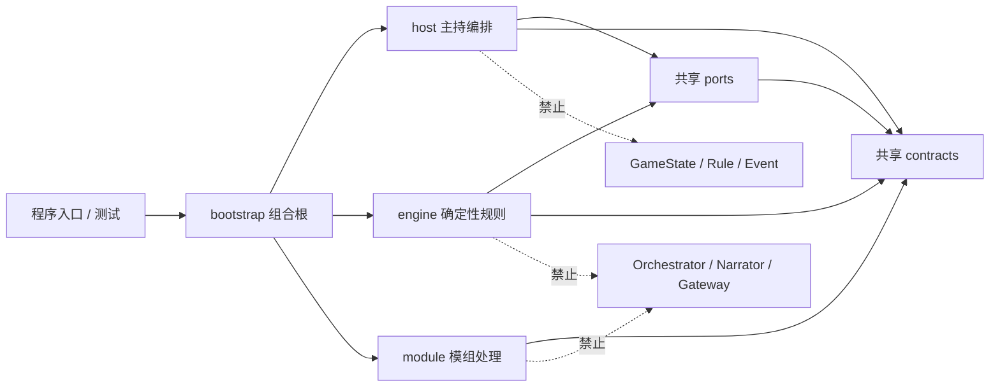
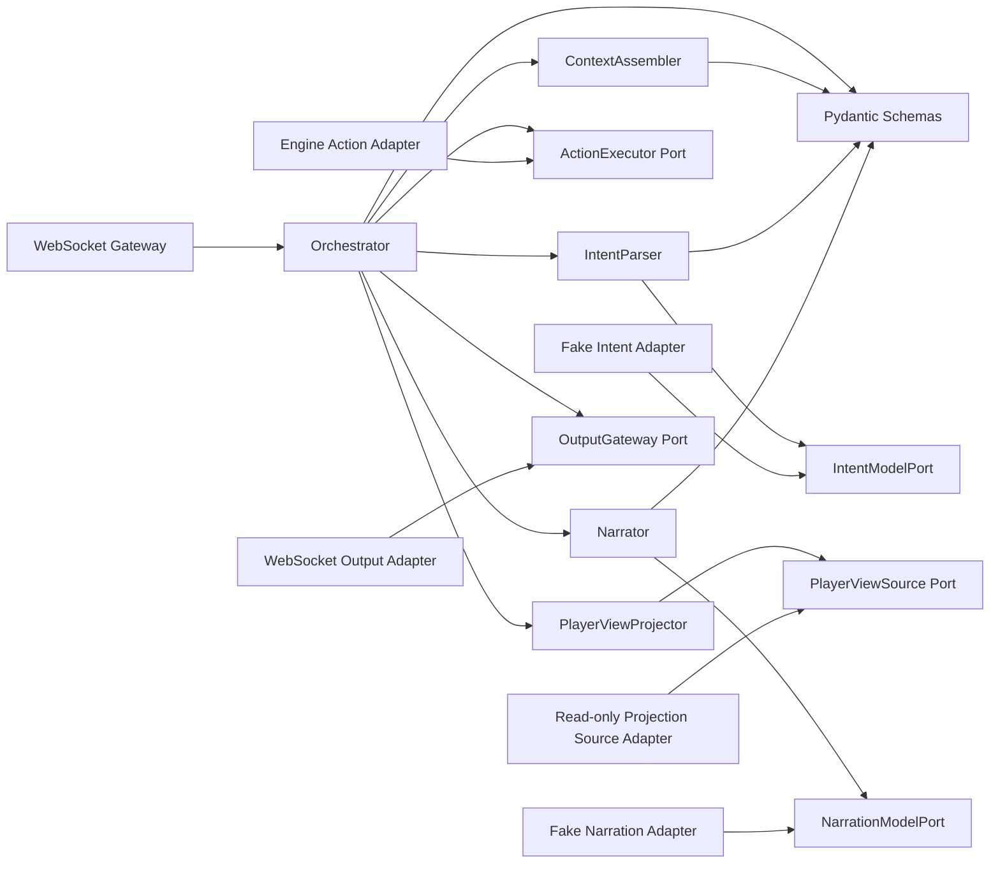
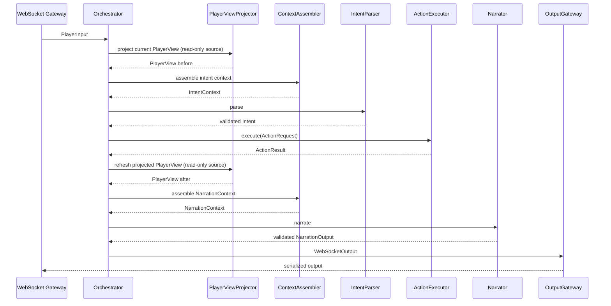

# 主持编排、规则引擎与模组 Agent 架构对齐提案

> 状态：Proposal（等待 A/B/C 三方确认）
>
> 关联 Issue：[#68](https://github.com/1024XEngineer/TRPG-master/issues/68)
>
> 参考 Issue：[#48](https://github.com/1024XEngineer/TRPG-master/issues/48)
>
> 参考实现分支：[`agent-collaboration-framework`](https://github.com/1024XEngineer/TRPG-master/tree/agent-collaboration-framework/agent-collaboration-framework)
>
> 文档范围：只确定工程骨架、职责、依赖和数据契约，不实现业务逻辑

## 1. 结论摘要

这次不建议把主持编排代码直接复制进现有扁平文件，也不建议把独立 `components/` 作为长期方案。更稳妥的做法是：

1. **现在对齐跨成员边界**：先确定 `Intent`、`ActionRequest`、`ActionResult`、`PlayerView`、`ActionExecutor` 和依赖方向；
2. **保留成员内部自治**：A、B、C 只需要遵守共享契约，不需要使用相同的内部类和实现方式；
3. **采用模块化单体**：第一阶段放在同一个 Python 工程，但按 `host`、`engine`、`module`、`contracts`、`ports`、`bootstrap` 分区；
4. **先文档和空骨架，后迁移实现**：不在一次 PR 中同时改目录、改契约、迁移逻辑和接入真实模型；
5. **主持编排只编排，不裁定**：所有通过输入与 Intent 校验的玩家行动都通过 `ActionExecutor.execute()` 进入确定性规则边界；
6. **状态命令与只读投影分开**：`execute()` 是主持编排层唯一可以发出的游戏状态命令；PlayerView 刷新只能走只读投影接口，不能修改状态；
7. **MVP 保持框架无关**：使用普通 Python async Orchestrator，不引入 LangGraph、真实模型、Prompt 或真实规则引擎。

这里的“现在对齐”并不等于现在完成三人代码集成。现在只对齐**会影响别人的部分**；成员自己的目录内部、Fake 写法和未来适配器可以在契约稳定后分别推进。

## 2. 背景与问题定义

主持编排 Agent 原本已经形成一套以 `orchestrator`、`intent_parser`、`narrator`、`player_view`、`schemas`、`ports`、`adapters` 和 `gateway` 为核心的骨架。协作分支为了三人联调，又建立了 `contracts.py`、`workflow.py`、`routing.py`、`agents/`、`engine/`、`modules/` 等结构。

两套结构的目标并不冲突：

- 主持编排骨架强调长期职责边界和可替换端口；
- 协作分支强调尽快完成一个 A/B/C 可运行的纵向 Fake Demo。

真正的冲突发生在两套结构对同一个跨成员概念给出了不同答案，例如：

- 纯叙事动作是否可以绕过规则引擎；
- `Intent` 是否应该包含检定、技能和 Checkpoint 建议；
- `ActionResult` 是否可以向主持编排暴露 Event 与 StateChange；
- PlayerView 的所有权、可见性计算和刷新接口归谁；
- Pydantic 校验位于模型适配器还是应用层；
- 所有 Pydantic 模型是否都应该放在一个共享文件；
- Fake Engine 是某位成员的临时实现，还是跨模块契约测试资产。

这些问题无论早晚都必须对齐。差别只在于：现在以较低成本对齐接口，还是等三份实现互相引用后再以较高成本拆解。

## 3. 范围与非目标

### 3.1 本提案负责确定

- A/B/C 三方的职责和所有权；
- 目标目录结构；
- 核心模块的边界；
- 单向依赖关系；
- Pydantic Schema 的结构和归属；
- Port 的稳定方法签名；
- Fake 与测试的归属；
- 从当前协作分支迁移到目标结构的顺序。

### 3.2 本提案不做

- 不实现 Rule、Hook、Checkpoint、Dice 或结局判断；
- 不实现或修改真实 `GameState`；
- 不写入真实 Event；
- 不调用真实规则引擎；
- 不调用 OpenAI 或其他真实模型；
- 不写 Prompt；
- 不引入 LangGraph；
- 不设计 checkpoint、interrupt、resume 或多阶段 Action；
- 不完成生产 WebSocket、数据库或事务接入；
- 不要求在本次文档 PR 中移动协作分支的现有代码。

## 4. 对当前协作分支的中立评估

以下结论基于 `agent-collaboration-framework` 分支当前结构。评价标准不是“更像谁的版本”，而是职责是否明确、依赖是否稳定、是否允许三人并行开发。

| 当前设计 | 价值 | 风险或冲突 | 建议 |
|---|---|---|---|
| [`workflow.py`](https://github.com/1024XEngineer/TRPG-master/blob/agent-collaboration-framework/agent-collaboration-framework/collaboration_framework/workflow.py) 使用普通 async 函数 | 符合 MVP 复杂度，容易调试和测试 | 无原则性冲突 | 保留；LangGraph 争议视为已解决 |
| [`routing.py`](https://github.com/1024XEngineer/TRPG-master/blob/agent-collaboration-framework/agent-collaboration-framework/collaboration_framework/routing.py) 区分 narrative 与 engine 路由 | 能快速演示对话不掷骰 | 主持编排层因此拥有“是否进入引擎”的裁定权；与“所有有效行动统一调用 `execute()`”冲突 | 删除跨引擎路由；由引擎返回 `direct`、`check`、`blocked` 或 `unrecognized` |
| [`contracts.py`](https://github.com/1024XEngineer/TRPG-master/blob/agent-collaboration-framework/agent-collaboration-framework/collaboration_framework/contracts.py) 集中所有模型 | 初期查看方便，能快速导出 Schema | 混合 A 内部 DTO、A/B 契约、B 内部状态与 B/C 模组契约；任何成员修改都可能影响全部人 | 按所有权拆分，不按“是不是 Pydantic”集中 |
| `Intent` 包含 `execution`、`check`、`checkpoint_id`、`proposed_skills` | Fake Demo 可以直接驱动引擎 | 模型提议渗入规则裁定；B 无法保证权威性，A 也承担了不属于自己的规则语义 | 公开 Intent 只表达玩家语义；执行细节由 B 决定 |
| `MatchedTarget` / `UnmatchedTarget` | 明确表达匹配成功与失败，比多个可空字段稳定 | 无原则性冲突 | 保留，并允许 `target = null` 表示动作本身没有目标 |
| [`FakeAtomicEngine`](https://github.com/1024XEngineer/TRPG-master/blob/agent-collaboration-framework/agent-collaboration-framework/collaboration_framework/engine/atomic.py) 可以修改内存状态并产生事件 | 对纵向集成和契约回归非常有价值 | 如果放在主持编排目录，会让 A 看起来拥有状态修改能力 | 保留，但归 B 或 `tests/integration/fakes/` 所有；A 只看 `ActionExecutor` |
| [`runtime_host.py`](https://github.com/1024XEngineer/TRPG-master/blob/agent-collaboration-framework/agent-collaboration-framework/collaboration_framework/agents/runtime_host.py) 已有真实模型适配、Prompt 与降级逻辑 | 证明未来可接模型 | 早于骨架和接口稳定；真实模型依赖进入核心工程后会增加安装与测试耦合 | 后移到 A 的 `adapters/model/`，MVP 骨架只提供 Fake |
| `SummaryOutbox` 进入回合主流程 | 为后续摘要或异步处理留出扩展点 | 当前目标没有摘要需求，过早增加每回合协议和失败路径 | 从 MVP 必经流程移除；以后作为 turn-completed observer 接入 |
| [`tests/test_workflow.py`](https://github.com/1024XEngineer/TRPG-master/blob/agent-collaboration-framework/agent-collaboration-framework/tests/test_workflow.py) 跑通纵向 Fake 流程 | 能提前发现接口不一致 | 测试目前也固化了 narrative 绕过引擎等待定策略 | 保留测试思路，待契约确认后改写预期 |

结论是：**现有协作分支不应该被整体推翻。** 普通 async 工作流、目标联合类型、功能型 Fake Engine 和纵向集成测试都值得保留。需要调整的是跨成员边界，而不是为了目录整齐重写已经有价值的测试资产。

## 5. 为什么不把 `components/` 作为长期方案

### 5.1 三种方案比较

评分使用 1—5，分数越高越有利。

| 评价维度 | A. 先把主持编排完整放入 `components/` | B. 直接塞入当前协作分支的现有文件 | C. 先对齐契约，再按模块化单体集成 |
|---|---:|---:|---:|
| 成员 A 的短期开发自由 | 5 | 2 | 4 |
| 三方边界清晰度 | 2 | 2 | 5 |
| 近期冲突数量 | 4 | 1 | 4 |
| 后期重复模型与重复入口风险 | 1 | 2 | 5 |
| 可独立测试 | 4 | 3 | 5 |
| 最终迁移成本 | 1 | 2 | 4 |
| 适合作为长期结构 | 2 | 2 | 5 |

### 5.2 `components/` 什么时候有价值

`components/` 不是错误方案。它适合以下情形：

- 团队还没有任何共同接口，A 需要先验证一个可丢弃的 spike；
- B/C 正在快速重写，暂时无法承诺任何契约；
- 代码不会进入集成分支，且明确设置了删除日期；
- 需要隔离未知依赖，防止污染当前可运行 Demo。

### 5.3 当前为什么不应继续延后全部对齐

现在协作分支已经存在 `PlayerInput`、`Intent`、`ActionResult`、`workflow` 和 Fake Engine。继续把 A 的完整版本放进 `components/` 会产生两套同名概念和两套回合入口。它确实能减少今天的 merge conflict，却不会减少架构冲突，只会把冲突推迟到双方都写了更多代码以后。

因此建议修正为：

- **现在对齐共享契约和依赖方向；**
- **暂不对齐成员模块内部实现；**
- 如果某个争议暂时无法决定，只隔离那个适配器或实验，不隔离整个主持编排层；
- A 内部模块由 A 直接采用自己的结构；涉及 B/C 的 Schema 和 Port 通过 Issue/PR 共同评审。

## 6. 推荐的目标目录结构

```text
agent-collaboration-framework/
├── pyproject.toml
├── collaboration_framework/
│   ├── contracts/
│   │   ├── common.py
│   │   ├── runtime.py
│   │   ├── action.py
│   │   ├── player_view.py
│   │   └── module.py
│   ├── ports/
│   │   ├── action_executor.py
│   │   └── player_view_source.py
│   ├── host/
│   │   ├── application/
│   │   │   ├── orchestrator.py
│   │   │   ├── context_assembler.py
│   │   │   ├── intent_parser.py
│   │   │   ├── narrator.py
│   │   │   └── player_view_projector.py
│   │   ├── schemas/
│   │   │   ├── narration.py
│   │   │   ├── turn.py
│   │   │   └── websocket.py
│   │   ├── ports/
│   │   │   ├── intent_model.py
│   │   │   ├── narration_model.py
│   │   │   └── output_gateway.py
│   │   ├── adapters/
│   │   │   ├── fake/
│   │   │   └── model/
│   │   └── gateway/
│   │       └── websocket.py
│   ├── engine/
│   │   ├── application/
│   │   ├── domain/
│   │   ├── adapters/
│   │   └── fakes/
│   ├── module/
│   │   ├── application/
│   │   ├── domain/
│   │   ├── adapters/
│   │   └── fakes/
│   └── bootstrap/
│       └── container.py
└── tests/
    ├── contracts/
    ├── host/
    ├── engine/
    ├── module/
    └── integration/
```

目录名表达的是**责任和依赖方向**，不是要求第一天就创建所有文件。MVP 骨架只创建当前流程需要的空模块；`model/`、真实 `gateway`、B/C 业务子目录可以在对应负责人开始实现时再加入。

## 7. 每个目录为什么存在、边界在哪里

### 7.1 `contracts/`

1. **为什么需要**：A/B/C 必须用同一份跨边界数据语言交换输入、意图、动作结果、PlayerView 和模组数据。
2. **如果没有**：每个模块会复制自己的 Pydantic 模型；字段同名但语义不同，直到集成测试才暴露问题。
3. **边界**：只放跨模块稳定数据；不放 Orchestrator、规则算法、数据库模型、Prompt、WebSocket 连接对象或 B 的内部 Event。
4. **谁调用/它调用谁**：A/B/C 都导入它；它最多依赖 Pydantic 和标准库，不导入 A/B/C。
5. **业务还是基础设施**：属于共享领域契约，不是基础设施，也不包含业务执行逻辑。
6. **未来可放**：契约版本、兼容性说明、JSON Schema 导出；不能因为“也是 BaseModel”就放入所有内部 DTO。
7. **迁移 LangGraph 是否修改**：不修改。稳定契约正是让工作流框架可替换的前提。

### 7.2 顶层 `ports/`

1. **为什么需要**：定义 A 与 B 的稳定行为边界，特别是唯一状态命令 `ActionExecutor.execute()` 和 PlayerView 投影需要的只读数据源。
2. **如果没有**：A 会直接 import B 的具体 Engine 类，B 的重构会迫使 A 同步修改。
3. **边界**：只定义跨成员 Protocol/ABC；方法输入输出必须来自 `contracts/`。不包含实现和状态。
4. **谁调用/它调用谁**：host 调用 Port，engine 提供实现，bootstrap 注入实现；ports 只调用/引用 contracts。
5. **业务还是基础设施**：属于应用边界，不是业务算法，也不是具体基础设施。
6. **未来可放**：仅在确有第二个跨成员行为接口时新增；避免把每个内部 helper 都提升为共享 Port。
7. **迁移 LangGraph 是否修改**：通常不修改；LangGraph 节点仍然调用同一 Port。

### 7.3 `host/`

1. **为什么需要**：集中成员 A 的主持编排能力，让“理解—执行—叙事—输出”与规则、模组解析隔离。
2. **如果没有**：主持逻辑会散落在 workflow、gateway、模型适配器和引擎路由中，无法确定谁拥有回合流程。
3. **边界**：可以拥有回合编排状态和玩家输出；不能拥有 Rule、Dice、Checkpoint、GameState 修改或 Event 写入。
4. **谁调用/它调用谁**：gateway/bootstrap 调用 host；host 调用共享 ports、共享 contracts 和自己的内部 ports。
5. **业务还是基础设施**：整体是应用层模块；其 `adapters/` 和 `gateway/` 子目录属于基础设施。
6. **未来可放**：澄清策略、错误映射、观察者通知等编排能力；不放确定性规则。
7. **迁移 LangGraph 是否修改**：只替换或包装 `application/orchestrator.py`；schemas、ports、adapters、gateway 不应因迁移而修改。

### 7.4 `host/application/`

1. **为什么需要**：承载用例顺序和边界转换，而不是外部框架细节。
2. **如果没有**：WebSocket handler 或模型适配器会变成事实上的 Orchestrator，难以离线测试。
3. **边界**：组织步骤、调用 Port、处理验证结果；不执行规则、不连接网络、不写数据库。
4. **谁调用/它调用谁**：gateway 调用 Orchestrator；Orchestrator 调用 ContextAssembler、IntentParser、ActionExecutor、PlayerViewProjector、Narrator 和 OutputGateway。
5. **业务还是基础设施**：应用逻辑。
6. **未来可放**：回合取消、超时策略、可观测事件；复杂状态机只有需求出现后再加入。
7. **迁移 LangGraph 是否修改**：Orchestrator 的实现可能修改，其他用例服务应保持不变并被节点复用。

### 7.5 `host/schemas/`

1. **为什么需要**：A 仍有不应强迫 B/C 依赖的内部 DTO，例如 NarrationContext、NarrationOutput、TurnOutput 和 WebSocketOutput。
2. **如果没有**：这些 A-only 模型会被塞入共享 contracts，使 B/C 被无关字段和版本牵连。
3. **边界**：只放主持编排内部或主持到网关的数据；跨 A/B 的对象必须放顶层 contracts。
4. **谁调用/它调用谁**：host application、adapters 和 gateway 导入；只依赖 contracts/Pydantic，不导入 engine/module。
5. **业务还是基础设施**：内部应用契约；`websocket.py` 是传输 DTO。
6. **未来可放**：澄清输出、流式叙事片段、客户端错误封装。
7. **迁移 LangGraph 是否修改**：不应修改；LangGraph 状态可以引用它们，但不应取代它们。

### 7.6 `host/ports/`

1. **为什么需要**：隔离模型生成和消息输出等 A 自己依赖的外部能力。
2. **如果没有**：IntentParser 会直接调用 PydanticAI/OpenAI，Narrator 会直接操作 WebSocket，离线 Fake 测试变困难。
3. **边界**：A 内部所需的行为接口；跨 A/B 接口仍放顶层 ports。
4. **谁调用/它调用谁**：host application 调用；Fake/真实 adapters 实现；port 的类型依赖 host schemas 或 shared contracts。
5. **业务还是基础设施**：应用边界。
6. **未来可放**：IntentModelPort、NarrationModelPort、OutputGateway、时钟或 ID 生成器；不放业务算法。
7. **迁移 LangGraph 是否修改**：不修改。

### 7.7 `host/adapters/`

1. **为什么需要**：把 Fake、PydanticAI、OpenAI 或其他外部 SDK 限制在边缘。
2. **如果没有**：模型库会成为核心工程硬依赖，Prompt 与编排逻辑混合，测试必须联网。
3. **边界**：实现 host ports；不能决定规则结果，不能修改 GameState。
4. **谁调用/它调用谁**：由 bootstrap 实例化并注入 application；它调用外部 SDK 或本地 Fake。
5. **业务还是基础设施**：基础设施。
6. **未来可放**：真实模型、重试、限流、观测和缓存适配器；MVP 只需 `fake/`。
7. **迁移 LangGraph 是否修改**：不修改。

### 7.8 `host/gateway/`

1. **为什么需要**：隔离 WebSocket 协议、连接生命周期和传输错误。
2. **如果没有**：Orchestrator 会依赖 FastAPI/WebSocket 对象，无法从 CLI、测试或未来其他传输复用。
3. **边界**：把外部消息转换为 PlayerInput，调用 Orchestrator，再发送 WebSocketOutput；不解析意图、不叙事、不执行规则。
4. **谁调用/它调用谁**：服务端入口调用 gateway；gateway 调用 host application 和 OutputGateway。
5. **业务还是基础设施**：入口基础设施。
6. **未来可放**：鉴权上下文映射、连接恢复、流式输出；生产实现延后。
7. **迁移 LangGraph 是否修改**：不修改，只要 Orchestrator 的公开 `run()` 契约不变。

### 7.9 `engine/`

1. **为什么需要**：集中 B 的确定性权威能力，包括规则、检定、状态修改和 Event。
2. **如果没有**：规则逻辑会回流到 host，AI 输出可能直接改变状态。
3. **边界**：实现 ActionExecutor，并管理内部 GameState/Event；不能依赖 host application、Narrator、Prompt 或 WebSocket。
4. **谁调用/它调用谁**：host 只通过共享 Port 间接调用；engine 依赖 ports、contracts 和 B/C 的 module contract。
5. **业务还是基础设施**：核心确定性业务；其数据库/外部存储 adapter 属于基础设施。
6. **未来可放**：Rule、Hook、Checkpoint、Dice、状态仓储、EventLog 和真正的执行器。
7. **迁移 LangGraph 是否修改**：不修改。

### 7.10 `module/`

1. **为什么需要**：集中 C 的模组解析、审查和规范化能力，与运行时主持流程分离。
2. **如果没有**：A 会直接读取模组内部结构，B 会依赖解析 Agent 的临时数据。
3. **边界**：产出和验证 ModuleContent；不处理玩家回合，不生成权威运行时 Event。
4. **谁调用/它调用谁**：导入/审查入口调用 module；B 消费经过确认的 module contracts；A 不直接导入 ModuleContent。
5. **业务还是基础设施**：模组处理业务；文件读取、OCR、模型调用属于其 adapters。
6. **未来可放**：解析、引用检查、秘密标注、版本迁移、人工审核流程。
7. **迁移 LangGraph 是否修改**：运行时主持迁移不影响它；C 自己未来是否用工作流框架是独立决策。

### 7.11 `bootstrap/`

1. **为什么需要**：必须有且只有一个位置知道具体实现，并把 host、engine、module、Fake 或真实 adapters 装配起来。
2. **如果没有**：各模块会自行 new 对方实现，形成隐藏依赖和循环 import。
3. **边界**：只装配，不包含规则、意图解析或叙事逻辑。
4. **谁调用/它调用谁**：程序入口或测试调用 bootstrap；bootstrap 可以依赖所有模块，其他模块不能反向依赖 bootstrap。
5. **业务还是基础设施**：组合根基础设施。
6. **未来可放**：配置选择、Fake/真实实现切换、生命周期管理。
7. **迁移 LangGraph 是否修改**：可能替换注入的 Orchestrator 实现，但不会改变其他模块接口。

### 7.12 `tests/`

1. **为什么需要**：分别验证成员内部行为、共享契约兼容性和纵向流程。
2. **如果没有**：接口只靠文档约定，字段漂移无法及时发现。
3. **边界**：单元测试按所有权分目录；跨模块行为只放 integration。
4. **谁调用/它调用谁**：测试可以通过 bootstrap 组装 Fake；生产代码绝不能反向依赖 tests。
5. **业务还是基础设施**：质量保障。
6. **未来可放**：JSON Schema 快照、契约兼容测试、Fake 纵向回合、网关序列化测试。
7. **迁移 LangGraph 是否修改**：新增少量 Orchestrator 实现测试；契约测试和端口测试不变。

## 8. 主持编排层核心模块

### 8.1 `orchestrator`

- **为什么拆出**：它是单回合用例的唯一流程所有者。
- **负责**：按固定顺序调用步骤、传递强类型数据、处理可预期失败并形成 TurnOutput。
- **不负责**：解析 JSON、决定检定、修改状态、拼 Prompt、发送底层 WebSocket 帧。
- **调用方**：gateway、CLI Fake Demo、集成测试。
- **被调用方**：ContextAssembler、IntentParser、ActionExecutor、PlayerViewProjector、Narrator、OutputGateway。
- **LangGraph 影响**：未来可以把各步骤包装为节点，但保留同一公开 `run(PlayerInput) -> TurnOutput`。

### 8.2 `context_assembler`

- **为什么拆出**：给 IntentParser 的上下文与给 Narrator 的上下文不是同一件事，也不应由模型适配器临时拼接。
- **负责**：将 PlayerInput 与当前 PlayerView 组合为明确的 IntentContext；在执行后组合 NarrationContext。
- **不负责**：读取 GameState、决定可见性、检索秘密模组内容。
- **调用方**：Orchestrator。
- **被调用方**：接收 Orchestrator 已取得的 PlayerView，并执行纯数据转换；它不直接读取权威状态。
- **LangGraph 影响**：不修改，可直接成为节点内部服务。

### 8.3 `intent_parser`

- **为什么拆出**：把“获得 JSON 候选”和“验证为业务可用 Intent”分开。
- **负责**：调用 IntentModelPort、执行 Pydantic 校验、把验证错误映射为明确的解析失败。
- **不负责**：判断需要哪个技能、难度、骰子、Checkpoint 或规则结果。
- **调用方**：Orchestrator。
- **被调用方**：IntentModelPort 和 `Intent` Schema。
- **LangGraph 影响**：不修改。

### 8.4 `narrator`

- **为什么拆出**：叙事生成是规则结果之后的表达阶段，不能与 Intent 解析或引擎执行混合。
- **负责**：调用 NarrationModelPort、校验 NarrationOutput、确保只基于 ActionResult 与刷新后的 PlayerView 表达。
- **不负责**：补充引擎没有确认的事实、宣布未经引擎确认的成功或失败。
- **调用方**：Orchestrator。
- **被调用方**：NarrationModelPort 和 NarrationOutput Schema。
- **LangGraph 影响**：不修改。

### 8.5 `player_view`

- **为什么拆出**：PlayerView 是安全边界，不只是展示 DTO。它阻止主持模型看到不属于当前玩家的秘密和权威内部状态。
- **负责**：A 的 PlayerViewProjector 通过只读 PlayerViewSource 取得与 GameState 解耦的 ProjectionSnapshot，按玩家身份投影为稳定 PlayerView；执行前后分别生成对应 revision。
- **不负责**：修改 GameState；也不允许 A 自行解释 Rule/Checkpoint 来猜测可见性。
- **调用方**：ContextAssembler、Orchestrator、Narrator、WebSocket Output。
- **被调用方**：PlayerViewSource 的只读实现。
- **所有权建议**：A 拥有 PlayerView Schema、PlayerViewProjector 和投影流程；B 提供与 GameState 解耦的 ProjectionSnapshot 数据源，并给每条记录提供稳定的可见范围/观察者信息。未经投影的 snapshot 不能进入 IntentModel 或 NarrationModel。
- **LangGraph 影响**：不修改。

### 8.6 `schemas`

- **为什么拆出**：Pydantic 模型承担边界校验，但“模型放在哪里”应按所有权决定。
- **负责**：顶层 contracts 放跨模块模型，host/schemas 放 A 内部和输出模型。
- **不负责**：执行用例或规则。
- **LangGraph 影响**：不修改；不要把 LangGraph State 当成跨模块 Schema。

### 8.7 `ports`

- **为什么拆出**：稳定接口比具体类更适合三人并行开发和 Fake 替换。
- **负责**：描述需要什么能力，不描述能力如何实现。
- **不负责**：保存配置、创建 SDK client 或包含默认业务实现。
- **LangGraph 影响**：不修改。

### 8.8 `adapters`

- **为什么拆出**：Fake、真实模型、规则引擎连接和外部服务都会变化，但应用层不应随之变化。
- **负责**：把外部 API/SDK/具体实现转换为 Port。
- **不负责**：决定回合顺序或跨越边界修改状态。
- **LangGraph 影响**：不修改。

### 8.9 `gateway`

- **为什么拆出**：WebSocket 是传输方式，不是主持编排业务。
- **负责**：输入反序列化、鉴权上下文传递、调用 Orchestrator、输出序列化。
- **不负责**：Intent、Narration、Rule 或 PlayerView 可见性计算。
- **LangGraph 影响**：不修改。

## 9. 单向依赖关系

### 9.1 包级依赖



图中的虚线“禁止”是约束说明，不是允许的依赖边。

### 9.2 主持编排内部依赖



为避免图形语言造成误读：适配器箭头指向 Port 表示“实现该 Port”，不是运行时由适配器反向调用应用层。

### 9.3 禁止出现的依赖

- `host -> engine.domain.GameState`
- `host -> engine.domain.Rule`
- `host -> engine.domain.Event`
- `host -> module.ModuleContent`
- `engine -> host.application.Orchestrator`
- `engine -> host.schemas.NarrationOutput`
- `contracts -> host | engine | module`
- `ports -> 具体 adapter`
- `任何模块 -> bootstrap`
- `gateway -> 真实 Engine 实现`

可以在 CI 中用 import-linter 或简单的 import 规则测试逐步固定这些约束，但本次文档 PR 不引入工具。

## 10. MVP 固定工作流



固定顺序是：

```text
PlayerInput
→ AssembleContext
→ IntentParser
→ Pydantic 校验 Intent
→ ActionExecutor.execute()（Fake）
→ PlayerView Refresh（只读）
→ Narrator
→ Pydantic 校验 Narration
→ WebSocket Output
```

只有以下情况可以在 `execute()` 前停止：

- PlayerInput 本身不合法；
- 鉴权或会话上下文不合法；
- Intent 无法通过 Schema 校验，需要返回结构化错误或澄清。

“对话不需要检定”“观察没有状态变化”不是绕过引擎的理由。它们仍然是已理解的玩家行动，引擎可以确定性地返回 `direct` 或 `not_applicable`。这样 A 不需要维护第二套动作分类规则。

## 11. Pydantic Schema 设计

本节只定义结构和所有权，不提供实现代码。字段名称是提案，合并前由对应所有者确认。

### 11.1 `PlayerInput`（A/运行时入口共享）

| 字段 | 类型 | 说明 |
|---|---|---|
| `input_id` | UUID/string | 单条输入唯一标识，用于幂等和追踪 |
| `session_id` | string | 游戏会话/房间标识 |
| `player_id` | string | 当前玩家标识 |
| `character_id` | string/null | 当前角色；允许没有角色的系统输入 |
| `text` | string | 玩家原始自然语言，不在 gateway 中提前解释 |
| `received_at` | datetime | 接收时间 |
| `client_metadata` | map/null | 非权威客户端信息；不得携带 GameState |

### 11.2 `ProjectionSnapshot` 与 `PlayerView`（A/B 共同确认）

`ProjectionSnapshot` 是 B 向 A 的只读投影输入，不是 GameState 副本：

| 字段 | 类型 | 说明 |
|---|---|---|
| `session_id` | string | 所属会话 |
| `revision` | integer/string | 权威读取版本 |
| `scene_records` | list[projection record] | 投影所需的场景记录 |
| `entity_records` | list[projection record] | 投影所需的实体记录 |
| `fact_records` | list[projection record] | 投影所需的事实记录 |
| `audience` | structured visibility metadata | 每条记录的稳定可见范围；不包含 Rule/Checkpoint 执行对象 |

A 的 PlayerViewProjector 只把该 snapshot 转为指定玩家的 PlayerView。ProjectionSnapshot 不能被传给模型，也不能包含可用于修改状态的内部对象引用。

`PlayerView` 的结构为：

| 字段 | 类型 | 说明 |
|---|---|---|
| `session_id` | string | 所属会话 |
| `player_id` | string | 视图所属玩家，防止跨玩家复用 |
| `revision` | integer/string | 只读视图版本，用于执行前后关联 |
| `scene` | `VisibleScene` | 当前可见场景摘要 |
| `entities` | list[`VisibleEntity`] | 当前玩家可以识别的实体 |
| `facts` | list[`VisibleFact`] | 可供解析和叙事使用的确定性可见事实 |
| `interaction_hints` | list[`InteractionHint`] | 可选、非穷举的玩家安全提示；不得暴露 Checkpoint 或秘密规则 |

`PlayerView` 不包含完整 GameState、隐藏实体、未触发 Rule、秘密 Checkpoint、内部 Event 或其他玩家的私有数据。

### 11.3 `Intent`（A/B 共享）

| 字段 | 类型 | 说明 |
|---|---|---|
| `intent_id` | UUID/string | 本次解析结果标识 |
| `input_id` | UUID/string | 关联 PlayerInput |
| `actor_id` | string | 行动角色/实体 |
| `verb` | string | 玩家语义动作；使用受控词汇但不封闭为全局枚举 |
| `target` | `MatchedTarget | UnmatchedTarget | null` | 有目标时明确匹配状态；null 表示动作本身不需要目标 |
| `approach` | string/null | 玩家表达的手段或方式，不是技能/难度裁定 |
| `speech` | string/null | 明确的角色台词，可与动作语义分开 |

建议保留：

- `MatchedTarget = { kind: "matched", entity_id, mention }`
- `UnmatchedTarget = { kind: "unmatched", mention, reason? }`

建议从公开 Intent 删除：

- `execution`
- `check`
- `checkpoint_id`
- `proposed_skills`
- `dice`
- `difficulty`
- `state_changes`
- `events`

这些字段不是“模型理解玩家说了什么”，而是“规则引擎决定如何执行”。

### 11.4 `ActionRequest`（A/B 共享）

| 字段 | 类型 | 说明 |
|---|---|---|
| `request_id` | UUID/string | 单次执行请求标识 |
| `idempotency_key` | string | 防止 WebSocket 重试导致重复执行 |
| `session_id` | string | 引擎定位权威状态的键 |
| `player_id` | string | 请求主体 |
| `character_id` | string/null | 行动角色 |
| `intent` | Intent | 已通过应用层校验的玩家语义 |
| `source_view_revision` | integer/string | Intent 解析时使用的 PlayerView 版本 |

`ActionRequest` 不能包含由 A 构造的 GameState、Rule、Checkpoint 或 Event。

### 11.5 `ActionResult`（B 产出，A 消费）

| 字段 | 类型 | 说明 |
|---|---|---|
| `request_id` | UUID/string | 回连 ActionRequest |
| `action_id` | UUID/string | 引擎确认的动作标识 |
| `resolution` | `direct | check | blocked | unrecognized` | 引擎选择的裁定路径 |
| `outcome` | `success | failure | not_applicable` | 玩家安全的结果分类 |
| `visible_facts` | list[`VisibleFact`] | 引擎确认、可以用于叙事的事实 |
| `narration_constraints` | list[string/structured constraint] | 必须表达或不得表达的约束 |
| `resulting_view_revision` | integer/string | 执行后期望读取的视图版本 |
| `event_refs` | list[string]/null | 可选不透明追踪引用，不是 Event payload |
| `error` | `ActionError/null` | 被阻止或不识别时的稳定错误结构 |

B 内部可以有更丰富的 `EngineExecutionResult`，包含 Dice、StateChange、Event、审计信息和事务版本；它不应直接作为跨模块 `ActionResult` 返回给 A。

### 11.6 `NarrationContext`（A 内部）

| 字段 | 类型 | 说明 |
|---|---|---|
| `player_input` | PlayerInput | 保留玩家原始表达 |
| `view_before` | PlayerView | 解释行动发生前玩家知道什么 |
| `intent` | Intent | 已确认的玩家语义 |
| `action_result` | ActionResult | 唯一权威的结果来源 |
| `view_after` | PlayerView | 执行后可见世界 |

它不进入 B/C 共享 contracts，因为只有 Narrator 和主持编排需要它。

### 11.7 `NarrationOutput`（A 内部输出）

| 字段 | 类型 | 说明 |
|---|---|---|
| `narration_id` | UUID/string | 叙事输出标识 |
| `text` | string | 玩家可见正文 |
| `highlights` | list[string]/null | 可选结构化强调信息 |
| `suggested_actions` | list[string]/null | 可选、非权威建议 |

NarrationOutput 不能创造 ActionResult 中没有的成功、失败、伤害、物品、位置变化或秘密事实。

### 11.8 `TurnOutput` 与 `WebSocketOutput`（A/Gateway）

`TurnOutput` 是应用层完成一次回合后的内部结果：

| 字段 | 类型 |
|---|---|
| `input_id` | UUID/string |
| `action_id` | UUID/string/null |
| `narration` | NarrationOutput |
| `player_view` | PlayerView |
| `status` | completed/clarification/error |

`WebSocketOutput` 是传输封装：

| 字段 | 类型 |
|---|---|
| `protocol_version` | string |
| `message_type` | string |
| `correlation_id` | UUID/string |
| `payload` | TurnOutput 或稳定错误 DTO |

不要把 LangGraph State、内部异常堆栈、Engine Event 或 Prompt 内容直接序列化给客户端。

### 11.9 `ModuleContent`（B/C 共享）

`ModuleContent` 的字段由 B/C 共同决定，包含 B 执行规则所需的经过审查的模组数据。A 不直接导入该 Schema，也不根据它选择 Checkpoint。需要给玩家展示的内容必须先经过确定性 PlayerView 投影。

### 11.10 不应成为三方共享 Schema 的类型

- `GameState`：B 内部权威状态；
- `Event` / `StateChange`：B 内部事务与审计；
- `Rule` / `Hook` / `Checkpoint` / Dice：B 核心规则；
- `TurnState`：A 内部编排状态；
- `NarrationContext` / `NarrationOutput`：A 内部；
- `WebSocketOutput`：A 与传输层；
- 模型 SDK response、Prompt、token usage：A 的具体模型适配器；
- 解析草稿与审查过程：C 内部。

## 12. Port 设计与校验边界

### 12.1 跨 A/B Port

| Port | 稳定签名 | 说明 |
|---|---|---|
| `ActionExecutor` | `async execute(ActionRequest) -> ActionResult` | A 唯一可调用的游戏状态命令；具体实现可为 B Fake 或真实引擎 |
| `PlayerViewSource` | `async read(session_id, revision?) -> ProjectionSnapshot` | 为 A 的 PlayerViewProjector 提供只读输入；不得触发 Rule、写 Event 或修改 GameState |

“主持编排只能调用 `ActionExecutor.execute()`”应解释为：**主持编排对权威游戏状态只能发出这一种命令。** PlayerViewSource 只是 A 的投影输入查询，不是第二个状态修改入口。如果团队要求引擎边界字面上只能暴露一个方法，则替代方案是让 `ActionResult` 携带执行后的 ProjectionSnapshot；这会把命令结果与查询模型绑定得更紧，因此不作为首选。

### 12.2 A 内部 Port

| Port | 建议签名 | 返回值 |
|---|---|---|
| `IntentModelPort` | `async generate(IntentContext)` | JSON object，不是 Intent |
| `NarrationModelPort` | `async generate(NarrationContext)` | JSON object，不是 NarrationOutput |
| `OutputGateway` | `async send(WebSocketOutput)` | None/发送确认 |

### 12.3 为什么模型 Port 返回 JSON，而应用服务返回强类型

推荐分两层：

```text
模型 Adapter
  → 未信任 JSON object
IntentParser / Narrator
  → Pydantic model_validate
Orchestrator
  → 已信任的 Intent / NarrationOutput
```

这样可以同时满足两个目标：

- 模型输出必须经过显式 Pydantic 校验；
- Orchestrator 不需要处理 SDK response、JSON 字符串或验证细节。

如果让模型 adapter 直接返回 Intent，校验位置会被隐藏；如果让 Orchestrator 自己解析 JSON，它又会承担不属于流程编排的职责。

## 13. 争议点逐项结论与责任人

| 争议 | 中立结论 | 选择理由 | 决策人 | 何时对齐 |
|---|---|---|---|---|
| 普通 async vs LangGraph | 普通 async | 当前是固定线性流程，没有暂停恢复需求 | A，B/C 知会 | 已解决 |
| `components/` vs 直接合并 | 契约先行的模块化单体 | 同时保留成员自治和最终集成路径 | A/B/C | 现在 |
| narrative 是否绕过引擎 | 不绕过 | 避免 A 维护规则动作分类；所有有效行动走一个权威入口 | A/B | 现在 |
| Intent 是否带规则建议 | 不带 | 技能、难度、Checkpoint、Dice 属于 B | A/B/C | 现在 |
| Target 结构 | 判别联合 + 可空 | 能区分匹配失败与无需目标 | A/B | 现在 |
| Verb 类型 | string + 受控词汇 | 模组动作可扩展，同时允许 B 明确拒绝未知动作 | A/B/C | 现在 |
| ActionExecutor 命名 | `execute(ActionRequest)` | 与主持编排原则一致，减少跨层别名 | A/B | 现在 |
| PlayerView | A 拥有 Schema 与 Projector；B 提供只读 ProjectionSnapshot | 遵守 A 负责 PlayerView 投影的原则，同时避免 A import GameState | A/B | 现在 |
| ActionResult 内容 | 对外安全结果与 B 内部执行结果分开 | 最小暴露、避免 Event/StateChange 泄漏和耦合 | A/B | 现在 |
| contracts 组织 | 按所有权拆分 | 文件大小不是核心，变更影响范围才是核心 | A/B/C | 现在 |
| Fake Engine | 保留，归 B/集成测试 | 它验证跨模块契约，但不能成为 A 内部实现 | A/B | 现在 |
| Demo Module | 归 C/集成测试 | A 只消费 PlayerView，不消费 ModuleContent | B/C | 现在 |
| SummaryOutbox | 延后 | 不属于当前固定主流程，可作为观察者独立加入 | A | 后续 |
| PydanticAI/Prompt | 延后到 adapter | 骨架应离线、无真实模型依赖 | A | 后续 |
| WebSocket 真实实现 | 先 Port/Fake，后接生产 gateway | 先稳定 TurnOutput 和协议，再处理网络生命周期 | A/后端 | 后续 |

### 13.1 决策权限规则

- 只影响 `host/` 内部且不改变共享 Schema/Port：A 决定；
- 只影响 Engine 内部且不改变 ActionResult/PlayerView：B 决定；
- 只影响 Module 内部且不改变 ModuleContent：C 决定；
- 修改 `contracts/action.py`、`contracts/player_view.py` 或顶层 `ports/`：A/B 必须共同确认；
- 修改 `contracts/module.py`：B/C 必须共同确认；
- 修改 `common.py`、包级依赖方向或 bootstrap：A/B/C 共同确认；
- 任何模块都不能以“内部实现”为理由把新的权威字段加入别人的契约。

## 14. Fake 与测试策略

### 14.1 MVP 必需 Fake

- `FakeIntentModel`：返回预设 JSON；用于验证 IntentParser 的 Pydantic 边界；
- `FakeNarrationModel`：返回预设 JSON；用于验证 Narrator 的 Pydantic 边界；
- `FakeActionExecutor`：实现唯一 `execute()`，返回预设 ActionResult；A 的单元测试使用；
- `FakePlayerViewSource`：按 revision 返回 ProjectionSnapshot，供 A 的 PlayerViewProjector 离线投影；
- `FakeOutputGateway`：记录输出，不建立真实 WebSocket；
- `FakeAtomicEngine`：B 所有的功能型内存引擎，用于 A/B/C 纵向集成测试；
- `DemoModule`：C 所有的固定模组数据，用于 B/C 和纵向集成。

### 14.2 测试分层

| 目录 | 验证内容 |
|---|---|
| `tests/contracts/` | Pydantic 校验、JSON Schema 快照、向后兼容 |
| `tests/host/` | 固定调用顺序、所有有效 Intent 都调用 execute、叙事只使用安全结果 |
| `tests/engine/` | B 的规则和状态行为，由 B 定义 |
| `tests/module/` | C 的解析和审查行为，由 C 定义 |
| `tests/integration/` | PlayerInput → Fake Engine → PlayerView Refresh → NarrationOutput 的完整离线链路 |

纵向测试可以保留当前协作分支的价值，但需要修改两条旧假设：

- “纯叙事跳过引擎”改为“引擎返回 direct”；
- “A 向 B 提议 Check/Checkpoint”改为“B 根据 Intent 与权威状态决定执行路径”。

## 15. 分阶段迁移计划

### 阶段 0：形成书面共识（当前 PR）

- 三方评审 Issue #68 和本文档；
- 对每个跨成员决策明确接受、修改或拒绝；
- 不移动代码，不实现业务。

### 阶段 1：只建立 contracts 与 ports

- 创建目标目录；
- 拆分共享 Pydantic Schema；
- 定义空 Protocol/ABC；
- 导出 JSON Schema 或建立快照测试；
- 不加入真实引擎、模型和 Prompt。

### 阶段 2：迁移主持编排骨架

- 把 A 原有骨架放入 `host/`；
- 删除或适配协作分支中重复的 host 入口；
- 所有类允许是 `pass`/TODO 或 Fake；
- 固定 Orchestrator 的公开方法和步骤顺序。

### 阶段 3：接回现有 Fake 纵向集成

- 让 B 的 FakeAtomicEngine 实现 ActionExecutor；
- 让 C 的 Demo Module 供 Fake Engine 使用；
- 更新 integration tests；
- 证明 A 不 import B/C 内部类型。

### 阶段 4：成员内部实现并行推进

- A：Intent/Narration Fake、错误策略、WebSocket DTO；
- B：真实规则引擎、GameState、Event；
- C：模组解析与审查；
- 只通过共享契约集成。

### 阶段 5：按需求接真实基础设施

- 模型 adapter 与 Prompt；
- 生产 WebSocket gateway；
- 数据库、事务和 EventLog；
- 观察者/摘要；
- 只有出现暂停恢复、多阶段 Action 等真实需求时再评估 LangGraph。

## 16. PR 拆分建议

不要把所有调整塞进一个 PR。建议依次提交：

1. **文档 PR**：本文档；
2. **契约 PR**：contracts、ports、Schema 测试；
3. **结构 PR**：host/engine/module/bootstrap 空骨架与 import 迁移；
4. **Fake 集成 PR**：更新 Fake Engine、Demo Module、纵向测试；
5. **成员实现 PR**：A/B/C 分别提交内部实现。

这样每个 PR 都可以回答一个明确问题，出现争议时也能只回退对应层，不需要推翻整个 Agent。

## 17. 验收标准

- [ ] A/B/C 明确接受或修改 Issue #68 中的每项跨成员决策；
- [ ] MVP 明确使用普通 async，不依赖 LangGraph；
- [ ] 主持编排对权威状态的唯一命令是 `ActionExecutor.execute()`；
- [ ] 所有通过校验的玩家行动都进入 ActionExecutor；
- [ ] A 的 PlayerViewProjector 只通过只读 ProjectionSnapshot 刷新视图，不允许修改或导入 GameState；
- [ ] A 不导入 Rule、Hook、Checkpoint、Dice、GameState、Event 或 ModuleContent；
- [ ] Intent 不包含规则裁定字段；
- [ ] ActionResult 不暴露 Event payload、StateChange 或 GameState；
- [ ] 共享 contracts 按所有权拆分；
- [ ] A/B/C 内部目录可以独立演进；
- [ ] Fake 可以离线运行，不调用真实规则引擎或真实模型；
- [ ] 纵向集成测试验证单向依赖和完整流程；
- [ ] 未来迁移 LangGraph 时只需要替换编排实现，不修改共享契约和业务模块。

## 18. 最终建议

对齐工作确实不可避免，但不应该在两个极端之间选择：

- 不是“现在把三个人的内部结构全部统一”；
- 也不是“完全不对齐，各写一套，最后再合并”。

工程上更优的时间点是：**现在统一最小但稳定的跨成员边界，稍后再集成各自内部实现。**

这意味着成员 A 可以直接采用自己的主持编排内部结构；成员 B/C 的已有实现只在越过共享边界时调整。判断标准不是谁先提交、谁的代码更多，而是：该设计是否把权威状态留在规则引擎，是否让依赖保持单向，是否让契约可以独立测试，以及未来替换工作流或基础设施时是否需要重写其他模块。
