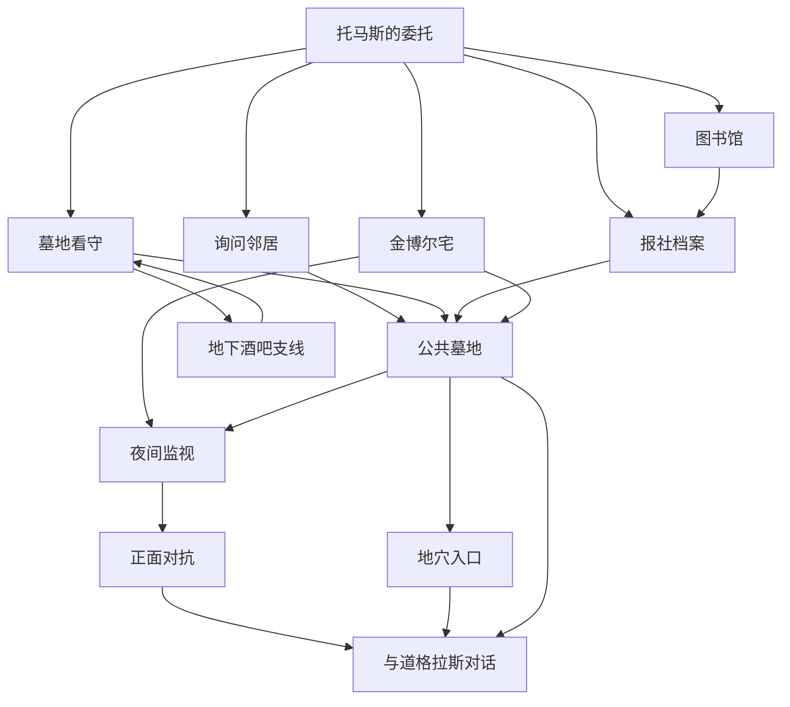
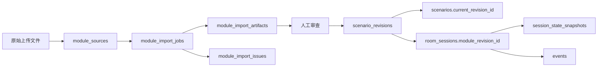

# 《追书人》模组解析与入库设计报告

工作项：[Issue #98](https://github.com/1024XEngineer/TRPG-master/issues/98)

## 1. 报告目的

本报告用于回答三个问题：

1. 解析 Agent 从《追书人》PDF 中识别出了什么；
2. 当前解析结果是否足以转成可执行 `ModuleContent`；
3. 后续进入生产流程时，原始文件、解析草稿、已发布模组和每局运行状态应如何入库。

配套机器可读草稿为 [`module-draft.json`](module-draft.json)。本报告可以独立阅读，不要求评审者打开 JSON 或原始 PDF。

---

## 2. 执行摘要

### 2.1 解析结论

《追书人》是一款适合一名调查员的短篇调查模组。核心不是击败怪物，而是查明失踪者道格拉斯已经主动选择食尸鬼生活，并决定如何处理这一真相。

PDF 共 6 页，解析出了：

| 内容类别 | 数量 | 结果评价 |
|---|---:|---|
| 场景/调查节点 | 12 | 主线和主要支线均已覆盖 |
| NPC、群体、物品、地点 | 12 | 核心 NPC 和关键交互物完整 |
| 线索 | 13 | 可构成从失踪案到食尸鬼真相的线索链 |
| 技能检定 | 14 | 包含社交、调查、追踪、幸运和力量 |
| 理智事件 | 4 | 已提取损失公式和触发条件 |
| 事件触发器 | 7 | 覆盖夜间监视、地穴、对话和食尸鬼群 |
| 结局 | 6 | 包含和平、失踪、入院、逃亡和被捕 |
| 图片/地图资源 | 2 | 已识别用途，尚未裁切成独立资源 |
| 人工确认项 | 6 | 均已保留来源和问题描述 |

### 2.2 当前可用程度

当前结果属于：**高质量、可审查的 `ModuleDraft`，尚不是可直接发布的 `ModuleContent`。**

它已经足以支持：

- 产品、模组和规则成员共同审查解析结果；
- 设计 `ModuleContent` 下一版 Schema；
- 生成一个受控的演示模组；
- 编写关键线索、检定、触发器和结局的测试用例。

在以下问题确认并通过规则映射前，不应进入生产发布：

- 食尸鬼群战斗是否直接判定为失败结局；
- 地穴腐臭是否无需检定即可使角色昏厥；
- 和平对话后的 SAN 损失和回复顺序；
- 五本书在和平结局中的最终归属；
- 单人模组是否允许产品扩展为多人；
- 地图是否需要转成可点击地点图。

### 2.3 启发式质量评分

以下评分用于团队内部比较不同解析版本，不表示内容版权或商业发布审核已经通过。

| 维度 | 得分 | 依据 |
|---|---:|---|
| 文本与版式识别 | 94/100 | 6 页均有可提取文本；双栏、数值表和地图经过渲染核对 |
| 剧情结构完整性 | 90/100 | 委托、调查分支、揭示、对话和主要结局均已覆盖 |
| NPC 与实体完整性 | 88/100 | 核心人物、关键物品和地点完整，普通邻居未逐个实体化 |
| 线索可追踪性 | 91/100 | 13 条线索均记录来源章节，主要真相有多条支持路径 |
| 规则映射准确度 | 79/100 | 技能和公式已提取，但部分判定依赖 Keeper 裁量 |
| 运行时可执行度 | 75/100 | 主流程可建模，仍缺通用重复检定、环境声明和理智结算协议 |
| 歧义暴露能力 | 92/100 | 未把模糊原文静默改写为确定规则，保留了 6 项审查问题 |
| 资源处理完整度 | 65/100 | 识别了插图和地图，但尚未裁切、标注坐标或生成地图拓扑 |
| **综合** | **84/100** | **适合进入人工审查，不适合跳过审查直接发布** |

---

## 3. 原始文档分析

### 3.1 文档结构

| 页码 | 主要内容 | 解析注意事项 |
|---:|---|---|
| 1 | 标题、背景、玩家信息 | 区分 Keeper 真相与玩家开局已知信息 |
| 2 | 邻居、墓地看守、图书馆、报社 | 包含规则转换脚注和多种替代调查方式 |
| 3 | 报社证词、金博尔宅、夜间监视 | 包含日记、重复幸运检定和多分支冲突 |
| 4 | 食尸鬼群后果、与道格拉斯对话 | 图片与双栏混排，不能只按文本流读取 |
| 5 | 地穴、奖励、道格拉斯数值 | 包含理智公式、奖励、环境危险和角色数据表 |
| 6 | 地图、译者后记 | 地图不按比例；译者评价不能转成运行规则 |

### 3.2 内容来源分层

解析时将内容分成三类：

- **原模组事实**：剧情、人物、线索、场景和结果；
- **七版转换内容**：技能、难度、SAN 公式和角色数据；
- **译者注释或推断**：用于解释版本差异，不自动视为模组权威规则。

这是解析质量的重要边界。例如“地穴打开但不下去时，道格拉斯会拜访调查员房间并进入对话”带有译者根据上下文所作的目的推断，因此应保留来源和审查状态，而不是在解析时静默写死。

---

## 4. 模组整体理解

### 4.1 玩家开局已知信息

- 委托人托马斯最近继承了叔叔道格拉斯的旧宅；
- 道格拉斯一年前失踪，没有留下明确踪迹；
- 书房近期丢失五本书；
- 这些书市场价值不高，但道格拉斯极为珍爱；
- 托马斯希望追回书籍并确认叔叔的生死。

### 4.2 Keeper 真相

- 道格拉斯长期在墓地读书，并与地下的食尸鬼建立友谊；
- 他主动跟随食尸鬼进入地下世界，之后逐渐成为食尸鬼；
- 他仍保留人格和阅读爱好，对当前生活感到满足；
- 偷书者正是道格拉斯，他只是回来取走自己的藏书；
- 道格拉斯通常不主动伤害调查员；
- 食尸鬼准备关闭这处入口，道格拉斯不会再次回来；
- 真正的戏剧冲突是调查员是否接受、隐瞒或暴力干预道格拉斯的选择。

### 4.3 推荐的核心体验标签

```text
失踪调查 → 超自然迹象 → 确认非人化 → 是否尊重当事人选择
```

该模组并不是传统的“发现怪物并消灭怪物”。如果 AI Keeper 把道格拉斯持续塑造成主动猎杀玩家的敌人，就说明解析或主持发生了严重偏差。

---

## 5. 场景与流程

### 5.1 场景关系概览



这是调查网络，不是严格线性章节。玩家可以跳过图书馆、先去住宅，也可以完全依靠监视遭遇道格拉斯。

### 5.2 场景明细

| ID | 场景 | 主要作用 | 进入/推进方式 | 可能获得 |
|---|---|---|---|---|
| `client_briefing` | 托马斯的委托 | 建立失踪和盗书目标 | 开局固定 | 失踪信息、五本书 |
| `neighborhood` | 询问邻居 | 建立道格拉斯与墓地联系 | 自由调查 | 经常去墓地读书 |
| `caretaker_interview` | 墓地看守 | 指认墓碑和夜间人影 | 去墓地询问 | 具体墓碑、人影 |
| `speakeasy` | 地下酒吧 | 为贿赂看守取得酒 | 选择贿赂路线 | 一品脱酒，也可能被捕 |
| `library` | 当地图书馆 | 找到旧报纸索引 | 研究路线 | 墓地怪人报道 |
| `newspaper` | 报社档案 | 获取更直接的怪物描述 | 社交、职业免检或幸运 | 希尔达的未刊证词 |
| `kimball_house` | 金博尔宅 | 获取核心日记线索 | 搜索书房一天 | 加入地下朋友、隧道网络 |
| `cemetery` | 公共墓地 | 找入口或开始监视 | 由多条线索引导 | 蹄状足迹、地穴入口 |
| `surveillance` | 夜间监视 | 直接遭遇道格拉斯 | 每晚幸运检定 | 偷书者身份和行动路线 |
| `confrontation` | 正面对抗 | 处理追赶、攻击、呼喊名字 | 遭遇道格拉斯后 | 对话、死亡或食尸鬼群 |
| `crypt` | 地穴入口 | 处理石板、腐臭和进入决定 | 追踪足迹成功 | 与道格拉斯见面 |
| `douglas_conversation` | 与道格拉斯对话 | 揭示真相并做最终选择 | 礼貌询问或跟随 | 真相、奖励和和平结局 |

### 5.3 场景解析质量

- 主要场景均能从原文找到明确来源；
- “地下酒吧”属于可选资源支线，不应被误判为主线场景；
- “正面对抗”是行为分支，不一定对应独立物理地点；
- 地图只给出住宅、道路、墓地和入口石板的相对位置，没有距离和精确拓扑；
- 产品层可以将“调查节点”和“地图地点”分开建模，避免所有 Scene 都被强制显示在地图上。

---

## 6. NPC 与实体解析

### 6.1 主要 NPC

| NPC | 公开身份 | 知道什么 | 目标/态度 | 解析质量 |
|---|---|---|---|---|
| 托马斯·金博尔 | 委托人、侄子 | 书被盗、叔叔失踪 | 追回书并确认叔叔生死 | 高 |
| 道格拉斯·金博尔 | 失踪的爱书人 | 完整地下真相 | 取书、自由生活、避免再受打扰 | 高，含完整数值 |
| 莱拉·奥戴尔 | 邻居 | 道格拉斯常带书去墓地 | 通过社交检定提供信息 | 高 |
| 梅洛迪亚斯·杰弗逊 | 墓地看守 | 墓碑位置、夜间人影 | 害怕墓地，可被信用、胁迫或酒说服 | 高 |
| 希尔达·沃德 | 旧证词提供者 | 曾观察到类人怪物 | 不实时出场，作为档案人物存在 | 高 |
| 食尸鬼群 | 地下群体 | 道格拉斯的现状 | 关闭入口、带回道格拉斯、压倒攻击者 | 中高，群体规则需确认 |

### 6.2 道格拉斯的关键行为约束

解析结果明确保留以下约束，供 Keeper 使用：

- 默认不主动攻击调查员；
- 被追赶时优先带书逃往墓地；
- 无法逃脱时才反击；
- 赶走或击倒袭击者后停止攻击；
- 被礼貌询问时愿意回答问题；
- 希望调查员不要把自己的现状告诉托马斯；
- 对自己的食尸鬼生活感到满意。

这些不是装饰性人物设定，而是防止 AI 把模组主持成普通怪物战斗的重要运行约束。

### 6.3 关键物品和地点状态

| 实体 | 初始状态 | 可变化状态 |
|---|---|---|
| 道格拉斯日记 | 未发现、未读 | `found`、`read` |
| 书房窗户 | 通常未锁 | `locked`、`broken` |
| 常坐墓碑 | 未被玩家确认 | `identified` |
| 地穴入口 | 未发现、关闭 | `discovered`、`open` |
| 酒瓶线索 | 未被注意 | `noticed` |
| 一品脱酒 | 未持有 | `owned`、购买价格 |

---

## 7. 线索网络

### 7.1 线索链

| 目标结论 | 支持线索 | 获取方式 |
|---|---|---|
| 道格拉斯与墓地有关 | 邻居目击、看守指认墓碑、旧报道 | 社交、信用、研究 |
| 墓地存在非人生物 | 怪异足迹、希尔达证词、旧报纸 | 图书馆、报社、追踪 |
| 地下存在隧道网络 | 日记、蹄状足迹、入口石板 | 搜索、语言、追踪 |
| 偷书者是道格拉斯 | 夜间监视、尸体相貌、直接对话 | 重复幸运、冲突或对话 |
| 道格拉斯主动选择现状 | 日记最后一篇、本人对话 | 搜索日记、完成对话 |
| 威胁将自行结束 | 道格拉斯说明入口会关闭 | 和平对话 |

### 7.2 关键线索可达性

- 找到墓地有邻居、看守、图书馆、报社和日记等多条入口；
- 找到地穴主要依赖追踪，但夜间监视和跟随道格拉斯可以绕过；
- 得知完整真相主要依赖与道格拉斯对话；
- 即使调查路径失败，重复夜间监视最终仍可触发遭遇，因此模组不容易永久卡死；
- “和平解决需要礼貌交流”属于行为条件，需要 Keeper 正确理解玩家语气，不能只检查固定动词。

### 7.3 风险

完整真相集中在最终 NPC 对话。如果 AI 过早把 Keeper 真相写进普通场景描述，就会严重剧透；如果 AI 把道格拉斯误判为必杀敌人，又会切断最重要的揭示。因此该模组特别适合测试信息可见性和 NPC 知识边界。

---

## 8. 检定与规则映射

| 检定 | 技能/属性 | 难度 | 成功结果 | 特殊规则 |
|---|---|---|---|---|
| 询问邻居 | 话术/魅惑 | 普通 | 得知道格拉斯去墓地读书 | 合适交涉技能即可 |
| 给看守好印象 | 信用 | 普通 | 得到具体墓碑位置 | 无 |
| 注意酒瓶 | 侦察 | 普通 | 解锁胁迫路线 | 秘密检定亦可考虑 |
| 胁迫看守 | 恐吓 | 普通 | 得到夜间人影信息 | 需先注意酒瓶 |
| 贿赂看守 | 话术/魅惑/信用 | 普通 | 得到夜间人影信息 | 需持有酒 |
| 寻找地下酒吧 | 幸运 | 普通 | 花 1D3 美元买酒 | 大失败导致被捕；特定职业可免检 |
| 图书馆研究 | 图书馆使用 | 普通 | 找到旧报道 | 无 |
| 进入报社档案 | 合适交涉 | 普通 | 查到希尔达证词 | 记者或作家免检 |
| 跳过图书馆后碰运气 | 幸运 | 普通 | 偶然找到关联资料 | 仅在缺少旧报道时使用 |
| 搜索书房 | 侦察 | 普通 | 找到日记 | 至少消耗一天 |
| 阅读日记 | 语言：英语 | 普通 | 得到地下隧道信息 | 必须先找到日记 |
| 墓地追踪 | 追踪 | 普通 | 找到蹄状足迹和入口 | 可被跟随道格拉斯绕过 |
| 夜间监视 | 幸运 | 普通 | 看到道格拉斯取书 | 每晚重复一次直到成功或玩家放弃 |
| 移开石板 | 力量 | 普通 | 打开地穴入口 | 随后触发腐臭危险 |

### 8.1 协议缺口

当前 `ModuleContent 0.1` 不能完整表达：

- `repeat.interval = 1 night` 的重复检定；
- 记者、侦探等背景触发的免检；
- 大失败直接产生被捕结局；
- 时间成本和货币花费；
- 玩家声明“屏住呼吸”对环境危险的规避；
- 理智检定、技能奖励和 SAN 回复；
- 调查和跟随两条不同动作抵达同一场景。

---

## 9. 理智、奖励与危险

| 事件 | 结果 |
|---|---|
| 直接看见食尸鬼道格拉斯 | SAN `0/1D6` |
| 杀死后意识到其为道格拉斯 | SAN `1/1D8` |
| 看见大量食尸鬼出现 | SAN `0/1D6` |
| 与道格拉斯交谈并理解其现状 | 增加 3% 克苏鲁神话，损失 `1D4` SAN |
| 得知道格拉斯不会再回来 | 回复 `1D6` SAN |
| 打开地穴且未声明屏息 | 因腐臭昏迷到夜晚 |

原文注明前后两次食尸鬼目击适用“习惯恐惧”，相关 SAN 损失总上限为 6。该规则需要绑定到具体规则系统能力，不能只作为自然语言交给 Keeper 自行记忆。

---

## 10. 结局解析

| 结局 | 触发条件 | 玩家结果 | 确定度 |
|---|---|---|---:|
| 和平解决 | 完成与道格拉斯的对话 | 得知真相和入口关闭，获得奖励 | 高 |
| 跟随地下 | 玩家选择跟随道格拉斯 | 从外界失踪 | 高 |
| 被食尸鬼群带走 | 主动与群体搏斗或开枪 | 被制服并消失 | 高 |
| 疗养院 | 目击群体时陷入临时疯狂 | 昏迷后在疗养院醒来 | 高 |
| 杀死后逃离 | 道格拉斯死亡，调查员选择逃跑 | 食尸鬼带走尸体，托马斯不再受扰 | 中高 |
| 地下酒吧被捕 | 寻找酒吧时大失败 | 调查中断并入狱 | 高 |

没有传统意义上唯一的“胜利条件”。发布协议应使用 `EndingSpec` 和 `outcome`，而不是只使用 `ModuleWinCondition`。

---

## 11. 视觉资源

### 11.1 道格拉斯插图

- 来源：第 4 页；
- 内容：食尸鬼形态的道格拉斯坐在墓碑上阅读；
- 建议用途：首次明确揭示道格拉斯身份时展示；
- 风险：过早展示会剧透，因此资源本身需要 `unlock_condition`。

### 11.2 地点地图

- 来源：第 6 页；
- 标注：金博尔宅、道路、墓地、入口石板；
- 明确注明不按比例；
- 可以直接作为手绘地图展示，也可以进一步解析为地点节点；
- 自动解析得到的拓扑必须人工确认，不能从画面距离推断实际移动时间。

---

## 12. 人工审查清单

| 编号 | 问题 | 风险 | 建议默认值 |
|---|---|---|---|
| R1 | 是否严格限制一名调查员 | 多人会改变难度和对话节奏 | Demo 保持单人，产品层标记可适配 |
| R2 | 攻击食尸鬼群是否直接失败 | 若进入普通战斗可能偏离原意 | 按叙事失败结局处理 |
| R3 | 未屏息是否自动昏厥 | 玩家可能认为缺少公平检定 | 保留原文，并在进入前给感官提示 |
| R4 | `1D4` SAN 损失与 `1D6` 回复顺序 | 影响临时疯狂和最终 SAN | 先损失，再在确认威胁结束后回复 |
| R5 | 五本书最终归属 | 影响托马斯委托是否完成 | 作为结局摘要变量，不强行统一 |
| R6 | 地图采用图片还是互动节点 | 影响前端和解析成本 | Demo 先图片，后续增加地点拓扑 |

---

## 13. 解析质量最终判断

### 13.1 已经做得可靠的部分

- 原文中的核心真相没有被玩家信息污染；
- 非线性调查路线被保留，没有强行改造成单线流程；
- 道格拉斯的非敌对行为得到明确建模；
- 每条关键线索、检定和结局都保留页码与章节来源；
- 规则脚注、译者意见和地图说明没有被无差别地当作剧情事实；
- 不确定内容进入审查清单，而不是由解析 Agent 擅自补全。

### 13.2 尚未完成的部分

- 尚未从 PDF 裁切并保存独立图片资产；
- 尚未把地图转换成经过确认的地点图；
- 尚未对照后端技能目录验证全部技能 ID；
- 尚未执行关键线索可达性的自动图算法；
- 尚未用正式 `ModuleContent` Schema 验证；
- 尚未进行模拟玩家跑团和结局覆盖测试；
- 尚未经过内容权利和发布审核。

### 13.3 发布门槛

只有以下条件全部满足，Draft 才能发布为 `ModuleContent`：

1. 所有 `review_items` 已处理；
2. 所有规则技能、难度和结果类型可被目标规则系统识别；
3. ID、状态路径和引用完整；
4. 核心线索至少存在一条可达路线；
5. 所有结局冲突有明确优先级；
6. 玩家可见内容经过秘密信息过滤；
7. `ModuleContent` 通过 Schema 校验并生成不可变校验和；
8. 至少完成一次模拟跑团和一次人工审查。

---

## 14. 解析 Agent 应产出什么

一个生产级导入任务不应只有最终 JSON，而应产出以下内容：

| 产物 | 用途 | 是否进入正式游戏 |
|---|---|---|
| `SourceManifest` | 文件、页码、哈希、版权和提取方式 | 否，审计使用 |
| `ExtractedDocument` | 章节、文本块、表格和图片位置 | 否，解析中间态 |
| `ModuleDraft` | 带来源、置信度和待确认项的结构化草稿 | 否，供审查 |
| `AssetManifest` | 地图、立绘、手册及裁切信息 | 间接进入 |
| `ValidationReport` | 引用、规则、线索、结局和安全检查 | 否，发布门禁 |
| `ModuleContentCandidate` | 去除解析噪声后的可执行候选 | 通过审查后进入 |
| `ModuleContent` | 已发布、不可变、可被引擎执行的内容 | 是 |

---

## 15. 是否应该存入数据库

应该，但不同阶段的数据不能混在一张表里。



推荐原则：

- 原 PDF 和大图片存对象存储，数据库只存地址和哈希；
- Draft、报告和发布内容以 JSON/JSONB 保存，避免协议快速演进时频繁拆表；
- 已发布 `ModuleContent` 使用不可变 revision；
- 房间开局时固定 revision，作者后续修改不影响正在进行的游戏；
- 每局运行状态和模组模板完全分开；
- `fixtures` 继续留在 Git 中作为测试样例，不被数据库取代。

---

## 16. 推荐数据库表

### 16.1 `module_sources` - 原始上传文件

| 字段 | 类型 | 说明 |
|---|---|---|
| `id` | UUID PK | 上传文件 ID |
| `owner_user_id` | UUID FK | 上传者 |
| `original_filename` | VARCHAR(255) | 原文件名 |
| `mime_type` | VARCHAR(100) | PDF、DOCX、Markdown 等 |
| `storage_key` | VARCHAR(500) | 对象存储地址，不直接存二进制 |
| `size_bytes` | BIGINT | 文件大小 |
| `checksum_sha256` | CHAR(64) | 去重、完整性和审计 |
| `page_count` | INTEGER NULL | PDF 页数 |
| `language` | VARCHAR(20) NULL | 识别语言 |
| `rights_declaration` | JSON | 用户对上传权利的声明 |
| `status` | VARCHAR(20) | uploaded/scanning/ready/rejected |
| `created_at` | TIMESTAMP | 上传时间 |
| `deleted_at` | TIMESTAMP NULL | 软删除时间 |

### 16.2 `module_import_jobs` - 导入任务

现有表只有状态、文件名、结果场景和错误文本，生产版建议扩展为：

| 字段 | 类型 | 说明 |
|---|---|---|
| `id` | UUID PK | 导入任务 ID |
| `source_id` | UUID FK | 对应 `module_sources` |
| `requested_ruleset_id` | UUID FK NULL | 用户指定规则系统 |
| `status` | VARCHAR(20) | pending/running/review/published/failed |
| `stage` | VARCHAR(30) | extract/structure/map/validate/review/publish |
| `progress` | INTEGER | 0-100 |
| `parser_version` | VARCHAR(50) | 解析器版本 |
| `model_provider` | VARCHAR(50) NULL | 模型供应商 |
| `model_name` | VARCHAR(100) NULL | 模型版本 |
| `prompt_version` | VARCHAR(50) NULL | Prompt 版本 |
| `result_scenario_id` | UUID FK NULL | 发布后模组 |
| `result_revision_id` | UUID FK NULL | 发布后的具体版本 |
| `error_code` | VARCHAR(50) NULL | 稳定错误码 |
| `error_detail` | JSON NULL | 结构化错误 |
| `started_at` | TIMESTAMP NULL | 开始时间 |
| `completed_at` | TIMESTAMP NULL | 完成时间 |
| `created_at` | TIMESTAMP | 创建时间 |
| `updated_at` | TIMESTAMP | 更新时间 |

### 16.3 `module_import_artifacts` - 解析产物

| 字段 | 类型 | 说明 |
|---|---|---|
| `id` | UUID PK | 产物 ID |
| `job_id` | UUID FK | 所属导入任务 |
| `artifact_type` | VARCHAR(40) | source_manifest/extracted_document/module_draft/validation_report/content_candidate |
| `schema_version` | VARCHAR(30) | 产物 Schema 版本 |
| `content_json` | JSON/JSONB | 结构化内容 |
| `storage_key` | VARCHAR(500) NULL | 大型产物放对象存储时使用 |
| `checksum_sha256` | CHAR(64) | 内容校验和 |
| `created_at` | TIMESTAMP | 创建时间 |

同一任务可以有多个版本的 Draft 和报告，因此不能把它们全塞在 `module_import_jobs` 一行中。

### 16.4 `module_import_issues` - 待审查问题

| 字段 | 类型 | 说明 |
|---|---|---|
| `id` | UUID PK | 问题 ID |
| `job_id` | UUID FK | 所属导入任务 |
| `code` | VARCHAR(60) | 例如 `AMBIGUOUS_OUTCOME` |
| `severity` | VARCHAR(20) | info/warning/error/blocker |
| `object_type` | VARCHAR(30) | scene/entity/checkpoint/ending 等 |
| `object_ref` | VARCHAR(200) NULL | Draft 内稳定 ID |
| `source_ref_json` | JSON NULL | 页码、章节和坐标 |
| `message` | TEXT | 问题描述 |
| `suggested_resolution` | JSON NULL | Agent 建议，不自动采纳 |
| `resolution_json` | JSON NULL | 人工确认结果 |
| `status` | VARCHAR(20) | open/resolved/ignored |
| `resolved_by` | UUID FK NULL | 审查人 |
| `created_at` | TIMESTAMP | 创建时间 |
| `resolved_at` | TIMESTAMP NULL | 解决时间 |

### 16.5 `scenarios` - 模组目录和身份

现有 `scenarios` 可以保留为模组稳定身份，但建议增加：

| 字段 | 类型 | 说明 |
|---|---|---|
| `id` | UUID PK | 模组稳定 ID |
| `owner_user_id` | UUID FK NULL | 上传者；内置模组可空 |
| `game_system_id` | UUID FK | 默认规则系统 |
| `world_id` | UUID FK NULL | 世界观 |
| `title` | VARCHAR(200) | 标题 |
| `slug` | VARCHAR(200) UNIQUE | 公开访问标识 |
| `synopsis` | TEXT NULL | 无剧透简介 |
| `authors` | JSON | 作者列表 |
| `players_min/max` | INTEGER | 玩家人数 |
| `estimated_duration` | VARCHAR(50) | 时长 |
| `visibility` | VARCHAR(20) | private/unlisted/public |
| `status` | VARCHAR(20) | draft/published/archived |
| `current_revision_id` | UUID FK NULL | 当前发布版本 |
| `created_at/updated_at` | TIMESTAMP | 时间戳 |

不要继续把 `version` 直接放在 `scenarios` 上作为唯一版本，因为一个模组会有多个历史 revision。

### 16.6 `scenario_revisions` - 已发布模组版本

这是最关键的新表。

| 字段 | 类型 | 说明 |
|---|---|---|
| `id` | UUID PK | Revision ID |
| `scenario_id` | UUID FK | 所属模组 |
| `revision_number` | INTEGER | 递增版本号 |
| `semantic_version` | VARCHAR(50) | 作者展示版本 |
| `schema_version` | VARCHAR(30) | `ModuleContent` Schema 版本 |
| `ruleset_id` | UUID FK | 固定规则系统 |
| `ruleset_version` | VARCHAR(50) | 固定规则版本 |
| `content_json` | JSON/JSONB | 完整、已验证的 `ModuleContent` |
| `validation_summary` | JSON | 发布时验证摘要 |
| `source_job_id` | UUID FK NULL | 来源导入任务 |
| `checksum_sha256` | CHAR(64) | 不可变内容哈希 |
| `status` | VARCHAR(20) | review/published/deprecated |
| `created_by` | UUID FK NULL | 发布者 |
| `created_at` | TIMESTAMP | 创建时间 |
| `published_at` | TIMESTAMP NULL | 发布时间 |

唯一约束建议：

```text
UNIQUE(scenario_id, revision_number)
UNIQUE(scenario_id, checksum_sha256)
```

已发布 revision 不允许原地修改；修改内容必须创建新 revision。

### 16.7 `module_assets` - 模组资源

现有表只有 `scenario_id/type/name/url`，建议改为 revision 级资源：

| 字段 | 类型 | 说明 |
|---|---|---|
| `id` | UUID PK | 资源 ID |
| `revision_id` | UUID FK | 所属模组版本 |
| `asset_key` | VARCHAR(200) | `asset.local_map` 等稳定键 |
| `asset_type` | VARCHAR(30) | map/portrait/handout/audio |
| `name` | VARCHAR(200) | 名称 |
| `storage_key` | VARCHAR(500) | 对象存储地址 |
| `mime_type` | VARCHAR(100) | MIME |
| `checksum_sha256` | CHAR(64) | 哈希 |
| `source_page` | INTEGER NULL | 来源页码 |
| `source_bbox` | JSON NULL | 页面裁切坐标 |
| `metadata_json` | JSON | 尺寸、标签、解锁条件等 |
| `generated_by_ai` | BOOLEAN | 是否 AI 生成 |
| `created_at` | TIMESTAMP | 创建时间 |

### 16.8 `room_sessions` - 一次开团实例

现有 `room_sessions` 应增加：

| 字段 | 类型 | 说明 |
|---|---|---|
| `module_revision_id` | UUID FK | 固定本局使用的模组版本 |
| `ruleset_version` | VARCHAR(50) | 固定本局规则版本 |
| `state_version` | INTEGER | 乐观锁版本 |
| `current_scene_key` | VARCHAR(200) NULL | 当前主场景 |
| `last_event_sequence` | BIGINT | 最新事件序号 |

`rooms.scenario_id` 可以继续用于大厅展示，但实际开局必须以 `room_sessions.module_revision_id` 为准。

### 16.9 `session_state_snapshots` - 运行状态快照

| 字段 | 类型 | 说明 |
|---|---|---|
| `id` | UUID PK | 快照 ID |
| `room_session_id` | UUID FK | 所属游戏局 |
| `state_version` | INTEGER | 状态版本 |
| `event_sequence` | BIGINT | 对应事件位置 |
| `state_json` | JSON/JSONB | 当前 GameState |
| `checksum_sha256` | CHAR(64) | 完整性校验 |
| `created_at` | TIMESTAMP | 创建时间 |

运行时可由最近快照加后续 Event 恢复，不需要每次操作都重写完整状态。

### 16.10 `events` - 权威事件日志

现有事件表建议增加：

| 字段 | 类型 | 说明 |
|---|---|---|
| `room_session_id` | UUID FK | 必须按局区分 |
| `sequence` | BIGINT | 局内严格递增 |
| `event_type` | VARCHAR(60) | 稳定事件类型 |
| `actor_id` | VARCHAR/UUID NULL | 行动角色 |
| `payload` | JSON/JSONB | 事件数据 |
| `visibility_json` | JSON | public/player/team/keeper |
| `caused_by_command_id` | VARCHAR(100) NULL | 因果与幂等追踪 |
| `schema_version` | VARCHAR(30) | 事件 Schema 版本 |
| `created_at` | TIMESTAMP | 发生时间 |

唯一约束建议：

```text
UNIQUE(room_session_id, sequence)
UNIQUE(room_session_id, caused_by_command_id, event_type)
```

### 16.11 `room_summaries` - 每局复盘

现有表以 `room_id` 唯一会导致同一房间只能有一份复盘。建议改为：

| 字段 | 类型 | 说明 |
|---|---|---|
| `room_session_id` | UUID FK UNIQUE | 对应具体一局 |
| `summary_text` | TEXT | 复盘文本 |
| `highlights` | JSON | 精彩片段 |
| `facts_json` | JSON | 复盘依据的结构化事实 |
| `model_info` | JSON | 模型和 Prompt 版本 |
| `created_at` | TIMESTAMP | 生成时间 |

---

## 17. 是否拆分 Scene、Entity、Clue 等关系表

短期建议采用混合方案：

- `scenario_revisions.content_json` 是唯一发布事实源；
- `scenario_scenes`、`entities`、`module_checkpoints` 等现有表作为搜索和编辑投影；
- 新增投影表时至少包括 `revision_id`、`content_key`、常用搜索字段和 `spec_json`；
- 投影只能由发布流程生成，不允许和 `content_json` 分别手工修改。

建议补充两个当前缺失的投影表：

```text
module_clues(
  id, revision_id, content_key, name, criticality,
  visibility, spec_json, created_at
)

module_triggers(
  id, revision_id, content_key, event_type, priority,
  spec_json, created_at
)
```

现有表也应增加 `revision_id`，否则同一模组不同版本的 Scene、Entity 和 Checkpoint 无法并存。

对于当前六周开发期，不建议把 Condition、Effect、NPC Goal、Clue Source 再拆成十几张高度规范化表。它们变化快、结构多态，先保存在版本化 JSON 中更稳妥。商业化迁移 PostgreSQL 后使用 `JSONB` 和 GIN 索引即可支持必要查询。

---

## 18. 本次解析结果与数据库的映射

| 本次产物 | 推荐存储 |
|---|---|
| 原始《追书人》PDF | 对象存储 + `module_sources` |
| PDF 文本块和版面信息 | `module_import_artifacts: extracted_document` |
| `module-draft.json` | `module_import_artifacts: module_draft` |
| 本解析报告 | `module_import_artifacts: validation_report` 或对象存储 |
| `review_items` | `module_import_issues` |
| 地图和道格拉斯插图 | 对象存储 + `module_assets` |
| 人工确认后的内容 | `scenario_revisions.content_json` |
| 模组目录信息 | `scenarios` |
| 每局初始状态 | 从 revision 生成 `session_state_snapshots` |
| 玩家行动、检定和状态变化 | `events` |

---

## 19. 推荐实施顺序

1. 冻结 `ModuleDraft`、`ModuleContent` 和 `ValidationReport` 的首版 Schema；
2. 新增 `module_sources`、`module_import_artifacts`、`module_import_issues`；
3. 新增 `scenario_revisions`，让 `scenarios` 指向当前版本；
4. 使用本次《追书人》Draft 完成人工审查并生成第一个正式 revision；
5. 房间开局时固定 `module_revision_id` 并生成初始状态快照；
6. 扩展 Event 的 session、sequence、visibility 和幂等字段；
7. 再根据编辑器和搜索需求生成 Scene、Entity、Clue、Trigger 投影；
8. 最后接入通用 PDF 导入和自动发布门禁。

## 20. 最终建议

本次解析质量足以作为团队的第一个“黄金模组样本”。它同时覆盖非线性调查、替代检定、NPC 知识边界、重复行动、理智规则、环境危险、地图、人物图和多结局，能够暴露协议中大多数关键缺口。

数据库设计上，最重要的不是立即把每个 JSON 字段拆成关系表，而是先建立：

```text
原始文件可追溯
+ Draft 可审查
+ 问题可解决
+ 发布版本不可变
+ 开局固定版本
+ 运行状态和模板分离
+ Event 可以回放
```

满足这些条件后，硬编码 JSON、用户上传 PDF 和未来 AI 生成模组都可以进入同一条可靠的发布与运行管线。
