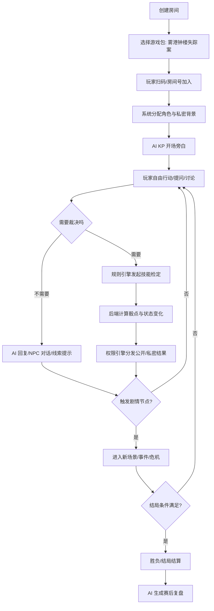
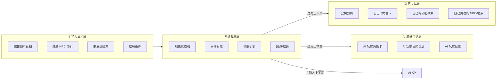
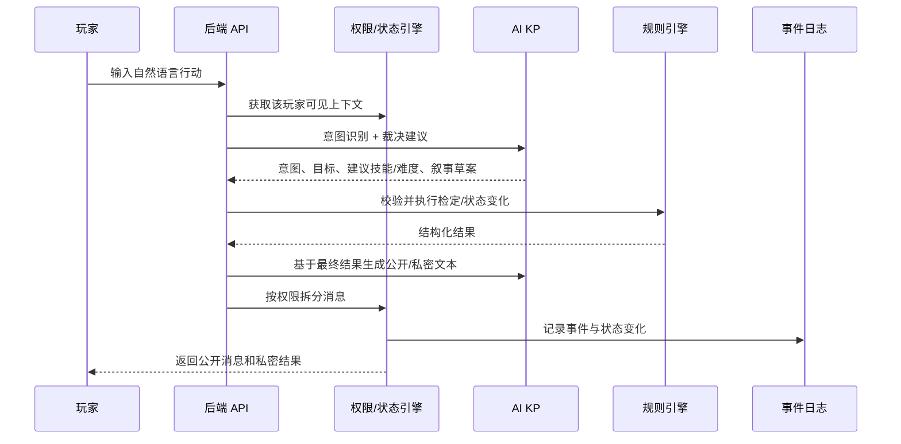
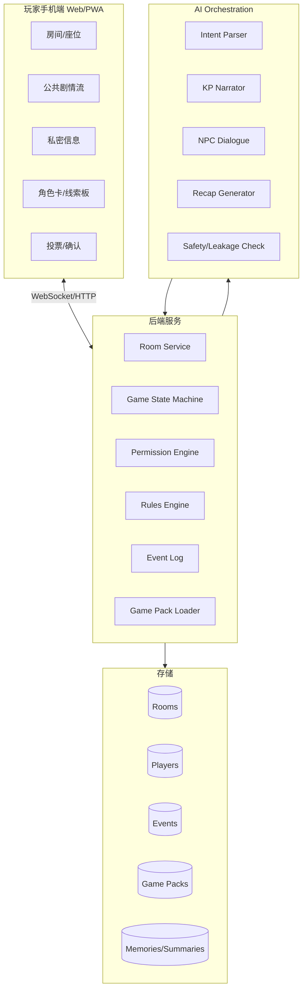

# AI DM: 面向桌游/聚会游戏的智能主持人产品规划

日期：2026-07-08  
建议汇报定位：半天调研后的产品形态与 MVP 收敛方案  
推荐方向：优先做 **CoC-like 高自由度调查跑团**，但不要直接复刻商业 CoC 规则或官方模组；做一个“克苏鲁/怪谈风格的原创轻量调查系统”。

---

## 0. 一句话结论

本项目最适合做成一个 **多人手机端 AI KP 房间**：玩家扫码/房间号加入，各自手机收到角色、技能、私密线索和检定结果；后端维护不可被 AI 随意篡改的剧情状态、权限、骰点、事件日志；AI KP 负责旁白、NPC 对话、玩家意图理解、裁决建议、节奏控制和赛后复盘。

关键产品策略不是“让大模型完全自由生成一切”，而是 **结构化自由**：

- 剧情不是死流程，而是“场景节点 + 线索图谱 + 触发条件 + 世界状态”。
- 玩家输入可以开放表达，但 AI 的结果必须经过规则/权限/状态校验。
- AI 可以看到“主持人上下文”，AI 玩家/NPC 只能看到自己权限内的信息。
- MVP 只接一个 45-75 分钟原创调查本，先证明 AI 真能主持一局。

---

## 1. 背景与竞品观察

### 1.1 市场上已有几类相关产品

| 类型 | 代表 | 主要能力 | 对本项目的启发 | 不足/机会 |
|---|---|---|---|---|
| AI 文本冒险 | AI Dungeon、Voyage、Friends & Fables、RoleForge | 自由文本输入、AI 叙事、世界记忆、部分规则/骰点 | 证明 AI 叙事和 AI GM 是成立方向 | 多数偏单人或弱多人；私密信息、多人同桌权限和主持节奏较弱 |
| VTT 数字桌面 | Roll20、Alchemy、Quest Portal | 角色卡、地图、骰子、素材、GM 工具、线上房间 | 证明桌游线上化需要角色状态、地图/手牌/日志等基础设施 | 通常仍依赖真人 GM；AI 多是备课助手 |
| AI GM 辅助工具 | Quest Portal Assistant、各类 NPC/剧情生成器 | 生成 NPC、任务、遭遇、秘密、物品 | 适合借鉴“主持素材生成”和“新手 GM 辅助” | 不是完整的无人主持系统 |
| 社交推理主持 App | 狼人杀 AI 主持、桌游主持小程序 | 阶段推进、身份发放、投票、语音播报 | 状态机、权限、私密行动非常成熟 | 玩法多为固定流程，难体现高自由度 AI |
| 剧本杀/开本助手 | 剧狐 DM 等 | 辅助 DM 理解剧本、节奏和主持 | 说明国内场景对 DM 降本有现实需求 | 通常服务真人 DM，不替代 DM |

调研来源中，AI Dungeon 官方定位为可创建和游玩 AI 文本冒险；Quest Portal 强调 VTT 与 AI 辅助 GM 备课；Friends & Fables 宣称 AI Game Master、世界构建和多人/战斗工具；Alchemy 更偏沉浸式 VTT，强调音乐、动态环境和故事驱动；Roll20 代表成熟 VTT，强调角色卡、骰子、规则书和自动化；RoleForge 则把“规则引擎 + AI 叙事 + 持久世界”作为卖点。这些都说明：**AI DM 不能只是聊天机器人，必须有规则、状态、记忆、权限和多人协作层。**

参考链接：

- AI Dungeon: https://aidungeon.com/
- Voyage / Latitude: https://latitude.io/ ，https://voyage.io/
- Quest Portal Assistant: https://www.questportal.com/assistant
- Friends & Fables: https://fables.gg/
- Alchemy RPG: https://alchemyrpg.com/
- Roll20: https://roll20.net/
- RoleForge: https://roleforge.ai/
- Hidden Door 结构化 AI 叙事案例: https://www.theverge.com/games/757816/hidden-door-early-access-ai-story
- Generative Agents 论文: https://arxiv.org/abs/2304.03442

### 1.2 对 CoC-like 方向的关键判断

CoC/克苏鲁调查跑团的吸引力在于：

- 玩家目标不是刷数值，而是调查真相、做危险选择、面对未知。
- 主持人/KP 的价值高度集中在氛围、线索投放、临场裁决、NPC 演绎和节奏控制上，正好是 AI 可以展示能力的地方。
- 规则可以轻量化为技能检定、理智/压力、生命/伤势、道具、线索、关系、结局分支，适合 MVP。

但风险也非常明显：

- 完全开放容易跑偏、幻觉和状态不一致。
- 玩家可能不熟悉跑团，不知道“该怎么问、怎么行动”。
- 直接使用 Call of Cthulhu 商标、官方规则、官方模组和商业素材会带来版权/授权问题。

因此建议用 **原创世界观 + CoC-like 调查体验 + 简化 d100 检定**。对外可称“怪谈调查跑团”“不可名状调查社”“AI KP 调查本”，避免把项目包装成官方 CoC 产品。

---

## 2. 推荐产品形态

### 2.1 产品候选名称

可选命名：

- **雾港调查局**
- **AI Keeper**
- **夜谈档案**
- **雾中来信**

建议内部汇报先叫：**AI Keeper: 多人手机端怪谈调查跑团平台**。

### 2.2 核心使用场景

3-5 名玩家围坐或线上语音，打开手机进入同一个房间。系统自动分配调查员角色、私密背景、技能和初始线索。AI KP 在公共频道推进剧情，玩家可以自由输入行动、提问 NPC、搜查地点、和同伴讨论；必要时系统发起检定、投放私密结果、更新状态。结局后，AI 基于事件日志生成复盘，包括真相、关键选择、错过线索和角色高光。

### 2.3 产品不是传统 VTT，而是“主持型游戏房间”

不建议 MVP 一开始做完整地图、复杂角色卡、战斗网格和素材市场。产品第一屏应该直接是可玩的房间：

- 公共剧情流：AI KP 旁白、NPC 发言、公开结果。
- 玩家输入区：自然语言行动、提问、讨论发言。
- 私密抽屉：身份、秘密、个人线索、仅自己可见检定。
- 状态面板：生命/压力、道具、技能、当前位置、投票/选择。
- 主持控制台：对开发/调试可见，展示场景节点、隐藏真相、事件日志、AI 调用。

### 2.4 一局 MVP 的完整体验

推荐第一局原创剧本：《雾港钟楼失踪案》

- 时长：45-75 分钟。
- 人数：3-5 人。
- 题材：民国/近现代港口小镇怪谈调查，弱克苏鲁、强悬疑。
- 玩家身份：记者、医生、警探、古籍修复师、失踪者亲友。
- 核心目标：查明钟楼失踪案真相，阻止午夜仪式，尽量保全理智和证据。
- 核心循环：到达现场 -> 搜查地点 -> 询问 NPC -> 玩家讨论 -> 关键检定 -> 私密线索 -> 推理选择 -> 结局。
- 结局类型：成功阻止、揭露但牺牲、误判真相、放任仪式、隐藏个人结局。

---

## 3. 用户与价值主张

### 3.1 目标用户

第一优先级：

- 想体验跑团但没有 KP/DM 的新手玩家。
- 桌游/聚会场景中想快速开一局沉浸式推理的人。
- 对 CoC、剧本杀、狼人杀感兴趣，但不想学习大量规则的学生团队。

第二优先级：

- 有跑团经验但缺少准备时间的 KP。
- 想做原创模组/互动叙事的内容创作者。
- 想在活动课、社团、破冰游戏里使用主持系统的组织者。

### 3.2 用户痛点

- 缺主持人：会主持的人少，主持准备成本高。
- 缺时间：传统跑团和剧本杀动辄数小时。
- 缺门槛友好度：新手不知道怎么创建角色、怎么行动、何时检定。
- 缺私密管理：多人游戏里身份、秘密、线索、行动结果容易混乱。
- 缺复盘：跑完后真相、伏笔和玩家选择往往靠主持人口述。

### 3.3 核心卖点

| 卖点 | 用户感知 |
|---|---|
| 无需真人 KP | 几个人随时能开局 |
| 手机即玩家面板 | 不需要纸笔、规则书和复杂桌面 |
| 自然语言行动 | 不被固定选项限制 |
| 私密线索与权限 | 有“只有我知道”的桌游感 |
| AI NPC 与旁白 | 比普通流程 App 更有沉浸感 |
| 自动复盘 | 结束后知道真相、分支和高光 |

---

## 4. 核心体验流程



### 4.1 玩家端关键页面

| 页面/区域 | 必要内容 | MVP 交互 |
|---|---|---|
| 房间加入页 | 房间号、昵称、头像/座位 | 输入房间号加入 |
| 角色页 | 职业、背景、技能、生命/压力、秘密 | 查看、标记线索 |
| 公共剧情页 | AI KP 旁白、NPC 发言、公开事件、玩家发言 | 发送行动/台词 |
| 私密消息页 | 个人线索、暗骰结果、秘密提醒 | 查看、确认收到 |
| 决策页 | 投票、路线选择、关键行动确认 | 点击选择/投票 |
| 复盘页 | 真相、时间线、玩家贡献、错过线索 | 分享/导出文本 |

### 4.2 AI KP 的职责边界

AI 应该做：

- 把玩家自然语言转成可处理的意图。
- 判断是否需要检定、需要哪种技能、难度大概是多少。
- 以 KP 口吻描述场景、NPC、恐怖氛围和行动后果。
- 回答玩家对规则、当前线索、可行动方向的疑问。
- 在讨论停滞时给出轻微引导。
- 基于事件日志复盘。

AI 不应该直接做：

- 私自修改血量、压力、线索归属、投票结果。
- 把隐藏真相泄露给无权限玩家。
- 无限制生成脱离剧本主线的新地点、新真相、新反派。
- 替玩家做决定。

---

## 5. 结构化自由：让 AI 可控地“像 KP”

### 5.1 核心设计原则

1. **大模型负责理解与表达，后端负责事实与结算。**
2. **玩家可以自由输入，但世界状态必须结构化保存。**
3. **AI 每次输出都绑定可追踪事件，不能只存在聊天记录里。**
4. **所有信息都有权限标签，AI 成员也必须按权限取上下文。**

### 5.2 信息权限模型



### 5.3 AI 调用流水线



### 5.4 游戏包配置思路

游戏包不是一段 prompt，而是一组结构化配置：

```yaml
game_pack:
  id: fog_harbor_clocktower
  title: 雾港钟楼失踪案
  player_count: [3, 5]
  estimated_minutes: 60
  tone: 民国怪谈 / 调查 / 低战斗 / 心理恐怖
  public_intro: 一封来自雾港镇的求助信将几位调查员带到废弃钟楼前。
  hidden_truth: 钟楼并非祭坛，而是封印装置；真正的危险来自失踪者留下的录音。
  phases:
    - lobby
    - opening
    - investigation
    - confrontation
    - ending
  skills:
    - name: 侦查
      type: d100
    - name: 图书馆使用
      type: d100
    - name: 心理学
      type: d100
    - name: 医学
      type: d100
    - name: 神秘学
      type: d100
  clues:
    - id: bell_rope_fiber
      visibility: discoverable
      location: clocktower
      unlock_by: search_success_or_cost
      text_public: 你们在钟绳末端发现异常纤维。
      text_private: 它不像普通麻绳，更像从某种旧式防护服上撕下。
  endings:
    - id: seal_restored
      condition: found_recording and repaired_mechanism and pressure_total < 8
```

---

## 6. MVP 范围建议

### 6.1 必做

| 模块 | MVP 内容 | 验收标准 |
|---|---|---|
| 房间系统 | 创建房间、玩家加入、准备状态 | 3-5 人可进入同一局 |
| 角色/权限 | 分配角色、私密背景、技能、线索 | 每个玩家只能看到自己的秘密 |
| 公共聊天/行动 | 玩家自然语言输入，AI KP 回应 | AI 能根据当前场景回应而不是泛聊 |
| 状态机 | lobby/opening/investigation/confrontation/ending | 阶段不会乱跳，结局可达 |
| 规则裁决 | d100 技能检定、难度、生命/压力变化 | 骰点由后端生成并落日志 |
| 线索系统 | 地点线索、私密线索、公开线索 | 发现线索后可在玩家端查看 |
| AI KP | 旁白、NPC 对话、意图理解、答疑、节奏提示 | 一局内保持设定与语气基本一致 |
| 事件日志 | 记录玩家行动、检定、线索、状态变化 | 可完整回放关键节点 |
| 赛后复盘 | 真相、时间线、玩家高光、错过线索 | 结束后自动生成复盘 |

### 6.2 暂缓

- 复杂地图、战棋移动、完整战斗系统。
- 语音识别/语音合成全流程。
- 视频生成。
- 多游戏包自动生成。
- 复杂 AI 玩家自治。
- 商业化素材市场。

### 6.3 可以作为展示加分项

- 环境音乐/音效按钮：按场景播放，不必 AI 实时生成。
- 关键场景图：用预生成图片增强沉浸，不必每轮生成。
- AI 新手导师：当玩家沉默时，私聊提示“你可以尝试询问/搜查/对照线索”。
- “暗骰”效果：玩家不知道具体结果，只收到叙事后果。

---

## 7. 技术方案建议

### 7.1 推荐架构



### 7.2 技术路线

前端：

- Web/PWA 优先，手机浏览器可用，避免多端 App 成本。
- 实时消息用 WebSocket 或 SSE。
- 页面设计围绕“公共剧情流 + 私密抽屉 + 角色/线索面板”。

后端：

- Room/Player/GameSession 三层模型。
- 事件溯源：所有行动、检定、线索获得、状态变化都写入 event log。
- 状态机：明确阶段、可用行动、结局条件。
- 权限引擎：每条线索、消息、事件有 visibility 标签。

AI 编排：

- 多 prompt 分工，而不是一个万能 prompt。
- 先解析意图，再做规则结算，最后生成叙事。
- 每轮给 AI 的上下文要经过权限过滤和摘要压缩。
- AI 输出结构化 JSON，再由后端校验。

### 7.3 关键数据对象

| 对象 | 字段示例 |
|---|---|
| GamePack | id、title、player_count、phases、locations、NPCs、clues、endings |
| GameSession | room_id、pack_id、phase、current_scene、global_flags、started_at |
| PlayerState | player_id、role_id、skills、health、pressure、inventory、known_clues |
| Event | type、actor、target、visibility、payload、created_at |
| Message | channel、speaker、content、visibility、related_event_id |
| Clue | id、location、unlock_condition、public_text、private_text、tags |
| NPC | id、persona、knowledge_scope、relationship_state |

---

## 8. AI 成员的进阶设计

进阶目标里“AI 成员必须遵守和真人玩家相同的信息权限”是非常好的亮点，但 MVP 不建议一开始做复杂自治。建议分三档：

### L1: AI 新手导师

- 不扮演玩家，不参与胜负。
- 只基于该玩家已知信息给建议。
- 适合 MVP 加分。

### L2: AI NPC

- 有人格、动机、知道的事实范围。
- 只能回答自己知道的事，可以撒谎或回避。
- 是 CoC-like MVP 最自然的 AI 角色。

### L3: AI 替补玩家/隐藏成员

- 有角色卡、目标、私密线索和记忆。
- 通过同样的玩家接口行动。
- 不能读取主持人真相，只拿自己的 visible context。
- 可借鉴 Generative Agents 的“记忆、反思、计划”结构，但要在回合/阶段边界内执行，避免抢戏。

---

## 9. 两个月项目规划

### 第 1 周：产品定稿与原型

- 确定 MVP 只做一个 CoC-like 原创调查本。
- 完成剧本大纲、角色、线索图、阶段状态机。
- 做低保真原型：玩家端 4 个页面 + 主持调试台。
- 明确 AI KP 的职责边界和泄密防护策略。

交付物：产品 PRD、游戏包草案、页面原型、技术架构图。

### 第 2 周：基础房间与状态机

- 创建房间、玩家加入、准备。
- 游戏包加载。
- 角色分配与权限数据结构。
- 基础事件日志。

交付物：多人可进入同一房间，能看到不同角色信息。

### 第 3 周：公共剧情流与私密消息

- 公共消息/私密消息分发。
- 玩家行动输入。
- 线索卡片、角色卡、状态展示。
- WebSocket 实时同步。

交付物：不用 AI 也能跑一个固定流程 demo。

### 第 4 周：规则引擎与检定

- d100 检定。
- 技能、难度、成功等级。
- 压力/生命/道具变化。
- 状态机触发条件。

交付物：玩家行动能触发检定并产生公开/私密结果。

### 第 5 周：AI KP 接入

- 意图识别 prompt。
- 叙事/NPC prompt。
- 结构化 JSON 输出与后端校验。
- 防泄密 prompt + 权限过滤。

交付物：AI 能主持调查阶段，回答玩家问题并推进剧情。

### 第 6 周：完整剧本闭环

- 完成《雾港钟楼失踪案》全部场景、线索和结局。
- 增加讨论卡住时的 AI 引导。
- 复盘生成。
- 内部试玩 2-3 轮。

交付物：从开房到结局可完整跑通。

### 第 7 周：体验打磨与多模态轻增强

- UI 优化，手机端适配。
- 加入场景图/背景音效/关键节点音效。
- 优化 AI 延迟和上下文摘要。
- 补充异常处理：掉线、玩家沉默、重复提问。

交付物：可给外部同学试玩的 beta。

### 第 8 周：测试、展示与文档

- 多轮压力测试和试玩反馈。
- 修复泄密、卡流程、结局不可达问题。
- 准备演示脚本、视频、项目文档。
- 梳理进阶目标：第二游戏包、AI 玩家、规则导入。

交付物：最终 demo、汇报 PPT、技术文档、复盘材料。

---

## 10. 分工建议

按 6 人开发团队估算：

| 角色 | 负责内容 |
|---|---|
| 产品/剧情负责人 | PRD、游戏包、线索图、结局、试玩记录 |
| 前端 1 | 房间/公共剧情流/实时消息 |
| 前端 2 | 角色卡/私密线索/移动端交互/复盘页 |
| 后端 1 | 房间、玩家、状态机、事件日志 |
| 后端 2 | 权限引擎、规则引擎、游戏包加载 |
| AI 工程 | prompt 编排、意图识别、NPC、复盘、防泄密 |

如果人手紧张，前端可以先做单页 Web，后端和 AI 合并一人负责。

---

## 11. 主要风险与应对

| 风险 | 表现 | 应对 |
|---|---|---|
| AI 幻觉 | 编造不存在的线索/地点/真相 | 所有线索必须来自 GamePack；AI 只能建议，后端校验 |
| 泄露真相 | 提前告诉玩家隐藏答案 | 权限过滤上下文；输出前做 leakage check；私密/公开分通道 |
| 自由度过高导致跑偏 | 玩家去不存在地点或做离谱行动 | “允许尝试，但用代价/失败/软引导拉回线索图” |
| 状态不一致 | AI 说某 NPC 死了，但后端没记录 | 叙事必须引用事件结果；状态变化只由规则引擎写入 |
| 延迟太高 | 每轮等 AI 十几秒 | 意图识别短 prompt；场景摘要缓存；可先返回“KP 思考中” |
| 新手不会玩 | 玩家沉默或只问“现在干嘛” | AI 新手导师、可行动建议、线索板提示 |
| 版权/IP 风险 | 直接使用 CoC 名称/规则/模组 | 原创世界观和剧本；只借鉴“调查跑团”体验 |
| 展示不可控 | 现场 AI 输出翻车 | 准备演示剧本路径；关键节点可 fallback 到预写旁白 |

---

## 12. 下午汇报建议结构

5-8 分钟版本：

1. **为什么选 CoC-like**：比狼人杀更能体现 AI 理解、叙事和开放交互；比完整 DnD 更轻，MVP 可控。
2. **产品一句话**：多人手机端 AI KP 调查跑团房间。
3. **核心创新**：结构化自由，AI 负责理解表达，后端负责规则状态和权限。
4. **一局怎么玩**：扫码入房、分配角色、AI 开场、自由调查、私密线索、检定、结局复盘。
5. **MVP 范围**：一个原创 60 分钟调查本，3-5 人，文字为主，轻量图片/音效加沉浸。
6. **技术可行性**：房间系统 + 状态机 + 权限引擎 + 事件日志 + AI 编排。
7. **两个月计划**：前 4 周搭骨架，后 2 周接 AI 和剧本闭环，最后 2 周打磨展示。

建议汇报用语：

> 我们不做一个“会讲故事的聊天机器人”，而做一个“有规则、有记忆、有权限、有日志的 AI 主持人”。CoC-like 是第一款游戏包，因为它的核心乐趣正好集中在调查、氛围、NPC 对话、临场裁决和复盘上，最能体现 AI DM 的价值。

---

## 13. 最终推荐决策

建议团队今天下午直接定：

1. **产品形态**：多人手机 Web 房间，不做完整 App，不做完整 VTT。
2. **首个游戏包**：原创 CoC-like 调查本《雾港钟楼失踪案》。
3. **AI 定位**：AI KP + AI NPC + 可选 AI 新手导师；AI 替补玩家放进阶。
4. **MVP 核心验收**：3-5 人无需真人主持，能完整跑完一局，过程中存在真实私密线索、检定、状态变化和结局复盘。
5. **技术底座**：游戏包配置 + 状态机 + 权限引擎 + 事件日志 + AI 编排。

如果要保守降风险，可以把第一版剧情做成“半开放调查”而不是“完全开放沙盒”：玩家输入自由，但场景数量、NPC、线索和结局是有限的。这样既能体现 AI，又不会失控。
