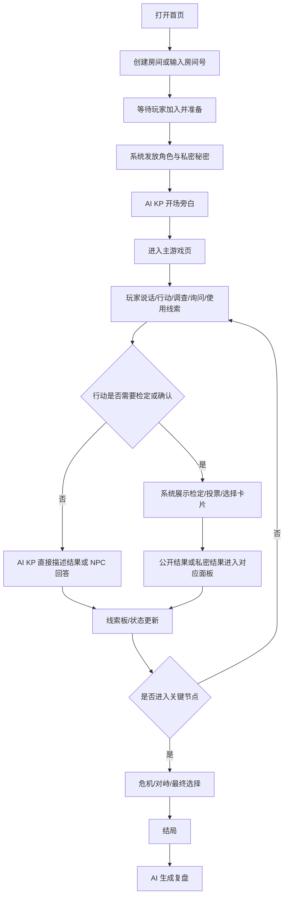
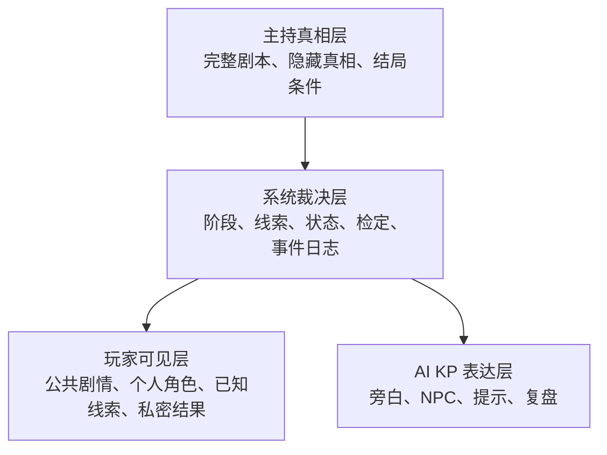
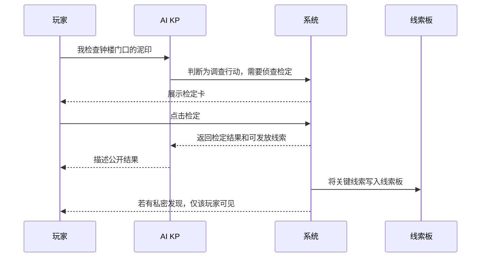

# AI Keeper 产品规划报告：多人手机端 CoC-like AI KP 跑团

日期：2026-07-08  
定位：产品方向汇报 / 组内对齐材料  
关联正式提案：[FullSpec: AI Keeper 首期产品形态与 CoC-like MVP 设计](./proposal-ai-keeper-mvp-fullspec-2026-07-08.md)

---

## 0. 先给结论

我们不应该把首期产品做成“AI 聊天跑团”，也不应该做成“完整虚拟桌游平台”。更合理的产品形态是：

> **场景式手机 AI KP 房间**：3-5 名玩家用手机进入同一局原创怪谈调查跑团。屏幕上方显示当前场景画面，中间是 AI KP 剧情流和公共讨论，底部是自然语言行动输入；角色、线索、私密结果、检定、投票和复盘通过游戏面板承载。

这套形态的核心取舍是 **“文字承载事实，图片承载场景，面板承载状态，AI 承载主持感”**。

首期 MVP 只做一件事：让 3-5 名新手玩家在没有真人 KP 的情况下，用手机完成一局 45-75 分钟的原创 CoC-like 调查短团。推荐首个游戏包为《雾港钟楼失踪案》。

---

## 1. 为什么不是继续泛泛调研

今天的任务不是证明“AI DM 有没有价值”，而是把产品想成一个可以被团队共同理解、可以进入原型和开发拆解的具体形态。

继续横向试玩大量桌游平台的收益有限，因为不同品类的核心体验差异很大：

- 狼人杀/血染钟楼类产品强在固定流程、身份权限、投票结算。
- DnD/VTT 产品强在地图、角色卡、战斗、素材和长期战役。
- AI 文本冒险强在自由输入和即时叙事。
- 剧本杀/跑团强在角色秘密、线索投放、主持节奏和复盘。

我们已经初步选择 CoC-like 高自由度调查路线，因此现在最重要的不是再比较所有品类，而是回答：

1. 玩家打开产品第一眼看到什么？
2. 一局游戏怎样从创建房间走到结局？
3. 图片、聊天、状态、线索分别放在哪里？
4. 玩家自由输入时如何不迷路？
5. AI KP 负责什么，系统面板负责什么？
6. 首期哪些不做，避免两个月内失控？

---

## 2. 产品定位

### 2.1 一句话定位

**AI Keeper 是一个面向新手聚会跑团的手机端 AI KP 主持系统。**

玩家不需要准备规则书、不需要真人主持、不需要完整虚拟桌面，只要用手机加入房间，就能体验一局带角色秘密、调查线索、NPC 对话、技能检定、关键选择和结局复盘的怪谈调查短团。

### 2.2 产品承诺

对玩家承诺：

- 我知道自己是谁：有角色、背景、目标和秘密。
- 我知道现在在哪：有当前场景、氛围图和 AI KP 旁白。
- 我知道能做什么：可以说话、行动、调查、询问、使用线索。
- 我知道自己发现了什么：线索会沉淀到线索板，不会只埋在聊天记录里。
- 我知道为什么会这样结局：结束后有真相、时间线、错过线索和个人高光复盘。

对团队开发承诺：

- 首期不是完整 CoC 规则实现。
- 首期不是完整 VTT。
- 首期不是无限开放沙盒。
- 首期是一局可控短团，验证 AI KP 能否在结构化边界内主持多人调查体验。

---

## 3. 核心产品形态：场景式手机游戏房间

### 3.1 形态取舍

| 方向 | 看起来像什么 | 优点 | 为什么不选 / 怎么吸收 |
|---|---|---|---|
| 纯聊天房间 | 一个群聊，AI 在里面当 KP | 实现快，自然语言门槛低 | 太像聊天机器人，缺少场景感、线索板和桌游状态。吸收“聊天作为主交互”。 |
| 完整 VTT | 地图、棋子、角色卡、骰子、素材并列 | 桌游工具完整，扩展性强 | 对 MVP 过重，新手会被工具压住。吸收“角色卡、骰子、状态”但做轻量面板。 |
| 视觉小说 | 大图 + 分支选项 + 对话框 | 沉浸强，演示效果好 | 自由度不足，多人讨论弱。吸收“场景图锚定氛围”。 |
| 场景式手机房间 | 场景图 + KP 剧情流 + 行动输入 + 面板抽屉 | 兼顾沉浸、自由输入和结构化状态 | 首期推荐方案。 |

### 3.2 推荐主界面

```text
┌────────────────────────┐
│ 第2幕 · 雾港钟楼        │
│ 压力 2  生命 稳定  线索 5│
├────────────────────────┤
│                        │
│        场景图片         │
│   废弃钟楼 / 雨夜 / 门廊 │
│                        │
├────────────────────────┤
│ KP 你们推开钟楼木门，   │
│    潮湿的铜锈味涌出。   │
│                        │
│ 玩家 我想检查地上的水迹 │
│                        │
│ KP 这需要一次侦查检定。 │
│    [进行检定]           │
│                        │
│ 私密结果已发送给你      │
├────────────────────────┤
│ [说话] [行动] [调查]    │
│ 我想____                │
│                    [发] │
├────────────────────────┤
│ 角色  线索  队伍  复盘  │
└────────────────────────┘
```

### 3.3 图片和聊天的关系

本产品不应该把图片当成“找隐藏物”的证据图，也不应该把图片完全塞进聊天流里偶尔出现。推荐规则是：

- **图片是场景锚点**：告诉玩家现在在钟楼、旅店、档案室、海边仓库等地点，增强氛围和方位感。
- **聊天是事实记录**：AI KP 旁白、玩家行动、NPC 回答、检定结果、公开线索以文字为准。
- **线索板是结构化记忆**：关键线索必须进入线索板，便于后续引用、推理和复盘。

这样可以避免两个常见问题：

1. 如果只有聊天，产品会退化成普通 AI 群聊。
2. 如果图片过重，玩家会误以为要靠看图找细节，增加实现和体验风险。

---

## 4. 一局游戏怎么进行

### 4.1 玩家旅程



### 4.2 关键屏幕

| 屏幕 | 目的 | 核心内容 |
|---|---|---|
| 首页 / 游戏大厅 | 快速开局 | 今日剧本、创建房间、输入房间号 |
| 房间等待页 | 组织玩家 | 房间号、玩家列表、准备状态、开始按钮 |
| 角色揭示页 | 建立代入感和权限 | 职业、背景、目标、技能、秘密 |
| 主游戏页 | 承载主要游玩 | 场景图、KP 剧情流、输入栏、状态条 |
| 线索板抽屉 | 支持推理 | 公开线索、私密线索、引用到输入框 |
| 检定/私密结果卡 | 表现跑团不确定性 | 技能、目标值、结果、仅你可见信息 |
| 关键选择/投票页 | 推进多人决策 | 选项、投票状态、倒计时/等待状态 |
| 结局复盘页 | 提供闭环 | 真相、时间线、错过线索、玩家高光 |

### 4.3 输入方式

首期推荐 **自然语言 + 行动模式提示**，而不是完全自由或完全选项制。

输入栏提供模式：

- 说话：对玩家或 NPC 说话。
- 行动：做具体动作。
- 调查：检查地点、物品、痕迹。
- 询问：向 NPC 提问。
- 使用线索：把已有线索拿出来推理或对质。

玩家仍然用自然语言表达，例如：

```text
模式：调查
输入：我想检查钟楼门口的泥印，看看是不是有人拖拽过什么东西。
```

这样既保留跑团自由度，又能降低 AI 意图识别难度，也让新手知道“我现在可以怎么参与”。

---

## 5. 首期游戏包建议：《雾港钟楼失踪案》

### 5.1 为什么选原创 CoC-like 调查短团

直接做官方 CoC 规则或官方模组有版权和复杂度风险；直接做 DnD-like 又容易被战斗、地图、数值成长拖住。原创 CoC-like 调查短团更适合首期：

- 重点在调查、氛围、NPC、线索和选择，正好能展示 AI KP 能力。
- 规则可以轻量化为技能检定、压力/生命、道具和线索。
- 单局 45-75 分钟，适合课堂/社团/项目展示。
- 原创世界观可以避开官方 IP 和商业素材风险。

### 5.2 剧本骨架

| 项目 | 建议 |
|---|---|
| 名称 | 雾港钟楼失踪案 |
| 人数 | 3-5 人 |
| 时长 | 45-75 分钟 |
| 题材 | 港口小镇 / 怪谈调查 / 低战斗 / 高氛围 |
| 玩家身份 | 记者、医生、警探、古籍修复师、失踪者亲友 |
| 核心目标 | 查明钟楼失踪案真相，在午夜前做出关键选择 |
| 主要场景 | 旅店、钟楼、档案室、守夜人小屋、海边仓库 |
| 结局类型 | 阻止仪式、揭露但牺牲、误判真相、放任危险 |

### 5.3 剧情推进节奏


### 5.4 游戏包要控制自由度

本期不要做无限沙盒。玩家可以自由表达行动，但可交互内容应该集中在有限场景、有限 NPC、有限线索和有限结局上。

可以使用“软边界”：

- 玩家想去不存在的地点：AI KP 可以承认意图，并引导到最接近的可用场景。
- 玩家提出离谱行动：系统允许尝试，但用失败、代价或 NPC 反应拉回主线。
- 玩家卡住：AI KP 给调查方向，不直接给答案。

---

## 6. AI KP 的职责边界

### 6.1 AI 应该负责的事

| 职责 | 表现 |
|---|---|
| 旁白 | 描述场景、氛围、行动后果 |
| NPC 对话 | 按 NPC 立场、动机和已知信息回答 |
| 意图理解 | 判断玩家是在说话、行动、调查、询问还是使用线索 |
| 节奏引导 | 玩家停滞时轻推调查方向 |
| 新手答疑 | 解释当前能做什么、规则大概如何运作 |
| 复盘总结 | 结局后整理真相、时间线、关键选择 |

### 6.2 AI 不应该直接负责的事

| 不应该做 | 原因 |
|---|---|
| 私自改变生命、压力、线索归属 | 状态必须可信，不能只靠模型一句话 |
| 泄露隐藏真相 | 会破坏推理和私密体验 |
| 编造关键线索 | 会导致结局不可控，玩家无法推理 |
| 替玩家做决定 | 玩家应保留行动和选择权 |
| 无限扩展世界 | MVP 需要可控边界 |

### 6.3 产品层表达

玩家不需要看到“后端状态机如何实现”，但产品必须让玩家感知到状态可信：

- 检定结果以卡片出现，而不是只由 AI 口头说。
- 私密信息进入私密消息/线索板，而不是夹在公共聊天里。
- 关键线索可被引用，而不是需要翻聊天记录。
- 结局复盘引用事件日志，而不是 AI 即兴编一段总结。

---

## 7. MVP 范围

### 7.1 必须做

| 模块 | 产品价值 | 最小验收 |
|---|---|---|
| 多人房间 | 几个人能一起玩 | 3-5 人加入同一房间，看到同一公共剧情 |
| 角色揭示 | 产生代入和私密性 | 每人看到不同角色、目标、秘密 |
| 主游戏页 | 承载核心体验 | 场景图、剧情流、输入栏、状态条可用 |
| 自然语言行动 | 保留跑团自由感 | 支持说话、行动、调查、询问、使用线索 |
| 线索板 | 支持推理 | 关键线索沉淀为卡片，可查看和引用 |
| 私密消息 | 支持信息权限 | 至少 3 次私密信息只给指定玩家 |
| 检定卡 | 支持跑团不确定性 | 至少 3 次技能检定，结果可理解 |
| 关键选择/投票 | 支持多人决策 | 至少 1 次全员选择影响结局 |
| 结局复盘 | 形成闭环 | 输出真相、时间线、错过线索、玩家高光 |

### 7.2 暂不做

- 完整官方 CoC 规则。
- 完整 VTT 地图、棋子、素材管理。
- 长期战役和角色成长。
- 复杂战斗系统。
- 多游戏包市场。
- AI 替补玩家完整自治。
- 实时图片生成作为核心玩法。
- 语音作为必须交互。
- 输入新规则自动生成游戏接入配置。

### 7.3 可作为展示加分

- 场景背景音或音效。
- AI 文字旁白朗读。
- 语音转文字输入。
- 关键节点预生成场景图。
- AI 新手导师私聊提示。

---

## 8. 信息结构与权限

### 8.1 三层信息



设计原则：

- 主持真相不直接暴露给玩家。
- 系统裁决层维护事实和权限。
- AI KP 的表达必须服从当前可见信息和游戏阶段。
- AI NPC 或导师只能使用其权限内的信息。

### 8.2 线索流转



---

## 9. 两个月推进计划

### 第 1 周：产品形态与低保真原型

- 定稿本报告和 FullSpec Proposal。
- 画 8 个关键屏幕低保真原型。
- 确认《雾港钟楼失踪案》的角色、场景、线索、结局。

### 第 2 周：可点击原型与剧本细化

- 做手机端可点击原型。
- 写完整一局示例流程。
- 明确每个场景的可调查对象、NPC 和线索。

### 第 3-4 周：MVP 骨架

- 房间、玩家、角色揭示。
- 主游戏页、剧情流、输入模式。
- 线索板、私密消息、检定卡。

### 第 5-6 周：AI KP 与游戏闭环

- 接入 AI KP 旁白、NPC、意图理解。
- 跑通调查、危机、结局、复盘。
- 组织内部试玩，修复卡流程和泄密问题。

### 第 7 周：体验打磨

- 手机端适配和信息密度优化。
- 场景图、音效、提示文案。
- 新手引导和卡住提示。

### 第 8 周：展示准备

- 固定演示路线。
- 准备备用脚本和关键截图。
- 输出项目文档、演示视频和答辩材料。

---

## 10. 汇报建议

### 10.1 5 分钟汇报结构

1. **问题**：跑团好玩，但缺 KP、规则门槛高、私密线索难管理。
2. **选择**：我们首期不做狼人杀式固定流程，也不做完整 VTT，而做 CoC-like 调查短团。
3. **产品形态**：场景式手机 AI KP 房间。
4. **一局怎么玩**：创建房间、分配角色、AI KP 开场、自由调查、检定/线索、关键选择、结局复盘。
5. **核心取舍**：文字承载事实，图片承载场景，面板承载状态，AI 承载主持感。
6. **MVP 边界**：只做一个原创短团，不做完整 CoC、完整 VTT、长期战役和语音核心交互。
7. **下一步**：画 8 个关键屏幕原型，再进入架构设计。

### 10.2 可直接使用的表述

> 我们的第一版不是一个 AI 聊天室，也不是一个完整虚拟桌游平台，而是一个手机上的 AI 跑团桌。玩家打开手机后，看到当前场景图、AI KP 剧情流和行动输入；角色、线索、私密信息、检定和投票都沉淀为可操作面板。这样既保留 CoC-like 的自由调查感，又能把两个月 MVP 控制在一个可完成的范围内。

---

## 11. 风险与应对

| 风险 | 表现 | 产品侧应对 |
|---|---|---|
| 变成普通 AI 聊天 | 只有聊天，没有桌游结构 | 保留场景图、线索板、检定卡、角色页、投票页、复盘页 |
| 信息过载 | 手机上看不清重点 | 主界面只保留场景、剧情流、输入和少量状态，其余放抽屉 |
| 新手不知道做什么 | 开放调查阶段沉默 | 输入模式提示、当前可调查方向、AI 新手导师 |
| 图片误导玩法 | 玩家以为要看图找物 | 明确图片是氛围和场景锚点，线索以文字卡片为准 |
| AI 编造关键线索 | 推理失控 | 关键线索来自游戏包，发现后进入线索板 |
| AI 泄露真相 | 推理体验被破坏 | 私密权限和 NPC 知识边界作为产品规则写入 |
| 演示不可控 | AI 临场输出跑偏 | 准备固定演示路径和备用文本 |

---

## 12. 参考与借鉴方向

本报告不依赖某一个竞品形态，而是从几类产品中各取一部分：

| 类别 | 可借鉴点 | 不直接照搬的原因 |
|---|---|---|
| AI 文本冒险 | 自然语言输入、即时叙事、AI 旁白 | 多人权限、状态和线索结构较弱 |
| VTT 桌游平台 | 角色卡、骰子、地图、在线房间 | 首期过重，仍依赖真人 GM |
| 社交推理主持工具 | 阶段推进、身份权限、投票 | 固定流程强，自由调查弱 |
| 剧本杀/跑团 | 角色秘密、线索投放、主持节奏、复盘 | 真人主持成本高，系统化程度低 |

可后续参考的产品/资料：

- AI Dungeon: https://aidungeon.com/
- Quest Portal: https://www.questportal.com/
- Friends & Fables: https://fables.gg/
- Alchemy RPG: https://alchemyrpg.com/
- Roll20: https://roll20.net/
- Generative Agents 论文: https://arxiv.org/abs/2304.03442

这些参考的价值不是告诉我们“照着谁做”，而是帮助确认首期产品的取舍：**用 AI 文本冒险的自由输入，结合桌游工具的状态和权限，再用跑团/剧本杀的线索与复盘构成完整一局。**

---

## 13. 最终建议

团队今天可以先定三个结论：

1. **首期产品形态**：场景式手机 AI KP 房间。
2. **首个游戏包**：原创 CoC-like 调查短团《雾港钟楼失踪案》。
3. **下一步工作**：基于 8 个关键屏幕画低保真原型，再进入架构设计。

这三个结论定下来之后，后续开发讨论才有稳定对象：不是抽象的“AI DM”，而是一个明确的手机端游戏房间，一条明确的一局流程，一组明确的屏幕和交互。

