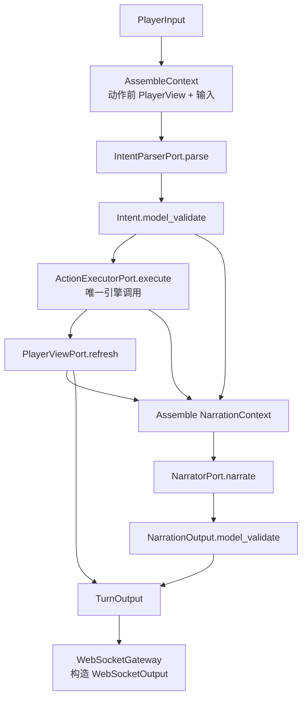
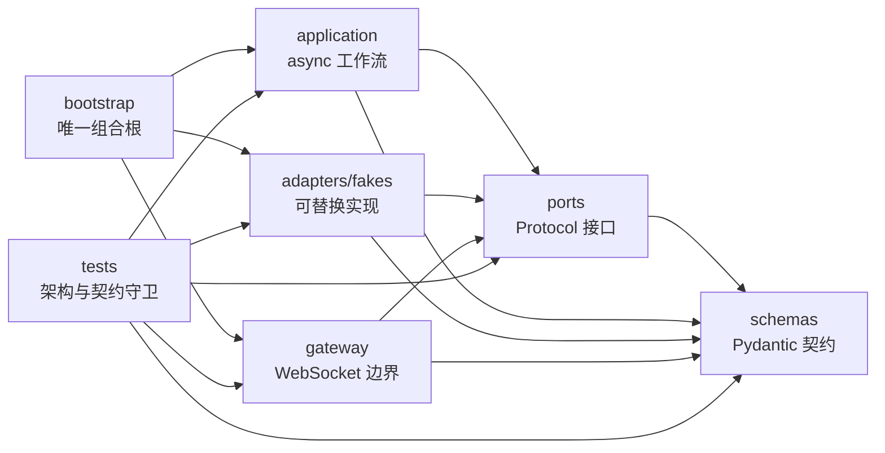

# 主持编排层工程骨架

本目录是主持编排 Agent 的独立 Python 子项目。它不复用旧后端目录，不定义规则引擎，也不绑定任何模型供应商或工作流框架。

当前阶段只冻结三类内容：

1. 模块职责与单向依赖；
2. Pydantic 数据契约；
3. async Port 方法签名与空实现位置。

当前所有 Application、Gateway 和 Fake 类均为 `TODO` 骨架，不能运行完整回合。

## 1. 永久职责边界

主持编排层负责：

- PlayerView 投影与刷新；
- IntentParser 调用；
- 严格校验 Intent；
- 调用唯一规则引擎端口 `ActionExecutor.execute()`；
- 组装脱敏的 NarrationContext；
- Narrator 调用；
- 严格校验 NarrationOutput；
- 构造 WebSocket 输出。

主持编排层不负责：

- Rule；
- Hook；
- Checkpoint；
- Dice；
- GameState 修改；
- Event 写入；
- 规则引擎事务；
- Prompt 内容；
- LangGraph 工作流。

`ActionExecutorPort` 只有 `execute()` 一个方法。主持层不能新增 `roll()`、`apply_rule()`、`save_state()`、`append_event()` 或类似旁路。

## 2. MVP 固定工作流



MVP 不包含 checkpoint、interrupt、resume、多阶段 Action 或 LangGraph。

## 3. 目录结构

```text
host-orchestrator/
├── README.md
├── pyproject.toml
├── src/
│   └── host_orchestrator/
│       ├── application/
│       ├── schemas/
│       ├── ports/
│       ├── adapters/
│       │   └── fakes/
│       ├── gateway/
│       └── bootstrap/
└── tests/
    ├── architecture/
    └── contracts/
```

### 3.1 目录职责

| 目录 | 为什么需要 | 如果没有 | 负责与边界 | 谁调用它 → 它调用谁 | 类型 | 未来可放内容 | 迁移 LangGraph |
| --- | --- | --- | --- | --- | --- | --- | --- |
| `host-orchestrator/` | 与快速变化的后端物理隔离 | 主持层再次跟随后端目录和依赖变化 | 独立包、依赖和架构说明；不承载其他系统代码 | 仓库/构建系统 → 内部包 | 工程边界 | 独立发布、版本、CI | 不修改 |
| `src/host_orchestrator/` | 提供唯一 Python 包边界 | 容易误导入仓库中其他模块 | 只容纳主持层；禁止规则、状态、数据库 | Python 运行时 → 子模块 | 工程组织 | 稳定公开 API | 不修改 |
| `application/` | 固定工作流需要唯一所有者 | 流程散落到 Gateway 和 Adapter | 编排顺序、上下文组装；禁止 I/O 和规则 | TurnPort 调用者 → Ports + Schemas | 应用逻辑 | async 工作流及以后节点实现 | 可能替换内部驱动，接口不变 |
| `schemas/` | 跨模块字段需要单一事实源 | 同一概念产生多个不兼容 DTO | 只定义 Pydantic 数据结构 | 所有层 → Pydantic/标准库 | 契约 | Schema 版本与兼容迁移 | 不修改 |
| `ports/` | 高层必须依赖接口而非 SDK | 换模型、引擎或传输会修改流程 | Protocol；不含具体实现 | Application/Gateway/Adapters → Schemas | 应用拥有的边界 | 新的稳定能力接口 | 不修改 |
| `adapters/` | 外部变化需要隔离 | 外部 SDK 和后端 DTO 污染核心 | 把外部实现适配为 Ports；不决定流程 | Bootstrap → Ports + 外部实现 | 基础设施 | 模型、引擎、投影数据源适配 | 只新增/替换实现 |
| `adapters/fakes/` | 在无真实依赖时保留装配位置 | 被迫提前接模型或引擎 | 合同占位；禁止维护 GameState | Bootstrap → Ports + Schemas | 测试基础设施 | 固定夹具、错误注入 | 不修改 |
| `gateway/` | WebSocket 只能位于边缘 | Orchestrator 绑定具体传输框架 | 输入输出适配；禁止调用 Parser/Executor/Narrator | WebSocket 服务器 → TurnPort + Schemas | 基础设施 | 身份绑定、事件信封、连接路由 | 不修改 |
| `bootstrap/` | 具体类只能集中装配 | 各层互相导入产生循环 | 创建并注入 Application、Adapter、Gateway | 进程入口 → 所有具体实现 | 组合根 | 配置和生命周期 | 仅切换工作流实现 |
| `tests/architecture/` | 文档中的依赖规则需要自动守卫 | 单向依赖会逐渐退化 | 禁止 import 和环检查 | 测试运行器 → 生产包 | 质量保障 | AST/import-linter 检查 | 基本不变 |
| `tests/contracts/` | Schema/Port 需要版本兼容证据 | Adapter 可悄悄偏离接口 | 序列化、严格字段、Port 兼容 | 测试运行器 → Schemas/Ports/Fakes | 质量保障 | 版本化载荷夹具 | 不修改 |

## 4. 核心模块

| 模块 | 职责 | 调用者 → 被调用者 | 边界 | 类型 | LangGraph 影响 |
| --- | --- | --- | --- | --- | --- |
| `application/orchestrator.py` | 固定回合步骤顺序 | TurnPort/Gateway → ContextAssembler + Ports | 不含规则、SDK、WebSocket I/O | 应用逻辑 | 可能被图驱动器替换或包裹 |
| `application/context_assembler.py` | 组装 IntentContext 和 NarrationContext | Orchestrator → Schemas | 不查询数据库、不调用外部服务 | 应用逻辑 | 可直接成为普通节点 |
| `ports/turn.py` | 稳定应用入口 | Gateway → Orchestrator 实现 | 只暴露 `run()` | Port | 不变 |
| `ports/intent_parser.py` | 隔离意图解析实现 | Orchestrator → Parser Adapter | 返回未经信任的 JsonObject | Port | 不变 |
| `ports/action_executor.py` | 唯一规则引擎入口 | Orchestrator → Engine Adapter | 只有 `execute()` | Port | 不变 |
| `ports/player_view.py` | 动作前投影、动作后刷新 | Orchestrator → PlayerView 实现 | 不暴露 GameState | Port | 不变 |
| `ports/narrator.py` | 隔离叙事实现 | Orchestrator → Narrator Adapter | 只消费 NarrationContext | Port | 不变 |
| `adapters/fakes/*.py` | 真实依赖接入前的占位 | Bootstrap → 各 Port | 不包含业务模拟 | 基础设施 | 不变 |
| `gateway/websocket.py` | WebSocket 边界 | WebSocket 服务器 → TurnPort | 不理解工作流内部步骤 | 基础设施 | 不变 |
| `bootstrap/container.py` | 唯一组合根 | 进程入口 → 具体类 | 不含条件分支和业务判断 | 基础设施 | 只切换装配对象 |

Parser 和 Narrator 的 Port 返回原始 `JsonObject`，而不是已校验模型。这样可以保证下面两个校验步骤属于 Orchestrator，而不是隐藏在某个 Adapter 内部：

```text
IntentParserPort.parse() -> JsonObject
Intent.model_validate(JsonObject) -> Intent

NarratorPort.narrate() -> JsonObject
NarrationOutput.model_validate(JsonObject) -> NarrationOutput
```

## 5. 源码依赖方向

箭头表示“左侧模块允许 import 右侧模块”。



禁止方向：

- Schemas 不得 import 任何其他项目层；
- Ports 不得 import Application、Adapters、Gateway 或 Bootstrap；
- Application 不得 import 具体 Adapter、Gateway、模型 SDK 或后端 Engine 包；
- Adapters 与 Gateway 不得互相 import；
- 除 Bootstrap 外，没有生产模块可以同时知道 Application 与具体 Adapter。

## 6. Pydantic Schema

所有顶层契约使用 `schema_version = "1"`。`ContractModel` 默认：

- `extra="forbid"`：拒绝未声明字段；
- `frozen=True`：契约对象创建后不可重新赋值。

| Schema | 结构 | 明确排除 |
| --- | --- | --- |
| `PlayerInput` | 请求 ID、可信 room/player/actor、文本、输入模式 | GameState、规则与骰子 |
| `VisibleFact` | 事实 ID、玩家可见文本 | 隐藏事实和规则轨迹 |
| `VisibleEntity` | 安全实体 ID、名称、可见描述 | 完整实体状态和秘密 |
| `AvailableAction` | 动作 ID、标签、安全目标 ID | 最终合法性与检定参数 |
| `PlayerView` | 身份、场景、版本、可见事实/实体/动作 | God View、其他玩家私有信息、Hook、Event |
| `IntentTarget` | 已匹配实体 ID、玩家原始指称 | 匹配算法和裁决 |
| `Intent` | 类型、动词、目标、内容、摘要 | Rule、Hook、Checkpoint、Skill、Difficulty、Dice、状态修改 |
| `IntentContext` | PlayerInput、动作前 PlayerView | ActionResult 与隐藏状态 |
| `ActionRequest` | 可信身份、请求 ID、已校验 Intent | GameState、Event、规则执行指令 |
| `ActionResult` | 动作 ID、状态、可见事实、叙事约束、视图版本 | 状态变更命令、Event 写入、Hook 轨迹、骰子实现 |
| `NarrationContext` | 输入、Intent、ActionResult、动作后 PlayerView | GameState、秘密、Prompt |
| `NarrationOutput` | 文本、引用事实 ID | 状态和规则决定 |
| `TurnOutput` | 请求和路由身份、叙事、刷新视图 | WebSocket 连接对象 |
| `WebSocketOutput` | 事件信封与 TurnOutput | 工作流内部对象 |

## 7. PlayerView 与规则引擎的关系

`PlayerViewPort` 是主持层拥有的投影能力，不是第二个规则引擎端口。

它只能返回主持层定义的 `PlayerView`，方法参数中也不能出现 `GameState`、Rule、Hook 或 Event 类型。未来若需要读取物化投影，应由独立 Adapter 将只读数据映射为 `PlayerView`。任何状态变化仍只能由 `ActionExecutor.execute()` 完成。

## 8. 未来迁移到 LangGraph

允许变化：

- 在 Application 内新增 LangGraph 驱动实现；
- 将当前固定步骤映射成节点；
- Bootstrap 改为装配新的 TurnPort 实现。

不允许变化：

- 不把 LangGraph State 当作跨模块 Schema；
- 不让 Gateway、Adapters 或规则引擎依赖 LangGraph；
- 不改变 Intent、ActionRequest、ActionResult、NarrationContext、NarrationOutput 和 TurnOutput 的职责；
- 不新增绕过 `ActionExecutor.execute()` 的状态入口。

## 9. 当前完成度

已完成：目录、Pydantic 结构、Protocol 签名、空 Application/Fake/Gateway/Bootstrap 类。

未实现：工作流、模型调用、Prompt、规则引擎调用、PlayerView 数据读取、WebSocket 框架接线、错误分支、业务测试。
