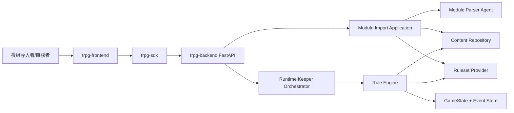
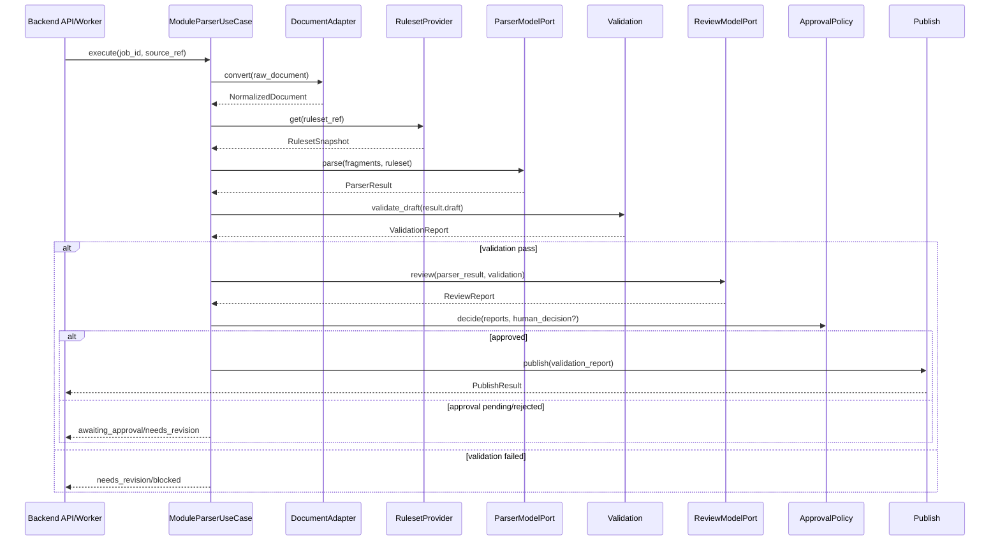

# Module Parser Architecture

> 状态：Draft v0.1 / Proposed
> 日期：2026-07-22
> 主责：成员 C
> 关联产品文档：`important_docs/module-parser-mvp-prd.md`
> 当前共享 Contract 权威：`agent-collaboration-framework/collaboration_framework/contracts/module.py`

一句话说明：本文定义 Module Parser 如何在现有 TRPG 前端、SDK、FastAPI 后端、主持 Agent 和确定性规则引擎之间完成“文档 → 可审查 ModuleDraft → 可发布 ModuleContent”的分层集成。

## 1. 文档目的与范围

本文回答以下架构问题：

- 系统由哪些层和模块组成；
- Module Parser Agent 与主持 Agent 如何编排；
- Parser 私有模型、共享 Contract、Runtime 状态如何隔离；
- Module Parser、规则引擎、前端、SDK、后端和数据库之间如何通信；
- 模组导入任务如何管理状态、错误、重试和发布；
- 哪些决定已经冻结，哪些仍为 Proposed/TBD。

本文不重新定义产品范围，不扩展当前 `ModuleContent` Schema，不把数据库占位表视为已经接入的生产能力。

### 1.1 决策状态

| 标记 | 含义 |
|---|---|
| Accepted | 已由现行代码、测试或团队决议确认 |
| Proposed | 本文推荐方案，待团队评审 |
| TBD | 必须由对应 Owner 决定 |
| Deferred | 已明确推迟，不阻塞当前阶段 |

### 1.2 权威关系

| 内容 | 权威来源 |
|---|---|
| 产品目标、MVP 与验收 | `module-parser-mvp-prd.md` |
| 当前可执行模组 Schema | `contracts/module.py` |
| A/B/C 已接受的依赖边界 | `agent-collaboration-framework/docs/architecture.md` |
| 当前 Runtime 消费证据 | `module-content-capability-matrix.md` 与测试 |
| 前后端现状 | `1024XEngineer/TRPG-master` 的 `main` 分支 |
| 本文 | Module Parser 目标集成架构与 Proposed 决策 |

## 2. 当前事实基线

### 2.1 Agent Framework 当前能力

`agent-collaboration-framework` 当前是模块化单体骨架：

- A：显式 async `Orchestrator`、Intent、Narration、PlayerView；
- B：当前 Fake/Atomic Engine、GameState、Event、ActionExecutor；
- C：`ModuleDraft`、Validation、Publish、JSON Import Workflow；
- 真实模型 SDK 尚未进入依赖；
- `ModuleContent` 已能通过发布物进入 Runtime，并完成 Checkpoint、状态修改、Event 和 WinCondition 闭环。

### 2.2 主项目前后端当前能力

`upstream/main` 当前结构为：

```text
TRPG-master/
├── trpg-frontend/   # React + Zustand
├── trpg-sdk/        # TypeScript REST/WebSocket SDK
└── trpg-backend/    # FastAPI + Pydantic + Async SQLAlchemy
```

当前已经存在：

- `POST /api/v1/modules/import`；
- `GET /api/v1/modules/import/{jobId}`；
- `GET /api/v1/modules` 与 `GET /api/v1/modules/{moduleId}`；
- `GET /api/v1/systems/{systemId}/ruleset`；
- `Scenario`、Scene、Entity、Checkpoint、SanTrigger、WinCondition、Pregen、Asset 等 ORM 表骨架；
- REST DTO → JSON Schema → TypeScript SDK codegen 流程。

但必须明确：

- 模组导入接口目前固定返回 `NOT_IMPLEMENTED`；
- Import DTO 目前只有 `source_filename` 占位，没有真实文件上传；
- `RulesetRead` 目前只有 `attributes/skills/occupations: list[str]`；
- `GameSystem.ruleset` 是最小 JSON 快照，不执行规则校验；
- 内容库 ORM 与 `ModuleContent` 尚没有正式 Lowering/Persistence Mapping；
- 主项目真实 LLM、规则引擎和服务端权威检定尚未接入；
- 主项目数据库表支持未来对象，不代表当前共享 Contract 已支持对应字段。

## 3. 架构原则

### 3.1 已冻结原则

1. Runtime 只依赖正式 `ModuleContent`，不得依赖 `ModuleDraft`、ParserResult 或 ReviewReport。
2. Parser 私有模型放在 C 的内部目录，不进入共享 `contracts/`。
3. Validation 是 `ModuleDraft → ModuleContent` 的唯一确定性转换边界。
4. Validation、Publish 和规则执行使用普通 Python，不调用 LLM。
5. Module Parser 不直接修改 GameState，不写 Runtime Event，不创建 Room。
6. A 通过 `ActionExecutor` 调用 B；A 不直接操作 B 的权威状态。
7. 共享 Contract 声明“模组能表达什么”；B 决定“声明如何确定性执行”。
8. Contract 无法表达的原文机制进入 Capability Gap 或阻断，不得静默丢弃。
9. 前端只通过 TypeScript SDK 调后端，不直接调用模型供应商或 Agent Framework。
10. 后端 DTO 变更通过既有 codegen 同步到 SDK，不手工维护重复类型。

### 3.2 Proposed 原则

1. 模组导入采用异步 Job，不在单次 HTTP 请求中等待 PDF 解析和 LLM。
2. 主流程由普通 Python Application Use Case 显式编排。
3. OpenAI Agents SDK 仅作为 `ParserModelPort`/`ReviewModelPort` Adapter 的候选默认实现。
4. 当前不引入 LangGraph；只有出现持久化长流程、复杂循环、跨进程 Human-in-the-loop 恢复时重新评估。
5. ParserResult 包装 `ModuleDraft + ParserProvenance`，Validation 仍只接收其中的 Draft。
6. 所有导入产物由 `job_id/run_id` 关联，避免 Draft、来源和 Review 报告失配。

## 4. 系统上下文与分层逻辑

### 4.1 系统上下文



### 4.2 分层

```text
Interface Layer
├── React UI
├── TypeScript SDK
├── FastAPI REST Controller
└── WebSocket Gateway

Application Layer
├── ModuleImportUseCase
├── ModuleParserUseCase
├── ReviewUseCase
├── PublishUseCase
└── Runtime Orchestrator

Domain / Contract Layer
├── Parser 私有 IR
├── ModuleContent 共享 Contract
├── Validation Policy
├── Rule/Checkpoint 声明语言
└── Runtime Action/PlayerView Contract

Infrastructure Layer
├── Document Adapters
├── LLM Adapters
├── Ruleset Provider Adapters
├── Job/Artifact/Content Repositories
├── SQLAlchemy/PostgreSQL
└── Object/File Storage
```

依赖方向必须从外层指向内层。Application 依赖 Port/Protocol，不反向依赖 FastAPI、React、OpenAI SDK 或 ORM。

## 5. 目标目录结构

### 5.1 Agent Framework / Python 核心

```text
agent-collaboration-framework/
└── collaboration_framework/
    ├── contracts/                    # A/B/C 共享、稳定
    │   ├── module.py                 # ModuleContent
    │   ├── action.py
    │   ├── player_view.py
    │   └── runtime.py
    ├── module/                       # C 私有
    │   ├── application/
    │   │   ├── import_use_case.py
    │   │   ├── parse_use_case.py
    │   │   ├── review_use_case.py
    │   │   └── publish_use_case.py
    │   ├── models/
    │   │   ├── document.py
    │   │   ├── draft.py
    │   │   ├── parser_result.py
    │   │   ├── validation_report.py
    │   │   └── review_report.py
    │   ├── ports/
    │   │   ├── document_adapter.py
    │   │   ├── parser_model.py
    │   │   ├── review_model.py
    │   │   ├── ruleset_catalog.py
    │   │   └── artifact_repository.py
    │   ├── adapters/
    │   │   ├── documents/
    │   │   │   ├── markdown.py
    │   │   │   ├── text.py
    │   │   │   ├── pdf_pymupdf.py
    │   │   │   └── docx.py
    │   │   ├── models/
    │   │   │   └── openai_agents.py
    │   │   └── rulesets/
    │   │       ├── fake_snapshot.py
    │   │       └── backend_provider.py
    │   ├── validation.py             # 现有确定性边界
    │   └── publish.py                # 现有规范化发布
    ├── host/                         # A：主持 Agent
    ├── engine/                       # B：规则与状态权威
    ├── ports/                        # 跨成员能力端口
    └── bootstrap/                    # 组合根
```

说明：这是目标逻辑目录，不要求一次性机械迁移当前文件。每次目录调整必须由真实功能驱动，避免无关重构。

### 5.2 主项目集成目录

```text
trpg-backend/app/
├── controller/v1/modules.py          # REST 入口
├── dto/module.py                     # HTTP DTO
├── service/module_import.py          # 调用 ModuleImportPort
├── integration/agent_framework/      # Proposed：后端 Adapter/装配
│   ├── module_import_adapter.py
│   ├── ruleset_provider.py
│   └── runtime_adapter.py
├── models/content.py                 # 内容库 ORM
├── models/module_import.py           # Proposed：Job/Artifact 元数据
└── worker/                            # Proposed：异步任务执行

trpg-sdk/src/
├── resources/modules.ts
└── generated/dto.ts

trpg-frontend/src/
├── routes/modules/import/             # Proposed：上传/进度
├── routes/modules/review/             # Proposed：问题与审批
└── stores/module-import-store.ts      # Proposed：客户端状态
```

## 6. 核心模块划分

| 模块 | 职责 | 输入 | 输出 | 禁止事项 |
|---|---|---|---|---|
| DocumentAdapter | 文件识别、提取、稳定分片 | RawDocument | NormalizedDocument | 不理解游戏语义 |
| ParserModelAdapter | 调用 LLM 提取结构 | fragments + ruleset | ParserResult | 不发布、不执行规则 |
| Validation | 确定性 Schema/引用/路径检查 | ModuleDraft | ValidationReport + ModuleContent? | 不调用 LLM、不修复 |
| ReviewModelAdapter | 对照原文发现遗漏/泄漏/编造 | ParserResult + validation | ReviewReport | 不修改 Draft |
| ApprovalPolicy | 决定能否发布 | reports + human decision | ApprovalDecision | 不绕过 Validation |
| Publish | 规范化序列化 | pass report/content | PublishResult | 不接受 dict/Draft |
| RulesetCatalogProvider | 根据稳定引用提供只读目录 | world/system ref | RulesetSnapshot | 不泄漏 ORM |
| ModuleImportJobService | 管理状态、重试、产物关联 | import command | job snapshot | 不承载领域解析逻辑 |
| Runtime Orchestrator | 主持回合编排 | PlayerInput | TurnOutput | 不直接修改状态 |
| Rule Engine | 确定性执行与状态/Event 权威 | ActionRequest | ActionResult | 不调用 Parser/Review |

## 7. 数据模型设计

### 7.1 数据分类

| 分类 | 模型 | 可否进入共享 contracts | Runtime 可见 |
|---|---|---|---|
| 文档输入 | RawDocument、NormalizedDocument、SourceFragment | 否 | 否 |
| Parser IR | ModuleDraft、ParserResult、ParserProvenance | 否 | 否 |
| 报告 | ValidationReport、ReviewReport、CapabilityGap | 否 | 否 |
| 发布契约 | ModuleContent | 是 | 是 |
| 导入任务 | ModuleImportJob、ArtifactRef、ApprovalDecision | HTTP/存储 DTO，非 Runtime Contract | 否 |
| 运行状态 | GameState、EngineExecutionResult、Event | B 私有 | B 内部 |
| 玩家投影 | ProjectionSnapshot、PlayerView、ActionResult | 按现有 A/B Contract | 仅安全视图 |

### 7.2 RawDocument / NormalizedDocument / SourceFragment（Proposed）

```text
RawDocument
├── document_id
├── filename
├── media_type
├── sha256
└── storage_ref

NormalizedDocument
├── document_id
├── source_sha256
├── converter_name
├── converter_version
├── fragments: tuple[SourceFragment, ...]
├── assets: tuple[DocumentAssetRef, ...]
└── warnings: tuple[PreprocessIssue, ...]

SourceFragment
├── id                         # 同输入、同转换器版本下稳定
├── document_id
├── locator                    # 页码/章节/段落
├── page_number: int | None
├── block_order: int
├── text
├── section                    # keeper/player/unclassified
└── bounding_box: tuple | None
```

### 7.3 ModuleDraft（Accepted 当前形状）

当前 `ModuleDraft` 与 Phase 1 `ModuleContent` 顶层同形：

```text
ModuleDraft
├── module_id
├── version
├── world_ref
├── scenes
├── entities
├── checkpoints
└── win_conditions
```

它是严格 Parser IR，但允许由 Validation 聚合报告语义问题。它不从 `collaboration_framework.module` 包级接口导出。

### 7.4 ParserResult 与 Provenance（Proposed）

```text
ParserResult
├── run_id
├── draft: ModuleDraft
├── provenance: ParserProvenance
├── unresolved_questions
└── capability_gaps

ParserProvenance
├── source_sha256
├── field_sources              # draft path → fragment ids
├── parser_model
├── model_provider
├── prompt_version
├── ruleset_id
├── ruleset_version/revision
├── converter_name/version
└── created_at
```

采用包装而不是把 provenance 加进 ModuleDraft，避免 Parser 证据误入 `ModuleContent`；`run_id` 保证 Draft 和证据不会失配。

### 7.5 RulesetSnapshot（Proposed）

```text
RulesetSnapshot
├── canonical_id
├── version
├── revision: str | None
├── attributes: tuple[CatalogEntry, ...]
├── skills: tuple[CatalogEntry, ...]
└── occupations: tuple[CatalogEntry, ...]   # Parser 可选，当前 Validation 非必需

CatalogEntry
├── id
├── name
├── aliases
├── enabled
├── category: str | None
├── family: str | None
└── specialization: bool
```

当前后端 `RulesetRead(list[str])` 不足以承载 alias、稳定 ID 和 revision；具体扩展由 Ruleset Owner/后端负责人确认。

### 7.6 ValidationReport（Accepted）

```text
ValidationReport
├── status: pass | needs_revision | blocked
├── content: ModuleContent | None
├── errors: tuple[ValidationIssue, ...]
└── warnings: tuple[ValidationIssue, ...]

ValidationIssue
├── severity
├── code
├── path
└── message
```

### 7.7 ReviewReport（Proposed）

```text
ReviewReport
├── status: pass | needs_revision | blocked
├── findings: tuple[ReviewFinding, ...]
└── unresolved_questions

ReviewFinding
├── severity
├── code
├── draft_path
├── source_references
├── message
└── suggested_action
```

ReviewReport 不包含自动修改后的 Draft；修订必须产生新的 run/revision 并重新 Validation。

### 7.8 ModuleContent（Accepted）

当前唯一顶层字段：

```text
module_id
version
world_ref
scenes
entities
checkpoints
win_conditions
```

SanTrigger、Pregen、Asset、完整 Expr 等即使后端已有 ORM 表，也不得在当前 Parser 输出中冒充共享 Contract 能力。

## 8. Module Parser Agent 与主持 Agent 编排

### 8.1 两个一级 Agent

```text
Module Parser Agent（离线/异步）
├── Parser Pass（LLM）
├── Validation（Python）
├── Review Pass（LLM）
└── Approval/Publish（Python + 可选人工）

Runtime Keeper Agent（在线/低延迟）
├── PlayerViewProjector
├── IntentParser（模型端口）
├── ActionExecutor（B）
└── Narrator（模型端口）
```

Parser Pass 和 Review Pass 是同一 Module Parser Agent 的内部阶段，不是两个一级 Agent，也不需要 handoff 对话。

### 8.2 Module Parser 编排



### 8.3 主持 Agent 编排（Accepted）

```text
WebSocket PlayerInput
→ Orchestrator.run()
→ PlayerView before
→ IntentParser
→ ActionExecutor.execute() 恰好一次
→ PlayerView after
→ Narrator
→ player-safe TurnOutput
```

两条 Agent 链路只通过发布后的 `ModuleContent` 间接相交。主持 Agent 不读取 Parser prompt、provenance 或 Review finding。

### 8.4 Agent SDK 边界

```text
ParserModelPort / ReviewModelPort
        ↑
OpenAIAgentsAdapter（Proposed）
```

- Application 层拥有输入输出政策；
- Adapter 负责模型、工具、重试、usage 和 trace；
- Pydantic Schema Gate/Validation 不交给 SDK 决定业务语义；
- 模型替换只增加 Adapter，不修改 Runtime 或共享 Contract；
- Prompt 版本必须记录到 ParserProvenance。

## 9. 规则引擎边界

### 9.1 所有权

B/规则引擎拥有：

- GameState 权威读写；
- Rule/Hook dispatcher；
- Checkpoint 选择复核与检定结果；
- Dice、SAN、资源变化等 Ruleset 执行；
- Operation 应用；
- Event 追加、幂等、事务和重放；
- WinCondition 求值；
- Player-safe ActionResult 和 ProjectionSnapshot。

C/Module Parser 拥有：

- 从原文提取声明；
- 对声明做静态校验；
- 对照原文做 Review；
- 发布共享 ModuleContent。

### 9.2 编译/执行边界

```text
ModuleContent（声明）
→ B 的 Runtime Loader/Compiler
→ Rule/Checkpoint 索引
→ ActionRequest
→ 确定性执行
→ StateChange + Event
→ ActionResult/ProjectionSnapshot
```

Parser 不模拟规则引擎来判断运行结果；Runtime 不宽容接受非法 Draft。若 Contract 声明与引擎消费能力不一致，记录为 Contract/Runtime Gap，由 B/C 共同决策。

### 9.3 Ruleset 与 ModuleContent

Ruleset 是跨模组的规则目录与执行政策；ModuleContent 是单个模组的声明：

```text
Ruleset
├── 属性/技能 canonical ID
├── 检定与骰子政策
├── Hook/Operation Catalog（未来）
└── SAN 等系统级规则

ModuleContent
├── 场景与实体
├── 在哪里可以检定
├── 成功/失败产生什么声明式结果
├── 实体规则
└── 终局条件
```

`world_ref` 到 GameSystem/Ruleset 的稳定映射仍为 TBD；本文推荐稳定业务键而非环境相关 UUID。

## 10. 前端、SDK、后端与 Agent Framework 边界

### 10.1 前端

前端负责：

- 选择/上传文件；
- 展示导入进度；
- 展示 Validation、Review、Capability Gap 和来源；
- 收集人工批准/驳回；
- 展示已发布模组。

前端不负责：

- PDF/OCR；
- 调用 LLM；
- 判断技能或状态路径是否合法；
- 构造正式 ModuleContent；
- 修改导入 Job 的权威状态。

Zustand 只保存 UI 缓存、当前 jobId 和筛选状态；刷新后从后端恢复。

### 10.2 TypeScript SDK

SDK 负责：

- 封装 REST/WebSocket；
- 提供生成的 DTO 类型；
- 暴露 startImport/getImportJob/getImportReport/approve 等资源方法；
- 不包含业务 Validation 或 Agent 编排。

所有 DTO 改动沿用后端 JSON Schema → SDK codegen 与 drift CI。

### 10.3 FastAPI 后端

后端负责：

- 鉴权与授权；
- 文件大小/MIME/速率限制；
- 创建与查询 Import Job；
- 调度 Worker；
- 保存 Artifact、报告和审批记录；
- 将发布物映射到内容库；
- 向前端提供稳定 REST DTO；
- 装配 Agent Framework 的 Port Adapter。

Controller 不包含 Parser prompt、文档转换或规则逻辑。

### 10.4 Agent Framework

Agent Framework 负责：

- Module Parser 和 Runtime Keeper 的应用/领域逻辑；
- Parser/Review 模型 Port；
- Validation 与共享 Contract；
- Rule Engine Port 和当前实现；
- 与 Web/ORM/SDK 无关的确定性测试。

推荐将 Agent Framework 作为后端可安装的 Python 包或同仓内部包集成，而不是由前端远程直连；是否拆成独立服务推迟到性能、隔离或部署证据出现后。

## 11. 状态管理方案

### 11.1 状态分类与单一事实源

| 状态 | 权威所有者 | 持久化 | 前端能否修改 |
|---|---|---|---|
| Import Job 状态 | 后端 Job Service | DB | 否 |
| 原始文件/转换产物 | Artifact Repository | Object/File Storage | 仅上传 |
| Parser/Review 报告 | 后端/Artifact Repository | DB 元数据 + Artifact | 否 |
| Approval Decision | 后端 | DB/审计记录 | 通过受控 API 提交 |
| Published ModuleContent | Content Repository | DB/规范化 JSON | 否 |
| Runtime GameState | B Rule Engine | Runtime Store | 否 |
| Runtime Event | B Event Store | Append-only | 否 |
| 前端 UI 状态 | Zustand | 内存/可选本地缓存 | 是，不具权威性 |

### 11.2 Import Job 状态机（Proposed）

```text
queued
→ preprocessing
→ parsing
→ validating
→ reviewing
→ awaiting_approval
→ publishing
→ published

任一执行阶段
→ needs_revision | blocked | failed | cancelled
```

约束：

- 状态转换只能由 Job Service 执行；
- `published` 必须关联 `result_scenario_id` 或发布 Artifact；
- `needs_revision` 表示内容可修；`blocked` 表示缺核心输入/外部依赖；`failed` 表示系统执行失败；
- 重试产生新的 attempt/run_id，不覆盖旧报告；
- 相同文件是否去重由 SHA-256 + 用户显式选择决定，不自动复用旧审批；
- Job API 不直接返回整份原文或大型报告，使用摘要与 Artifact/Report endpoint。

### 11.3 Runtime 状态

Parser 输出中的 `Entity.state` 是模组声明，不等于自动创建的 GameState。Room/GameState 初始化仍由后端/B 的 Runtime Session 流程负责。

Runtime 状态更新必须：

- 由 ActionExecutor/Engine 执行；
- 原子提交 StateChange 与 Event；
- 支持 request id 幂等；
- 不接受前端或 LLM 直接提交任意状态 path。

## 12. API 设计

### 12.1 API 原则

- 保留现有 `/api/v1/modules/import` 异步任务形态；
- REST 使用现有 `{success, data, error}` 信封；
- 文件上传、Job 状态、报告、审批和发布分离；
- 列表/状态 API 返回轻量摘要；
- 详细问题使用稳定 code/path/severity；
- DTO 通过 codegen 同步 SDK。

### 12.2 创建导入任务

```http
POST /api/v1/modules/import
Content-Type: multipart/form-data

file: <binary>
worldRef: coc-7e | null
approvalMode: manual | policy | null
```

响应：

```json
{
  "success": true,
  "data": {
    "jobId": "...",
    "status": "queued",
    "sourceFilename": "module.pdf",
    "createdAt": "...",
    "updatedAt": "..."
  },
  "error": null
}
```

说明：当前 `ModuleImportRequestBody(sourceFilename)` 是占位 DTO；真实文件上传采用 multipart 后需要更新后端 DTO/Controller 和 SDK。是否支持先上传 Artifact 再提交 JSON 命令可在大文件需求出现后评估。

### 12.3 查询任务

```http
GET /api/v1/modules/import/{jobId}
```

建议返回：

```text
jobId
status
stage
progress                 # 可选估算，不承诺精确百分比
sourceFilename
attempt
validationSummary
reviewSummary
resultScenarioId
error
createdAt/updatedAt
```

### 12.4 查询报告

```http
GET /api/v1/modules/import/{jobId}/report
```

返回：

```text
preprocessWarnings
validationIssues
reviewFindings
unresolvedQuestions
capabilityGaps
provenanceSummary
approvalStatus
```

来源正文按 fragment 分页/按需读取，避免一次返回整份受版权保护或敏感的模组原文。

### 12.5 人工决策

```http
POST /api/v1/modules/import/{jobId}/decision
Content-Type: application/json

{
  "decision": "approve | reject | request_revision",
  "acceptedWarningCodes": [],
  "comment": "..."
}
```

只有具备对应权限的用户可操作；必须记录 actor、时间、目标 run_id 和接受的 warnings。

### 12.6 发布

两种候选方式：

- A：审批后 Job Service 自动进入 `publishing`；
- B：显式 `POST /modules/import/{jobId}/publish`。

本文推荐 A，减少重复命令；最终由 Approval Policy ADR 决定。Publish 必须使用 ValidationReport 中的正式 `ModuleContent`，不得从前端重新提交内容 dict。

### 12.7 Ruleset API 演进

当前：

```http
GET /api/v1/systems/{systemId}/ruleset
```

Proposed 最小响应：

```json
{
  "canonicalId": "coc-7e",
  "version": "7e",
  "revision": "...",
  "attributes": [{"id":"STR","name":"力量","aliases":["strength"],"enabled":true}],
  "skills": [{"id":"spot-hidden","name":"侦查","aliases":["spot_hidden"],"enabled":true}],
  "occupations": []
}
```

`world_ref → system_id` 的解析入口可以是独立 endpoint 或后端内部 Provider；不得要求 C 直接查询 ORM。

### 12.8 错误设计

HTTP 信封继续使用主项目 `ErrorCode`；导入报告内部使用细粒度稳定错误码：

| code | 阶段 | 结果 |
|---|---|---|
| `import.unsupported_media_type` | API | 拒绝创建/blocked |
| `preprocess.empty_document` | Preprocess | blocked |
| `preprocess.ocr_required` | Preprocess | blocked 或 warning（按支持等级） |
| `parser.model_failed` | Parser | 有限重试后 failed/blocked |
| `parser.output_schema_invalid` | Parser | 有限重试后 needs_revision/blocked |
| `ruleset.not_found` | Ruleset | 生产 blocked；测试可注入 Snapshot |
| `validation.*` | Validation | needs_revision/blocked |
| `review.possible_omission` | Review | warning/error |
| `review.source_unsupported` | Review | needs_revision |
| `publish.not_approved` | Publish | blocked |
| `publish.invalid_report` | Publish | blocked |

错误详情不得暴露模型密钥、数据库错误、内部路径或未经授权的秘密原文。

## 13. 安全与权限

- 文件扩展名不能替代 MIME/内容检查；
- 设置文件大小、页数、解压大小、处理时间和并发限制；
- DOCX/PDF 转换在受限环境运行，禁止执行嵌入脚本；
- 原始模组、Prompt/trace 和解析结果按用户/房间权限隔离；
- LLM trace 默认避免记录完整敏感原文，必要时脱敏或关闭内容采集；
- Review 页面区分 keeper-only 与 player-visible 信息；
- Approval 和 Publish 需要授权并写审计记录；
- Runtime 只加载不可变发布物，不读取用户可修改的临时 Artifact。

## 14. 可靠性、幂等与重试

- 上传创建 Job 使用 idempotency key 或客户端 request id；
- 文档转换按 `source_sha256 + converter_version` 可重复；
- LLM 重试有固定上限，记录 attempt、模型、Prompt 和 usage；
- Validation 不重试，失败直接报告全部问题；
- Review 失败不降级成“已审查”；
- Publish 使用原子写入/临时文件替换，避免半成品；
- Worker 崩溃后可从最近持久化阶段重启，但不得重复发布；
- 已发布 run 的后续修订产生新版本，不覆盖审计记录。

## 15. 可观测性与审计

每个 Job 贯穿：

```text
request_id
job_id
run_id
attempt
source_sha256
module_id/version（生成后）
model/prompt_version
ruleset_id/version/revision
converter/version
```

记录：

- 各阶段耗时；
- Token/模型费用；
- 重试次数；
- Validation/Review 错误码分布；
- 发布与审批操作者；
- Artifact 引用和保留期限。

模型 trace 是诊断信息，不是业务权威；业务状态仍由 Job Repository 和报告模型决定。

## 16. 测试与质量策略

### 16.1 测试层次

| 层 | 测试 |
|---|---|
| Contract | frozen、extra forbid、枚举、必填、跨引用 |
| Document Adapter | 格式识别、稳定 fragment、页码、空文档、OCR warning |
| Parser Adapter | Fake model、Schema Gate、重试、provenance |
| Validation | 每个稳定错误码与多错误聚合 |
| Review | 人工植入遗漏、泄漏、颠倒和无来源推断 |
| Publish | pass-only、规范化、等价重载、原子写入 |
| Backend API | 权限、上传、状态机、轮询、审批、错误信封 |
| SDK/codegen | DTO drift 与资源方法 |
| E2E | 文件 → Publish → Runtime Load |

### 16.2 黄金样例

《追书人》作为首个 Evaluation Golden Case：

- 人工提取预期；
- Phase 1 可表达 ModuleContent；
- Capability Gaps；
- 页码/章节来源；
- Parser 与 Review 指标。

具体准确率阈值在人工黄金答案完成后由产品主责与 B/C 共同批准。

## 17. 部署与演进

### 17.1 MVP 部署

推荐保持模块化单体：

- FastAPI 提供 API；
- 同一代码库的 Worker 执行异步导入；
- Agent Framework 作为 Python 包接入；
- DB 保存 Job/报告元数据；
- 文件/对象存储保存原始文档与大型 Artifact。

MVP 不需要为了“Agent”单独拆微服务。

### 17.2 拆分触发条件

只有出现以下证据才考虑独立 Parser Service 或 LangGraph/工作流平台：

- 文档处理需要独立扩缩容/GPU；
- 导入任务持续很久且必须跨部署恢复；
- 多阶段人工审批需要长期暂停；
- Parser 与 Backend 有独立发布节奏；
- 安全隔离要求模型处理在独立网络/进程；
- 显式 Python 状态机已经无法维护。

## 18. Open Decisions

| ID | 问题 | 推荐 | Owner | 阻塞 |
|---|---|---|---|---|
| OD-01 | `world_ref` 如何映射 Ruleset | 稳定业务键，不用环境 UUID | Ruleset/后端 + C | 生产 Catalog 接入 |
| OD-02 | canonical ID/alias | Ruleset 维护；Parser 显式归一化；Validation 不静默改写 | Ruleset Owner + B/C | 生产 Validation |
| OD-03 | Ruleset Provider/version/缺失 | 版本化只读 Snapshot；生产缺失 blocked | 后端 + B/C | 生产发布 |
| OD-04 | 模型运行层 | OpenAI Agents SDK Adapter 候选默认 | Agent 团队 | M3 Parser |
| OD-05 | provenance | ParserResult 包装 Draft + Provenance | C | M3 Parser |
| OD-06 | Review 模型/失败策略 | 结构化 Review；失败不得标记已审查 | C/产品 | M4 Review |
| OD-07 | 人工审批 | LLM 产物生产发布前默认人工确认 | 产品/团队 | M5 Publish |
| OD-08 | DOCX/扫描 PDF | DOCX 目标支持；扫描 PDF 分级支持 | C/产品 | 输入承诺 |
| OD-09 | 版本记录 | 全部写入 ParserProvenance/报告 | C/后端 | 可审计性 |
| OD-10 | 黄金阈值 | 人工答案后由产品主责 + B/C 批准 | 产品 + B/C | MVP 验收 |
| OD-11 | ModuleContent → ORM Mapping | 单独 Persistence Mapping，不直接复用 ORM 为 Contract | 后端 + B/C | 内容库发布 |
| OD-12 | Job 执行器 | MVP 后台 Worker 方案 | 后端 | API 实现 |

## 19. 分阶段实施

```text
Stage A：评审 PRD/ARCH + 最小 Ruleset 决策
Stage B：DocumentAdapter + SourceFragment + 《追书人》黄金样例
Stage C：ParserModelPort + OpenAI Agents SDK Spike + ParserResult
Stage D：接入现有 Validation + Import Job API
Stage E：ReviewModelPort + ReviewReport + 人工错误集
Stage F：Approval + Publish + Content Mapping
Stage G：Published ModuleContent → Runtime 集成回归
```

每个 Stage 都必须保留 Fake/离线测试。不得为了展示完整链路而让未实现阶段假装成功。

## 20. 下一步

1. B/C/后端共同评审第 3、9、10、11、12 和 18 节；
2. 接受或修订 OD-01～OD-05；
3. 用本 ARCH 补全 PRD 的功能清单、逐功能完成定义、数据字段和错误矩阵；
4. 为 Stage B 建立独立 Issue；
5. 在技术 ADR 中最终确认 OpenAI Agents SDK、LangGraph 暂缓和 ParserResult；
6. 未完成 Ruleset 生产决策前，继续使用测试 Snapshot，不阻塞 DocumentAdapter。
