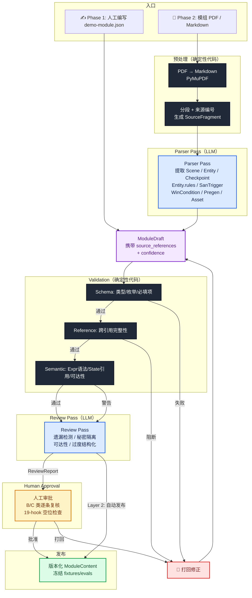

# Module Parser Pipeline 设计

> 日期：2026-07-17（对齐 codex/agent-collaboration-aligned 架构）
> 定位：Module Parser Agent——将非结构化 CoC 模组编译为 Runtime 可执行的 ModuleContent
> 主责：成员 C
> 前置：`agent-collaboration-framework/docs/architecture.md` / `contracts/module.py` / `数据模型设计.md`
>
> **框架对齐说明**：本文档描述完整目标状态。当前 `contracts/module.py` 中的 Spec 模型是 MVP 简化版——Entity.kind 仅 3 种（npc/object/location）、无 SanTrigger/Pregen/Asset、Rule 使用 ConditionSpec（非 Expr）、Checkpoint.difficulty 不可空。Phase 2 逐步对齐。C 私有模型（ModuleDraft、ValidationReport、ReviewReport）放在 `module/` 目录，不进入 `contracts/`。

---

## 〇、系统定位

### 〇.1 项目中只有两个一级 Agent

```text
Arkham Case Files
├── Module Parser Agent（离线）    ← 本文档
│   输入: PDF / Markdown
│   输出: ModuleContent
│   内部: Parser Pass → Validation → Review Pass → Human Approval
│
└── Runtime Keeper Agent（在线）
    输入: 玩家自然语言
    输出: AI 叙事 + 状态更新
    内部: ContextAssembler → Planner → Engine → Narrator
```

Parser 和 Review 是 Module Parser Agent 内部的两个工作流阶段。它们不是独立 Agent。

### 〇.2 本质是编译器，不是聊天机器人

```
编译器类比：

  源码（模组原文）
    → 词法/语法分析（Preprocess + Parser Pass）
    → 语义分析（Validation）
    → 优化 + 警告（Review Pass）
    → 人工审批（Human Approval）
    → 目标代码（ModuleContent）

不是：

  用户提问 → LLM 回答
```

---

## 一、完整 Pipeline（Mermaid）



**关键设计**：`PARSER_NODE` 是 Parser Pass，`REV` 是 Review Pass。两者同属 Module Parser Agent 的内部阶段，不是独立 Agent。Parser Pass 使用单次 LLM 调用完成全部提取；若后续实测发现单 Pass 遗漏率过高，可再拆分为两 Pass。

---

## 二、两阶段策略

```text
Phase 1（当前 MVP）：人工编写 demo-module.json
  → Validation → Review Pass → Human Approval → ModuleContent
  → 目标：跑通校验 + 审批管线，给 Runtime Keeper Agent 提供稳定数据契约
  → 不涉及 Parser Pass（数据是人工写的）

Phase 2（Runtime 稳定后）：模组原文自动导入
  → 预处理 → Parser Pass → ModuleDraft
  → 然后汇入与 Phase 1 完全相同的 Validation → Review → Human Approval → 发布管线
  → 目标：让任意 CoC 模组自动编译为可执行内容
```

---

## 三、每个阶段的详细设计

### 3.1 预处理（Preprocess）——确定性代码

**职责**：将原始文件转为干净的、可追溯的结构化文本。

| 步骤 | 工具 | 输入 | 输出 |
|------|------|------|------|
| PDF 提取 | PyMuPDF | 模组 PDF | Markdown 文本 |
| 章节识别 | 标题层级解析 | Markdown | 章节树（h1/h2/h3） |
| 段落编号 | 确定性分片算法 | 章节树 | `SourceFragment[]`（稳定 ID） |
| 边界识别 | 关键词匹配 | SourceFragment[] | 标注"守秘人信息"/"玩家信息" |

**SourceFragment**：

```python
class SourceFragment(BaseModel):
    id: str          # "src_ch3_p12_005" — 稳定可引用
    locator: str     # "第三章 / 第12页 / 第5段"
    text: str
    section: Literal["keeper_info", "player_info", "unclassified"]
```

**为什么用确定性代码而不是 LLM**：段落编号必须稳定（同一 PDF 两次运行得到相同 ID）。LLM 输出不可复现。章节边界识别用 h1-h6 就够了。

---

### 3.2 Parser Pass（LLM）——Module Parser Agent 的第一个内部阶段

**职责**：从模组原文中提取结构化数据。**单次 LLM 调用**，输出 ModuleDraft。

**为什么先单 Pass？**

两 Pass 的理论收益（拆分关注点）被级联错误风险和双倍延迟抵消了——Pass 1 遗漏的实体，Pass 2 修不回来，反而产生引用断裂。单 Pass 所有信息在同一个注意力窗口里，LLM 在 prompt 中按"先提取基础信息，再补充机制字段"的顺序完成全部提取。若后续实测单 Pass 遗漏率过高，再考虑拆分。

**提取目标（按提取顺序组织 prompt）**：

**基础信息（高置信度）**：

| 提取目标 | 置信度 | 说明 |
|---------|--------|------|
| ModulePack 元信息（title, authors, players_min/max, difficulty） | 🟢 高 | 模组标识和发布元数据 |
| ModuleContent 基础字段（module_id, version, world_ref） | 🟢 高 | 模组标识和规则系统绑定 |
| Scene[] | 🟢 高 | 场景名称、描述、出口关系 |
| Entity[]（基本信息） | 🟢 高 | name, kind, content, public_persona, stats（可为 null） |
| Checkpoint[]（文本描述） | 🟢 高 | match_hint, skill, on_success/on_fail 的自然语言描述 |
| Pregen[] | 🟢 高 | 预设角色卡，格式规整 |
| Asset[] | 🟢 高 | 模组附带的图片、地图、文字材料引用 |
| SanTrigger.loss/condition | 🟢 高 | 原文通常直接写 "0/1d6" |

**机制信息（需要领域知识，易错——Review Pass 和人工复核兜底）**：

| 提取目标 | 置信度 | 说明 |
|---------|--------|------|
| Entity.rules[] | 🟡 中 | `(hook, when, then)` 三元组。LLM 不愿生成 forbid 类 |
| Entity.refuse_ops[] | 🟡 中 | A 类：绝不可执行的操作 |
| Entity.state{} | 🟡 中 | D 类：被 Rule/Expr 引用的值 |
| Checkpoint.difficulty | 🟡 中 | 可为 null——运行时软判据决定 |
| SanTrigger.kind | 🟠 低 | 六值枚举，direct 和 check 易混淆 |
| SanTrigger.source_tag | 🟠 低 | 累计封顶的分组键 |
| WinCondition.expr | 🟠 低 | 表达式语法 |
| WinCondition.is_ending | 🟠 低 | 回滚 vs 终局 |

**Parser Pass 的硬约束**：

1. 每个字段必须携带 `source_references`（追溯到 SourceFragment.id）
2. 原文不含的信息不得凭空补造
3. 不确定的字段标记在 `unresolved_questions` 中
4. `Entity.secrets` 和 `Entity.public_persona` 必须严格分离

**技术实现**：

```python
from pydantic_ai import Agent

parser_pass = Agent(
    model="claude-opus-4",
    result_type=ModuleDraft,
    system_prompt="""你是 CoC 模组的结构化解析器。

从模组原文中按以下顺序提取：

一、基础信息
- ModulePack 元信息（title, authors, players_min/max, difficulty）
- Scene（名称、描述、出口关系）
- Entity（name, kind, content, public_persona, secrets, stats）
- Checkpoint（match_hint, skill, on_success/on_fail 描述）
- Pregen（预设角色卡）、Asset（附件引用）
- SanTrigger（loss 值、触发条件描述）

二、机制信息（基于已提取的基础信息）
- Entity.rules（hook-when-then 三元组，hook 从 19 个中选）
- Entity.refuse_ops（A 类：绝不可执行的操作）
- Entity.state（仅 D 类：被 Rule/Expr 引用的键）
- Checkpoint.difficulty（可为 null——运行时软判据决定）
- SanTrigger.kind（六值枚举：check/flat/direct/max_reduce/gain/capped）
- WinCondition.expr + is_ending

约束：
1. 每个字段携带 source_references
2. 原文不含的信息不得凭空补造
3. 不确定的字段标为 null，记入 unresolved_questions
4. secrets 和 public_persona 必须严格分离
5. when 必须是 Expr 语法（比较/布尔/算术），不能写自然语言
6. kind=direct 与 kind=check 不同：direct 不走 SAN 检定
7. is_ending=false 表示状态回滚，不是终局""",
    tools=[query_skill_catalog, query_hook_catalog, query_op_catalog],
)
```

---

### 3.3 Validation（确定性代码）——零 LLM

**职责**：发现确定性的错误。所有错误在数学上可证明——不需要"理解"模组，只需要检查数据结构。

#### Layer 1：Schema 校验

```python
def validate_schema(draft: dict) -> list[ValidationIssue]:
    """Pydantic model_validate。阻断。"""
    try:
        ModuleContent.model_validate(draft)
    except ValidationError as e:
        return [_to_issue(err) for err in e.errors()]
```

| 检查项 | 示例 |
|--------|------|
| 字段类型 | `Entity.kind` 必须是 6 种枚举之一 |
| 必填项 | `Checkpoint.skill` 不可为空 |
| 枚举值 | `SanTrigger.kind` 必须是 check/flat/direct/max_reduce/gain/capped |
| 额外字段 | Model 中未定义的字段 → 拒绝 |
| ID 格式 | `entity_id` 不能含空格 |

#### Layer 2：引用完整性校验

```python
def validate_references(content: ModuleContent) -> list[ValidationIssue]:
    """跨引用完整性。阻断。"""
    issues = []
    entity_ids = {e.id for e in content.entities}
    scene_ids = {s.id for s in content.scenes}
    checkpoint_ids = {c.id for c in content.checkpoints}
    state_keys = _collect_all_state_keys(content)

    # Scene → Entity / Checkpoint
    for scene in content.scenes:
        for eid in scene.entity_ids or []:
            if eid not in entity_ids:
                issues.append(error("scene.ref.entity_not_found", scene.id, eid))
        for cid in scene.checkpoint_ids or []:
            if cid not in checkpoint_ids:
                issues.append(error("scene.ref.checkpoint_not_found", scene.id, cid))

    # Checkpoint → Scene / Entity
    for cp in content.checkpoints:
        if cp.scene_id not in scene_ids:
            issues.append(error("checkpoint.ref.scene_not_found", cp.id))
        if cp.target_id and cp.target_id not in entity_ids:
            issues.append(error("checkpoint.ref.target_not_found", cp.id))

    # Rule → State
    for entity in content.entities:
        for rule in entity.rules or []:
            refs = _extract_state_refs(rule.when)
            for ref in refs:
                if ref not in state_keys:
                    issues.append(error("rule.ref.state_not_found", entity.id, ref))

    # WinCondition → State
    for wc in content.win_conditions:
        refs = _extract_state_refs(wc.expr)
        for ref in refs:
            if ref not in state_keys:
                issues.append(error("wincon.ref.state_not_found", wc.id, ref))

    # 顶层禁止 rules
    if hasattr(content, 'rules') and content.rules:
        issues.append(error("top_level.rules_forbidden", "module", None))

    return issues
```

#### Layer 3：语义校验

```python
def validate_semantics(content: ModuleContent) -> list[ValidationIssue]:
    """非阻断。警告。"""
    issues = []

    # Expr 语法
    for entity in content.entities:
        for rule in entity.rules or []:
            if not _expr_parser.is_valid(rule.when):
                issues.append(warning("rule.expr.syntax", entity.id, rule.when))

    # State 引用完整性（数据模型.md §7.2）：未被引用的 key 应降级
    all_refs = _collect_all_expr_refs(content)
    for key in _collect_all_state_keys(content):
        if key not in all_refs:
            issues.append(warning("state.unreferenced", key))

    # 可达性：每个 Checkpoint 是否有到达路径
    for cp in content.checkpoints:
        if not _has_path_to(content, cp.scene_id):
            issues.append(warning("checkpoint.unreachable", cp.id))

    # 循环依赖：柜子需要钥匙，钥匙在柜子里
    cycles = _find_state_cycles(content)
    for cycle in cycles:
        issues.append(warning("state.circular_dependency", str(cycle)))

    # 起始 Scene 缺失
    if not _has_start_scene(content):
        issues.append(warning("scene.no_start", "module"))

    # WinCondition 可达性
    for wc in content.win_conditions:
        if not _condition_is_reachable(content, wc):
            issues.append(warning("wincon.unreachable", wc.id))

    # is_ending 语义提示
    for wc in content.win_conditions:
        if _contains_reset_keywords(wc.text):
            issues.append(warning("wincon.is_ending_hint", wc.id))

    return issues
```

**Validation 与 Review Pass 的边界**：

| 问题 | 属于 | 原因 |
|------|------|------|
| Entity ID 引用了不存在的对象 | Validation | 数学上可证明——做集合差运算 |
| 柜子需要钥匙、钥匙在柜子里 | Validation | 图论——检测状态转移图中的环 |
| WinCondition 表达式引用不存在的 state key | Validation | 符号表交叉比对 |
| 没有起始 Scene | Validation | 检查是否存在 `phase=start` 或等效标记 |
| Checkpoint 所在 Scene 无法从起始 Scene 到达 | Validation | BFS 遍历场景图 |
| **NPC 的秘密被误放在 public_persona 中** | Review Pass | 需要语义理解——"这个信息玩家该知道吗" |
| **B 类规则遗漏（管家进入没有 Hook）** | Review Pass | 需要理解"什么事件必须主动触发" |
| **C 类规则遗漏（INT 成功 → 更糟）** | Review Pass | 需要理解"成功不一定是好事" |
| **模组剧情是否流畅** | Review Pass | 需要理解叙事——机器做不了 |
| **是否过度结构化（普通抽屉做成了 Rule）** | Review Pass | 需要判断"这个真的需要引擎接管吗" |

---

### 3.4 Review Pass（LLM）——Module Parser Agent 的第二个内部阶段

**职责**：对已通过所有确定性校验的 ModuleDraft 进行语义审查。输出 ReviewReport。**只审查，不发布。**

**为什么 Review 不能合并进 Validation？**

Validation 只能回答"结构对不对"——引用是否存在、类型是否匹配、状态是否有环。它回答不了"玩起来对不对"——NPC 的秘密是否泄漏、B 类事件是否遗漏、C 类反转是否标注。这些问题需要语义理解。

**为什么 Review 不用 Human 替代 LLM？**

一次模组导入产出数百个 Entity/Checkpoint/Rule。人工逐条审查成本太高。LLM 先扫一遍，产出结构化的 `human_review_checklist`，人工只需要逐条打勾——而不是从零开始审查。

```python
review_pass = Agent(
    model="claude-sonnet-5",
    result_type=ReviewReport,
    system_prompt="""你是 Module Parser Agent 的 Review Pass。

对已通过所有确定性校验的 ModuleDraft 进行语义审查。

审查维度：
1. 来源忠实度——有无凭空补造的设定？
2. 机制 A 遗漏——存在"绝不出售"的 NPC 但 refuse_ops 为空？
3. 机制 B 遗漏——存在条件满足后必须触发但缺失的 Hook？★
4. 机制 C 遗漏——存在检定成功反而坏结果但未标注？★
5. 机制 D 遗漏——被 Rule/Expr 引用的值是否都已落 entity_states？
6. 秘密隔离——secrets 是否混入公开字段？
7. 可执行性——Rule 的 Op/Hook 是否在引擎支持范围内？
8. 可达性——关键 Checkpoint 和结局是否有合理路径？
9. 过度结构化——是否有纯文本对象被错误做成 Rule/Checkpoint？

输出 ReviewReport（errors 阻断 + warnings 警告 + human_review_checklist）。
""",
    tools=[query_engine_capabilities, query_hook_catalog],
)
```

---

### 3.5 Human Approval（人工审批）——可选的质量分层

**定位**：人工审批不是发布的前置条件，而是质量分层的最高一级。模组通过 Validation 即可运行，通过 Review Pass + 人工审批获得更高质量认证。

```text
┌──────────────────────────────────────────────────┐
│ Layer 1: 结构正确（Validation，全自动，即时）      │
│                                                   │
│ 引用完整、类型正确、状态无环。                      │
│ → 上传后 30 秒内通过，即可玩。                      │
│ → 体验：能跑。可能缺 B/C 类机制，模组变简单。        │
└──────────────────────────────────────────────────┘

┌──────────────────────────────────────────────────┐
│ Layer 2: 语义完整（+ Review Pass，全自动，数分钟）  │
│                                                   │
│ Layer 1 + LLM 扫描 A/B/C/D 覆盖度、秘密隔离。       │
│ → 上传后几分钟通过，标注"AI 已审查"。               │
│ → 体验：大部分机制正确。B/C 遗漏率降低但非零。       │
└──────────────────────────────────────────────────┘

┌──────────────────────────────────────────────────┐
│ Layer 3: 人工认证（+ Human Review，人工，可能数天）  │
│                                                   │
│ Layer 2 + 人工逐条复核 B/C 清单 + 19-hook 空位。    │
│ → 标注"人工认证"，作者意图 100% 保留。              │
│ → 适合：官方模组、比赛模组、付费模组。               │
└──────────────────────────────────────────────────┘
```

**为什么 Layer 3 是可选的**：

- B 类遗漏（猫必须死）→ 玩家最终会卡关 → 可检测，可修复
- C 类遗漏（INT 成功反而疯狂）→ 玩家不会发现 → 游戏变简单，但不影响可玩性
- Layer 1 保障"能跑"，Layer 2 保障"跑得不错"，Layer 3 保障"和原模组一模一样"

**Phase 1 仍建议走人工审批**：书房 Demo 只有 5 个实体，5 分钟即可完成，目的是建立审批流程和 checklist 模板，为 Phase 2 做准备。

**审批清单**：

```text
□ A 类：每个 Entity——玩家索要/夺取时，是否无论如何都不能得手？
□ B 类：每个 Entity——是否存在无论如何都必须发生的 Hook？★
□ C 类：每个 Checkpoint——成功是否反而导致坏结果？★
□ D 类：每个 state key——是否被 Rule/Expr 引用且合法落库？
□ 19-hook 空位：对 kind∈{npc,monster} 的 Entity，逐 hook 检查
□ 结局可达性：所有 WinCondition 的前置状态是否可能达成？
```

**三种审批结果**：
- `批准` → 版本化发布
- `打回` → 返回 Parser Pass 或人工修订，重新跑 Validation
- `有条件批准` → 接受 warnings，记录审批人及理由

---

### 3.6 发布（Publish）

```text
Layer 1 通过（Validation）   → 标注"可运行"，即时发布
Layer 2 通过（+ Review Pass）→ 标注"AI 已审查"，自动发布
Layer 3 通过（+ Human Review）→ 标注"人工认证"，人工批准后发布

批准后的 ModuleContent:
  1. 赋予不可变版本号
  2. 计算 content_hash（SHA256）
  3. 存入 Content Repository
  4. 冻结 fixtures/evals
  5. 通知 Runtime Keeper Agent 可加载
```

---

## 四、中间产物

```text
C 私有（module/ 目录）                    B/C 共享（contracts/module.py）
─────────────────────────                 ──────────────────────────

RawDocument
  │  PDF 路径 + SHA256 + MIME 类型
  │  只读，不修改
  │
  ▼
SourceFragment[]
  │  分段的文本块 + 稳定 ID + 页码定位
  │  用于来源追溯
  │  确定性代码生成
  │
  ▼
ModuleDraft                               ← C 私有。不可被 Runtime 加载。
  │  Parser Pass 输出
  │  携带 source_references（字段→SourceFragment.id）
  │  携带 confidence_notes（字段→置信度）
  │  携带 unresolved_questions
  │
  ▼
ValidationReport                          ← C 私有。确定性代码生成。
  │  errors[]: 阻断项（必须修）
  │  warnings[]: 提醒项（可接受）
  │  status: pass | needs_revision | blocked
  │
  ▼
ReviewReport                              ← C 私有。Review Pass（LLM）生成。
  │  errors[]: 阻断项
  │  warnings[]: 提醒项
  │  human_review_checklist[]: 待人工逐条核查
  │  mechanism_abcd_coverage: {A: true, B: false, ...}
  │
  ▼
ModuleContent                             ← B/C 共享契约（contracts/module.py）
  │  通过全部校验 + 审查 + 人工审批         Pydantic 校验 + 引用完整性
  │  版本化、不可变                          B 消费它执行规则
  │  存入 Content Repository
  │  同步冻结 fixtures/evals
```
> 注：`ModuleDraft`、`ValidationReport`、`ReviewReport` 是 C 私有模型，定义在 `module/` 目录中，不进入 `contracts/`。`ModuleContent` 定义在 `contracts/module.py`，是 B/C 共同评审的共享契约。

---

## 五、Parser Pass 与 Review Pass 的职责边界

```text
┌──────────────────────────────────────────────────────────────┐
│                    Parser Pass（LLM）                         │
│                                                               │
│  回答："模组里写了什么？"                                      │
│                                                               │
│  输入: SourceFragment[]（原文段落）                            │
│  输出: ModuleDraft（结构化 JSON + 来源引用）                   │
│                                                               │
│  做的事:                                                      │
│    · 从自然语言中提取 Scene / Entity / Checkpoint / Rule       │
│    · 区分 public_persona 和 secrets                           │
│    · 识别 SanTrigger 的 loss 值和触发条件                      │
│    · 提取 WinCondition 的文本描述                              │
│                                                               │
│  不做的事:                                                    │
│    · 判断提取结果是否正确（那是 Validation 的事）               │
│    · 判断是否有遗漏（那是 Review Pass 的事）                   │
│    · 修改原文（必须忠实提取）                                  │
└──────────────────────────────────────────────────────────────┘

┌──────────────────────────────────────────────────────────────┐
│                    Review Pass（LLM）                         │
│                                                               │
│  回答："这个模组能跑吗？有遗漏吗？"                             │
│                                                               │
│  输入: ModuleDraft + 原文                                     │
│  输出: ReviewReport（errors + warnings + checklist）           │
│                                                               │
│  做的事:                                                      │
│    · 检测 A/B/C/D 四类机制的遗漏                               │
│    · 检测秘密泄漏（secrets 混入 public fields）                │
│    · 检测过度结构化（纯文本对象被做成 Rule）                    │
│    · 检测剧情流程断裂                                          │
│    · 生成 human_review_checklist                              │
│                                                               │
│  不做的事:                                                    │
│    · 修改 ModuleDraft（只提建议，不改内容）                    │
│    · 替代人工审批（checklist 需要人打勾）                      │
│    · 检查引用完整性（那是 Validation 的事）                    │
└──────────────────────────────────────────────────────────────┘
```

**一句话总结**：Parser Pass 负责提取，Review Pass 负责审查。提取和审查是同一个人（Module Parser Agent）的两道工序，不是两个人。

---

## 六、Validation、Review Pass、Human Approval 的分工

| 问题类型 | Validation | Review Pass | Human Approval |
|---------|------------|-------------|---------------|
| 引用不存在的 Entity | ✅ 阻断 | — | — |
| 类型/枚举错误 | ✅ 阻断 | — | — |
| Expr 语法不合法 | ✅ 警告 | — | — |
| State 循环依赖 | ✅ 警告 | — | — |
| 场景不可达 | ✅ 警告 | 可补充判断 | — |
| 秘密泄漏到公开字段 | — | ✅ 阻断 | 复核 |
| B 类规则遗漏 | — | ✅ 标记 | ★ 逐条复核 |
| C 类规则遗漏 | — | ✅ 标记 | ★ 逐条复核 |
| A 类 refuse_ops 遗漏 | — | ✅ 标记 | 逐条复核 |
| D 类 state 遗漏 | — | ✅ 标记 | 逐条复核 |
| 过度结构化 | — | ✅ 警告 | 接受/拒绝 |
| 剧情流程断裂 | — | ✅ 警告 | 接受/拒绝 |
| 19-hook 空位 | — | ✅ 标记 | ★ 逐条复核 |
| 可玩性判断 | — | — | ✅ 最终裁决 |

---

## 七、Phase 1 落地计划

Phase 1 没有 Parser Pass——数据是人工写的。Pipeline 从 ModuleDraft 开始：

```text
人工编写 demo-module.json
    │
    ▼
Validation（L1+L2+L3）
    │
    ▼
Review Pass（LLM 审查 A/B/C/D 覆盖度）
    │
    ▼
Human Approval（B/C 逐条复核 + 19-hook 空位检查）
    │
    ▼
发布 → 通知成员 A、B
```

对应的三个 Issue（按依赖顺序）：

```text
Issue 1: 对齐 contracts/module.py 的 RuleSpec 结构到数据模型.md §5.3
  → 影响: contracts/module.py + fixtures/demo-module.json + tests/
  → 需 B 共同评审（contracts/module.py 是 B/C 共享契约）

Issue 2: 补齐 demo-module.json 的 A/B/C/D 四类机制覆盖
  → 影响: fixtures/demo-module.json + demo-cases.json + demo-state.json

Issue 3: 建立 Validation 确定性校验流水线（Layer 1+2）
  → 影响: module/validation.py + 新增 module/reference_checker.py
```
