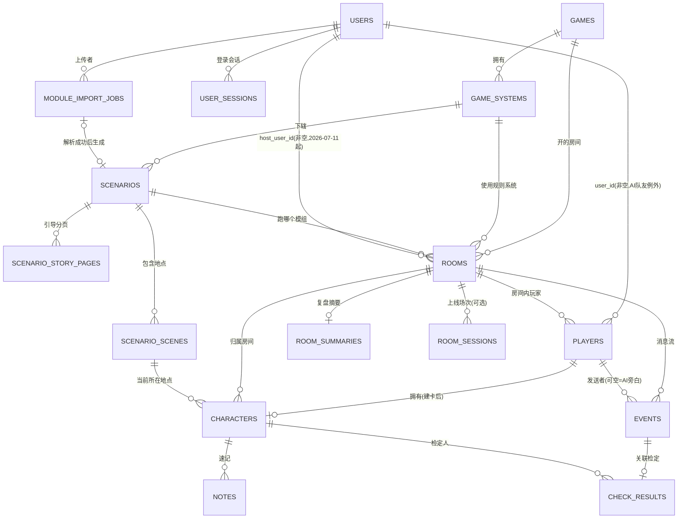

# 前端 Demo 数据表设计 —— 表清单 + 关系

> **本文定位**：从 `TRPG-master` 前端 demo 的真实页面/组件/类型定义**反推**出的数据表草案，是与 [[架构设计-整体多视图]] §4.4 已有设计的**交叉核对稿**——不是新的权威源，也**不是最终版**。本文只回答两个问题：①这个 demo 跑起来到底需要哪些表；②表和表之间怎么连。**每张表只列了少量支撑关系判断的核心字段，完整字段由你来补。**
> **在整体工作流程里的位置**（2026-07-11 补充）：按 [[架构设计参考1]] 的方法论——`产品定位 → 产品原型 → API 设计 → 数据表设计 → 模块拆分 → 详细设计`，这份 demo 扮演的是"产品原型"的角色（用交互界面把需求收集/整理出来），本文是照着这个原型做的"数据表设计"这一步；下一步预期是"功能 API 设计"，详见文末 §五。
> 返回首页 → [[00-Index]]　相关 → [[架构设计-整体多视图]]、[[数据库设计导读]]、[[00-架构总览与演进日志]]、[[架构设计参考1]]

## 〇、这次看了什么

`trpg-app/src` 下几乎全部页面/store/service/data 文件都读过了，不是猜的：

- `data/character-model.ts`、`data/occupations.ts`、`data/skills.ts` —— COC7 角色卡规则数据（属性、职业、技能）
- `types/game.ts`、`config/games.ts` —— 游戏大类 / 规则系统 / 模组（剧本）注册表
- `types/message.ts`、`routes/room/RoomPage.tsx` —— 游戏内消息流、骰子检定、地图/场景、速记本
- `stores/auth-store.ts`、`stores/room-store.ts`、`stores/game-store.ts` —— 登录态、房间/玩家、游戏进度
- `routes/character/CharacterPage.tsx`、`routes/lobby/LobbyPage.tsx`、`routes/story/StoryPage.tsx` —— 建卡流程、大厅、引导叙事
- `routes/games/GameSelectionPage.tsx`、`routes/system/SystemSelectionPage.tsx`、`routes/scenarios/ScenarioSelectionPage.tsx` —— 选游戏/选规则系统/选模组三级导航
- `services/*.ts`（`types.ts`/`room.ts`/`game.ts`/`auth.ts`）—— 预留的 API 请求/响应形状，虽是占位但能看出后端要接哪些接口

前端 dev server 已经跑起来了（`http://localhost:9877`），你可以自己点一遍找有没有我漏看的表。

## 收尾：全流程表清单速览（2026-07-11）

demo 全部 8 屏（`/login → /games → /games/:id(system) → /games/:id/scenarios/:sys → /story → /character → /lobby → /room`）走完了一轮。这节是这一阶段的收尾——**只列表名 + 一句话 + 状态**，方便扫一遍看全貌，详细字段/理由都在下面「一、表清单」对应小节里，不在这里重复。

### 内容库 / 规则库（只读，跨局复用）

| 表 | 一句话 | 状态 |
|---|---|---|
| `games` | 游戏大类清单（跑团/血染钟楼/狼人杀/剧本杀） | ✅ 已定现在建（问题 A-1） |
| `game_systems` | 大类下的规则系统（COC7/DND5e） | ✅ 同上 |
| `worlds` | 规则系统底层定义——属性/技能目录/判定机制/理智机制/战斗规则引擎，master 已有 | ✅ master 已有；本轮**追加** `occupationCatalog`(JSONB，✅已定，问题 D-9)、`ageModifierTable`、`pointBuyConfig`（问题 D-12 数字待核实）、`weaponCatalog`（✅已定后置，问题 D-15）几个字段，都不是新表 |
| `scenarios`（≈`module_packs`） | 模组/剧本元信息 | ✅ master 已有，demo 印证 |
| ~~`scenario_story_pages`~~ | 模组开场分页引导叙事 | ❌ 撤回，✅ 已定并入 `module_packs.intro_pages`（JSONB） |
| `scenario_scenes`（≈`module_scenes`） | 模组内地点/场景，含连通关系 `exits` | ✅ master 已有；连通性约束已经够用，不用新加 |
| `entities`/`module_checkpoints`/`module_san_triggers`/`module_win_conditions`/`module_pregens`/`module_assets` | 线索/NPC/怪物、检定点、理智触发、结局、预设角色、地图图片等模组内容 | ✅ master §4.3/4.4.1 已完整设计，本轮直接引用，未重新设计 |
| ~~`rule_skills`~~ | ~~技能目录~~ | ❌ 撤回，并入 `worlds.skillCatalog` |
| ~~`rule_occupations`+`rule_occupation_skills`~~ | ~~职业目录+职业技能关联~~ | ❌ 撤回，✅ 已定并入 `worlds.occupationCatalog`（JSONB） |

### 运行时状态库（每局游戏一份，会变化）

| 表 | 一句话 | 状态 |
|---|---|---|
| `users` | 跨设备账号 | ✅ master 已收口 |
| `user_sessions` | 登录会话（支撑真正的登出） | ✅ 已定落库（问题 A-2） |
| `rooms` | 房间实例 | ✅ master 已有；本轮**补字段**：生命周期时间戳/`phase`、`discovered_scene_ids`（地图渐进展示，✅已定房间共享，问题 E-16）、`attribute_gen_method`（建卡属性生成方式） |
| `players` | 房间内参与者（人类/AI） | ✅ master 已有；本轮**补字段**：`joined_at`/`left_at`/`connected`/`reconnect_token`（断线续玩、中途退出都靠这几个字段，不是新表；`connected` 2026-07-12 前曾写作 `is_connected`，已与 master 统一改名） |
| `characters` | 调查员角色卡本体 | ✅ master 已有骨架；本轮**大幅细化**字段（bio/装备/建卡状态等，本轮讨论最集中的一张表，见 §一.2 完整提案） |
| ~~`character_skills`~~ | ~~技能分配明细~~ | ❌ 撤回，`characters.skills`(JSONB) 已够 |
| `notes` | 速记本 | ✅ master 已有，无新改动；单条 vs 多条已定单条（问题 B-4，非主要功能不值得额外投入） |

### 事件日志层（只增不改）

| 表 | 一句话 | 状态 |
|---|---|---|
| `events` | 全部消息/旁白日志，天然支撑断线补课和复盘 | ✅ master 已有 |
| `check_results` | 骰子/检定结果明细 | 🆕 独立拆表与否见问题 B-3；本轮加了 `luck_spent`（消耗幸运留痕） |

### 复盘与账号历史（demo 未体现，按产品需求反推）

| 表 | 一句话 | 状态 |
|---|---|---|
| `room_summaries` | 复盘摘要 | ✅ 已定 1:1（问题 B-5），MVP 只做 summary，对话式复盘是未来方向不影响现在的表 |
| `room_sessions` | 上线场次记录 | ✅ 已定建（问题 B-6，一个模组要玩 3~5 次才能通关，场次统计是真实需求） |

### 模组导入

| 表 | 一句话 | 状态 |
|---|---|---|
| `module_import_jobs` | 跟踪 LLM/Agent 解析上传模组这个异步任务 | ✅ 已定现在就建（问题 C-8，可维护性问题）；含 `parsed_by_model` |

**统计**：正式表 21 张（含 2 张可选/待定），另外撤回 2 张（`rule_skills`/`character_skills`，并入了已有表的 JSONB 字段），`worlds` 上建议追加 4 个规则配置字段。开放问题 17 个，已经按主题分了 A~E 组（§四）。

## 一、表清单

按 master 已定的三层模型分类（内容库 / 运行时状态库 / 事件日志）。每张表给了：**职责**（这张表负责记什么）、**前端体现**（具体在哪个页面/组件能看到它）、**核心字段**（示例，非完整，字段由你补）、**状态**（是否 master 已有设计，还是这次 demo 反推新发现的）。

### 1. 内容库 / 规则库（只读，跨局复用）

#### `games` ✅（问题 A-1 已拍板：建）
- **职责**：平台支持的游戏大类清单（跑团 / 血染钟楼 / 狼人杀 / 剧本杀），以及每个大类当前是否可玩。**这张表已验证过能完整支撑 `/games` 选择游戏这一整屏**（截图核对过：图标、名称、描述、推荐/开发中徽标都能对上）。**✅ 已定（2026-07-11）现在就建**——表极简单、建表成本几乎为零，直接省掉"以后迁移会不会做对"的风险，不用赌。
- **前端体现**：`config/games.ts` 的 `GAME_REGISTRY` 常量；`GameSelectionPage.tsx` 首屏的 2×2 游戏卡片网格，卡片上的「推荐/开发中」徽标就是这张表的 `status` 字段驱动的。
- **核心字段（示例）**：`id`, `name`, `description`, `icon`, `status`(recommended/coming-soon/wip/ready)
- **✅ 已确认不落库**：`color`/`borderColor`/`iconBg`/`iconColor` 这套配色（demo 里在 `GAME_REGISTRY` 每条里写了一遍，又在 `GAME_COLORS` 里按 id 单独抽了一遍，本身有点冗余）——已跟你确认，配色归前端管理（写死在代码里按 `id` 查主题色），不进这张表。`icon` 字段本身留着，它是"用哪个图标"这个语义数据，跟"这个图标用什么颜色画"是两回事。

#### `game_systems` ✅（问题 A-1 已拍板：建）
- **职责**：某个游戏大类下具体的规则系统/世界版本（「跑团」下目前有 COC7、DND5e 两套）。
- **前端体现**：`types/game.ts` 的 `GameSystem`；`SystemSelectionPage.tsx`「选择世界」页（`/games/trpg`）的卡片，只有 `status:'ready'` 的能点进去。
- **核心字段（示例）**：`id`, `game_id`(FK), `name`, `name_en`, `description`, `status`
- **✅ 已确认设计意图**：这张表就是为"以后要加其他跑团类世界/规则系统"预留的扩展点——新增一个规则系统（比如以后加"新克苏鲁"或别的 TRPG 规则）只需要在这张表插一行、挂到 `game_id='trpg'` 下，不需要改表结构。
- **⚠️ demo 里有个小穿帮**：`SystemSelectionPage.tsx` 虽然在开头判断了 `if (!game || !game.systems) return...`（说明设计上是要读 `game.systems`，也就是这张表按 `game_id` 查出来的行），但组件内部实际渲染用的是**又手写了一份本地写死的 `systems` 数组**（COC7/DND5e），没有真的去读 `game.systems`。这是 demo 图快留下的技术债，不代表设计上要放弃这张表——恰恰相反，`game.systems` 这个字段的存在就是"以后要动态查"的信号，跟你的判断一致。

#### `scenarios` ✅
- **职责**：一个可供选择的模组/剧本的元信息——叫什么、难度、几人玩、大概多久。
- **前端体现**：`config/games.ts` 的 `SCENARIO_REGISTRY`；`ScenarioSelectionPage.tsx`「选择模组」列表（惠特利旧宅/暗黑边缘/死光…），卡片上的难度色标、人数、时长都来自这张表。
- **核心字段（示例）**：`id`, `system_id`(FK), `name`, `name_en`, `description`, `difficulty`, `player_count`, `estimated_time`
- **备注**：`ScenarioSelectionPage.tsx` 里用了 `scenario.status==='ready'` 来判断显示「已就绪/开发中」徽标，但 demo 当前的 `Scenario` 类型定义里其实没有 `status` 字段——这是 demo 自身的一处小疏漏，但也说明**这张表大概率需要一个 `status` 字段**。另外该页面还有「自行导入模组（支持 JSON/YAML）」的入口（目前是空 TODO），说明 `scenarios` 未来要区分**内置**和**用户导入**两种来源。

#### ~~`scenario_story_pages`~~ ❌ 撤回——✅ 已拍板（2026-07-11，问题 C-7）并入 `module_packs` 的一个 JSONB 字段
- **职责**：模组开场时，一段一段展示给玩家看的引导叙事文案（沉浸式讲故事，不是游戏内对话）。
- **前端体现**：`Scenario.storyPages` 字段；`StoryPage.tsx` 整个页面——顶部「案件档案 #1927-03」标签、逐段淡入的黑底叙事文字，其中还带 `<span>` 高亮片段（`dangerouslySetInnerHTML`）。
- **✅ 已定**：不单独开表，跟 `occupationCatalog` 同样的理由——这份数据永远是"整份读、整份用"（`/story` 页面一次性把全部分页拿去逐段展示），不会有人只查"第 2 段"；`module_packs` 加一个 `intro_pages`(JSONB，数组：`{seq, html}[]`) 就够，也更方便 LLM 生成模组内容时一次性整体写入/覆盖，不用拆行插入。

#### `scenario_scenes` ✅
- **职责**：模组内的地点/场景清单——有哪些地方能去，去了看到什么描述。
- **前端体现**：`RoomPage.tsx` 的 `MAP_LOCATIONS` 常量；点开底部「地图」面板看到的地点列表（前门/花园/门厅/书房…），当前所在地点会高亮「▶ 当前位置」。
- **核心字段（示例）**：`id`, `scenario_id`(FK), `name`, `icon`, `description`
- **地点之间"A 不能直连 C、只能经 B"这条约束——master 已经设计好了，不用新加东西**：对应 master `module_scenes.exits`（这张表里已有，见 §一.5 对照表）——`exits` 就是地点之间的有向连接关系，A 的 `exits` 里没有 C、只有 B，这条约束自然成立。**这是模组内容（作者写模组/或 LLM 解析模组时定下来的），不是 AI 守秘人在对局过程中临时决定的**——理由很直接：如果连通关系是 AI 每次现场编，同一个模组不同局、甚至同一局问两次都可能编出不一样的答案（"书房到底能不能直接到地下室"这种事实性问题前后矛盾，玩家会直接察觉），这跟之前"卡关引导交给 LLM、但游戏机制事实要用状态机裁决"是同一条判据（[[aidm-datamodel-vs-llm-heuristic]]）——连通关系属于会被"静默改变、影响所有人"的事实，该固定在内容层，AI 只负责怎么描述这个地点，不负责决定它跟哪里连着。
- **地图要渐进展示（只显示已发现的地点+当前位置），这是一个真缺口**：`module_scenes` 本身是模组作者写死的全量地点清单（含还没被发现的），不能直接拿来渲染地图——`/room` 地图面板只应该显示"这一局已经发现过的地点"。这需要一个**运行时**的"已发现地点"记录，跟"已发现线索"用 `rooms.entity_states` 里的 `discovered` 布尔键是同一个思路，但场景不是 entity，需要单独一个位置存。建议 `rooms` 加一个 `discovered_scene_ids`(JSON 数组)。**✅ 已定（问题 E-16）：房间共享一份**——产品同时支持线下面对面玩和线上玩，主流场景本来就是团队共享信息；个别模组存在的"分头行动、单人独立发现"是真实需求，但先预留不具体设计，现在按公开处理就行。

#### ~~`rule_skills`~~ ❌ 撤回——直接用 master 已有的 `worlds.skillCatalog`
- master 的 `worlds` 表已经有 `skillCatalog`(JSONB，`SkillDef[]`)字段，装的就是"技能目录+默认值"，跟我这边想建的 `rule_skills` 是同一份数据。再单独开一张表会变成两个地方存同一份技能列表，容易改一边漏改另一边——**撤回这张表，`ALL_SKILLS` 这份数据直接写进对应 `world` 行的 `skillCatalog` 字段**。
- 对应 demo：`data/skills.ts` 的 `ALL_SKILLS`；`CharacterPage.tsx` 建卡 Step2 技能分配列表；`RoomPage.tsx` 技能面板。

#### 插播：JSONB 是什么（问题 D-9 要先搞懂这个才能选）

用 [[数据库设计导读]] 里已经用过的 Excel 类比接着讲：普通字段，就是"一个格子只填一个简单值"——数字、一句话、一个是/否。**JSONB 是一种特殊的字段类型，允许你在一个格子里塞进一整块"结构化数据"**——可以是一个列表，也可以是"列表里每一项还是一个小对象"，数据库能看懂这块数据内部的结构（可以查询/更新里面的某个子字段），但它物理上就是**一行的一列**，不是拆成很多行很多列存的。

具体到职业目录这个场景，两种做法长这样：

- **JSONB 做法**：`worlds` 表里"COC7 这个规则系统"是一行，这一行有个 `occupation_catalog` 列，这一列里装的是一整个数组——约 230 个职业，每个职业是一个小对象（`{名字, 信用范围, 技能点公式, 包含哪些技能...}`）全挤在这一个格子里。要用的时候是"把这一整包职业数据一次性读出来"，不是一条条按条件筛选。
- **关系表做法**：真开两张表——`rule_occupations` 每一行是一个职业（职业名、信用范围各占一列）；`rule_occupation_skills` 每一行记一条"职业 X 包含技能 Y"的关系。可以用 SQL 直接查"筛出所有信用评级下限>50 的职业"或者"侦查这个技能被哪些职业包含"这种条件查询。

**为什么我推荐 JSONB**：玩家建卡选职业时，前端要的是"把全部约 230 个职业一次性展示出来给我选"，不是按条件筛选，JSONB 完全够用，还不用维护两张表之间的关联、不用写 JOIN，简单。而且职业数据基本是 COC7 规则书定死的、不会天天改，不需要数据库层面对单条记录做精细的增删改查权限。

**关系表的优势在哪**：如果以后真需要"哪些职业包含这个技能"这种反向查询，或者要做一个后台管理界面单独编辑/审核某一个职业、给它做修改历史，关系表会更顺手——JSONB 这类查询和管理相对笨重一些。

按你的实际需求：如果你不打算做"职业数据的后台管理系统"，也不需要"按技能反查职业"这类统计功能，JSONB 更省事；如果这两个以后大概率要做，现在就用关系表能少一次返工。

#### 速度和数据泄露——这两个顾虑，一个不成立、一个是好问题但不影响这次的选择

**速度/传输效率**：不管后端用 JSONB 还是关系表，**前端拿到手的都是一份 JSON**——REST/JSON API 不管数据库里怎么存，最终都要序列化成 JSON 发给前端，这一步跟数据库存储形态没关系。粗算一下体量：230 条职业，每条算上名字/信用范围/技能点公式/简介/技能列表，撑死几百字节，整包也就几十 KB，走 HTTP 压缩（gzip，这类重复 key 名的 JSON 压缩率很高）之后大概率是十几 KB——比一张普通图片还小，弱网环境下也是毫秒到一两秒的事，不构成问题。而且如果走关系表，后端还要多一步"查两张表 + JOIN + 拼回同一个嵌套结构再序列化"，这一步 JSONB 反而是省的（数据本来就是按你要的形状存的，不用现拼）——**这条顾虑站在 JSONB 这边，不是反对它的理由**。

**数据泄露——这是个好问题，但要看场景**：JSONB 真正的泄露风险不在"传输",在于**把敏感字段和该公开的字段混进同一个 JSONB 大对象里**——数据库的访问控制（谁能读哪一列、哪一行）是按"字段/行"这个粒度做的，没法说"这个 JSONB 里第 3 个 key 不让读、其他 key 能读"，只能整块给或整块不给，剩下的只能指望应用代码手动把敏感字段过滤掉再返回——这一步一旦漏改，就是真实的泄露。**这正是 master 自己的设计里，`entities` 表把 `secrets`（NPC 底牌，仅 KP/AI 能读）跟 `public_persona`/`content`（玩家能看到的部分）分成两个独立字段、不揉进一个 JSONB 里的原因**（§4.3.4 提示注入防御 / §六.6.2 不泄底）——这样"不查 `secrets` 这一列"就是数据库层面天然的安全边界，不用靠应用代码每次都记得过滤干净。

回到 `occupationCatalog`：这个顾虑在这里**不成立**，因为它里面**没有敏感字段跟公开字段混装**这回事——`name`/`creditRange`/`skillIds`/`shortDesc` 这些全都是建卡时本来就要展示给玩家看的东西，没有一个"KP 专属、不能让玩家看到"的子字段藏在里面。跟"跨房间隔离"（ADR-13/14）那条铁律也不沾边——这份数据是**规则系统级别的公开参考资料**，COC7 这个 World 下所有房间看到的都是同一份，不存在"房间 A 的数据泄露给房间 B"这个场景，它更像是"规则书的一页"，不是任何人的私密数据。所以你这个警觉是对的，只是这次问对了没踩中——真正要小心用这条原则去审视的，是 `characters`（有没有把"KP能看/玩家能看"的东西混一起）、`entities`（已经处理过）这类**真的带敏感信息**的表。

#### ~~`rule_occupations`~~ ❌ 撤回——✅ 已拍板并入 `worlds.occupationCatalog`(JSONB)
- **职责**：COC7 规则书里定义的职业（会计师、考古学家…约 230 个）——建卡时选哪个职业决定了信用评级范围、技能点公式、职业技能有哪些。**master 现有 schema 完全没有这个概念**（`module_pregens` 只是模组作者预设好的现成角色模板，`occupation` 只是自由文本标签，不支持"玩家自己选职业"这套标准 COC7 建卡流程）——这是真缺口，不是重复劳动。
- **前端体现**：`data/occupations.ts` 的 `ALL_OCCUPATIONS`；`CharacterPage.tsx` 建卡 Step0「选择职业」的网格卡片，以及按 `OCCUPATION_GROUPS` 分类的筛选下拉。
- **✅ 已定（2026-07-11，问题 D-9）**：不新开 `rule_occupations`+`rule_occupation_skills` 两张关系表，而是比照 `worlds.skillCatalog` 的既有模式，给 `worlds` 加一个 `occupationCatalog`(JSONB，数组，每项内联 `skillIds:[]`)——demo 自己（`OccupationDefinition.skillIds: string[]`）就是这么内联存的，不是关系型。职业数据是"整份读、几乎不变"的静态规则参考，不需要跨职业/跨技能做关系查询；速度和数据泄露两个顾虑也核对过，都不构成问题（详见下方"速度和数据泄露"小节）。

### 2. 运行时状态库（每局游戏一份，会变化）

#### `users` ✅（master 已收口）
- **职责**：跨设备的账号身份——换手机/重装 App 后能找回同一局游戏。
- **前端体现**：`stores/auth-store.ts`（token/userId/nickname）；`services/auth.ts` 的 `loginWithQR`/`createRoom`/`checkSession`。demo 目前还没有真正的注册/登录表单页面，只有 store 状态和接口占位。
- **核心字段（示例）**：`id`, `account`, `password_hash`, `nickname`

#### `rooms` ✅
- **职责**：一局游戏的房间实例——房间码、选了哪个游戏/系统/模组、最多几人。
- **前端体现**：`services/types.ts` 的 `RoomResponse`/`CreateRoomRequest`；`stores/room-store.ts` 的 `roomCode`；`LobbyPage.tsx` 顶部那个 `AR-1927` 房间码标签。
- **核心字段（示例）**：`id`, `room_code`, `game_id`(FK), `system_id`(FK), `scenario_id`(FK), `host_user_id`(FK，**非空**，2026-07-11 起改，见下), `max_players`
- **🔴 2026-07-11 方向推翻：`host_user_id` 从"可空"改成"非空"，App 强制登录**——此前（问题 A 组收口时）拍板"不强制访客注册"，理由是账号只解决跨设备找回、跟"能不能玩"是两件事。这次在 API 详细设计阶段被推翻：产品诉求明确"每个玩家都要能复盘、掉线后能重新进来"，而 `reconnectToken` 只能解决同设备内的会话级重连，解决不了跨设备/隔一段时间后的找回——要满足这个诉求，每个真人玩家必须有服务端持久身份，登录因此从"可选增强"变成"玩游戏的硬性前提"。详见 [[API接口对齐规范]] §2.0、[[2026-07-11 账号强制登录-推翻不强制访客注册]]。
- **⚠️ demo 没体现、但要补**：`phase`（`game-store.ts` 里其实已经定义了 `lobby`/`playing`/`paused`/`ended` 四态，demo 只用到前两个）+ `created_at`/`started_at`/`paused_at`/`last_active_at`/`ended_at` 生命周期时间戳。没有这些字段，「中断很久后回来继续玩」「我的房间列表按最近活跃排序」都做不了——demo 里房间是纯内存态，进程一重启就没了，这块前端天然看不出需求。
- **✅ 已定（2026-07-11）：谁能给房间选/导入模组——房间内任何玩家都行，不限房主**：`module_import_jobs.uploader_user_id`（见 §一.4）本来就没有限定必须是房主，房主的作用简化成"创建房间"，`players.is_host`/`rooms.host_user_id` 继续保留（以后可能还有别的房主专属操作），只是不再是"选模组"这件事的权限依据——这条不需要新字段，是权限设计上的简化。
- **⚠️ 重要：`scenario_id` 的写入必须做成幂等操作，这是留给 API 设计阶段的正确性要求，不是数据库表结构问题**：一个房间只能定一次模组，如果"设置模组"这个接口写成无条件覆盖（`UPDATE rooms SET scenario_id=X`），两个玩家几乎同时选了不同模组时会出现竞态——谁的请求后处理谁生效，纯粹看时序，玩家会遇到"我选的明明是A，进去却是B"这种静默错误。正确做法是条件更新：`UPDATE rooms SET scenario_id=$1 WHERE id=$2 AND scenario_id IS NULL`——数据库层面 `scenario_id` 保持可空、只设置一次即可，不需要新表/新字段/触发器，**但下一步做 API 详细设计时，"选择模组"这个接口必须显式按这个模式实现，不能遗漏**，按 [[aidm-datamodel-vs-llm-heuristic]] 的判据，这是"静默出错+系统性影响所有人"的那类问题，必须结构性地保证正确，不能寄希望于"一般不会同时点"。

#### `players` ✅
- **职责**：房间内的参与者（真人玩家或 AI 补位角色）——昵称、是否房主、是否已就绪。
- **前端体现**：`stores/room-store.ts` 的 `Player` interface；`LobbyPage.tsx` 玩家列表的四个位置（已就绪/等待中/AI 队友三种状态样式）；`RoomPage.tsx` 头部「3 位调查员」计数。
- **核心字段（示例）**：`id`, `room_id`(FK), `user_id`(FK，**非空，`is_ai=true` 时例外仍可空**，2026-07-11 起改，理由同 `rooms.host_user_id`，见上方 🔴 说明), `nickname`, `is_host`, `is_ai`, `is_ready`, `character_id`(FK 可空)
- **⚠️ demo 没体现、但要补**：`joined_at`、`left_at`(可空)、`connected`（🔧 2026-07-12 改名：本文档此前写作 `is_connected`，与 master §4.4.2 已建立的 `connected` 字段撞名，统一以 master 的 `connected` 为准）、`reconnect_token`。玩家断线/关 App 时**这一行不能删**，只能把 `connected` 置为 false——不然「我进入过哪些房间」查不出历史，断线重连也没法认回是同一个人。
- **`is_ai`（LobbyPage「AI 调查员·自动补位」）从第一轮就已经在字段里了，不是这次新发现，但值得说清楚它够不够用**：AI 调查员的 `players` 行 `is_ai=true`、`user_id` 留空（它不是一个真实账号），照样会关联一张普通的 `characters`（建卡这件事对 AI 和真人是同一张表、同一套流程，没有特殊路径）。AI 投资员"演得像谁"这件事（性格/行事风格），**不需要新表**——直接复用 `characters.personality_notes` 就够了，这个字段本来就是给建卡时写的角色特质，AI 编排层读同一个字段当 prompt 参考即可，人类角色和 AI 角色统一处理，不用因为"这是 AI"而多开一条平行数据。真正决定 AI 投资员每回合做什么、说什么的，是 §六 AI 编排架构那层的 prompt/模型调度逻辑（不是这份文档的范围），数据库这边只要保证"AI 是不是这个角色的操盘手"这一个标记位、以及角色卡数据跟真人共用同一张表，就够了。
- **提醒一个容易混淆的点**：demo 里有**两种"AI"**，`events.sender_player_id` 的处理不一样——AI 守秘人/旁白（KP，主持全场的那个）发的消息，`sender_player_id` 是空（见下面 `events` 表）；AI 调查员（这里说的"AI 队友"）发的消息，`sender_player_id` 就是它自己那行 `players.id`，跟真人玩家发言完全同等对待，不是空值。
- **你提到"房间没有退出选项，但玩家应该能中途退出"——数据库这边接口已经留好了，是前端 UI 没画出来**：玩家中途退出，就是把这一行的 `connected` 置为 false、`left_at` 写上时间戳（上面已经列出来的字段），`is_ready`/`character_id`/角色卡数据全部原样保留——不删行，房间列表、复盘、断线重连全靠这一行还在。demo 的 `RoomPage.tsx` 确实没有"退出"按钮，这是前端功能缺口，不是数据库缺口，数据库这边不需要为此新增东西。
- **一个衍生问题，先记下不深挖**：真人玩家中途退出后，这个角色在场景里要怎么处理——原地不动干等、还是暂时交给 AI 顶替着演（类似临时把这个 `players` 行标记成"AI 代管"）？如果要支持"AI 临时接管掉线玩家的角色"，`players.is_ai` 现在是建卡时定死的布尔值，可能得改成更灵活的"当前操盘方"字段（人类/AI/暂无人操作）。这个目前只是发现了这个可能性，不确定 MVP 要不要做，先记一笔（问题 17）。

#### `characters` ✅（master 已有，但缺"从零建卡"需要的几个字段）
- **职责**：调查员角色卡本体——基本信息、八维属性、衍生值（HP/SAN/MP/幸运/DB/MOV）、当前位置。
- **前端体现**：`CharacterPage.tsx` 建卡全流程四步（信息→属性→技能→装备背景备注汇总）；`RoomPage.tsx` 底部「角色卡」面板（头像+职业+年龄+属性网格+HP/SAN/幸运药丸）。
- **master 实际已有字段**（§4.4.2）：`id`/`room_id`(FK)/`player_id`(FK)/`based_on_pregen_id`(FK→`module_pregens`，可空)/`name`/`attributes`(JSONB，八维属性)/`derived_stats`(JSONB，HP/SAN/MP/幸运等当前值)/`skills`(JSONB)/`equipment`(JSON)/`location`(软引用→场景)/`conditions`/`ledger`/`flags`。
- **✅ 顺带解决了两个开放问题**：技能分配 master 已经是 `skills`(JSONB) 而不是关系表（解掉了下面开放问题 3）；装备 master 已经是 `equipment`(JSON 数组) 而不是自由文本或独立物品表（解掉了开放问题 5）——demo 里 `equipment` 现在是一个自由文本框，跟 master 的"数组"设计有一点点差距，前端后面要改成拆条目输入，不是数据库层面的事。
- **⚠️ 真缺口（demo 的从零建卡流程需要，master 现在没有）**：`occupation_id`(FK→职业目录，见上面 `rule_occupations`)、`player_name`、`age`、`gender`、`residence`、`birthplace`、`background`(背景故事文本)、`personality_notes`(角色特质/秘密/人际关系文本)。**这几个字段跟 `notes` 表不是一回事**——`notes` 表是 RoomPage 「速记」面板那种游戏进行中持续记录的案件笔记；这里说的 `background`/`personality_notes` 是建卡时一次性写好的角色背景设定，是 `characters` 表自己的字段，别混在一起，命名上也刻意避开了"notes"这个词以免和 `notes` 表撞车。
- **`based_on_pregen_id` vs `occupation_id` 是两条不同路径**：前者是"直接套用模组作者预设的现成角色"，后者是"玩家自己选职业从零建卡"——demo 目前只做了后者，两个字段都留着、都可空，互不冲突。
- **建卡过程本身也要能"断点续建"，呼应你之前提的断线续玩需求**：`CharacterPage.tsx` 现在建卡四步（信息→属性→技能→装备背景汇总）全部是纯前端 `useState`，关掉页面就清空，要走完四步才 `navigate('/lobby')` 存一次。但你之前明确要过"长时间中断后要能回来继续"——建卡本身也可能被中断（填到一半接了个电话），如果只在"完成创建"那一下才写库，中途关闭就前功尽弃，跟你的需求矛盾。建议 `characters` 每一步都增量保存（而不是最后一次性提交），并加一个 `status`(`draft`\|`complete`) 字段区分"还在建卡"和"已建好能进游戏"——这个我没直接定，作为新问题列在下面（问题 17）。

#### `characters` 完整字段提案（详细设计，本轮产出）

按用途分组，不是每个字段都有定论，标了 ⚠️ 的是值得你重点看一眼的：

| 分组 | 字段 | 说明 |
|---|---|---|
| 身份归属 | `id`/`room_id`(FK)/`player_id`(FK)/`based_on_pregen_id`(FK→`module_pregens`，可空) | master 已有。`based_on_pregen_id` 是**克隆快照**关系，不是活引用——选了预设角色后是把 `module_pregens` 那一行的值**复制**进 `characters`，此后各玩各的（HP/SAN 会变，pregen 原始数据不会变），这个字段只留个"当初是照哪个模板建的"的溯源，不代表运行时还要回读 `module_pregens` |
| 基本信息 | `name`、`age`(int)、`gender`、`residence`、`birthplace`、`occupation_id`(FK，可空) | ⚠️ **`playerName` 不建议单独存**——demo 的 `InvestigatorInfo.playerName`（"玩家昵称"）本质上就是 `players.nickname`，两边都存会出现"角色卡上的玩家名"和"房间里的昵称"对不上的风险，建议角色卡直接引用 `players.nickname` 显示，不新增字段。`occupation_id` 可空是因为建卡过程中（`status='draft'`）可能还没选职业——demo 现在其实也没在切到下一步前强制要求选职业，这点前端后面可能要补个校验 |
| 属性与衍生值 | `attributes`(JSONB：str/con/pow/dex/app/siz/int/edu)、`derived_stats`(JSONB：hp_current/hp_max/san_current/mp_current/mp_max/luck/db/build/move) | master 已有，沿用。生成方式（demo 是手动 ±5 点数分配，COC7 官方是 3d6×5 或点数购买）不影响存储——**只存最终结果，生成过程是 UI 逻辑，不落库** |
| 技能 | `skills`(JSONB：`Record<skillId, currentValue>`) | ⚠️ 建议存**最终效果值**（基础值+建卡分配点数算出来的最终 %），不要只存"分配了多少点"——原因是 COC7 有"技能成长检定"规则，玩这局用过的技能事后有机会永久提升，提升后要直接改这个数，如果只存"建卡时分配的点数"，后续成长就没地方叠加，还要连着 `attributes`/公式一起倒推，没必要这么绕 |
| 装备 | `equipment`(JSON 数组，元素形状见下) | ⚠️ 这块你专门提醒过要重点考虑，展开在下面单独一节，不是简单的"字符串 vs 数组"问题 |
| 叙事 | `background`(text，可空)、`personality_notes`(text，可空) | 建卡时一次性写好的背景设定/角色特质，前面强调过不是 `notes` 表；这两个字段**没有你说的"剧情交互/规则判定"这层需求**——背景故事不会被规则引擎读取，纯粹是 AI 旁白的叙事参考材料，跟装备的处理方式不用一样，不用画蛇添足加结构 |
| 位置与规则引擎 | `location`、`conditions`、`ledger`、`flags` | master 已有，本轮 `/character` 没有新发现，照抄 |
| 建卡生命周期 | `status`(`draft`\|`complete`) | 本轮新增，支撑断点续建（问题 17） |

#### `/room` 角色卡面板：哪些字段固定、哪些会变，以及"消耗幸运"这类特殊机制

你要的这个"固定 vs 可变"区分，其实字段分组本身已经隐含了，这里明说一遍，顺便把"消耗幸运"这类机制放进对的位置：

| 字段 | 建卡后基本不变（一局游戏内） | 游玩中会变 |
|---|---|---|
| `attributes`（八维属性） | ✅ 正常情况下整局不变 | 有极少数规则效果会临时/永久改属性（比如某些理智症状、诅咒类效果），但这是**例外**，不是常态，按需通过 `conditions`/`ledger` 叠加修正值去表达，不直接改 `attributes` 本身——保留"建卡时定下的底子"不动，运行时修正值另外叠加，这样才查得清楚"原始值多少、临时改了多少" |
| `skills`（技能%） | ✅ 一局游戏内基本不变 | 技能成长检定通常发生在**一局/一次冒险结束时**，不是打到一半随时变，所以整局游戏期间可以当"读多写少"处理 |
| `derived_stats.hp` / `.san` / `.mp` | ❌ | ✅ 全程随时在变，这是 `/room` 角色卡面板里"生命/理智/魔法"那几个数字实时对应的字段 |
| `derived_stats.luck`（幸运） | ❌ | ✅ **你提的"消耗幸运重新触发一次检定"这个机制，证实幸运本来就该归进会变的这一类**，跟 HP/SAN 是同一种字段，不是固定参考值——这点原本就是这么设计的（在 `derived_stats` 里，不是独立的固定属性），这次只是确认一下没有想漏 |
| `location` / `conditions` / `ledger` / `flags` | ❌ | ✅ master 已有，本来就是运行时会变的部分 |
| `equipment` 的 `qty` | ❌ | ✅ 消耗品/弹药 |

**"消耗幸运"这个动作本身要不要留痕迹**：COC7 官方确实有"花费幸运值来改善一次检定结果"的机制（具体消耗多少、能不能对任何检定用，规则细节我不打包票，建议你核对规则书，跟之前几个数字性质的规则一个处理方式）。这里的数据库设计问题不是"幸运能不能扣"（`derived_stats.luck` 本来就能改），而是**这次消耗要不要在 `events`/`check_results` 里留一条记录**，而不是静默改一个数字——建议要留痕：一是复盘时能看到"这里玩家拼了幸运"，二是如果规则上有"这次判定用过幸运就不能再用"这类限制，得有地方查"这次检定有没有已经用过幸运"，光改数字查不出来。落地上不需要新表，`check_results` 已有的字段加一个可空的 `luck_spent`(int) 就够。

#### 装备与物品——你提的"剧情交互 + 武器规则判定"，展开说

你这个提醒是对的，而且正好能用 master 已有的分层原则（内容库 vs 运行时状态库）说清楚该怎么分：

**先分清楚两类完全不同的"物品"，不要用同一套结构装**：
1. **随身装备**（建卡时自己填的手电筒、笔记本、左轮手枪…）——这是**角色私有的运行时数据**，会变（弹药减少、东西丢了），但不需要被模组作者预先定义，玩家想填什么填什么。
2. **剧情道具**（模组里"书房抽屉的钥匙""地下室发现的诅咒匕首"这类）——master 已经设计好了，就是 `entities`(`kind='item'`)，属于**模组内容层**（模组作者预先定义、`Scene.contents` 里挂载、玩家在场景里"发现"才拿到），这块不需要改，本来就有。

**问题在①，也就是你说的"随身装备要不要能参与规则判定"**：一支"左轮手枪 (.38)"要在战斗检定里算出正确的伤害/用什么技能骰，光一个字符串是不够的，得能查到"这把枪伤害多少、用哪个技能、装弹量多少"这些规则数据。但**不建议把随身装备直接塞进 `entities`**——`entities` 是模组作者定义的内容，是只读的、按 `module_id` 归属的，而随身装备是玩家建卡时自己填的、需要在游玩中改变数量（比如打光子弹），两者的读写权限和归属完全不同，硬塞一起会破坏 master 已经定好的"内容只读 / 状态可变"这条分层原则。

**建议的做法**：新增一张跟 `occupationCatalog`/`skillCatalog` 同类型的规则参考表——`worlds.weaponCatalog`（JSONB，武器/枪械/近战武器的规则数据：技能/伤害/射程/装弹量/故障值，你的规则表里"武器列表 战斗"这个分页就是现成的数据源）。然后 `equipment` 数组的元素形状改成：
```
{ name: string, qty?: number, weaponRef?: string }
```
`weaponRef` 是可选字段，只有这件装备是"武器/需要规则判定的东西"才填，指向 `worlds.weaponCatalog` 里的一条记录——查伤害/技能就靠这个查表，`qty` 继续管弹药这种会变的数量。普通的手电筒、笔记本这类纯剧情道具，`weaponRef` 留空，就是个展示用的名字，不参与任何判定。

这样处理的好处：随身装备还是角色私有、可自由填写的运行时数据，不违反"内容只读"的分层；但需要规则判定的部分（武器）有地方查表，不是死字符串。`weaponCatalog` 的详细字段（伤害骰/射程/装弹量/故障值……）先不深挖，跟你说的节奏一致——等这轮全流程走完，回头集中核对细节的时候再展开，这里先把"要有这张表、装备要能可选地指向它"这个结构定下来。

**顺带定一个小事**：`interest 技能点数 = INT×2`、属性范围 `15-99` 这类**建卡通用规则数值**，建议跟"COC7 规则不会变"那条已有结论（问题 2）一起处理——当成后端代码里的系统常量，不落库，不需要为这类固定公式专门开字段，除非你想让不同 World 有不同的建卡规则（目前没这个需求）。

**`occupationCatalog`（挂在 `worlds` 上的 JSONB）单条记录形状建议**：
```
{ id, name, nameEn?, creditRange, skillPointsFormula, icon, shortDesc, skillIds: string[], group, featured?: boolean }
```
其中 `group`（对应 demo 的 `OCCUPATION_GROUPS`："学术研究"/"执法安全"…）**建议放进每条职业数据里，而不是像配色那次一样丢给前端单独写死一份映射**——配色是纯样式，跟职业是什么无关；但"这个职业属于哪个分类"是内容语义的一部分（换一个 World/规则系统，分类体系可能完全不同），跟 `skillIds` 性质一样该随数据走，不该由前端猜。`featured`（**本轮新增**，见下）标记这条职业是不是"默认展示的常用职业"。

#### 手机 UI 要"先显示 20 个常用职业+展开+分类+搜索"，跟 JSONB 这个选择不冲突，而且是两件事

你这个提醒是对的，但**这是前端展示逻辑，跟数据库存储形态（JSONB vs 关系表）其实是两个独立的问题**，说清楚为什么：

- 不管后端是 JSONB 还是关系表，**前端拿到数据的方式都是同一种**——建卡这一步，客户端把 `worlds.occupationCatalog` 整包（约 230 条，几十 KB 的 JSON，不大）**请求一次、缓存在本地**，然后"默认显示 20 个常用职业""点展开显示全部""按分类筛选""按关键字搜索"这些交互，全部是在**前端已经拿到的这份数据上做 JS 数组操作**——demo 现在的 `CharacterPage.tsx` 已经是这么写的（`search`/`activeGroup` 状态过滤 `ALL_OCCUPATIONS` 这个本地数组），不是每次搜索/筛选都问一次服务器。230 条这个量级，客户端筛选比每次搜索都发请求问后端更快、体验更好，也不给服务器增加没必要的负担（这份数据本来就不常变）。
- 所以你说的这套交互（默认20个/展开/分类/搜索）**用 JSONB 完全能支持，甚至更适合**——真正会受"JSONB vs 关系表"影响的，是**后端从数据库往外拿这份数据的方式**（一次性拿一整包 vs 拼 SQL 按条件查），不是前端怎么展示。如果改用关系表，前端该怎么交互还是完全一样，只是后端多了一步"要不要支持按条件查询"的选择——而这个场景（一次性拿全部+前端本地筛选）根本用不上关系表的条件查询能力，所以这次提醒其实**进一步支持了 JSONB 这个选择**，不是削弱它。

**顺带牵出一个真实要补的字段**：**默认展示哪 20 个"常用职业"，得有数据依据，不能是前端随便挑或者按 id 顺序砍前 20**——建议 `occupationCatalog` 每条加一个 `featured`(boolean，已经加进上面的形状里了) 或者 `displayOrder`(int，更精细，能控制"展开前"具体显示顺序)，由内容团队标记哪些是经典/常用职业（比如私家侦探/记者/医生/教授这种 demo 里原本就有的那 30 个，很可能就是一份不错的"常用职业"初始名单，可以直接复用）。搜索和分类不需要新字段，`group` 和 `name`/`shortDesc` 已经够用。

#### 你这轮说明对应到设计上的三点

1. **调查员信息自由编辑（姓名/年龄/性别/居住地/出生地）**——跟上面表格里"基本信息"这几个自由字段的设计一致，不需要改，这几个本来就没有候选列表，玩家想填什么填什么。

2. **~200 个职业的固定职业表**——比 demo 的 30 个大了一截，但**不影响 schema，只影响数据量**：`occupationCatalog` 是挂在 `worlds`（COC7 这个规则系统）上的，只需要建一次、跟具体导入哪个模组无关（不要跟前面讨论的"LLM 解析上传模组"混在一起——那条管线解析的是**模组**内容如 `scenes`/`entities`，职业表是**规则系统**级别的东西，一次性录入/维护，两者是不同批数据、不同来源）。200 条量级 JSONB 一次性整体读出来也毫无压力，问题 15（JSONB vs 关系表）的建议不变；如果后续要做"按职业单独编辑/上下架"这种运营后台功能，到时候拆表更方便，但那是运营诉求不是查询性能诉求，先不急。

3. ~~职业技能点只能加职业技能、兴趣点能加所有技能——demo 是互斥的，官方规则允许叠加~~ → **你已拍板"一切以官方规则为主"，问题 19 定了：走叠加**。`characters.skills` 不能只存最终值，改成 `Record<skillId, {value, occPoints, intPoints}>` 存点数来源——理由见下面详细展开。

**这条"职业点只能加职业技能"的规则本身该怎么校验**：这是**确定性规则**，不是语气/节奏这类交给 LLM 判断的软性东西（算错了会静默做出一张不合规的角色卡，符合 [[aidm-datamodel-vs-llm-heuristic]] 里"该用状态机裁决"的标准）——但落地上，**校验逻辑写在后端建卡服务的代码里**（提交角色卡时检查"职业池的分配是否都落在这个角色职业允许的技能范围内"），不是 DB 层面的 CHECK 约束——"这个 JSONB 字段的 key 必须出现在另一个 JSONB 字段的某个数组里"这种跨字段业务规则，数据库约束语法表达不了，也没必要为这个上触发器，普通应用层校验就够。

#### 这轮深挖 COC7 官方规则细节，对 schema 的具体影响（本轮产出，含需要你核实的数字）

你提的三点（强制选择、阈值范围、衍生属性公式）我逐条查了官方规则细节，比 demo 复杂不少，逐一说明该怎么落进 schema。**先说清楚置信度**：规则的*结构*（有哪几种机制）我有把握；具体的*数字*（比如点数购买法到底是 460 点还是别的、职业技能上限是不是 80%）查到的资料有一处互相矛盾，我标了出来，建议你用权威规则书核实一遍，不要直接当定论抄——但**不管数字最后是多少，schema 的形状不用改**，这是这轮设计的重点。

**① 职业技能列表不是简单的固定 8 个 id，要支持三种槽位**：官方职业技能表里常见"任选其一"（比如"格斗(斗殴)或射击(手枪)"选一个）和"自选"（比如作家的技能表里有一格是"任意技能，玩家自选"）。demo 的 `skillIds: string[]` 是拍平的固定列表，装不下这两种。建议把 `occupationCatalog[].skillIds` 换成 `skillSlots`：
```
type SkillSlot =
  | { type: 'fixed', skillId: string }              // 固定技能，如"图书馆使用"
  | { type: 'choice', options: string[] }            // 任选其一，如格斗/射击二选一
  | { type: 'any' }                                  // 自选任意技能
```
玩家在建卡时把每个 `choice`/`any` 槽位具体选成了哪个技能，**不需要单独存"选择记录"**——选完之后这个技能就变成一条普通的 `characters.skills` 记录（有 `occPoints>0`），跟"固定槽位"选出来的技能在存储上没有区别，槽位类型只在**建卡当下校验"这一选择合不合法"**的时候用得上，选完就用不着追溯了。

**② 信用评级（Credit Rating）demo 完全没做，但它是本职技能表里必有的一项，且有特殊规则**：信用评级本质上是一个"披着技能外皮"的特殊技能——查到的资料说它的初始值范围由职业决定（这个 demo 的 `creditRange` 字段已经有，只是目前只当展示文案没当校验用）、且（查到但没有十足把握，待你核实）可能只能用职业点数加、不能用兴趣点数加。建议：
- 把信用评级作为 `worlds.skillCatalog` 里普普通通的一条技能（`id: 'credit_rating'`，基础值官方是 0）
- `occupationCatalog[].creditRange` 从纯展示字符串 `"30-70"` 拆成 `{creditMin: 30, creditMax: 70}` 两个整数字段，建卡校验时专门用来卡这一项的取值范围
- 是否禁止用兴趣点数加信用评级——这条规则不确定，列进问题 20，需要你核实

**③ 衍生属性公式：直接复用 master 已有的 `Expr` 表达式语法（§4.3.6.6），不用发明新格式**：master 现有的 `Expr` 语法已经支持算术、比较、`floor`/`ceil`/`min`/`max` 函数、变量引用——HP/SAN/MP 这种纯公式（`floor((con+siz)/10)`）直接就能写成一条 `Expr` 字符串，不用为衍生属性另造一套语法。但 DB（伤害加值/体格）和 MOV（移动速度）不是单一公式，是"分档查表"（比如 STR+SIZ 总和 ≤64 是 -2、≤84 是 -1……；MOV 要比较 DEX/STR/SIZ 三个值的大小关系），`Expr` 语法本身没有三元/if-else，硬塞一个公式字符串会很难读。建议给 `ResourcePoolDef` 定义两种 `kind`，都基于已有的 `Expr` 语法，不新增语法：
```
type ResourcePoolDef =
  | { key: string, kind: 'formula', expr: string }                                   // hp: "floor((con+siz)/10)"
  | { key: string, kind: 'conditional', rules: {when: string, value: string}[], default: string }  // db/build、mov：when 是 Expr 布尔表达式，按顺序命中第一条
  | { key: string, kind: 'roll', formula: string }                                    // luck：官方是独立掷骰 3D6×5，不是从属性推导出来的
```
`kind:'roll'` 这条顺带指出 demo 一处明确的错误：`character-model.ts` 里 `luck: attr.pow` 把幸运直接抄成了意志值，但官方规则里幸运是**独立掷骰**得出的初始值，跟 POW 没关系——这是"demo 有缺陷"的一个具体例子，落地时不要照抄这段逻辑。

**④ 属性生成：掷骰法 vs 点数购买法，是"整桌"的选择，不是"每个角色"的选择**：这个建议放在 `rooms` 上而不是 `characters` 上——现实里一桌玩家通常统一用同一种生成方式（不会有人掷骰、有人点数购买，那样起点不公平），所以是建房间/开局时定一次的配置，不是每个角色单独选：
- `rooms.attribute_gen_method`(`'roll'` \| `'point_buy'`)
- 掷骰法的每项属性骰子公式（STR/CON/DEX/APP/POW 是 `3D6×5`，SIZ/INT/EDU 是 `(2D6+6)×5`，查到的资料一致，置信度较高）放在 `worlds.attributes`(即 `AttributeDef[]`) 里，每项一个 `rollFormula` 字段
- 点数购买法查到的资料是**总池 460 点，每项 15-90，且 INT 和 SIZ 至少 40**——这个数字来自单个来源，建议你核实一下；不管最终数字是多少，建议放进 `worlds` 一个 `pointBuyConfig`(pool/min/max/floors) 字段里当数据，**不要硬编码进代码**——这点是对我上一轮"建卡固定公式当代码常量"这个结论的修正：那时候还没意识到这类数字有好几个、还可能因规则书版本/桌规不同而变，写成 `worlds` 里的数据比写死在代码里更经得住"数字错了要改"这件事。

**建议你直接核实的具体数字（问题 20，部分已被下面你的表核实/推翻）**：点数购买法总池是不是 460、每项 15-90 且 INT/SIZ≥40 是否准确（你的表里没直接看到，可能在别的分页，仍待核实）；信用评级是否真的只能用职业点数、不能用兴趣点数（部分证实，见下）；职业技能/兴趣技能是否存在"职业技能上限 80%、兴趣技能上限 60%"这类查到但存疑的分档上限规则（你的表里没看到这个上限，暂时按"没有此限制"处理，除非你核实确有）。

#### 用你的 `COC7空白卡CY23Final.xlsx` 核对后的修正与新发现（置信度从"网上查的"升级为"你的表验证过"）

你这份表信息量很大（`人物卡`/`简化卡 骰娘导入`/`职业列表`/`本职技能`/`成长表`/`附表`/`武器列表`等 13 个分页），直接读了公式和数据，比上一轮网上查的可靠得多。挑出对 schema 有影响的部分：

**① 年龄不是纯 flavor 字段，是真实规则输入**——`附表` 里有一张完整的年龄调整表（15-19/20-39/40-49/50-59/60-69/70-79/80-89/90+ 共 8 档），触发效果包括：EDU 获得若干次"成长检定"（跟技能成长是同一套机制，见下）、STR/CON/DEX/APP 按档位扣减、15-19 岁档 Luck 要"掷两次取高"。这意味着 `characters.age` 不只是拿来显示，建卡时要按年龄档触发这些效果。建议 `worlds` 加一张 `ageModifierTable`（年龄区间 → 效果描述，效果本身复用下面的"成长检定"机制 + 简单的属性扣减表达式）。

**② 幸运（Luck）独立掷骰，确认了 demo 的错误**：你的表里 Luck 是一个独立命名的输入格（`=Luck`），不从 POW 推导——跟我上一轮的猜测一致，demo 那句 `luck: attr.pow` 确认是错的，不用照抄。

**③ 信用评级、克苏鲁神话，都是"技能表里普通的一行"，但各自有特殊限制**：
- 信用评级：就在技能列表第 26 行，基础值 0，跟其他技能一样有"职业点/兴趣点/成长"几栏——**直接证实了我上一轮的建议**（信用评级就该建模成 `skillCatalog` 里普通一条技能，不用单独开字段），但这一行被标了特殊记号（★，其他技能是可勾选的 ☐），且实际取值范围要卡在职业的信用评级区间内。
- 克苏鲁神话：也在技能列表里，但"职业点""兴趣点"两栏被直接画成"——"（不允许在建卡时用职业点或兴趣点加）——证实"某些技能在建卡阶段完全不能被职业/兴趣点覆盖"这条限制是真实存在的，不是我瞎猜。

这两个例子说明 `skillCatalog` 每条技能除了 §一.2 已经提的字段，还需要一个**建卡可分配性**标记，建议：`allocatable: 'normal' | 'occupation_only' | 'none'`（普通/仅职业点可加/建卡时完全不可加）。

**④ 职业技能槽位设计，被你的表直接验证并需要再精确一点**：`职业列表`（约 230+ 行，比你说的 200 还多，`occupationCatalog` 用 JSONB 的判断不变）里技能栏是大白话文本，比如：
- 会计师："会计，法律，图书馆，聆听，说服，侦查，**任意其他两项**个人或时代特长"——6 个固定 + 2 个"任选"
- 演员："...，**两项社交技能（取悦、话术、恐吓、说服）**，...，任意一项其他特长"——这里出现了"从 4 个候选里选 2 个"，不是我上一轮设计的"选 1 个"

隐藏的 `本职技能` 分页把这套规则拆成了一个技能×职业的矩阵，第 7 行"任意特长"那一行的值就是数字 2（会计师）——证实"任选"槽位是带**数量**的，不是我之前想的"选1个"。所以 `SkillSlot` 要在 `choice`/`any` 两种类型上都加 `count`：
```
type SkillSlot =
  | { type: 'fixed', skillId: string }
  | { type: 'choice', count: number, options: string[] }   // 如"两项社交技能"：count=2, options=[充悦,话术,恐吓,说服]
  | { type: 'any', count: number }                          // 如"任意其他两项"：count=2
```

**⑤ 发现两个"逃生舱"，官方允许但已决定 MVP 不支持**：`职业列表` 第 1 行是内置的"自定义职业"选项（本质是"职业"这个字段允许玩家不选目录、自己填技能列表+信用评级范围）；`本职技能` 矩阵最后一行是"自定义技能"（允许玩家发明一个目录里没有的全新技能）。**问题 D-13 已拍板：MVP 阶段都不支持**，`occupation_id` 保持简单的 FK（不用像我之前建议的那样搞成"引用目录 or 内联自定义"两种形态），玩家建卡必须从 `occupationCatalog`/`skillCatalog` 目录里选，简化实现，以后再加。

**⑥ 技能表里"技艺①②③""科学①②③""格斗①②③""外语①②③"这类是"选类型+自由命名子类"，不是固定枚举**：跟 demo 把 `science-biology`/`science-chemistry` 各自开一条 catalog 记录的做法不同，官方表是"科学①"这样的空位，玩家自己填"生物学"当子类。**问题 D-14 已拍板：照官方做法**——`worlds.skillCatalog` 里"科学/技艺/格斗/射击/外语/生存/驾驶/学识"这几条不再是穷举出来的具体子类（不用维护"所有可能的科学门类"清单），而是标成"槽位模板"（比如 `{id:'science', hasSubtype:true, ...}`），玩家建卡时自己填具体子类文本；最终存进 `characters.skills` 的 key 是类似 `"science:生物学"` 这种「模板 id + 冒号 + 自由文本子类」拼成的复合 key，跟 demo 现在按子类各开一条枚举的做法不一样，落地时按这个来改。

**⑦ 顺带看到但先不处理、跟 master 已有 MVP 决策一致的部分**：MOV 实际公式比 demo 复杂（还要考虑年龄和穿的护甲），DB/体格是标准分档表（跟 demo 数值一致，不用改），另外还有一整张结构化的"武器表"（技能/伤害/射程/装弹量/故障值，从武器目录 VLOOKUP 出来）和"资产"子系统（生活水平/消费水平/其他资产/现金，不只信用评级一项）。这些我先记录下来但不建议现在就深挖——**跟 master §4.3.6 末尾"战斗规则 MVP 建字段不填充，先交给 LLM 自由发挥执行"是同一个已经拍板的范围决策**，武器/资产的精细结构可以等 MVP 收尾后再展开，不然这次讨论会没完没了。

#### ~~`character_skills`~~ ❌ 撤回——master 用的是 `characters.skills`(JSONB)，不需要单独一张表
- 上面已经说了：`skillAlloc: Record<skillId, points>` 这份数据直接存进 `characters.skills` 这个 JSONB 字段就够，不用拆关系表。

#### `notes` ✅
- **职责**：玩家私有的游戏笔记/线索记录，只有自己能看，帮助整理案情。
- **前端体现**：`RoomPage.tsx` 底部「速记」面板——那个可编辑大文本框，「添加线索标签」按钮会往里追加一段带时间戳的文字，右下角有「最后编辑：xx · 自动保存」提示。
- **核心字段（示例）**：`id`, `character_id`(FK), `room_id`(FK), `content`, `updated_at`
- 你确认过这块不需要特别关注——就是给玩家防遗忘用的展示型功能，维持现状即可，这次没有新改动。

**问题 B-4 具体在纠结什么，说清楚**：这张表已经是独立的一张表了，真正悬而未决的是——**对同一个角色，这张表只留一行，还是允许存很多行**。demo 现在的行为是"一行"：一个可编辑大文本框，点「添加线索标签」是往同一段文字后面**追加**，不是"新建一条笔记"。两种做法具体差在哪：

- **只留一行**（跟 demo 一致）：`notes` 表里一个角色永远只有一条记录，`content` 就是那一整块不断变长/被编辑的文字，每次保存是整段覆盖。实现简单，前端不用改，跟现在 demo 的交互完全一样。**缺点**：没法单独删除/编辑某一句话（想删掉一条旧笔记，得在这一大段文字里手动找到它删），也没法让笔记跟具体某条线索/地点关联（比如以后想做"点这条笔记跳转到发现它的那个地点"）。
- **允许多行**：每次玩家写点什么（或者点"添加线索标签"）都存成新的一行，各有各的时间戳。**优点**：能单独管理每一条、以后能做关联/搜索这类功能。**缺点**：前端要跟着改成"笔记列表"的样式，不再是一个大文本框，demo 现在的 UI 就不适用了，需要重新设计交互。

一句话总结这个取舍：**要不要为"以后能单独管理/关联笔记"这类功能预留，用现在前端要不要跟着改交互样式来换**。

**✅ 已定（2026-07-11，问题 B-4）**：单条——你确认速记本不是产品的主要功能，不值得为它单独投入设计成本，跟 demo 现在的行为保持一致就行。

### 3. 事件日志层（只增不改）

#### `events` ✅
- **职责**：房间里发生的每一条消息——旁白、玩家发言、系统提示、掷骰结果，并标记谁能看到（公开/悄悄话/仅 KP）。
- **前端体现**：`types/message.ts` 的 `GameMessage`；`RoomPage.tsx` 的 `messages` 状态和整个聊天流渲染（system 灰色胶囊 / narr 守秘人旁白 / player 玩家发言 / dice 掷骰卡片四种气泡样式）；`services/game.ts` 的 `getGameHistory()` 也是在按房间+时间查这张表。
- **核心字段（示例）**：`id`, `room_id`(FK), `type`, `sender_player_id`(FK 可空，空=AI 旁白), `content`, `visibility`, `metadata_json`, `created_at`
- **你问的"AI 守秘人对话内容要不要存"——这张表从第一轮开始就是干这个的，不是新需求**：`events` 本来就是"只增不改"的完整消息日志，AI 旁白说的每一句话都是一条 `sender_player_id=null` 的行，跟玩家发言存在同一张表里，不是分开存的。这个设计从最开始就是为了支撑复盘（§一.4 `room_summaries`）才建的，你这次提到的"多人+中途退出"场景，正好是它必须存在的理由之一：**中途离开又回来的玩家（或者中途才加入的新玩家），要能读到自己不在场时 AI 旁白讲了什么、队友做了什么**，靠的就是查这张表（按 `room_id`+`created_at` 顺序读，`visibility` 字段过滤掉不该给这个人看的私聊/暗骰）——这也是 `services/game.ts` 里 `getGameHistory()` 这个接口存在的意义。所以你担心的这件事已经在架构里了，不需要新表，只是这次借你的问题把"为什么这么设计"说清楚。

#### `check_results` 🆕（是否独立拆表待定）
- **职责**：一次骰子/技能检定的结果明细——检定的是什么技能、目标值多少、掷出多少、判定成功等级。
- **前端体现**：`types/message.ts` 的 `CheckResult`；`RoomPage.tsx` 里的 `DiceModal`（摇骰/掷骰交互）和 `getVerdict()`（把结果换算成「极限成功/困难成功/成功/失败」）。demo 目前只是把这个结果拼成一条文本塞进聊天记录，**没有单独持久化存一条检定记录**。
- **核心字段（示例）**：`id`, `event_id`(FK 可空), `character_id`(FK), `check_kind`(`'skill'`\|`'san'`，🆕 2026-07-11), `skill_id`(string 可空，软引用→所属 `world.skillCatalog` 里的技能 id，不是硬 FK——技能目录改成 JSONB 之后就没有一张独立的技能表能建外键了，这点跟 master 引用 `characters.skills`/`entities.state` 的方式是同一套"JSONB 内软引用"逻辑；`check_kind='san'` 时恒为空), `roll`, `target`, `grade`, `dice_type`, `luck_spent`(int，可空，本次检定额外花费的幸运值，见 `characters` 小节"消耗幸运"那条)
- **🆕 2026-07-11（AI 编排详细设计第二轮）补 `check_kind`**：理智检定（`SanTrigger.kind='check'`）不是技能检定——是"用当前 SAN 值做一次 roll-under 判定"，没有技能可引用给 `skill_id`。不加区分字段的话，理智检定这行要么 `skill_id` 留空（查询时分不清"没填技能"还是"根本不是技能检定"），要么被迫在 `skillCatalog` 里编一个假技能凑数（污染技能目录——SAN 是 `resourcePools` 里的资源池，跟技能是两个概念）。`check_kind` 让这张表能干净区分两种检定，供复盘统计（技能检定/理智检定次数、理智检定平均损失）和前端渲染（理智检定卡片该显示损失点数，不是技能名）分流，详见 [[AI编排架构详细设计]] §二。

### 4. 账号会话与复盘（demo 完全没做，按产品需求反推）

> demo 是单机跑一局的原型，没有「登录/登出」「我玩过哪些房间」「点进去复盘」「隔天回来接着玩」这几个需要**跨会话持久化**的能力，但这些是产品要求，得先把表留出来。下面三张表专门支撑这四个能力：

#### `user_sessions` ✅（问题 A-2 已拍板：建）
- **职责**：一次真实的登录会话——这个账号在哪、什么时候登的、有没有主动登出。没有这张表，「登出」就只能是前端删本地 token，服务端并不知道这个 token 已经作废，安全上也说不过去。
- **对应需求**：登录 / 登出。
- **前端体现**：无（demo 的 `auth-store.ts` 只有内存态 `token`，没有服务端会话概念）。
- **核心字段（示例）**：`id`, `user_id`(FK), `token_hash`, `device_info`, `created_at`, `expires_at`, `revoked_at`（登出时置为当前时间，非空即代表已失效）
- **✅ 已定（2026-07-11，问题 A-2）**：走真实服务端会话，不用无状态 JWT 简化——这是"真正的产品"该有的样子，且实现本身不复杂，没必要在这里省成本。

#### `room_summaries` ✅（问题 B-5 已拍板：1:1，MVP 只做 summary）
- **职责**：一局游戏结束（或你主动要求）时生成的复盘摘要——不是完整事件日志（那是 `events` 表的活，用来逐条回放），而是提炼过的"这局讲了个什么故事、大家怎么样了、发现了哪些关键线索、结局是什么"。「我的房间」列表里点进某一局复盘页，首先出来的就是这张表的内容。
- **对应需求**：点击某个房间进行复盘。
- **前端体现**：无（demo 没有房间列表页，也没有复盘页）。
- **核心字段（示例）**：`id`, `room_id`(FK), `ending_type`, `summary_text`, `key_findings_json`, `stats_json`（SAN 变化/角色生死/耗时等）, `generated_at`, `generation_method`(`'llm'`\|`'fallback_template'`，🆕 2026-07-11)
- **✅ 已定（2026-07-11，问题 B-5）**：`room_id` 上是 **1:1**（不重新生成，不用管版本历史），表结构不变。
- **🆕 2026-07-11（AI 编排详细设计第五轮）补 `generation_method`**：`summary_text` 由 LLM 生成，但产品要求"绝不能卡在生成失败"——重试超过时间窗口后会降级成结构化数据拼出的模板文字，这个字段标记这次是哪种，前端可用来决定要不要提示"简版复盘"。不需要新增失败终态（`ending_type`/`key_findings_json`/`stats_json` 这些结构化字段本来就不依赖 LLM，永远拿得到，退化的只是 `summary_text` 的文采），详见 [[AI编排架构详细设计]] §五。
- **产品方向记一笔，MVP 不做**：你提出复盘更好的形式可能是"AI 守秘人一步步引导玩家对话式复盘"，而不是甩一段 summary 就结束——这个方向认可，但 MVP 先做 summary。**如果以后要做对话式复盘，大概率不需要新建一套机制**——复盘对话本身的结构（谁说了什么、什么时候）跟游戏内的 `events` 是同一种东西，届时更可能是"在 `events` 里开一个新的 `phase='review'` 或者复用现有的消息流机制走一轮新对话"，而不是从零设计一套新的复盘专用日志表。现在不用为这个可能性预留字段，到时候加不复杂。

#### `room_sessions` ✅（问题 B-6 已拍板：建）
- **职责**：如果同一个房间会横跨好几次真实上线（今晚玩 2 小时中断，明天接着玩 1 小时），这张表记录每一段"场次"的起止时间，用来算总耗时、在复盘里标注"分几次玩完的"。
- **✅ 已定（2026-07-11，问题 B-6）**：建——一个模组通常要玩 3~5 次甚至更多次才能通关，不是一两次的事，"玩了几次""每次多久"是真实会被用到的统计，不算可选的锦上添花，去掉了原来的"可选"标记。
- **核心字段（示例）**：`id`, `room_id`(FK), `started_at`, `ended_at`(**可空**——当前正在进行中的这一次场次还没结束，这个字段就是空的，直到房间暂停/所有人退出才回填), `session_number`(可选，第几次上线，不存也能靠 `COUNT(*)`/排序算出来，存一份方便前端直接展示"第 3 次游玩"不用现算)
- **什么时候会新增一行/更新一行**：`rooms.phase` 从别的状态切到 `playing` 且没有"进行中"（`ended_at` 为空）的场次时，新开一行；切到 `paused`（或所有玩家断开）时，把当前进行中那一行的 `ended_at` 回填。

**问题 B-6 说人话——这张表到底是干嘛的**：`rooms.phase` 只告诉你**当前这一刻**是"正在玩"还是"暂停中"，但它不记录**历史**——比如这局游戏一共断断续续玩了几次、每次玩了多久，`phase` 完全答不上来，因为它每次只有一个"当前值"，切换状态时旧的信息就被覆盖掉了。类比一下：`phase` 就像门禁卡的"当前在不在楼里"这一个状态位；`room_sessions` 则像打卡记录——"周一 9 点进、5 点出；周二 9 点进、3 点出"，一条条留档。

有没有这张表的区别，具体体现在：如果你想在复盘页说"你们这局游戏经历了 3 个夜晚才通关，总共花了 6 小时"，或者以后想做"上次咱们玩到几点了"这种查询——**没有这张表，这些信息压根没地方查**（`rooms.phase` 只知道现在的状态，不知道之前切换过几次、每次多久）；有这张表，才能拼出这些统计。如果这类"精细时长统计"或者"游玩了几次"这种复盘细节暂时不是你想要的，这张表可以先不建，不影响"中断后能继续玩"这个核心功能。

**「我进入过哪些房间/游戏」不需要新表**：这是一次联表查询——`SELECT rooms.*, scenarios.name FROM players JOIN rooms ON players.room_id=rooms.id JOIN scenarios ON rooms.scenario_id=scenarios.id WHERE players.user_id=? ORDER BY rooms.last_active_at DESC`。前提是上面标的 `rooms` 生命周期字段、`players` 不删行这两点要做到，否则这个查询没数据可查。想看"玩过哪些游戏类型"就是同一条查询按 `game_id` 分组，不需要再建表。

### 5. 🔴 模组内容与导入——这块不是空白，master 已有完整设计，别重新画

`/games/trpg/scenarios/coc` 这屏点开「自行导入模组」之后要落哪些表——**这个问题 [[架构设计-整体多视图]] §4.3（模组内容包规范）+ §4.3.3（导入六步校验流程）+ §4.4.1（DB 落地清单）已经完整设计过了**，而且比我这份 demo 反推出来的 `scenarios`/`scenario_scenes`/`scenario_story_pages` 深得多——demo 里能看到的惠特利旧宅开场白和地图列表，只是 master 这套完整 schema 的一个简化子集在前端渲染出来的样子。**这不是要另起一轮从零设计，是要把这份文档跟 master 那套对齐/合并**，你说"后面再讨论"，这里先留一份对照表，后面接上就行：

| 我这份 demo 反推的表 | master §4.4.1 已有的表 | 关系 |
|---|---|---|
| `game_systems` | `worlds` | master 的 `worlds` 更细——不止 id/name，还有 `attributes`(八维属性定义)/`resourcePools`(HP/SAN/幸运怎么算)/`skillCatalog`(技能目录，跟我这边 `rule_skills` 重叠)/`checkMechanic`(d100 判定规则)/`sanityMechanic`/`hooks`+`variables`+`worldRules`(战斗规则引擎) |
| `scenarios` | `module_packs` | 字段基本对得上（id/title/version/players/difficulty/estimated_duration），master 多了 `world_ref`(FK→worlds) 和 **`source: 'builtin'\|'imported'`** ——**这正好回答了上面的开放问题 7**，不用你再定了，master 已经定了 |
| `scenario_scenes` | `module_scenes` | master 的 `contents`(JSONB) 字段是结构化的——场景里有什么(`entity_present`)、线索怎么拿(`clue_access`)、检定点(`checkpoint`)、SAN 触发(`san_trigger`)，都挂在这一个字段上，比我这边光有 name/icon/description 丰富很多 |
| `scenario_story_pages` | 没有直接对应，接近 `module_packs.setting` | master 目前没有"分页开场白"这个粒度，是 demo 这边多出来的一个细节，值得反馈回 master |
| （我没建） | **`entities`** ✅已补字段 | 统一承载线索/NPC/怪物/物品/动物/杂物，是模组的核心内容表，demo 现在完全没有 UI 体现（RoomPage 的地图面板只是装饰性地点列表，没有可互动的线索/NPC）。**加了 `handout_asset_id`(FK→`module_assets`，可空)**——线索类 entity 对应一张手卡图片（信件/剪报）时直接关联，不用笼统塞进 `content` 文本 |
| （我没建） | `module_checkpoints`/`module_san_triggers`/`module_win_conditions` | 检定点/理智触发/结局-胜负条件，demo 都没体现 |
| （我没建） | `module_pregens` | 模组作者预设的"现成调查员模板"，跟 demo `CharacterPage.tsx` 的"从零建卡"是两条不同路径（见下） |
| （我没建） | `module_assets` | 地图/图片等二进制资源索引 |
| （我没建） | `module_packs` ✅已补字段 | **加了 `keeper_notes`(text，可空)**——装"剧情简介/整体引导建议"这类不挂在具体场景/实体上、只给 KP/AI 看的参考材料 |

**运行时那边也已经有对应**：`rooms.entity_states`(JSONB，记录每个 entity 运行时状态)、`characters.location`(当前所在场景，支持分头行动)、`characters.conditions`/`ledger`/`flags`(状态效果/流水账/一次性标记)——这些也是 demo 完全没体现、但 master 已经设计好的。

**一个真正的缺口（不是重复劳动，是这轮 demo 反推出的新发现）**：master 目前的 schema 里**没有"职业目录"这张表**——`module_pregens` 只是模组作者预设好的现成角色模板（`occupation` 只是个自由文本标签），不支持 demo `CharacterPage.tsx` 里那种"玩家自己选职业→按公式分配技能点"的标准 COC7 从零建卡流程。我这边反推出的 `rule_occupations`/`rule_occupation_skills` 是 master 没覆盖到的，`rule_skills` 则该并进 `worlds.skillCatalog`（重复了，不该单独开表）。这个缺口值得回头反馈进 master §4.3。

#### 5.1 `/story` 这屏具体对应哪张表（PS 问题）

`StoryPage.tsx` 读的是 `useGameStore().sceneId` → `getScenarioById()` → 拿到一个 `Scenario` 对象，页面上渲染了 `storyLabel`（顶部"案件档案 #1927-03"标签）、`name`/`nameEn`（标题）、`storyPages`（逐段淡入的开场白正文，含内嵌高亮 `<span>`）。对应到表：

- `storyLabel`/`name`/`nameEn` → 我这边的 `scenarios` 表，即 master 的 **`module_packs`**（`title` 字段）
- `storyPages`（分页正文）→ 我这边新建的 **`scenario_story_pages`**，master 目前没有直接对应，最接近 `module_packs.setting`（但那是单个大文本字段，不是分页数组）

所以 `/story` 这一屏**不是一张表**，是 `module_packs`（标题/标签这些元信息）+ 一个"分页开场白"字段/表（内容本身）两部分拼出来的。

#### 5.2 上传模组要走 LLM/Agent 解析——比 demo 文案多一步，得再补一张表

先纠正一个我之前没抓到的点：`ScenarioSelectionPage.tsx` 的「自行导入模组」按钮下面写的是"支持 JSON/YAML 格式"，这行文案暗示的是**用户直接上传一份已经写好、符合 schema 的结构化文件**，进来就能走 master §4.3.3 的六步校验。但你这次说的是**用大模型/Agent 来处理上传的模组**——这意味着真实产品里，用户上传的大概率是**更松散的原始材料**（一份模组文本、PDF、甚至几段设定描述），LLM 要做的是"从这些材料里生成一份合规的 `ModulePack` JSON"，生成完之后才轮到 §4.3.3 的六步校验接手。也就是说实际流程比 demo 文案暗示的**多了一道工序**：

```
用户上传原始材料（不一定是规整 JSON/YAML）
  → 【新增】LLM/Agent 解析生成 ModulePack 候选内容（worlds引用/scenes/entities/checkpoints/sanTriggers/win/storyPages…）
  → master §4.3.3 已有的六步校验（结构/引用完整性/核心线索可达性/内容安全/命名空间/入库）
  → 通过则落进 module_packs/module_scenes/entities/… 这一整套表
```

**`module_import_jobs` 是干嘛的，说人话**：你把自己写的模组材料传上去之后，系统要经过"AI 读材料 → 整理成标准格式 → 六步校验 → 存进数据库"这一整套流程，这个过程**不是瞬间完成的**——AI 要花时间读、可能要花几十秒甚至几分钟，还可能失败（材料太乱 AI 读不懂、整理出来的东西没通过校验）。这张表就是**这一次"导入"从开始到结束，进行到哪一步了、成不成功**的记录——最直接的类比是你往 B 站/YouTube 传视频：传完不是立刻能看，页面会显示"处理中 45%"，你可以关掉页面去干别的，回来再看进度，处理失败了也会告诉你为什么。`module_import_jobs` 就是干这个的，只是这里"处理"的是模组材料，不是视频。

**没有这张表会怎样**：用户传完模组材料，AI 还在后台处理的时候用户把 App 关了（等了 20 秒不耐烦了），10 分钟后回来——"我传的模组呢？成功了没？"——**数据库里完全查不到任何东西**，因为"正在处理"这个状态如果不存进数据库，只活在那一次性的服务器请求里，请求一结束（用户关了页面）它就跟着没了。或者 AI 解析到一半失败了（材料格式太怪、AI 理解错了），如果不存这张表，这次失败**连痕迹都没有**，用户不知道为什么模组没出现，你排查问题时也没有任何记录可查。这张表就是防止这两种情况发生的。

**新增表：`module_import_jobs`**
- **职责**：跟踪"一次模组导入"这个异步任务本身跑到哪一步了——LLM 解析要花时间（可能几十秒到几分钟），还可能失败（材料太乱解析不出来、生成的内容没过六步校验），前端要能显示"解析中/失败在第几步/成功了"，这个状态必须落库，不能只存在一次性的 HTTP 请求里——用户传完模组关掉 App，回来时得还能查到结果。
- **为什么值得建**：按 [[aidm-datamodel-vs-llm-heuristic]] 的判据——这个状态如果不落库，进程重启或页面刷新后用户会**看不出模组到底解析成功没有**，这是静默丢状态，不是"语气没拿捏好"那类软性判断，所以该用数据结构，不该只交给前端内存态。
- **核心字段（示例）**：`id`, `uploader_user_id`(FK), `raw_source_ref`(上传的原始文件，blob 引用), `status`(queued/parsing/validating/failed/succeeded), `fail_step`(可空，取值见下方 2026-07-11 补充), `fail_reason`(可空，面向用户可读文案，不是原始技术报错), `result_module_pack_id`(FK→module_packs，成功后回填), `parsed_by_model`(记录用哪个模型/版本解析的，可空), `created_at`, `updated_at`
- **✅ 2026-07-11 补充（API 详细设计阶段产出，见 [[API接口对齐规范]] §2.4）**：新增字段 `retry_count`(int, default 0)——解析/校验失败时，把具体报错喂回 LLM 重新生成，重试若干次（建议上限 3 次）仍不过才真正判定 `failed`，这个字段记录已经重试了几次，供排查/可观测性使用，不影响对外 API 的状态机（重试过程对客户端透明）。`fail_step` 的取值也相应扩展：新增 `'parsing'`档位覆盖"LLM 解析原始材料本身失败"（六步校验之前新加的一步，不在原六步编号内），其余四个取值（`schema`/`reference`/`reachability`/`contentSafety`）对应六步中会失败的前四步（⑤命名空间⑥入库不会失败，不需要枚举）。
- **这是第三种"AI"，demo 完全没有界面体现，但跟前两种是同一个架构模式**：demo 里能看到的只有 AI 守秘人（旁白/KP）和 AI 调查员（队友）——这张表对应的是**解析上传模组的 Agent**，三者都是 master §六.3「模型适配层：按角色配置、供应商无关」这个既有设计里的"一个角色"，不是三套不同的机制。落到数据库上体现为：`parsed_by_model` 记一下这次解析实际用了哪个模型/版本——这条不是新概念，只是补一个字段，方便以后模型换代时（呼应 §六.7"Eval：模型可持续替换的前提"）能查到"这条历史导入数据是旧模型解析的"，排查解析质量问题时有据可查。
- **谁能发起导入——已定为房间内任何玩家，不限房主**（2026-07-11，见 `rooms` 小节）：`uploader_user_id` 不需要改，本来就没限定必须是房主。**但两个相关问题还没解决，不要误以为这次一起定掉了**：①这张表现在没有 `room_id` 字段，导入这个动作跟"正在配置哪个房间"没有显式关联，demo 的"自行导入模组"按钮长在房间已经创建之后的"选模组"这一屏里，如果要支持"导入成功后自动设为这个房间的模组"这种顺畅体验，需要补上；②导入的模组是只有上传者自己能用，还是其他房主也能选到（分享/公开），也还没定。这两条留给 API 详细设计阶段一起考虑（涉及接口怎么设计，不只是数据库字段）。

**惠特利旧宅（内置） vs 你自己上传的模组，落的是同一批表**：这点很重要——不管是 demo 自带的内置模组，还是走 LLM 解析出来的上传模组，最终都落进同一套 `module_packs`/`module_scenes`/`entities`/…（区别只在 `source` 字段是 `'builtin'` 还是 `'imported'`，以及上传的那份多了一条 `module_import_jobs` 记录做为"怎么生成出来的"的溯源）。所以你拿惠特利旧宅举例完全没问题——它可以看作"已经跑完 LLM 解析+校验流程的最终产物"，跟未来任何一份上传模组解析完之后长的数据形状是一样的。

**`storyPages` 这类 LLM 生成内容，建议在导入时就生成好并存下来，不要等玩家点开 `/story` 才现算**：理由——①同一局里所有玩家看到的开场白必须完全一致，现算容易对不上；②没必要每次进页面都重新调一次 LLM，浪费成本；③以后要做复盘，得能查到"当时具体展示的是哪几段话"，这跟前面讨论 `check_results`/`room_summaries` 时"运行时产出该不该落库"是同一个逻辑。

#### 5.3 简单调研了一下真实 COC 模组长什么样（为什么必须靠 LLM/Agent 解析）

你指出的点很关键——COC 模组是人写的，而且中文社区创作经验谈 + Chaosium 官方风格指南这两边的说法一致：**同样是"模组"，不同作者组织方式差异很大**（NPC 数据写正文里还是堆附录、线性推进还是沙盒式自由探索、纯散文长文还是分节排版），这正是"不能指望作者直接产出规整 JSON、必须靠 LLM/Agent 读懂再抽取"的根本原因，跟你的判断吻合。调研下来，真实模组的构成大致是：

| 真实模组里的板块 | 现有表能不能接住 |
|---|---|
| 前置信息（标题/作者/人数/时长/难度） | ✅ `module_packs` |
| 背景与钩子（起因、为什么调查员会卷入） | ✅ `setting` / `storyPages` |
| 场景 + 埋在场景里的线索，且**作者会主动弱化次要信息、突出关键线索** | ✅ `module_scenes`+`entities(kind=clue)`+`is_core` —— 这点跟真实写作习惯完全对得上，不用改 |
| NPC / 怪物数据卡 | ✅ `entities.stats` |
| NPC 真实动机 / 故事真相（仅 KP 可见） | ✅ `entities.secrets` |
| 预设调查员 | ✅ `module_pregens` |
| 结局 / 后日谈 | ✅ `module_win_conditions` |
| **玩家手卡**（信件/剪报/照片等要在特定时刻"甩给"玩家看的素材，官方指南特别强调要出"large print-friendly版本"） | ⚠️ 半覆盖——`module_assets` 只是通用资产表，没有"这份素材绑定哪条线索、什么时候发给玩家"这层关系 |
| **KP 专属的整体性引导材料**（剧情简介、ideas and suggestions，不挂在具体某个 NPC/场景上） | ⚠️ 没覆盖——目前没有字段承载这种"不属于任何一个 entity，但只给 KP/AI 看"的整体参考文本 |

**两个具体建议（都不是新表，是给已有表补字段）**：
1. `entities` 加一个 `handout_asset_id`(FK→`module_assets`，可空)——线索类 entity 如果对应一张手卡图片，直接关联到具体资产，不要笼统塞进 `content` 文本里。
2. `module_packs` 加一个 `keeper_notes`(text，可空)——装"剧情简介/整体引导建议"这类不挂在具体场景/实体上的 KP 参考材料。**这只是给 AI 旁白 prompt 多喂一段背景参考，不是拿来做判定决策的结构化数据**——跟 [[aidm-datamodel-vs-llm-heuristic]] 之前否决的"卡关分级提示系统"不是一回事：那次否决的是"要不要为卡关这种连续性判断建状态机"，这里只是"要不要多给 AI 一段背景材料"，两者不冲突，不算推翻之前的判据。

参考资料：[跑团剧本大致该怎么写？（知乎）](https://www.zhihu.com/question/486070943)、[跑团小记：CoC模组创作经验谈（机核）](https://www.gcores.com/articles/146291)、[How to write and publish a scenario for Call of Cthulhu（Miskatonic Playhouse）](https://www.miskatonicplayhouse.com/blog/how-to-write-and-publish-a-scenario-for-call-of-cthulhu)、[Call of Cthulhu Style Guide（Chaosium 官方）](https://www.chaosium.com/call-of-cthulhu-style-guide/)

## 二、表关系图



## 三、关系说明（文字版，配合上图看）

- **规则库是"规则系统级"，不是"模组级"**：职业/技能目录挂在 `game_systems`（即 master 的 `worlds`，如 COC7）下，被这个系统下**所有模组**共享——一个新模组不需要重新定义"会计师"这个职业。这跟 master 现有"模组内容包 World/ModulePack"是不同的一层，是比模组更上一级的"系统规则书"。
- **`scenarios` 对应 master 已有的 World/ModulePack**，但 demo 里看到的字段（`storyLabel`/`subtitle`/`storyPages`）是"引导叙事"专用字段，是 master §4.3 完整 schema 里没细化到的一小块。
- **`games`/`game_systems` 是本次新发现**：demo 的登录页/游戏选择页显示这是个多游戏聚会平台外壳（跑团/血染钟楼/狼人杀/剧本杀），COC 只是其中 `status:'ready'` 的一个系统，其余是 `coming-soon`/`wip`。这跟 [[aidm-project-direction]]"COC-first MVP"不冲突（其它玩法只是预留壳），但**要不要现在就建表**、还是先硬编码到 MVP 阶段结束，需要你定。
- **`players.character_id` ↔ `characters.player_id`** 双向冗余：这个问题 master ER 图（2026-07-09）已经标注过一次，待斟酌，这次沿用同样的处理方式。
- ~~**`character_skills`**~~ → **已解决**：master 的 `characters.skills` 已经是 JSONB，不用拆明细表，见上面 `characters` 小节。
- **`check_results` 要不要独立于 `events`**：demo 目前的行为是把骰子结果直接拼成一条文本塞进聊天记录（`type:'dice'` 消息），并没有单独持久化"这次检定的技能/目标值/结果等级"。如果以后要做"检定统计/成长记录/复盘报表"，建议拆出来；如果只是要在聊天里回放，`events.metadata_json` 已经够用（`GameMessage.metadata.checkResult` demo 里已经这么设计了）。
- ~~**装备（equipment）目前不是一张表**~~ → **已解决**：master 的 `characters.equipment` 已经是 JSON 数组，不需要独立的 `character_items` 表，见上面 `characters` 小节；demo 现在是自由文本框，跟"数组"这个目标形态有落差，是前端后续要调整的地方，不是数据库设计问题。
- **`scenarios` 缺一个 `status` 字段**：`ScenarioSelectionPage.tsx` 用 `scenario.status==='ready'` 来显示「已就绪/开发中」徽标，但 demo 当前的 `Scenario` 类型定义里根本没这个字段（属于 demo 自身的疏漏）。另外这个页面还有「自行导入模组（JSON/YAML）」的入口，说明 `scenarios` 未来要能区分**内置**（团队自己做的模组）和**用户导入**两种来源。
- **`user_sessions` 是"账号登录会话"，跟已有的 `reconnectToken` 机制不是一回事**：master 现有的 `reconnectToken`（ADR 里"会话鉴权"那部分）解决的是"同一局游戏里，这个人断线后重连回同一个 `{roomId,playerId}`"，作用域是**单个房间**；`user_sessions` 解决的是"这个账号在这台设备上登录了多久、能不能主动登出"，作用域是**整个账号**，两者是叠加关系——一个登录着的账号，可以同时持有好几个不同房间的 `reconnect_token`。
- **`room_summaries` 是从 `events` 提炼出的成品，不是原始日志本身**：`events` 表负责"逐条回放"（复盘时可以看到当时具体说了什么、掷了什么骰子），`room_summaries` 负责"一句话/一段话讲清楚这局怎么样了"，两者不是互相替代，是"细节 vs 摘要"的关系，复盘页大概率是先展示 `room_summaries`，用户想深挖再去翻 `events`。

## 四、待你决定的问题（按主题整理，2026-07-11 重排）

原来是按讨论顺序堆的一条流水账，现在按表/主题分组，方便你一块一块过。**已解决的先压缩成一行放最前面**，后面都是还需要你表态的。

### 已解决 / 已被你的规则表验证（存档用，不用再看）

- 技能分配存 `characters.skills`(JSONB)，不拆明细表；装备存 `characters.equipment`(JSON 数组)，不拆物品表——两条都是 master 已有设计，不是我们新定的。
- `rule_skills` 撤回，并入 `worlds.skillCatalog`，不单独开表。
- `scenarios`/`module_packs.source:'builtin'|'imported'` master 已定，不用再纠结"要不要加来源字段"。
- `entities.handout_asset_id`、`module_packs.keeper_notes` 两个字段已经按建议加上。
- `characters` bio 字段已细化为 `name`/`age`/`gender`/`residence`/`birthplace`/`occupation_id`/`background`/`personality_notes`；`player_name` 定了**不加**（跟 `players.nickname` 重复）。
- 职业点/兴趣点允许叠加在同一技能上（走官方规则），`characters.skills` 要存点数来源。
- Luck 独立掷骰（不是 POW 推导）、信用评级建模成普通技能、"任选"槽位是带数量的——都被你的规则表直接验证。
- **2026-07-11 拍板（D 组，问题 9/13/14/15 全部收口）**：`worlds.occupationCatalog` 存储形态定为 **JSONB**（速度、数据泄露两个顾虑都核对过，都不构成问题，见 §一.1 详细说明）；自定义职业/自定义技能逃生舱 MVP **都不支持**（`occupation_id` 保持简单 FK）；技能子类走**官方自由文本子类**做法（`characters.skills` key 用 `"science:生物学"` 这种复合 id）；`weaponCatalog` **后置**，跟战斗规则引擎一起做，现在只占位 `equipment.weaponRef` 字段。D 组还剩问题 12（规则数字待你核实）和问题 10（断点续建，按已确认处理，如需修改请说）。
- **2026-07-11 拍板（C 组全部收口）**：`storyPages` 并入 `module_packs.intro_pages`（JSONB，理由同 `occupationCatalog`）；`module_import_jobs` **现在就建**——定性是可维护性问题（异步、可能失败的后台操作必须有状态追踪，不然出问题时用户和开发者都没法排查），跟具体哪种 LLM 管线怎么设计无关，属于一开始就该有的结构。C 组全部收口。
- **2026-07-11 拍板（B 组、E 组全部收口）**：`check_results` 保留独立表（数据持续累积+需要聚合统计，跟 `occupationCatalog` 选 JSONB 是同一逻辑反过来的结论）；`notes` 单条（非主要功能，不值得额外投入）；`room_summaries` 1:1（暂不需要重新生成，"对话式复盘"是认可的未来方向但 MVP 不做，且大概率能复用 `events` 机制不用另起炉灶）；`room_sessions` **建**（一个模组要玩 3~5 次才能通关，场次统计是真实需求，不是可选项）；`rooms.discovered_scene_ids` 房间共享/公开（产品同时支持线下和线上玩，分头行动的独立发现能力先预留不细设计）；中途退出角色转 AI 代管**不做**（非必要功能，以后要加成本也低，不影响现有设计）。B、E 两组全部收口。
- **2026-07-11 拍板（A 组全部收口，17 个问题至此全部有结论）**：`games`/`game_systems` **现在就建**（推翻了我最初"先硬编码"的建议——表极简单，建表成本几乎为零，直接省掉"硬编码以后迁移会不会做对"的风险）；`user_sessions` **落库**，不用无状态 JWT（"真正的产品"该有的样子，实现也不复杂，没必要省这个成本）。

### A. 平台外壳与账号 ✅ 全部收口（2026-07-11）

1. ~~`games`/`game_systems` 现在建表还是先硬编码？~~ → **已拍板：现在就建**（2026-07-11，推翻了我最初"先硬编码"的建议）。你问"硬编码以后要迁移会不会毁掉架构"这个顾虑成立——**如果**硬编码时不注意用稳定的字符串 id（跟 demo 一致，如 `'trpg'`/`'coc'`），以后迁移到真表虽然理论上是"加两张表+插入匹配 id 的数据+不用动 `rooms.game_id` 这些已有字段"这种纯增量操作，不算破坏性；但这终究是要看有没有做对，与其依赖"以后迁移做得对不对"，不如现在就把这两张表建了——它们本身极简单（几行静态数据），建表成本几乎为零，直接省掉这个风险，不用赌以后会不会迁移顺利。
2. ~~`user_sessions` 落库还是无状态 JWT？~~ → **已拍板：落库**（2026-07-11）。你的理由是"真正的产品"不该在这种地方省事，而且实现本身不复杂——这个判断合理，采纳。

### B. 房间生命周期与复盘 ✅ 全部收口（2026-07-11）

3. ~~`check_results` 要不要独立于 `events` 拆表？~~ → **已拍板：保留独立表**（2026-07-11）——理由跟 `occupationCatalog` 选 JSONB 正好相反：这份数据持续累积、需要聚合统计（复盘要算成功率、幸运消耗次数等），不是"整份读一次"的静态数据，JSONB 不适合这种场景，独立表更合适。
4. ~~`notes` 单条还是多条？~~ → **已拍板：单条**（2026-07-11）——你确认速记本不是主要功能，不值得为此单独花设计成本，维持 demo 现在的样子（一个角色一行，`content` 整段覆盖）就行。
5. ~~`room_summaries` 一个房间只留一份复盘，还是允许保留多个历史版本？~~ → **已拍板：1:1**（2026-07-11），不需要重新生成/版本历史。
6. ~~`room_sessions` 要不要现在建？~~ → **已拍板：建**（2026-07-11）——你指出一个模组通常要玩 3~5 次甚至更多次才能通关，不是一两次的事，"玩了几次""每次多久"是真实会被用到的统计，不是可有可无的锦上添花，提前定下来。

### C. 模组与导入 ✅ 全部收口（2026-07-11）

7. ~~`storyPages`（分页开场白）落成独立表，还是并进 `module_packs` 的一个 JSONB 字段？~~ → **已拍板：JSONB**（2026-07-11），并进 `module_packs.intro_pages`。
8. ~~`module_import_jobs` 要不要现在就建？~~ → **已拍板：现在就建**（2026-07-11）。定性是**可维护性问题**——异步/可能失败的后台操作如果没有状态追踪，出问题时用户和开发者都没有排查依据，这个结论不依赖具体哪种 LLM 管线怎么设计，属于"结构一开始就该有"的东西，不是等以后再补的可选项。

### D. 建卡与角色卡规则（这轮讨论最集中，逐条来自你的规则表）

9. ~~`worlds.occupationCatalog` 用 JSONB 还是拆成关系表？~~ → **已拍板：JSONB**（2026-07-11）。速度和数据泄露两个顾虑都核对过——速度不受影响（不管哪种存法前端拿到的都是同一份序列化 JSON，且 JSONB 还省了 JOIN 拼装这一步）；数据泄露风险不成立（`occupationCatalog` 里没有敏感/公开字段混装的情况，不像 `entities.secrets` 那样需要拆分）。
10. ~~建卡要不要支持断点续建？~~ → 按你之前的"断线续玩"需求直接当**已确认支持**处理，`characters` 加 `status`(draft/complete)，每步增量保存；没有单独确认过，如果不需要请告诉我。
11. ~~`equipment` 要不要支持数量追踪？~~ → **已细化**：`equipment` 元素形状定为 `{name, qty?, weaponRef?}`，`weaponRef` 可选指向新提议的 `worlds.weaponCatalog`（武器规则数据表，装备涉及剧情交互/战斗判定这个点你提得对，展开见 §一.2 装备专节）。`weaponCatalog` 本身的详细字段时机见问题 15（已拍板后置）。
12. 几个规则数字待你核实：①点数购买法总池/每项范围/INT-SIZ 下限；②信用评级是否真的只能用职业点、不能用兴趣点；③职业技能 80%/兴趣技能 60% 分档上限是否真实存在（你的表暂未证实，倾向按"不存在"处理）。
13. ~~要不要支持"自定义职业"/"自定义技能"逃生舱？~~ → **已拍板：都不支持**，`occupation_id` 保持简单 FK，玩家必须从目录选。
14. ~~"科学①/技艺①/格斗①"这类槽位技能怎么建模？~~ → **已拍板：照官方做法**，槽位模板 + 玩家自填自由文本子类，`characters.skills` key 用复合 id（如 `"science:生物学"`）。
15. ~~`weaponCatalog` 现在设计还是后置？~~ → **已拍板：后置**，跟 master §4.3.6 战斗规则引擎的 MVP 后置范围保持一致。现在只占位 `equipment.weaponRef` 这个可选字段，`weaponCatalog` 的详细字段（伤害/射程/装弹量……）等战斗规则引擎正式做的时候再展开。

### E. `/room` 屏新发现 ✅ 全部收口（2026-07-11）

16. ~~`rooms.discovered_scene_ids` 房间共享还是每角色独立？~~ → **已拍板：房间共享/公开**（2026-07-11）。理由：产品同时支持线下面对面玩和线上远程玩，主流场景是共享的；个别模组存在的"单人独立行动"是真实需求但先**预留、不具体设计**——按角色独立发现地点这个能力等真需要时再加，现在按公开处理。
17. ~~中途退出角色要不要支持临时转 AI 代管？~~ → **已拍板：不做**（2026-07-11）。产品判断这个功能没必要加；即使以后要加，只是把 `players.is_ai` 从"建卡时定死"改成"运行时可切换"，成本低，不涉及架构改动——这个判断是对的，`players` 表现在的设计不用为这个预留任何东西。

## 五、这份文档在整体工作里的位置（2026-07-11 补充）

你说明了做这份数据表设计的目的：按 [[架构设计参考1]]（Obsidian 里的方法论参考）的顺序推进——`明确产品定位 → 定义产品原型与原型图 → 定义功能API → 完成数据表设计 → 进行模块拆分 → 模块详细设计`。对应到这个项目：

- **产品定位**：已定（COC-first MVP）。
- **产品原型与原型图**：`TRPG-master` 这个前端 demo 就是在扮演这个角色——用交互界面把需求收集/整理出来，这也是这份文档"根据前端反推数据表"这个做法的出处，不是我自己随便选的切入点。
- **数据表设计**：就是这份文档，现在做的事。
- **功能 API 设计**：你说的"后续可能要做"，是下一步。

**如实记一笔顺序上的小出入**：架构设计参考1 原文的顺序是 `API 设计 → 数据表设计`（API 在前），但这一轮实际走的是 `原型（demo）→ 数据表设计 → API 设计（下一步）`，API 在数据表之后。这不算违背方法论精神——demo 本身已经足够具体（能直接读代码拿到确切的数据形状），先把数据表钉死，后面设计 API 时就有了扎实的落点，不用凭空定义接口签名；但如果你更看重跟参考文档顺序完全一致，也可以考虑下一步先补一版"从 demo 反推的 API 端点草案"，跟这份数据表设计互相校对。这个我不替你定，只是如实记录这个顺序差异，供你自己判断要不要紧。

## 六、17 个开放问题全部收口（2026-07-11）

demo 全流程（`games→system→scenarios→story→character→lobby→room`）走完，表清单见「收尾」小节——21 张正式表 + 4 个 `worlds` 规则配置字段，撤回 2 张。A~E 五组、17 个开放问题至此**全部有了结论**（详见 §四各组，逐条标了 ✅ 已拍板）。

**下一步**：按你说的方法论，这份数据表设计可以作为下一阶段"API 详细设计"的落地依据；数据表这边等你确认没有遗漏后，再决定是直接合并进 [[架构设计-整体多视图]] §4.4，还是先另开一节保留"demo 印证版"和"设计版"的差异对照。
