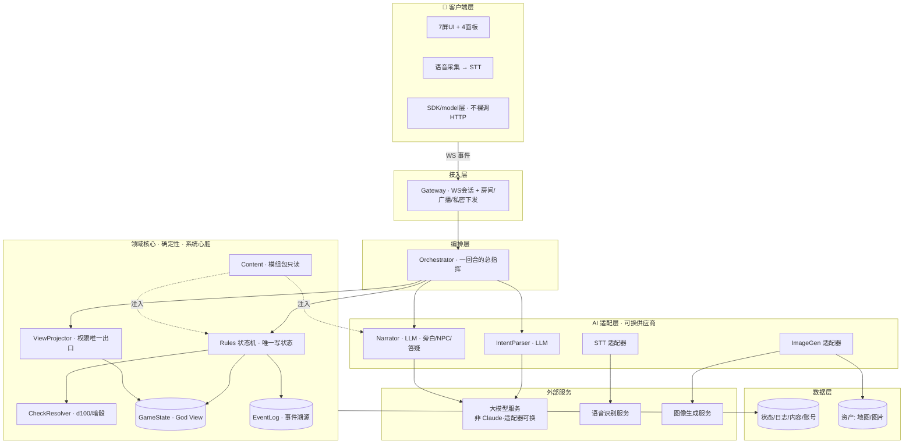
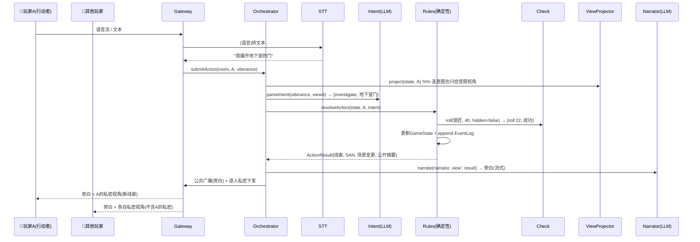

# 架构设计 · 整体多视图（架构师视角）

> **文档定位**：从架构师视角，用**多个视图**描述本产品的整体架构——不止「前端/后端/DB/协议」这几层静态结构，还包括**质量属性、运行时、AI 编排、横切关注点、架构决策**。作为 MS1「架构设计」的**总纲**。


## 〇、写在前面：什么是「架构」，为什么要「多视图」

一句话：**架构 = 那些「贵、且以后很难改」的重大决策的集合**。功能可以慢慢加，但「AI 会不会泄底、数据怎么存、多端怎么通信」这类骨架性决定，改起来伤筋动骨——架构就是提前把这些想清楚、定下来、并让它们**在代码结构里被强制**。

「前端/后端/DB/协议」只是架构的**静态结构**一面。一套完整架构至少要从**多个视图**看同一个系统（每个视图回答不同问题）：

| 视图 | 回答什么问题 | 本文章节 |
|---|---|---|
| **驱动力（需求 + 质量属性）** | 架构是为了满足什么？什么最重要？ | 一 |
| **逻辑 / 分层视图** | 系统由哪些部件组成、怎么分层 | 二 |
| **运行时视图** | 一次请求怎么在部件间流动 | 三 |
| **数据视图** | 数据长什么样、存在哪、谁能改 | 四 |
| **协议 / 集成视图** | 部件之间、与外部之间怎么通信 | 五 |
| **AI 编排视图** | LLM 这块怎么组织（本产品的心脏） | 六 |
| **横切关注点** | 权限/可观测/容错这些「每层都要管」的事 | 七 |
| **架构决策（ADR）** | 每个重大取舍为什么这么选 | 九 |

> 核心心法（贯穿全文）：**确定性的归代码，叙事表达的归 AI，真相(God View)只有一个出口。** 这是本产品架构的「宪法」。

## 一、架构驱动力

### 1.1 功能性需求（做什么）
多人用手机进房间 → 选 COC → 选/导入模组 → 车卡 → 由 AI 守秘人主持，玩家以**语音为主、文字为辅**输入行动 → AI 理解意图、按规则裁决(掷骰/线索/SAN)、私密下发、生成旁白与 NPC 对话 → 推进直到模组通关 → 赛后复盘。详见 [[产品原型-Arkham-Case-Files]]。

### 1.2 质量属性（架构真正的组织轴，按优先级）

> 这些「-性」才是决定架构长相的东西。每条给一个**具体场景**，避免空谈。

| 优先级 | 质量属性 | 具体场景（怕什么） | 架构必须给的答案（见二~七） |
|---|---|---|---|
| 🔴 P0 | **权限正确性** | 玩家问「地下室有什么」但还没探索，旁白**绝不能**提前泄露底牌 | ViewProjector 唯一出口 + **类型级强制**：喂给 LLM 的只能是 `PlayerView`，拿不到 `GameState` |
| 🔴 P0 | **可复现 / 确定性** | 同样的状态 + 同样的行动 + 同样的骰子种子 → 必须同样的裁决，能回放、能复盘、能定责 | Rules/Check 是**纯确定性函数**；LLM 永不写状态；事件溯源 |
| 🟠 P1 | **实时延迟** | 一回合里串了 STT + 2 次 LLM，可能 3–8 秒，玩家会觉得卡 | 旁白**流式输出** + 打字指示；确定性路径瞬时返回；意图用小模型；能并行则并行 |
| 🟠 P1 | **成本** | 一整场 COC 几百回合 × (STT+2×LLM)，token 成本会失控 | **提示缓存**(固定模组内容做缓存前缀) + 历史摘要截断 + 意图/旁白分模型 + 成本计量 |
| 🟠 P1 | **可扩展：多游戏 + 模组** | 以后要上 DND、要让玩家导入自制模组，不能改代码 | Content 层**数据驱动**；RulesEngine 可配置；**世界观→模组**两级抽象；游戏类型=策略 |
| 🟡 P2 | **容错 / 降级** | LLM 或 STT 超时/报错，不能让整局卡死 | 适配器统一 **超时+兜底**；确定性核心不依赖 AI 可用性 |
| 🟡 P2 | **安全：不可信模组** | 玩家导入的模组可能藏**提示注入**（诱导旁白泄底/越权） | 模组文本**当数据不当指令**注入；schema 校验；导入内容隔离 |
| 🟡 P2 | **可测试 / 可演进** | 确定性部分要能单测；AI 部分要能评测；模块边界要能替换 | 确定性核心=单元测试；AI=评测集(eval)；接口为真、不过早抽象 |

### 1.3 约束
- **时间**：8 周 / 4 Milestone（[[计划安排]]）——一切设计向「能在预算内做出来并反复 playtest」收敛。
- **不锁技术栈**：本阶段架构**语言/框架中立**（见 ADR-8），设计与技术栈解耦。
- **LLM 供应商：产品运行时不用 Claude**——由用户选定的其它大模型（倾向国内模型），全走适配器接口、可换（见 ADR-6）；具体型号待定（见待办）。**注意区分**：Claude 仅用于*开发期*（用 Claude Code 写代码），不进产品运行时。
- **规模**：MVP 单服务实例、少量并发房间即可；水平扩展留后（见八）。

## 二、逻辑与分层视图（系统由哪些部件组成）

**七层**。从上到下：客户端 → 接入 → 编排 → **领域核心(确定性)** → AI 适配 → 数据 → 外部服务；权限与可观测是**横切**。



**部件清单**（★=本文相对 [[MS1-架构设计-主干与空骨架]] 新增/强化）：

| 层 | 部件 | 职责 | 确定性? |
|---|---|---|---|
| 客户端 | UI / 语音采集★ / SDK 层 | 7 屏 + 4 面板；语音→文本；封装业务调用 | — |
| 接入 | **Gateway** | WS 会话、**房间生命周期★**、公共广播 + 私密定向下发 | 是 |
| 编排 | **Orchestrator** | 串起一回合全流程的单点指挥 | 是 |
| 核心 | **Rules / CheckResolver / ViewProjector / Content / GameState / EventLog** | 裁决、检定、权限裁剪、模组加载、真相状态、事件日志 | **是** |
| AI | **IntentParser / Narrator** | 意图理解 / 表达生成 | LLM |
| AI | **STT 适配器★ / ImageGen 适配器★** | 语音转文本 / 地图·图片生成 | LLM |
| 数据 | **持久化★ / 资产存储★** | 状态·日志·内容·账号落库；地图图片等 blob | 是 |
| 横切 | **权限 / 可观测·成本计量★ / 配置** | 见七 | 是 |

> 领域核心（L4）是**纯确定性**的心脏，可脱离 AI 与网络独立单测。AI 只在**两端**接入（输入理解 + 输出表达），**永不进裁决**。

## 三、运行时视图（一回合怎么流动）—— MS1 多人-薄 + 语音

一次玩家行动 = 一个「回合请求」，Orchestrator 单点编排。MS1 **回合制**（一次处理一个玩家；并发抢话留后，ADR-1）。



**关键点**：
- **私密下发是逐人不同的**——ViewProjector 为每个玩家裁出不同 `PlayerView`，Gateway 定向推送。这正是「多人-薄」要在 MS1 验证的核心。
- **暗骰**：`hidden=true` 时结果由 ViewProjector 从玩家视角抹掉，只有系统与日志知道。
- **房间生命周期**（MS1 新增）：创建/加入/就绪/开始/回合轮转/结束——由 Gateway + Orchestrator 维护。

## 四、数据架构

### 4.1 三个数据层（谁能改、存多久）
| 层 | 内容 | 可变性 | 存储 |
|---|---|---|---|
| **固定内容**（Content 模组包） | Module/Scene/Clue/NPC/Checkpoint/SAN触发/角色卡模板/地图素材 | **只读** | 内容库 + 资产 blob |
| **运行时状态**（GameState = God View） | 当前场景/阶段/各玩家状态/已发现线索/回合 | **仅 Rules 可写** | 状态库(可内存+落盘) |
| **事件日志**（EventLog） | 每次裁决的追加记录 | **只增不改** | 日志库（事件溯源，供复盘/回放/测试） |

### 4.2 要不要落库 / 落什么
| 数据 | MS1 | 说明 |
|---|---|---|
| 房间/玩家/就绪状态 | ✅ | 多人-薄必需 |
| 角色卡（完整 COC 结构，D3） | ✅ | 属性/技能/装备/HP/SAN/幸运；结构要能容纳后续全量角色卡 |
| 消息 / 事件日志 | ✅ | 事件溯源；复盘是产品功能 |
| 已发现线索 / SAN / 场景进度 | ✅ | GameState 核心 |
| 速记本 | ✅ | 玩家私有 |
| 模组内容包 | ✅ | 内置 + 玩家导入(D2) |
| 地图/图片资产 | ✅(blob) | 模组自带图或 AI 生图(D5) |
| 账号体系 | 🟡 视登录方案 | MVP 可先房间码轻量身份，正式账号可后置 |

### 4.3 🔴 承重件：模组内容包规范（D2）—— 待独立深挖
「玩家可导入模组」让**模组包格式**成为**同时压着 DB / Content 层 / 协议分发 / 前端选模组屏**的承重决策。**它值得一份独立文档**（放 `流程/` 或 `思考/`）。此处先给骨架草案供后续细化：

```
ModulePack {
  meta:   { id, title, system:"CoC7e", authors, version, players:{min,max}, difficulty }
  setting: 世界观/背景文本(注入LLM上下文)
  scenes:  [ { id, description, clues[], checkpoints[], sanTriggers[], exits[], mapRef } ]
  clues:   [ { id, content, isCore, reachableBy[] } ]   // 核心线索多路径可达(D6原则)
  npcs:    [ { id, name, persona, secrets, dialogueHints } ]
  pregens: [ 角色卡模板 ]                                  // 预设可选调查员(D3)
  assets:  [ { id, type:map|image, ref } ]                // 地图/图片
  win:     胜负/结束条件
}
```
> 安全提醒：导入包是**不可信内容**——`setting/description/npc.persona` 等文本进 prompt 时必须**当「背景资料」而非「指令」**，防提示注入(见 1.2 安全 / 七.1)。

## 五、协议 / 集成视图（怎么通信）

### 5.1 客户端 ↔ 服务端（WebSocket 事件协议）
**核心区分：公共广播 vs 私密定向**——协议在类型上就要把两者分开。

| 方向 | 事件（示意） | 公/私 |
|---|---|---|
| C→S | `room.join` / `player.ready` / `action.submit{utterance}` / `voice.chunk{audio}` / `note.save` | — |
| S→C 公共 | `narration.push`(流式) / `state.public`(场景/阶段/轮到谁) / `system.msg` / `player.list` / `turn.begin`·`turn.end` | 公共广播 |
| S→C 私密 | `view.private{PlayerView}` / `check.request{skill,target}` / `clue.granted` / `error` | **逐人定向** |

- **回合模型**（MS1）：`turn.begin{playerId}` → 该玩家行动 → `turn.end`，服务端仲裁顺序。
- **一致性**：公共状态以服务端为准（server-authoritative），客户端只渲染；生产级乐观更新/冲突消解留 MS2。

### 5.2 语音链路（D1）——薄层复用文本协议（ADR-5）
语音**不新开一套管线**：客户端采集音频 → STT(浏览器或服务端)转文本 → 复用 `action.submit{utterance}` 走**同一条文本回合链**。语音因此只是文本输入的**前端薄封装**，最省事、成本最低。（服务端 vs 客户端 STT 的取舍见待办。）

### 5.3 服务端 ↔ 外部（适配器模式）
LLM / STT / ImageGen 全部**藏在接口后**（`IntentParser`/`Narrator`/`STTAdapter`/`ImageGenAdapter`），统一超时+重试+兜底，供应商可换（ADR-6）。

### 5.4 前端 ↔ 后端（SDK / model 层）
前端**不裸调 HTTP/WS**，封装一层业务语义 SDK（承 [[MS1-架构设计-主干与空骨架]] §4.3、techcamp《架构设计规范》）：
```
api.game.submitAction({ room, player, utterance })
api.game.subscribe(room, player, onPublic, onPrivate)  // 公共/私密分流回调
```
> **多语言栈契约（前端 TS + 后端 Python）**：两端之间的事件 / 数据类型必须有**单一事实源**——后端 Pydantic 定义 → 生成 TS 类型（或 JSON Schema/OpenAPI 双向 codegen），避免手工维护两套导致漂移、削弱 P0 权限约束（见 ADR-9）。

## 六、AI 编排架构（本产品的心脏，最难、最有价值）

LLM 不是「一个大模型端到端生成」，而是**被编排进确定性骨架的两端**。

### 6.1 回合内 AI 流水线
```
语音→STT ─▶ 受限视角(project) ─▶ 意图理解(LLM·小模型) ─▶ 【Rules 确定性裁决】
                                                              ─▶ 重投视角 ─▶ 表达生成(LLM·强模型·流式) ─▶ 广播/私密
```
- **意图理解**用便宜小模型；**旁白/NPC**用强模型；成本与延迟分而治之。**每个环节的模型/供应商是独立配置**（ADR-6），随选型演进随时可调，甚至混用不同厂商。
- 意图落 `unknown` → 触发**脱本导回**策略，而非让 LLM 自由编设定。

### 6.2 三大架构不变量（Guardrails，必须在结构上强制）
| 不变量 | 怎么强制 |
|---|---|
| **不泄底** | LLM 函数签名只收 `PlayerView`，**类型上拿不到 `GameState`**——泄底成为编译期不可能 |
| **裁决不被污染** | LLM 输出**只是文本**，永不回写状态；Rules 是唯一状态写入者，结果可复现 |
| **不脱本 / 不失控** | Intent 有限意图集 + 兜底导回当前场景；不可信模组文本当「资料」不当「指令」 |

### 6.3 Prompt 组装与记忆（抗漂移 + 控成本）
- **事实靠注入不靠记忆**：system prompt = 人格 + 当前场景固定内容（由 Content 层注入），**固定内容做提示缓存前缀**（省 token）。
- **历史靠摘要**：近几回合明细 + 更早历史滚动摘要（来自 EventLog），把上下文 token 钉在预算内。
- **人格路由**：`narrator/npc/qa` 三人格 → 不同 system prompt + 对应受限视角（承 Proposal D8）。

> AI 编排值得一份**独立深挖文档**（prompt 模板、上下文窗口策略、eval 评测集、导回策略）。此处定架构骨架，细节后续展开。

## 七、横切关注点（每层都要管的事）

| 关注点 | 架构处理 |
|---|---|
| **权限 / 安全** | ViewProjector 唯一出口(类型级)；不可信模组当数据、schema 校验、防注入；房间私密下发定向 |
| **可观测性 / 成本计量** | 每回合 trace（意图→裁决→旁白链路 + 耗时）；**按房间/场次统计 token 成本**（LLM 产品必须盯成本）；事件日志天然是审计线索 |
| **容错 / 降级** | LLM/STT 超时→重试→兜底文案（「守秘人沉思中…」）；确定性核心不随 AI 挂掉而挂 |
| **可测试性** | 确定性核心=单元测试；AI=评测集(不是 assert 相等，是行为评测)；EventLog **回放**重演历史 |
| **配置 / 特性开关** | 游戏类型、模组、模型选择、是否暗骰皆为**配置**，非硬编码——支撑「货架」扩展 |

## 八、部署视图（MVP 从简）
**模块化单体**（modular monolith）：一个应用服务实例(内含 L2–L5 各模块，进程内同步调用) + 一个数据库(状态/日志/内容/账号) + 资产 blob 存储 + 外部 LLM/STT/图像 API。少量并发房间即可，**不上微服务**（ADR-2）。将来按 §五的接口缝隙拆分/水平扩展。

## 九、架构决策记录（ADR）

| # | 决策 | 备选 | 为什么这么选 |
|---|---|---|---|
| **ADR-1** | MS1 **回合制**输入 | 并发自由发言 | 语音(D1)+并发仲裁+AI编排三难点不叠加；抢话仲裁留后 |
| **ADR-2** | **模块化单体**、进程内同步 | 微服务 | 8 周/单团队/低延迟/易调试；接口留缝，将来可拆 |
| **ADR-3** | **事件溯源**(EventLog 为历史真相) | 只存最终状态 | 复盘是产品功能；回放利于测试与定责 |
| **ADR-4** | 权限层**唯一出口 + 类型级强制** | 约定/注释约束 | 泄底是 P0 风险，必须结构上不可能，非靠自觉 |
| **ADR-5** | 语音=**前端薄层复用文本协议** | 独立语音管线 | 最省事、成本最低、协议不分叉 |
| **ADR-6** | LLM/STT/图像**全走适配器**，不锁供应商，**支持按模块/人格路由到不同模型** | 绑定单一供应商单一模型 | **产品运行时不用 Claude**（Claude 只在开发期用）；模型选型**持续演进、不同功能可用不同模型**（意图=便宜小模型、旁白=强模型、NPC=另配）——适配器把「模型/供应商」变成**配置**（见 §6.1、§七）并**抹平各家 API 差异**（function-calling / JSON 模式不一），换/加模型 = 改配置或加实现，主干不动；可测（替身） |
| **ADR-7** | 模组=**数据驱动内容包**，世界观→模组两级 | 硬编码剧情 | 支撑导入(D2)与多游戏「货架」；不过早抽象通用框架 |
| **ADR-8** | 架构描述**语言中立**（设计与栈解耦） | 绑定某语言写架构 | 架构不因换语言而变；~~技术栈本阶段不锁~~ → 已由 **ADR-9** 选定 |
| **ADR-9** | **技术栈：前端 TS + 后端 Python**（2026-07-09 定，落地执行暂缓） | Node 全栈 / Go / Rust 后端 | 后端改选 **Python**（用户定）：瓶颈是 LLM 延迟、属 IO 密集（`asyncio` 承接并发 await，GIL 非瓶颈），且 **Python 的 LLM / 编排生态最成熟**，契合「多模型、按模块选型」（ADR-6）。**代价**：放弃 TS 全栈「跨网络共享一套类型」的免费红利——前端 TS + 后端 Python 是**多语言栈**，需**显式协议契约**做单一事实源（后端 Pydantic → 生成 TS 类型 / 或 JSON Schema·OpenAPI 双向 codegen），把 P0 权限正确性的跨端约束补回来。[[MS1-架构设计-主干与空骨架]] §四 接口契约（现为 TS 记法）落地时以 Python（Pydantic/typing）表达。 |

## 十、MS1 范围与分期

| 视图/部件 | MS1（薄切片） | 后续（MS2–4） |
|---|---|---|
| 逻辑核心 | Rules/Check/View/Content/EventLog **真实现** | 更多规则/技能覆盖 |
| AI | Intent/Narrator 先桩→接 Claude；单旁白人格起步 | NPC/答疑人格、导回、eval |
| 多人 | **多人-薄**：真多端、私密下发、回合制 | 生产级实时同步、并发抢话仲裁(MS2) |
| 语音 | 客户端采集→STT→文本链(D1) | 语音体验优化、说话人归属 |
| 数据 | 房间/车卡/状态/日志/内置模组落库 | 模组**导入**打通(D2)、账号体系 |
| 协议 | WS 公共+私密事件集、回合模型 | 重连/乐观更新/规模化 |
| 地图 | 模组内置图渲染 | AI 生图(D5) |

> 目标仍是 [[MS1-架构设计-主干与空骨架]] §五那条 **walking skeleton**，但**升级为多端**：2 部手机进同一房间，一人行动→另一人收到「公共旁白 + 各自不同的私密信息」，端到端证明**权限模型 + 协议**成立。

## 十一、风险与权衡
| 风险 | 权衡 / 应对 |
|---|---|
| 🔴 泄底 | 类型级唯一出口（ADR-4）——最高优先级，架构上封死 |
| 🔴 裁决被 LLM 污染 | 确定性 Rules 为唯一写者，LLM 只表达 |
| 🟠 延迟(串 2×LLM+STT) | 流式旁白 + 小/强模型分工 + 确定性路径瞬时；接受「AI 思考中」的节奏感 |
| 🟠 成本失控 | 提示缓存 + 历史摘要 + 成本计量；把它当一等公民盯 |
| 🟡 不可信模组注入 | 内容当数据、schema 校验、prompt 隔离 |
| 🟡 多人-薄的边界蔓延 | 死守 ADR-1/回合制；生产级同步坚决留 MS2 |

## 待办 / 下一步深挖
- [ ] **【承重·优先】模组内容包规范**独立文档（§4.3 骨架 → 完整 schema + 校验 + 导入流程），放 `流程/`
- [ ] **确定产品运行时 LLM 供应商与型号（非 Claude）**：评估 function-calling/JSON 结构化输出、上下文窗口、成本、中文与叙事表现——直接影响 §六 AI 编排 与 §1.2 成本
- [ ] **AI 编排**独立文档：prompt 模板 / 上下文窗口策略 / 脱本导回 / eval 评测集
- [ ] **协议**完整事件表 + 时序（含房间生命周期、重连边界），放 `流程/`
- [ ] 车卡完整 COC 数据模型（D3）落到 §四数据模型
- [ ] 组内评审本多视图架构；确认后按 [[MS1-架构设计-主干与空骨架]] §六建空骨架（多端版 skeleton）
- [ ] 记录 MS1 架构基线，供 MS2 复盘对比
